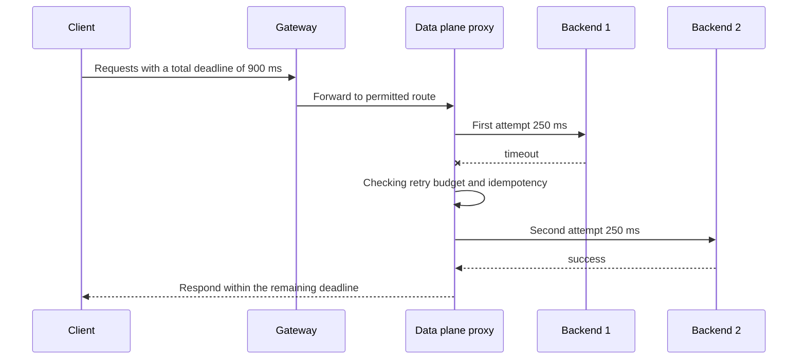

# Failure budget from gateway to upstream

## Terms introduced in this chapter

| word | Meaning in this chapter |
|---|---|
| control plane | A layer that declares and verifies which listeners, routes, and policies should exist |
| data plane | Layer that receives the actual request, forwards it to the backend, and executes timeout, retry, and limit |
| route attachment | The process where the route and gateway meet each other's conditions and are actually connected |
| per-try timeout | Time allowed for one upstream attempt |
| outer deadline | Total upper limit from receipt of initial request to final response |
| retry storm | A phenomenon in which additional attempts during failure increase the load and cause more failures. |

## Understand the model first

In the role model of the Gateway API, GatewayClass is the implementation type, Gateway is the point that receives traffic, and Route, such as HTTPRoute, is a rule that maps requests to the backend. Infrastructure providers, cluster operators, and application developers can take on different resources instead of all modifying the same object. Route is not added just by writing `parentRefs`. The gateway listener must allow the route of the namespace, type, and hostname, and the status must check the attachment.

This declaration alone does not determine the survival time of the request. In the actual data plane, there is a connection upper limit, a waiting request upper limit, a concurrent request upper limit, and a retry upper limit. Envoy circuit breaker sets these resource limits for each upstream cluster, and the retry budget limits simultaneous retries in proportion to the size of current and pending requests. Therefore, **route ownership** and **execution budget** are linked, but not the same setting.

1. The platform team manages the public gateway, TLS, and permitted route range.
2. The application team manages its own route, backend, and timeout requests that suit its business meaning.
3. The resilience policy examines the entire deadline, idempotency, retry budget, and overflow observations together.
4. SRE determines whether this policy reduces user errors and increases upstream saturation based on SLO and incident evidence.

## Every attempt consumes the shared deadline

If the total deadline is 900 ms, the timeout for each attempt is 400 ms, and the maximum retry is 2, the worst attempt time is 1,200 ms. Connection, queue, backoff, and response transmission times have not yet been included. In this configuration, the last attempt is truncated due to an outer deadline or the client gives up first. Correct calculation must satisfy `connection + queueing + Σ(each attempt + backoff) + response margin ≤ outer deadline`.

Just limiting the number of retries is not enough. If half of the normal traffic of 1,000 RPS fails and each request is attempted twice more, a short section of upstream attempt can add up to 2,000 RPS. When the proxy, client SDK, and job worker each retry, the upper limit for each layer is multiplied. The reason for tying the retry budget to the normal/in-progress request volume is to limit the additional traffic at the moment of failure.

| boundary | limiting | representative failure signal | What this border doesn't do |
|---|---|---|---|
| Route attachment | Unallowed exposure and backend references | Accepted=False, ResolvedRefs=False | backend health judgment |
| timeout | How long does a request hold up on a resource? | upstream timeout | Prevent duplicate side effects |
| retry budget | Additional attempts during failure | retry overflow | eliminate the cause |
| circuit breaker | Connection/standby/simultaneous request limit | connection·pending·request overflow | Determine work priorities for traffic |
| outlier detection | Temporary exclusion of repeatedly failed hosts | ejection count, success rate | Solve situations where all hosts fail due to the same common cause |

## Ownership is a safe boundary

Application developers know whether a POST, such as a payment approval, can be re-executed with the same idempotency key. Platform operators know at what scale proxy-wide queues and connection pools become saturated. If only one party owns the retry policy, duplication of work or infrastructure saturation is lost. So a change proposal must include a route owner, backend owner, approver, observation dashboard, and rollback method.

The namespace boundary of the Gateway API and `ReferenceGrant` distinguish between “reference is technically possible” and “reference to other team resources is permitted by the owner.” Likewise, the function that AIOps can change traffic weight and the policy that the authority is approved within a specific service, time, and range of change are separate.

## Order of reading failure

1. Check whether user symptoms such as success rate and delay have actually worsened.
2. Check which route and revision was requested.
3. Divide connection failure·5xx·timeout by upstream.
4. Check whether circuit breaker overflow and retry attempt volume amplified the original fault.
5. Place recent route·deployment·policy changes on the time axis.
6. After returning traffic, check whether user symptoms, upstream saturation, and queue have recovered.

This sequence extends the status/event/log verification of [Observation and Troubleshooting](../kubernetes/09-observability-and-troubleshooting.md) to the network data plane and specifies which identifiers [AIOps incident evidence graph](../aiops-foundations/01-evidence-graph.md) should collect.

## Explain it in your own words

- What is the difference between `max_retries: 3` and the 20% retry budget limit?
- Why are the user success rates of Route's `Accepted=True` and the backend separate evidence?
- Why can excluding outlier hosts by 100% result in complete blocking rather than recovery?
- What preconditions and abort conditions are needed for an automatic traffic switch to be safe?

<!-- source: https://gateway-api.sigs.k8s.io/docs/concepts/api-overview/ | checked: 2026-09-03 -->
<!-- source: https://gateway-api.sigs.k8s.io/docs/concepts/security/ | checked: 2026-09-03 -->
<!-- source: https://www.envoyproxy.io/docs/envoy/latest/api-v3/config/cluster/v3/circuit_breaker.proto.html | checked: 2026-09-03 | docs-version: latest -->
<!-- source: https://www.envoyproxy.io/docs/envoy/latest/intro/arch_overview/http/http_routing.html | checked: 2026-09-03 | docs-version: latest -->
