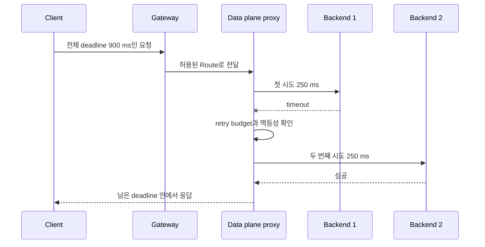

# Gateway에서 upstream까지의 실패 예산

## 이 장에서 처음 쓰는 말

| 말 | 이 장에서의 뜻 |
|---|---|
| control plane | 어떤 listener와 route, 정책이 존재해야 하는지 선언·검증하는 층 |
| data plane | 실제 요청을 받아 backend로 전달하고 timeout·retry·limit를 집행하는 층 |
| route attachment | Route와 Gateway가 서로의 조건을 만족해 실제 연결되는 과정 |
| per-try timeout | 한 번의 upstream 시도에 허용하는 시간 |
| outer deadline | 최초 요청 수신부터 최종 응답까지의 전체 상한 |
| retry storm | 실패 중 추가 시도가 부하를 키워 실패를 더 만드는 현상 |

## 먼저 이해하기

Gateway API의 역할 모델에서 GatewayClass는 구현 종류, Gateway는 traffic을 받는 지점, HTTPRoute 같은 Route는 요청을 backend에 매핑하는 규칙이다. 인프라 제공자·클러스터 운영자·애플리케이션 개발자가 같은 객체를 모두 수정하는 대신 서로 다른 자원을 맡을 수 있다. Route는 `parentRefs`만 적었다고 붙지 않는다. Gateway listener가 그 namespace·종류·hostname의 route를 허용하고 status가 attachment를 확인해야 한다.

이 선언만으로 요청의 생존 시간이 정해지지는 않는다. 실제 data plane에는 연결 상한, 대기 요청 상한, 동시 요청 상한, 재시도 상한이 있다. Envoy circuit breaker는 upstream cluster별로 이런 자원 상한을 두며, retry budget은 현재 요청과 대기 요청의 규모에 비례해 동시 재시도를 제한한다. 따라서 **route 소유권**과 **실행 예산**은 연결되지만 같은 설정이 아니다.

1. 플랫폼 팀은 공용 Gateway, TLS와 허용할 Route 범위를 관리한다.
2. 애플리케이션 팀은 자신의 Route와 backend, 업무 의미에 맞는 timeout 요구를 관리한다.
3. 복원력 정책은 전체 deadline, 멱등성, retry budget과 overflow 관측을 함께 검토한다.
4. SRE는 이 정책이 사용자 오류를 줄였는지, upstream 포화를 키웠는지 SLO와 incident 증거로 판정한다.

## 시간을 더한다고 예산이 되지 않는다

전체 deadline이 900 ms이고 시도별 timeout이 400 ms, 최대 재시도가 2회라면 최악의 시도 시간만 1,200 ms다. 연결·queue·backoff·응답 전송 시간은 아직 넣지도 않았다. 이 설정에서는 마지막 시도가 outer deadline 때문에 잘리거나 client가 먼저 포기한다. 올바른 계산은 `연결 + 대기 + Σ(각 시도 + backoff) + 응답 여유 ≤ outer deadline`을 만족해야 한다.

재시도 횟수만 제한해도 충분하지 않다. 정상 traffic 1,000 RPS에서 절반이 실패하고 각 요청이 두 번 더 시도하면 짧은 구간의 upstream 시도는 최대 2,000 RPS가 추가될 수 있다. proxy, client SDK와 job worker가 각각 retry하면 계층별 상한이 곱해진다. retry budget을 정상·진행 중 요청량과 묶는 이유는 장애 순간의 추가 traffic을 비율로 제한하기 위해서다.

| 경계 | 제한하는 것 | 대표 실패 신호 | 이 경계가 하지 않는 일 |
|---|---|---|---|
| Route attachment | 허용되지 않은 노출과 backend 참조 | Accepted=False, ResolvedRefs=False | backend 건강 판정 |
| timeout | 한 요청이 자원을 붙잡는 시간 | upstream timeout | 중복 side effect 방지 |
| retry budget | 장애 중 추가 시도량 | retry overflow | 원인 제거 |
| circuit breaker | 연결·대기·동시 요청 상한 | connection·pending·request overflow | traffic의 업무 우선순위 결정 |
| outlier detection | 반복 실패 host의 임시 제외 | ejection count, success rate | 모든 host가 같은 공통 원인으로 실패하는 상황 해결 |

## 소유권이 곧 안전 경계다

application 개발자는 결제 승인 같은 POST가 같은 idempotency key로 재실행 가능한지 안다. 플랫폼 운영자는 proxy 전체의 queue와 연결 풀이 어느 규모에서 포화되는지 안다. 어느 한쪽만 retry 정책을 소유하면 업무 중복 또는 인프라 포화를 놓친다. 그래서 변경 제안에는 route owner, backend owner, 승인자, 관측 dashboard와 rollback 방법이 함께 있어야 한다.

Gateway API의 namespace 경계와 `ReferenceGrant`는 “참조가 기술적으로 가능하다”와 “다른 팀 자원을 참조하도록 소유자가 허용했다”를 구분한다. 마찬가지로 AIOps가 traffic weight를 바꿀 수 있다는 기능과, 특정 서비스·시간·변경 폭 안에서 그 권한이 승인됐다는 정책은 별개다.

## 실패를 읽는 순서

1. 사용자 증상인 성공률과 지연이 실제로 나빠졌는지 확인한다.
2. 어떤 Route와 revision이 요청을 받았는지 확인한다.
3. upstream별 연결 실패·5xx·timeout을 나눈다.
4. circuit breaker overflow와 retry 시도량이 원래 장애를 증폭했는지 확인한다.
5. 최근 route·deployment·policy 변경을 시간축에 놓는다.
6. traffic을 되돌린 뒤 사용자 증상, upstream 포화와 queue가 함께 회복됐는지 확인한다.

이 순서는 [관측과 트러블슈팅](../kubernetes/09-observability-and-troubleshooting.md)의 상태·event·log 확인을 network data plane까지 확장하고, [AIOps incident evidence graph](../aiops-foundations/01-evidence-graph.md)가 어떤 식별자를 모아야 하는지 구체화한다.

## 스스로 설명해 보기

- `max_retries: 3`과 retry budget 20%가 제한하는 양은 어떻게 다른가?
- Route의 `Accepted=True`와 backend의 사용자 성공률은 왜 별도 증거인가?
- outlier host를 100%까지 제외하면 왜 복구가 아니라 전체 차단이 될 수 있는가?
- 자동 traffic switch가 안전하려면 어떤 precondition과 abort condition이 필요한가?

<!-- source: https://gateway-api.sigs.k8s.io/docs/concepts/api-overview/ | checked: 2026-09-03 -->
<!-- source: https://gateway-api.sigs.k8s.io/docs/concepts/security/ | checked: 2026-09-03 -->
<!-- source: https://www.envoyproxy.io/docs/envoy/latest/api-v3/config/cluster/v3/circuit_breaker.proto.html | checked: 2026-09-03 | docs-version: latest -->
<!-- source: https://www.envoyproxy.io/docs/envoy/latest/intro/arch_overview/http/http_routing.html | checked: 2026-09-03 | docs-version: latest -->
