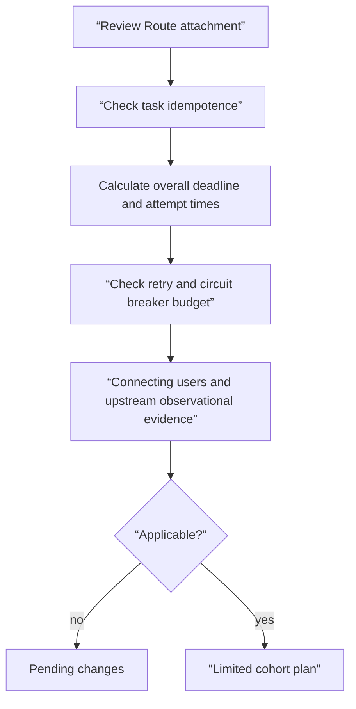

# Route ownership and retry storm review lab

## Lab prerequisites

This lab is a **Plan only** review that does not change cluster or proxy settings. All you need is a text editor, and if you have a YAML parser, you can use it to check the grammar. The example does not include the actual hostname or credentials. The goal is not “whether the application succeeds,” but rather “who allowed what, and how much additional traffic and duplication of work could result if it fails.”

| Preparation items | value |
|---|---|
| change target | doesn't exist |
| input | Gateway·HTTPRoute·Resiliency Policy Draft |
| observation evidence | Attachment condition, deadline sum, retry rate, rollback pointer |
| stopping condition | None of the following indicators: owner, idempotence, user influence |
| cleanup | Delete only temporary note files you have created |

## Understand the model first

Route review and retry review are in order. First, you need to check which listener this route is attached to and with what authority. Next, see who retries when the actual request fails, and whether the total attempt time and the amount of concurrent additional requests are within the upper limit. Even if `kubectl apply --dry-run=server` passes, it does not prove the meaning of this task and the load budget.



## Draft to review

```yaml
apiVersion: gateway.networking.k8s.io/v1
kind: Gateway
metadata:
  name: shared-web
  namespace: infra
spec:
  gatewayClassName: managed-gateway
  listeners:
    - name: https
      protocol: HTTPS
      port: 443
      hostname: "*.example.test"
      allowedRoutes:
        namespaces:
          from: Selector
          selector:
            matchLabels:
              shared-gateway-access: "true"
---
apiVersion: gateway.networking.k8s.io/v1
kind: HTTPRoute
metadata:
  name: checkout
  namespace: shop
spec:
  parentRefs:
    - name: shared-web
      namespace: infra
      sectionName: https
  hostnames:
    - "checkout.example.test"
  rules:
    - backendRefs:
        - name: checkout-api
          port: 8080
```

In the first review, check whether the `shop` namespace has a label that matches the selector. There is an intersection between the hostnames of the gateway and the route, but if the namespace is not allowed, they will not be combined. If a cross-namespace backend reference is added, the backend owner must allow `ReferenceGrant`. The mere existence of an object does not grant permission to use other namespace resources.

The following resiliency draft is a contract for review, not a finished configuration to be put directly into a specific proxy product.

```yaml
requestPolicy:
  outerDeadlineMs: 900
  connectTimeoutMs: 100
  perTryTimeoutMs: 250
  maxAttempts: 2
  retryOn:
    - connect-failure
    - reset
    - 503
  retryBudgetPercent: 15
  circuitBreaker:
    maxConnections: 200
    maxPendingRequests: 100
    maxRequests: 400
  outlierDetection:
    consecutive5xx: 5
    baseEjectionTimeSeconds: 30
    maxEjectionPercent: 50
evidence:
  userSignal: checkout_success_ratio
  saturationSignal: checkout_upstream_pending_requests
  retrySignal: checkout_upstream_retry_attempts
  rollbackPointer: route-policy-v17
```

## Step-by-step review

1. In `outerDeadlineMs` 900, write 100 for connection, 250 for two attempts, and whether backoff and response margin are included. In this example, at least 300 ms of space is left, but queue waiting is not defined.
2. The meaning of `maxAttempts: 2` is fixed for each implementation, whether it is “first attempt + one retry” or “two retries”. If you estimate based on the name alone, the actual amount of attempts will vary.
3. Make sure there is a guarantee that the 503 will be returned before processing. If only the response can be lost after the payment side effect, you should not retry without the idempotency key.
4. Calculate how much concurrent addition a 15% retry budget will allow for a normal 1,000 ongoing requests. Check the implementation documentation to see which setting takes precedence when used with static `maxRetries`.
5. When half of the backends show 5xx due to a common DB error, consider whether excluding the host is the solution. If it is a common cause, traffic may be concentrated on the remaining hosts.
6. If `checkout_success_ratio` is not recovered or the pending request increases, write an abort condition to stop automatic change and return to the previous policy revision.

## How to interpret the results

| observation | meaning | next action |
|---|---|---|
| Route `Accepted=False` | Attachment contract fails before traffic policy | Check status reason and listener allowable range |
| Retry increases and success rate remains the same | Additional attempts only add to the load without any recovery effect | Reduce or block retry, investigate cause |
| Increased success rate and stable saturation after ejection | Possibly isolated some host failures | Check the actual cause and return conditions of excluded hosts |
| Pending increases after ejection | Insufficient remaining capacity or common cause | Stop ejection expansion, review load shedding |
| rollback command success | spec changed to previous revision | User results and queue recovery are verified separately |

The most important distinction in this table is that **mitigation success is different from root cause resolution**. Even if traffic is restored and the error rate is lowered, it is left to postmortem and replication testing to determine what defects in the new release caused the failure. Conversely, even if the candidate cause was correct, if the user error continued, the incident did not end.

## completion and cleanup

- I wrote down the gateway owner, route owner, backend owner, and policy approver.
- All hostname·namespace·reference conditions were checked.
- The total deadline and maximum number of attempts were calculated.
- Forbid retry of non-idempotent requests or chained idempotency contracts.
- I wrote down user symptoms, upstream saturation, retry/overflow signals, and rollback pointer.
- If I created a temporary review file, I deleted only the correct file.

## Explain it in your own words

- Why doesn't server-side dry-run find the possibility of a retry storm?
- Why is `maxEjectionPercent: 50` a safe upper limit and not the correct threshold?
- What are you missing if you end up determining the success of automatic rollback with just rollout status?
- What ID and timestamp are needed when passing this incident evidence to [AIOps alert correlation](../aiops-diagnosis/02-alert-correlation-triage-lab.md)?

<!-- source: https://gateway-api.sigs.k8s.io/docs/concepts/security/ | checked: 2026-09-03 -->
<!-- source: https://gateway-api.sigs.k8s.io/docs/concepts/hostnames/ | checked: 2026-09-03 -->
<!-- source: https://www.envoyproxy.io/docs/envoy/latest/faq/load_balancing/transient_failures.html | checked: 2026-09-03 -->
<!-- source: https://www.envoyproxy.io/docs/envoy/latest/intro/arch_overview/upstream/circuit_breaking | checked: 2026-09-03 -->
