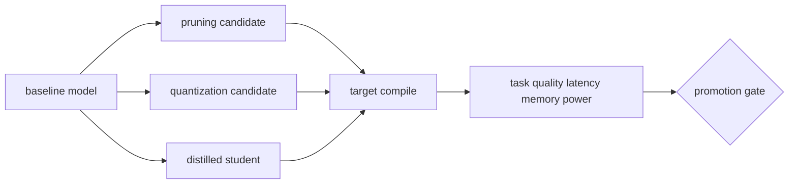

# On-device AI와 모델 압축

<!-- source: https://docs.pytorch.org/tutorials/intermediate/pruning_tutorial.html | checked: 2026-09-03 -->
<!-- source: https://docs.pytorch.org/tutorials/recipes/quantization.html | checked: 2026-09-03 -->
<!-- source: https://docs.pytorch.org/tutorials/beginner/knowledge_distillation_tutorial.html | checked: 2026-09-03 -->

모델 압축의 목적은 parameter 수를 줄이는 것이 아니라 선택한 device에서 품질, 지연, 메모리, 전력과 thermal 조건을 동시에 만족하는 것이다. pruning·quantization·distillation은 서로 다른 것을 바꾸며, 파일 size가 줄었다고 실제 커널이 빨라지는 것은 아니다.

## 이 장에서 처음 쓰는 말

| 말 | 이 장에서의 뜻 | 왜 필요한가요 · 언제 쓰나요 |
|---|---|---|
| pruning | weight·channel·block 일부를 제거하거나 0으로 만들어 sparsity를 높이는 방법 | 기여가 적은 구성 요소를 제거해 모델 축소를 시도하고 정확도·실행 시간 개선을 측정한다. **구체적인 상황(가상 예시):** 모델이 대상 장치에 너무 크다. → 일부 구조를 가지치기하고 필요하면 재조정한다. → 파라미터 수뿐 아니라 대상 지연·정확도를 측정한다. |
| quantization | 실수 값을 더 낮은 bit 정수·부동소수 표현으로 근사하는 방법 | 대상 런타임이 낮은 정밀도를 적절히 지원할 때 모델 저장·연산 비용을 줄인다. **구체적인 상황(가상 예시):** 원래 정밀도의 모델이 장치 메모리를 넘는다. → 지원되는 낮은 정밀도 양자화를 시험한다. → 메모리·실행 속도·대표 예측 오류를 비교한다. |
| distillation | 큰 teacher의 output·feature를 작은 student 학습 신호로 사용하는 방법 | 큰 교사 모델을 제공하기에 비용이 높을 때 유용한 동작을 작은 모델로 옮긴다. **구체적인 상황(가상 예시):** 큰 교사는 정확하지만 서빙 비용이 높다. → 승인된 교사 신호로 작은 학생을 학습한다. → 학생의 과제·실행 결과를 별도로 평가한다. |
| calibration | quantization range나 confidence를 대표 데이터에서 맞추는 과정 | 배포 전에 대표 데이터로 양자화 범위를 정하거나 신뢰도 값을 평가한다. **구체적인 상황(가상 예시):** 양자화 모델이 쉬운 이미지에서는 되지만 어두운 장면에서 실패한다. → 대표 calibration 데이터와 범위를 재검토한다. → 어두운 장면과 일반 장면을 나눠 평가한다. |
| structured sparsity | channel·block처럼 hardware가 이용하기 쉬운 단위의 희소성 | 제거할 모델 구조를 대상 하드웨어가 가속할 수 있는 패턴에 맞춘다. **구체적인 상황(가상 예시):** 가중치가 많이 0인데 추론은 빨라지지 않는다. → 하드웨어가 지원하는 희소 패턴을 확인한다. → 호환되는 구조화 표현으로 성능을 측정한다. |
| target artifact | model뿐 아니라 runtime·precision·operator·device 조건이 고정된 배포 묶음 | 모델과 실행 환경을 함께 고정해 배포 동작을 재현할 때 쓴다. **구체적인 상황(가상 예시):** 같은 모델이 런타임 두 개에서 다르게 동작한다. → 정밀도·연산자를 포함한 대상 아티팩트를 고정한다. → 의도한 장치에서 품질·지연을 재현한다. |

1. 정확도 baseline과 target hardware 측정 방법을 먼저 고정한다.
2. 압축률이 아니라 end-to-end task와 device 결과로 승급을 판정한다.

## 먼저 이해하기

unstructured pruning은 개별 weight를 0으로 만들어 parameter sparsity는 높일 수 있지만 target runtime에 sparse 커널이 없으면 dense 계산 시간이 그대로일 수 있다. structured pruning은 channel·head·block을 줄여 shape 자체를 바꾸기 쉽지만 품질 손실이 더 클 수 있다.



## 세 기법을 구분한다

| 기법 | 바꾸는 것 | 필요한 데이터 | 주된 검증 |
|---|---|---|---|
| magnitude pruning | 작은 weight 제거 | fine-tuning 선택 | 실제 sparse speedup·품질 |
| activation-aware pruning | weight와 activation 중요도 | calibration sample | 분포 이동 민감도 |
| PTQ | 학습 뒤 range·scale 결정 | calibration set | outlier·operator support |
| QAT | 학습 중 fake quantization | training data | target conversion 일치 |
| distillation | student objective | teacher output·label | teacher 오류 전이·student gain |

PyTorch 공식 자료도 pruning, 여러 quantization workflow와 distillation을 별도 과정으로 다룬다. 특정 tutorial의 정확도·속도 배수를 일반 보장으로 사용하지 않는다. architecture, backend, device와 dataset이 달라지면 결과가 바뀐다.

## quantization의 기본 계약

실수 `r`을 정수 `q`로 옮길 때 scale과 zero point 같은 mapping을 사용한다. 중요한 것은 식을 외우는 것이 아니라 어느 tensor·channel에 어떤 range를 썼고 saturation이 어디서 생기는지를 추적하는 일이다.

```yaml
edge_bundle:
  model: defect-detector@run-91
  graph: onnx@opset-20
  precision: int8
  calibrationDataset: line-a-camera@20260903
  runtime: tensorrt@target-profile-12
  device: edge-gpu-a
  inputContract: rgb-1024x768-v4
  fallback: fp16-bundle-88
```

LLM은 activation outlier, KV 캐시와 unsupported operator 때문에 CNN과 다른 sensitivity를 보일 수 있다. weight-only quantization과 activation quantization, prefill과 decode를 따로 측정한다.

## target gate

| 측정 | 기준선과 비교 | 실패 시 질문 |
|---|---|---|
| task quality | class·scenario별 degradation | 특정 rare case만 무너지는가 |
| p50·p99 latency | cold·warm, batch별 | compile·메모리 copy가 포함됐는가 |
| peak memory | model + activation + workspace | 동시 요청에서 OOM인가 |
| power·temperature | 지속 워크로드 | throttle 뒤 latency가 변하는가 |
| artifact size·load | OTA와 startup | 전송 성공과 load 성공이 같은가 |
| fallback | 같은 input contract | runtime 실패 뒤 안전하게 전환되는가 |

```json
{
  "candidate": "defect-detector-int8-91",
  "baseline": "defect-detector-fp16-88",
  "target": "edge-gpu-a",
  "result": {
    "macroF1Delta": -0.006,
    "rareDefectRecallDelta": -0.031,
    "p99LatencyMs": 24,
    "peakMemoryMiB": 812,
    "thermalThrottleObserved": false
  },
  "decision": "blocked-rare-defect-recall"
}
```

평균 품질과 latency가 좋아도 중요한 rare defect recall gate를 넘지 못하면 승급하지 않는다. model artifact만 registry에 올리지 말고 compiler·runtime·device·calibration dataset과 receipt를 연결한다.

## 운영 연결

1. input schema와 preprocessing은 [Vision과 생성 모델](#doc=ai-specialist-core-vision)의 bundle에서 받는다.
2. GPU·runtime capacity는 [AI 인프라와 LLM 서빙](#doc=ai-transformation-platform-infrastructure)에 연결한다.
3. artifact 승급과 rollback은 [MLOps·LLMOps 수명주기](#doc=ai-transformation-platform-mlops)에서 관리한다.
4. device temperature·OOM·fallback은 [AIOps 신호와 토폴로지](#doc=aiops-foundations-evidence-graph)에 남긴다.
5. 자동 rollback은 [승인된 자동 복구](#doc=aiops-remediation-state-machine)의 blast radius와 outcome gate를 따른다.

## 완료

- pruning·quantization·distillation이 바꾸는 대상을 구분했다.
- parameter·파일 size와 실제 target speedup을 분리했다.
- calibration·runtime·device를 model bundle에 넣었다.
- 품질·지연·메모리·전력·fallback을 승급 gate로 만들었다.

## 스스로 설명해 보기

- weight가 0인 비율이 높아도 latency가 줄지 않을 수 있는 이유는 무엇인가?
- calibration dataset이 production 분포를 대표하지 않으면 어떤 quantization 오류가 생기는가?
- teacher가 틀린 예를 student가 학습할 가능성을 어떻게 측정할 것인가?
- target artifact의 rollback이 model 파일 하나를 되돌리는 것보다 넓은 이유는 무엇인가?
