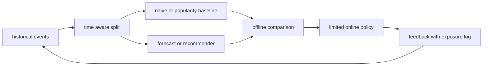

# 시계열 예측과 추천 시스템

<!-- source: https://arxiv.org/abs/1705.09477 | checked: 2026-09-03 -->
<!-- source: https://arxiv.org/abs/1205.2618 | checked: 2026-09-03 -->
<!-- source: https://arxiv.org/abs/1708.05031 | checked: 2026-09-03 -->

시계열은 미래를 예측하고 추천은 사용자에게 다음 후보를 순위화한다. task는 달라도 둘 다 관측되지 않은 값을 0으로 오해하기 쉽고, split·baseline·feedback loop를 잘못 설계하면 offline 점수가 실제 의사결정을 속일 수 있다.

## 이 장에서 처음 쓰는 말

| 말 | 이 장에서의 뜻 | 왜 필요한가요 · 언제 쓰나요 |
|---|---|---|
| horizon | 현재 시점에서 얼마나 먼 미래까지 예측할지 정한 길이 | 업무에서 얼마나 먼 미래를 보고 결정해야 하는지에 예측 평가를 맞춘다. **구체적인 상황(가상 예시):** 재고 결정에 일주일의 준비 시간이 필요하다. → 해당 예측 기간으로 평가한다. → 의사결정에 맞는 기준과 오류를 비교한다. |
| leakage | 예측 시점에는 알 수 없는 미래 정보를 학습·평가에 사용한 오류 | 오프라인 성능을 부풀리는, 예측 시점에 사용할 수 없는 미래 정보의 유입을 찾는다. **구체적인 상황(가상 예시):** 예측 특징에 예측 시점 이후 확정된 매출이 들어 있다. → 시점에 맞는 특징 가용성을 적용한다. → 미래 정보 없이 다시 평가한다. |
| naive baseline | 직전 값·계절 직전 값처럼 단순하지만 반드시 비교할 기준 | 복잡한 예측기가 간단한 계절값·최근값 기준보다 나은지 판단할 때 쓴다. **구체적인 상황(가상 예시):** 복잡한 예측이 간단한 비교 대상 없이 개선을 주장한다. → 최근값과 적절한 계절 기준을 추가한다. → 같은 별도 기간에서 비교한다. |
| implicit feedback | 클릭·조회처럼 선호일 수 있지만 비선호를 직접 말하지 않는 행동 | 명시적인 평점이 부족할 때 행동 기록으로 학습하며 노출 편향을 고려한다. **구체적인 상황(가상 예시):** 추천기에 클릭은 있지만 명시적 평점은 없다. → 행동 신호와 노출 조건을 반영한다. → 보이지 않은 항목을 비선호로 취급하는지 확인한다. |
| negative sampling | 미관측 항목을 비교용 음성 사례로 선택하는 것. 사용자가 실제로 싫어한다고 단정하지 않는다. | 비교 항목을 표본으로 골라 추천 학습을 감당할 수 있게 하며 표본 선택 편향을 명시한다. **구체적인 상황(가상 예시):** 학습에서 사용자마다 모든 항목을 비교할 수 없다. → 정해진 정책으로 비교용 음성 표본을 고른다. → 표본 선택이 순위 품질·편향에 미치는 영향을 평가한다. |
| ranking metric | top-K 순서의 품질을 재는 Recall·NDCG 같은 지표 | 사용자가 접하는 상위 결과에 관련 항목이 배치되는지 평가할 때 쓴다. **구체적인 상황(가상 예시):** 관련 상품이 결과에 있지만 사용자가 보는 목록 아래에 있다. → 적절한 순위 지표로 상위 관련성을 측정한다. → 실제 표시 개수 기준으로 비교한다. |

1. 예측 시점과 실제 사용할 정보를 고정한다.
2. 단순 baseline과 정책 비용을 함께 비교한다.

## 먼저 이해하기

random split은 미래 기록이 training에 들어가거나 같은 사용자의 이후 행동이 과거 예측에 섞이게 할 수 있다. 시계열은 시간순 rolling evaluation을, 추천은 사용자·item cold-start와 serving candidate 조건을 반영한 split을 설계한다.



## 시계열 문제 계약

| 항목 | 질문 | 예시 |
|---|---|---|
| target | 무엇을 예측하는가 | 15분 뒤 request rate |
| horizon | 얼마나 먼 미래인가 | 1, 4, 12 step |
| cadence | 입력 간격은 일정한가 | 5분 bucket |
| known future | 예측 시점에 아는 feature인가 | 예약된 deploy·휴일 |
| missing | 0과 미수집을 구분하는가 | collector outage flag |
| baseline | 무엇을 이겨야 하는가 | seasonal naive |
| decision | 예측으로 무엇을 바꾸는가 | pre-scale proposal |

ARIMA·상태공간 모델, RNN·LSTM과 encoder-decoder를 비교할 때 같은 split, horizon과 scaling을 사용한다. 더 복잡한 model이 naive를 못 이기면 복잡성을 채택하지 않는다. 평균 error뿐 아니라 peak underprediction, calibration과 action cost를 본다.

```json
{
  "forecastRun": "traffic-forecast-204",
  "cutoff": "2026-09-03T00:00:00Z",
  "horizonMinutes": 60,
  "baseline": "seasonal-naive-7d",
  "candidate": "encoder-decoder-v8",
  "metrics": {
    "maeBaseline": 18.2,
    "maeCandidate": 17.9,
    "peakUnderpredictionP95": 42.0
  },
  "decision": "observe-only"
}
```

MAE가 조금 좋아도 peak를 크게 낮춰 잡으면 capacity action에는 위험할 수 있다. [AIOps 진단](#doc=aiops-diagnosis-pipeline)에서 forecast residual은 anomaly 후보이며 root cause가 아니다.

## 추천 과제의 계약

협업 필터링은 사용자·item 상호작용에서 관계를 찾는다. implicit feedback에서 클릭하지 않은 항목은 싫다는 뜻이 아니라 노출되지 않았을 수 있다. BPR은 관측한 item이 sample한 미관측 item보다 높은 score를 갖도록 pairwise ranking을 학습한다. NCF는 nonlinear interaction을, graph collaborative filtering은 user-item graph의 이웃 전파를 활용한다.

| 단계 | 데이터 | 평가 위험 |
|---|---|---|
| candidate generation | ANN·인기·graph 이웃 | 정답 item이 후보에 없는 recall ceiling |
| ranking | user·item·context feature | future·post-click leakage |
| policy | 다양성·안전·재고 | model score와 업무 제약 충돌 |
| serving | exposure와 position | 보인 것만 feedback으로 돌아옴 |
| retraining | click·purchase | 기존 정책 bias를 다시 학습 |

```yaml
recommendation_receipt:
  dataset: interactions@20260903
  split: chronological-per-user
  candidateGenerator: ann-v12
  ranker: graph-ranker-v7
  policy: diversity-stock-safety-v4
  metrics:
    recallAt20: 0.42
    ndcgAt10: 0.27
    coldUserCoverage: 0.91
  exposureLogging: required
```

## 운영 연결

사용자별 순서뿐 아니라 전체에 적용할 평가 기준 시점도 하나 정한다. 다른 사용자의 미래 상호작용으로 학습한 모델은 과거 예측에 미래의 항목 인기도를 누출할 수 있다. 스케일러, 결측값 처리기, 어휘집, 특성 집계는 학습 구간에서만 맞추고 각 특성의 사용 가능 시점이 예측 시점보다 늦지 않게 한다. 랭킹에서는 Recall/NDCG와 함께 후보 전체 범위와 음성 샘플링 방식을 보고한다. 음성 사례 100개를 샘플링해 측정한 점수는 전체 카탈로그 랭킹과 직접 비교할 수 없다.

1. feature event의 schema·시간·중복 처리는 [메시징과 이벤트](#doc=messaging-roadmap)에 연결한다.
2. online feature cache와 hot key는 [Redis와 DynamoDB](#doc=nosql-roadmap)에서 검토한다.
3. dataset·run·model·policy lineage는 [MLOps·LLMOps](#doc=ai-transformation-platform-mlops)에 남긴다.
4. drift alert는 사용자·segment 결과와 함께 [AIOps 신호 계약](#doc=aiops-foundations-contract-lab)에 넣는다.
5. forecast 기반 scaling은 자동 실행 전에 [AIOps 복구 상태 머신](#doc=aiops-remediation-state-machine)의 precondition과 abort를 거친다.

## 완료

- 시간 누수 없는 split과 naive baseline을 정의했다.
- 시계열 error를 실제 capacity action 비용과 연결했다.
- implicit feedback에서 미관측과 비선호를 구분했다.
- candidate·ranking·policy·exposure feedback을 한 경로로 기록했다.

## 스스로 설명해 보기

- 시계열에서 random split이 미래 정보를 누출할 수 있는 이유는 무엇인가?
- MAE가 개선됐는데도 자동 pre-scaling을 승인하지 않을 수 있는 이유는 무엇인가?
- 클릭하지 않은 item을 모두 negative로 보면 어떤 bias가 생기는가?
- 추천 model score와 최종 policy 결과를 같은 것으로 보면 무엇을 놓치는가?
