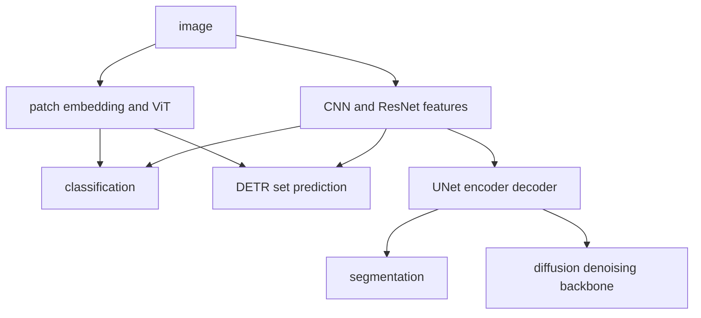

# Vision과 생성 모델 계보

<!-- source: https://arxiv.org/abs/1512.03385 | checked: 2026-09-03 -->
<!-- source: https://arxiv.org/abs/2010.11929 | checked: 2026-09-03 -->
<!-- source: https://arxiv.org/abs/2006.11239 | checked: 2026-09-03 -->

Vision 모델은 pixel의 지역 구조를 어떻게 보존하고 전역 관계를 어떻게 합칠지 선택한다. 생성 모델은 관측 데이터를 직접 분류하는 대신 그 데이터가 나오는 분포나 역과정을 학습한다. 두 계보는 UNet, attention과 latent representation에서 만나지만 objective와 평가 방식은 구분해야 한다.

## 이 장에서 처음 쓰는 말

| 말 | 이 장에서의 뜻 | 왜 필요한가요 · 언제 쓰나요 |
|---|---|---|
| convolution | 작은 kernel을 공간 전체에 공유해 지역 pattern을 찾는 연산 | 위치마다 별도 파라미터를 두지 않고 공유 가중치로 지역적인 공간 패턴을 학습한다. **구체적인 상황(가상 예시):** 제품 이미지 어디에나 결함이 나타날 수 있다. → 공유 convolution 커널로 지역 패턴을 학습한다. → 위치가 다양한 별도 시험 이미지로 검증한다. |
| residual | 입력을 변환 결과에 더해 깊은 network의 학습 경로를 돕는 연결 | 깊은 신경망에서 정보를 보존하고 더 짧은 덧셈 경로로 학습을 돕는다. **구체적인 상황(가상 예시):** 더 깊은 신경망을 최적화하기 어려워진다. → 통제된 구조 비교에서 residual 연결을 검토한다. → 학습 동작과 별도 평가 성능을 비교한다. |
| patch embedding | 이미지를 patch로 나누어 token sequence처럼 바꾸는 표현 | 이미지 영역을 transformer가 처리할 수 있는 시퀀스 입력으로 바꾼다. **구체적인 상황(가상 예시):** vision transformer가 이미지를 시퀀스로 받아야 한다. → 지정된 경로로 patch embedding을 만든다. → 패치 순서·모양·전처리 일관성을 확인한다. |
| detection | 객체의 class와 위치 집합을 예측하는 문제 | 이미지 전체의 분류만으로 부족하고 개별 물체의 위치가 필요할 때 쓴다. **구체적인 상황(가상 예시):** 로봇에 이미지 분류가 아니라 상자 여러 개의 위치가 필요하다. → 객체 탐지기를 평가한다. → 관련 장면에서 위치 정확도와 누락을 확인한다. |
| segmentation | 각 pixel 또는 영역의 class를 예측하는 문제 | 경계 상자만으로 필요한 모양을 표현할 수 없을 때 정확한 영역을 구분한다. **구체적인 상황(가상 예시):** 결함의 경계 상자보다 정확한 면적이 중요하다. → segmentation 마스크를 평가한다. → 경계 오류와 필요한 영역의 포함 정도를 비교한다. |
| latent | 관측 데이터보다 압축된 내부 표현 | 어떤 세부 정보가 보존되는지 확인하면서 압축된 표현에서 학습·생성을 수행한다. **구체적인 상황(가상 예시):** 생성 파이프라인이 압축된 이미지 표현을 처리한다. → latent 인코딩·디코딩 단계를 조사한다. → 복원된 세부 정보와 과제 품질을 확인한다. |

1. task의 output 구조부터 classification·detection·segmentation·generation으로 나눈다.
2. dataset split과 target 환경에서 baseline보다 나은지 검증한다.

## 먼저 이해하기

CNN은 locality와 translation 관련 구조를 architecture에 넣는다. ResNet은 residual connection으로 깊은 network의 최적화를 돕는다. ViT는 이미지를 patch token으로 만들어 Transformer encoder에 넣으며, convolution의 inductive bias가 줄어든 만큼 dataset·pretraining 조건에 더 민감할 수 있다.



## 판별 task의 계약

| task | output | 대표 평가 | 운영에서 추가할 것 |
|---|---|---|---|
| classification | class probability | accuracy·F1·calibration | class별 비용·abstention |
| detection | box와 class 집합 | mAP | 작은 객체·latency·NMS 여부 |
| segmentation | pixel mask | IoU·Dice | 경계·희소 class·memory |
| embedding | vector | retrieval recall | drift·index version |

DETR 계열은 object query와 bipartite matching으로 예측 집합을 학습한다. `query 100개` 같은 구현 숫자는 보편 계약이 아니다. scene의 객체 밀도, 학습 schedule과 backbone에 맞춰 검증해야 한다. UNet의 skip은 encoder feature를 decoder에 전달하지만 ResNet residual과 결합 방식·목적이 같지 않다.

```yaml
vision_bundle:
  task: defect-segmentation
  model: unet-vit-hybrid@run-88
  preprocessing: camera-calibration@v4
  input:
    width: 1024
    height: 768
    colorSpace: rgb
  labels: defect-taxonomy@v9
  target: edge-gpu-a@runtime-12
  evaluation: defect-suite@20260903
```

## 생성 모델의 서로 다른 문제 설정

| 계열 | 핵심 학습 아이디어 | latent 형태 | 주요 실패·평가 질문 |
|---|---|---|---|
| GAN | generator와 discriminator의 경쟁 | 연속 noise | mode collapse·학습 불안정 |
| VAE | 가능도 하한과 재매개변수화 | 연속 확률 변수 | 복원·잠재 공간 규칙성 |
| VQ-VAE | codebook의 이산 latent | 이산 token | codebook 사용·commitment |
| autoregressive image token | 이전 token으로 다음 token 예측 | 이산 sequence | 긴 생성 비용·ordering |
| diffusion | noise를 더한 뒤 역과정 denoising | pixel 또는 latent | sampling step·conditioning·fidelity |

DDPM은 단계적으로 noise가 섞인 데이터에서 역과정을 학습한다. Stable Diffusion류의 latent diffusion은 pixel 공간보다 압축된 latent에서 denoising해 비용을 줄이고 text conditioning을 결합한다. FID 같은 분포 metric 하나가 prompt 충실도, 안전성과 개별 이미지 정확성을 모두 보장하지 않는다.

## 데이터와 평가 누수

1. 같은 원본에서 잘라낸 frame·crop이 train과 test에 섞이지 않게 group split한다.
2. camera, site, time과 device 변화가 test에 대표되는지 확인한다.
3. label guideline와 annotator disagreement를 보존한다.
4. augmentation이 실제 불변성을 반영하는지 검토한다.
5. 전체 metric뿐 아니라 class·환경·confidence 구간별 결과를 기록한다.
6. 모델 update 뒤 preprocessing·calibration·runtime을 같은 bundle로 배포한다.

edge 배포는 [On-device AI와 모델 압축](#doc=ai-specialist-core-edge), GPU serving은 [AI Transformation 인프라](#doc=ai-transformation-platform-infrastructure)에 연결한다. 운영 영상 anomaly를 AIOps 신호로 쓸 때 detection confidence는 incident 원인 확률이 아니며 [AIOps 신호 계약](#doc=aiops-foundations-evidence-graph)에 model·camera·time ID를 함께 남긴다.

## 완료

- classification·detection·segmentation·generation의 output 계약을 구분했다.
- CNN·ResNet·ViT·DETR·UNet의 구조적 선택을 연결했다.
- GAN·VAE·VQ-VAE·autoregressive·diffusion의 objective 차이를 정리했다.
- dataset split, preprocessing와 target runtime을 model bundle에 포함했다.

## 스스로 설명해 보기

- 이미지 패치를 토큰으로 바꾸는 것은 합성곱과 비교해 ViT의 귀납적 편향을 어떻게 바꾸는가?
- ResNet residual과 UNet skip을 같은 연결이라고만 부르면 무엇을 놓치는가?
- 생성 이미지의 FID가 좋아도 실제 제품 gate를 통과하지 못할 수 있는 이유는 무엇인가?
- 연속 latent와 이산 codebook은 각각 어떤 downstream 선택을 바꾸는가?
