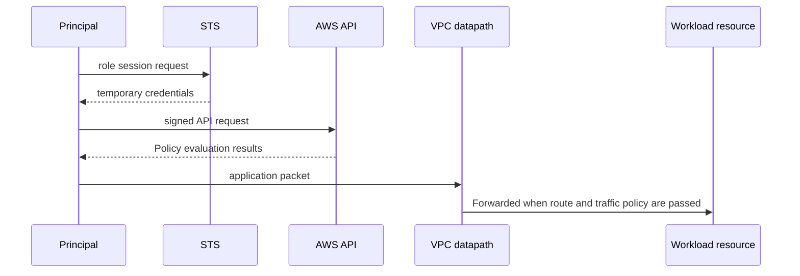

# Account, identity와 network boundary

<!-- source: https://docs.aws.amazon.com/awscloudtrail/latest/userguide/logging-data-events-with-cloudtrail.html | checked: 2026-09-10 | data-event support and explicit selection -->

## 이 장에서 처음 쓰는 말

- **principal**: AWS에 요청을 보내는 사람 또는 프로그램의 신원이다. **왜 필요한가요 · 언제 쓰나요:** AWS 요청의 권한을 평가할 때 어느 신원에 대한 정책을 적용할지 정한다. **구체적인 상황(가상 예시):** 같은 명령이 수동으로는 성공하지만 CI에서는 실패한다. → 실제 요청 신원을 비교한다. → 운영자가 아닌 CI 신원의 정책을 확인한다.
- **credential**: 그 신원을 증명할 때 사용하는 로그인 정보다. 장기 access key보다 임시 credential을 우선한다. **왜 필요한가요 · 언제 쓰나요:** 서비스에 요청자의 신원을 증명할 때 쓰며 자격 증명은 보호하고 수명을 제한한다. **구체적인 상황(가상 예시):** 몇 시간 실행한 작업에서 인증 오류가 발생한다. → 비밀값을 노출하지 않고 자격 증명 만료를 확인한다. → 갱신 절차로 인증이 복구되는지 본다.
- **API**: 프로그램이 AWS에 “목록을 보여 줘”, “자원을 만들어 줘”라고 요청하는 정해진 통로다. **왜 필요한가요 · 언제 쓰나요:** 정의된 요청 인터페이스로 AWS 조회와 변경을 반복 가능하게 자동화할 때 쓴다. **구체적인 상황(가상 예시):** 운영자가 매일 같은 자원 목록을 조회한다. → 제한된 자격 증명으로 문서화된 API를 사용한다. → 반환 자원의 계정·리전을 확인한다.
- **subnet**: VPC의 IP 주소 범위를 더 작은 구역으로 나눈 것이다. **왜 필요한가요 · 언제 쓰나요:** 네트워크 인터페이스를 원하는 배치·라우팅을 갖는 주소 범위로 묶을 때 쓴다. **구체적인 상황(가상 예시):** 혼잡한 서브넷에서 새 인스턴스에 주소를 주지 못한다. → 주소 여유와 배치를 조사한다. → 계획한 인스턴스를 수용할 주소가 있는지 확인한다.
- **route table**: 목적지 주소에 따라 트래픽을 어느 다음 지점으로 보낼지 정한 규칙 모음이다. **왜 필요한가요 · 언제 쓰나요:** 목적지별 트래픽 전달 결정을 명시하고 검토할 수 있게 한다. **구체적인 상황(가상 예시):** 서브넷이 사설 목적지를 잘못된 게이트웨이로 보낸다. → 라우팅 테이블 항목과 연결을 비교한다. → 의도한 다음 경유지가 선택되는지 확인한다.
- **availability zone(AZ)**: 한 Region 안에서 전원·시설 장애 경계를 분리한 운영 구역이다. **왜 필요한가요 · 언제 쓰나요:** 리전 안에서 시설 장애 경계가 다른 곳에 중복 워크로드를 배치할 때 쓴다. **구체적인 상황(가상 예시):** 가용 영역 하나의 장애로 모든 복제본이 사라진다. → 서로 다른 AZ에 배치됐는지 검토한다. → 남은 영역이 필요한 부하를 감당하는지 시험한다.

처음에는 요청 하나가 성공하려면 `신원에 작업 권한이 있음`과 `목적지까지 통신 경로가 있음`이 모두 필요하다는 사실만 잡는다. 둘 중 하나만 확인해서는 원인을 찾을 수 없다.

## 먼저 이해하기

AWS에서 resource 접근은 “같은 VPC에 있으니 된다” 또는 “IAM role이 있으니 된다”로 설명되지 않는다. API 호출에는 principal과 policy evaluation이 필요하고, 네트워크 packet에는 address·route·filter·리스너가 필요하다. 애플리케이션 요청 하나가 둘을 모두 거칠 수 있지만 두 허가는 독립적이다.

예를 들어 private subnet의 EC2에서 S3 object를 읽는다고 하자. application은 instance role의 temporary credential로 `s3:GetObject` 권한을 받아야 한다. 동시에 packet은 NAT gateway 또는 S3 VPC 엔드포인트 같은 실제 경로를 가져야 한다. IAM이 허용해도 route가 없으면 timeout이 나고, 네트워크가 열려 있어도 IAM이 거부하면 AWS API가 AccessDenied를 반환한다.

| 경계 | 핵심 질문 | 주된 증거 |
|---|---|---|
| account | 누가 resource와 비용의 최종 owner인가? | account·organization 구조, billing owner |
| identity | 어떤 principal이 어떤 session으로 요청하는가? | role ARN, STS session, CloudTrail |
| authorization | 어떤 action·resource·condition이 허용되는가? | policy evaluation과 denial context |
| network | packet이 어느 hop과 filter를 지나는가? | subnet, route, SG/NACL, flow evidence |
| resource | 실제 object가 어느 region·AZ와 lifecycle에 있는가? | 서비스 API, tags, state와 health |

## AWS 조회 요청을 한 단계씩 따라가기

1. 사용자나 프로그램이 credential을 사용해 AWS API 요청을 만든다.
2. AWS가 credential로 principal과 만료된 session이 아닌지 확인한다.
3. IAM과 관련 policy가 요청한 action을 해당 resource에 허용하는지 평가한다.
4. 허용됐다면 대상 Region의 서비스가 resource 상태를 조회하거나 변경한다.
5. data path가 필요한 작업은 VPC route와 security policy도 통과해야 한다.
6. 관련 이벤트 유형의 수집이 활성화되고 지원되는 서비스 로그나 CloudTrail을 확인한다. 예를 들어 S3 오브젝트 수준 데이터 이벤트는 모든 기본 관리 이벤트 기록에 자동 포함되는 것이 아니다.

이것은 패킷의 순차 경로가 아니라 책임 경계다. 서명한 API 요청이 AWS 엔드포인트에 도달해야 그 엔드포인트가 요청을 평가할 수 있다. 데이터베이스 세션 같은 별도 애플리케이션 연결에는 자체 네트워크·인증 경로가 있다.

## 요청 하나에 필요한 두 허가

AWS API 요청과 워크로드 네트워크 연결은 서로 다른 경로다.

- IAM authorization은 principal이 API action을 resource에 수행할 수 있는지 평가한다.
- 네트워크 reachability는 address, route, gateway와 트래픽 policy가 packet을 전달하는지 결정한다.

DB port가 열려 있어도 caller가 RDS configuration을 바꿀 권한은 생기지 않는다. 반대로 `rds:ModifyDBInstance` 권한이 있어도 application 프로세스가 DB 엔드포인트에 TCP 연결할 수 있다는 뜻은 아니다.



## Identity model

| 요소 | 의미 | 운영상 확인할 것 |
|---|---|---|
| principal | 요청을 서명한 user, role session 또는 서비스 | 실제 ARN과 session source |
| identity policy | principal에 붙은 권한 | action, resource, condition |
| resource policy | resource가 신뢰하는 principal | cross-account principal과 condition |
| role trust policy | 누가 role을 assume할 수 있는가 | 서비스, account, federation 조건 |
| session | temporary credential의 유효 범위 | duration, session name, source identity |

root user는 account 복구 등 제한된 작업에만 두고 일상 운영 경로로 사용하지 않는다. 워크로드에는 사람의 장기 access key가 아니라 execution environment가 받을 수 있는 role을 연결한다.

## VPC model

VPC는 논리적으로 격리된 virtual 네트워크다. subnet은 한 Availability Zone의 address range이고 route table이 subnet 또는 gateway 트래픽의 next hop을 정한다.

```text
reachability = source address + destination address
             + source route + destination return route
             + gateway/NAT/endpoint
             + security group/NACL/host policy
             + listening application
```

public/private이라는 label만으로 판정하지 않는다. public IPv4와 internet gateway route가 있어도 security policy와 리스너가 없으면 inbound 요청은 성공하지 않는다. private resource의 outbound도 NAT gateway, VPC 엔드포인트 또는 다른 controlled egress 경로가 필요하다.

## Regional resource와 failure domain

Region, Availability Zone과 resource scope를 구분한다. subnet은 한 AZ에 속하고, 여러 AZ에 resource를 나누는 것은 장애 반경을 줄이는 한 방법이지만 data replication·failover와 application retry가 준비되지 않으면 배치만 늘어난다.

## Shared responsibility

managed 서비스는 일부 infrastructure lifecycle을 AWS에 맡기지만 customer configuration과 data 사용 책임은 남는다. 예를 들어 EKS control plane 관리와 워크로드 RBAC·image·네트워크 policy·node 선택은 같은 책임이 아니다.

## 스스로 설명해 보기

1. role trust policy와 identity policy가 각각 묻는 질문은 무엇인가?
2. request가 `AccessDenied`일 때 네트워크 packet capture부터 시작하지 않는 이유는 무엇인가?
3. 두 AZ에 instance가 있어도 서비스가 신뢰성 목표를 못 지킬 수 있는 이유는 무엇인가?

<!-- source: https://docs.aws.amazon.com/IAM/latest/UserGuide/introduction.html | checked: 2026-09-03 -->
<!-- source: https://docs.aws.amazon.com/IAM/latest/UserGuide/access_policies.html | checked: 2026-09-03 -->
<!-- source: https://docs.aws.amazon.com/vpc/latest/userguide/what-is-amazon-vpc.html | checked: 2026-09-03 -->
<!-- source: https://docs.aws.amazon.com/AWSEC2/latest/UserGuide/concepts.html | checked: 2026-09-03 -->
<!-- source: https://docs.aws.amazon.com/eks/latest/userguide/what-is-eks.html | checked: 2026-09-03 -->
