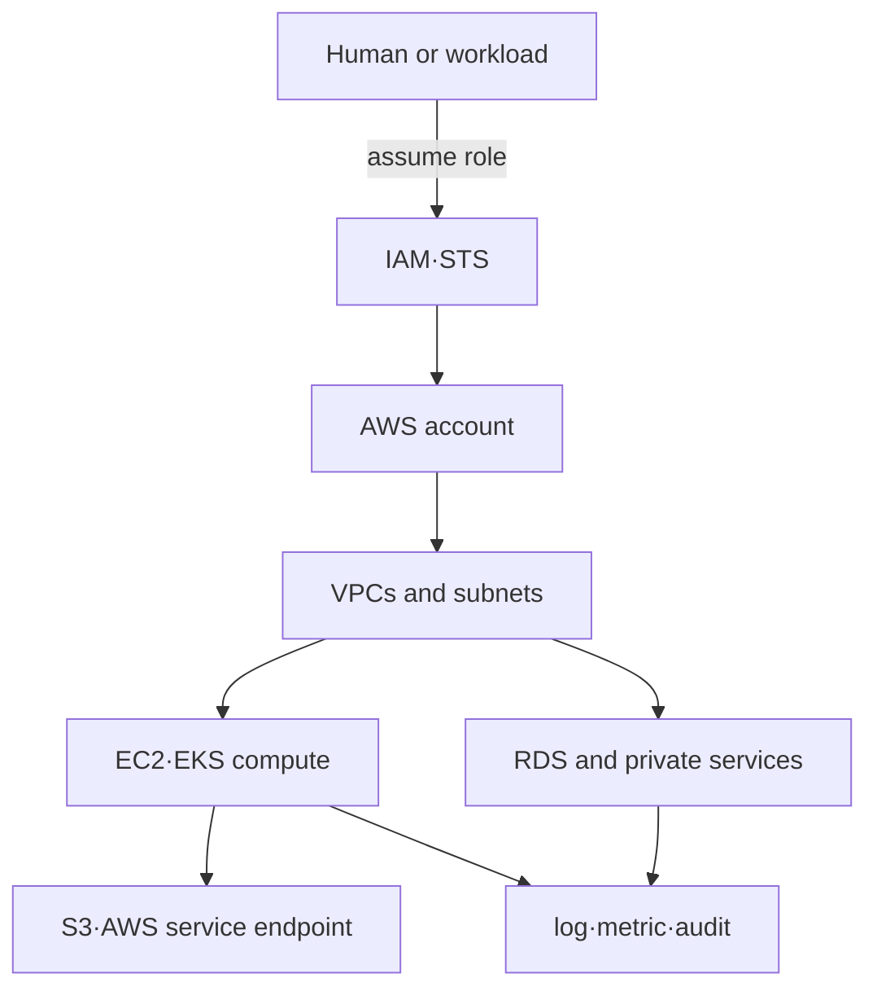

# AWS 인프라 기반 로드맵

## 처음 보는 사람을 위한 출발점

내 컴퓨터에서만 실행하던 애플리케이션을 다른 사람도 계속 사용할 수 있게 하려면 서버, 네트워크, 저장 공간과 접근 권한이 필요하다. AWS는 이런 자원을 필요할 때 만들고 사용량에 따라 비용을 내는 클라우드 서비스다. 편리하지만 어떤 계정에 무엇을 만들었는지 모르면 보안 사고와 예상하지 못한 비용이 생길 수 있다.

| 처음 만나는 말 | 학습용 쉬운 뜻 | 왜 필요한가요 · 언제 쓰나요 |
|---|---|---|
| 계정(account) | AWS 자원과 비용, 권한이 모이는 가장 큰 소유 경계 | 환경이나 조직의 소유권·청구·권한 경계를 분리할 때 쓴다. **구체적인 상황(가상 예시):** 시험 배포 비용이 운영 청구에 나타난다. → 자원을 변경하기 전에 활성 AWS 계정을 확인한다. → 의도한 계정과 자원 소유자가 같은지 확인한다. |
| 리전(Region) | AWS가 서비스를 제공하는 지리적 지역 | 지연 시간·데이터 위치·복구 요구에 맞는 지리적 배치를 선택할 때 쓴다. **구체적인 상황(가상 예시):** 배포 지역에서 먼 사용자에게 API가 느리다. → 가능한 리전들의 지연·데이터 위치 요구를 비교한다. → 워크로드 이동 전에 선택한 경로를 측정한다. |
| 자원(resource) | 서버, 네트워크, 저장소처럼 AWS에서 생성하고 관리하는 대상 | 소유권·비용·권한을 관리해야 할 정확한 AWS 객체를 선택할 때 쓴다. **구체적인 상황(가상 예시):** 공유 AWS 계정에서 소유자가 불분명한 버킷을 발견했다. → 리소스와 태그·정책·의존성을 식별한다. → 접근 권한과 비용을 책임질 팀을 확인한다. |
| IAM | 누가 어떤 AWS 작업을 할 수 있는지 정하는 권한 체계 | 적절한 신원에 필요한 AWS 작업을 허용하고 거부된 요청을 진단할 때 쓴다. **구체적인 상황(가상 예시):** 배포가 버킷 목록은 읽지만 아티팩트를 올리지 못한다. → 거부된 작업과 IAM 정책 범위를 조사한다. → 의도한 신원으로 필요한 업로드를 시험한다. |
| VPC | AWS 안에서 주소와 통신 규칙을 직접 정하는 격리된 네트워크 | AWS 네트워크 안에서 워크로드 주소와 허용할 통신 경로를 설계할 때 쓴다. **구체적인 상황(가상 예시):** AWS 서비스 두 개가 사설 통신을 해야 한다. → 검토한 VPC 네트워크에 배치하고 경로를 정한다. → 필요한 연결과 불필요한 경로의 차단을 확인한다. |
| 역할(role) | 사람이나 프로그램이 잠시 맡아 허가된 작업을 수행하는 권한 묶음 | 각 워크로드에 영구 사용자 자격 증명을 배포하지 않고 작업별 권한을 위임한다. **구체적인 상황(가상 예시):** 배포 작업이 버킷 하나에 임시 접근해야 한다. → 범위가 제한된 역할을 부여한다. → 업로드 허용과 무관한 접근 거부를 확인한다. |

첫 단계에서는 자원을 만들지 않고 현재 로그인한 주체와 이미 존재하는 네트워크를 읽는다. 그 뒤에 “누가 허용했는가”와 “네트워크 길이 열렸는가”를 분리해 판단한다.

AWS를 서비스 이름 목록으로 배우면 resource가 늘 때 trust와 네트워크 경계가 보이지 않는다. 이 과정은 **누가 어떤 account에서 어떤 network path로 어느 resource를 변경하는가**를 먼저 고정한다.

## 한 문장 모델

> AWS 워크로드는 `account boundary + identity policy + VPC reachability + regional resource + telemetry·cost record`의 결합이다.

## 읽는 순서

1. [Account, identity와 network boundary](../../content/aws-foundations/01-identity-network-resource-model.md): IAM authorization과 VPC reachability를 분리한다.
2. [Read-only AWS 진단 실습](../../content/aws-foundations/02-read-only-diagnosis-lab.md): 현재 caller와 VPC route를 변경 없이 조회하고 `AccessDenied`를 증거로 해석한다.

## 서비스 선택 지도

| 책임 | 먼저 배우는 resource | 운영 질문 |
|---|---|---|
| identity | account, role, policy, STS session | 누가 어떤 조건으로 무엇을 할 수 있는가? |
| network | VPC, subnet, route table, gateway, 엔드포인트 | 어느 source에서 어느 destination에 도달하는가? |
| compute | EC2, Auto Scaling, EKS | 프로세스·Pod가 어디서 실행되고 누가 교체하는가? |
| storage | EBS, S3 | block과 object의 수명·내구·삭제 경계는 무엇인가? |
| database | RDS | engine 운영과 infrastructure 운영을 누가 맡는가? |
| operations | CloudWatch, CloudTrail, tags | 상태·변경·비용을 어떤 identity와 resource에 귀속하는가? |

AWS Well-Architected의 운영 우수성, 보안, 신뢰성, 성능 효율, 비용 최적화와 지속 가능성은 서비스 선택의 별도 checklist가 아니라 같은 워크로드를 보는 여섯 관점으로 사용한다.

## 범위 밖

- 자격증 문제 풀이와 모든 AWS 서비스 암기
- multi-cloud 추상화
- Organizations·Control Tower의 실제 multi-account 구축
- 실제 resource 생성: [Terraform on AWS](../../content/terraform-aws/00-roadmap.md)에서 선택 실습으로 다룬다.

## 완료

이 주제는 한 번 읽고 끝내지 않는다. 먼저 용어 표를 자신의 말로 바꾸고, 개념 장에서 한 요청의 흐름을 따라간다. 실습에서는 정상 상태를 먼저 기록한 뒤 조건 하나만 바꿔 실패를 만들고, 증거로 원인을 설명한 뒤 복구한다. 마지막으로 아래 운영 판단 질문에 답하면서 더 복잡한 환경으로 확장한다.

- authentication과 authorization을 구분하고 role session의 주체를 확인한다.
- public subnet이라는 이름이 아니라 route와 address, gateway·policy의 조합으로 reachability를 판정한다.
- managed 서비스가 application의 schema·query·backup 검증 책임까지 대신하지 않는 이유를 설명한다.

## 처음 이해했는지 확인

1. AWS account와 Region은 무엇을 구분하는 경계인가?
2. IAM 권한이 있어도 네트워크 경로가 없으면 요청이 실패할 수 있는 이유는 무엇인가?

**확인 기준:** account는 소유·권한·비용의 큰 경계이고 Region은 지리적 서비스 위치라고 설명할 수 있으면 된다. 작업 허가와 통신 가능성은 별도 조건이다.

## 운영 판단으로 확장하기

1. IAM Allow가 있어도 요청이 실패할 수 있는 다른 policy·네트워크 이유는 무엇인가?
2. private subnet의 resource가 AWS API를 호출하는 경로에는 어떤 선택지가 있는가?
3. EKS가 관리해 주는 영역과 node·워크로드 운영자가 책임지는 영역을 나눠 보자.

<!-- source: https://docs.aws.amazon.com/wellarchitected/latest/framework/welcome.html | checked: 2026-09-03 -->
<!-- source: https://docs.aws.amazon.com/IAM/latest/UserGuide/introduction.html | checked: 2026-09-03 -->
<!-- source: https://docs.aws.amazon.com/vpc/latest/userguide/what-is-amazon-vpc.html | checked: 2026-09-03 -->
<!-- source: https://docs.aws.amazon.com/eks/latest/userguide/what-is-eks.html | checked: 2026-09-03 -->
