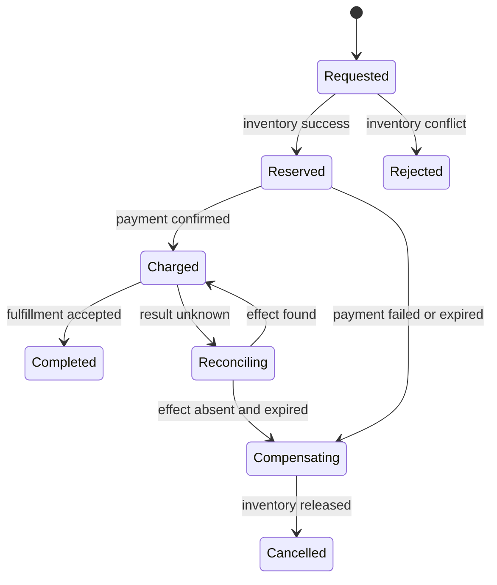

# 부분 실패와 분산 워크플로

<!-- source: https://kafka.apache.org/40/design/design/ | checked: 2026-09-03 -->
<!-- source: https://sre.google/sre-book/managing-critical-state/ | checked: 2026-09-03 -->

프로세스와 네트워크가 둘 이상이면 “호출이 실패했다”는 말만으로 실제 상태를 알 수 없다. 요청은 반영됐지만 응답이 사라질 수 있고, event는 처리됐지만 offset commit이 실패할 수 있다. 분산 워크플로는 이 결과 불명을 제거하는 마법이 아니라 안정 식별자, 상태 전이와 reconciliation으로 불확실성을 수렴시키는 설계다.

## 이 장에서 처음 쓰는 말

| 말 | 이 장에서의 뜻 | 왜 필요한가요 · 언제 쓰나요 |
|---|---|---|
| partial failure | 일부 구성 요소만 실패해 전체 결과를 즉시 알 수 없는 상태 | 모든 구성 요소가 함께 실패한다고 가정하지 않고 여러 시스템의 불확실한 결과를 복구하도록 설계한다. **구체적인 상황(가상 예시):** 결제는 성공했지만 재고 확인이 시간 초과된다. → 각 시스템의 영속 상태를 따로 조사한다. → 둘 다 실패했다고 가정하지 말고 대사·보상한다. |
| delivery | message가 broker와 소비자 사이에서 전달되는 규칙 | 수신을 완료와 동일시하지 않고 소비자가 처리해야 할 유실·중복 가능성을 정한다. **구체적인 상황(가상 예시):** 소비자가 재시작 뒤 같은 이벤트를 다시 받는다. → 전달 계약과 중복 처리 규칙을 적용한다. → 수신 횟수뿐 아니라 업무 효과를 확인한다. |
| deduplication | 이미 처리한 안정 식별자를 기억해 업무 효과를 반복하지 않는 것 | 보관되거나 재시도된 이벤트 사본이 업무 효과를 중복 발생시키지 않도록 한다. **구체적인 상황(가상 예시):** 보존 이벤트가 두 번 재생된다. → 고정된 식별자로 반복 처리를 찾는다. → 업무 합계가 의도한 만큼만 바뀌는지 확인한다. |
| fencing token | 오래된 owner의 늦은 쓰기를 거부하는 단조 증가 세대 값 | 새 실행자가 소유권을 얻은 뒤 만료된 이전 소유자의 지연 쓰기를 거부한다. **구체적인 상황(가상 예시):** 새 소유자가 시작된 뒤 만료된 워커가 재개된다. → 출력 저장소가 fencing 세대를 검사하게 한다. → 이전 워커의 지연 쓰기가 거부되는지 시험한다. |
| compensation | 이미 끝난 효과를 업무적으로 되돌리거나 상쇄하는 후속 작업 | 전체 워크플로가 계획대로 끝나지 못할 때 이미 완료된 외부 효과를 수습한다. **구체적인 상황(가상 예시):** 결제는 완료됐지만 배송을 만들 수 없다. → 승인된 업무 보상 절차를 실행한다. → 결과를 확인하고 원래 기록과 보상 기록을 모두 남긴다. |
| reconciliation | 원하는 상태와 실제 상태를 다시 읽어 차이를 수렴시키는 반복 | 응답이 불확실할 때 실제 상태를 확인한 뒤 작업을 반복·수정해 복구한다. **구체적인 상황(가상 예시):** 컨트롤러가 성공한 갱신의 응답을 잃는다. → 목표와 실제 상태를 다시 읽는다. → 아직 필요한 작업만 반복해 상태를 맞춘다. |

1. 모든 네트워크 경계에 응답 유실과 중복 전달을 추가한다.
2. 그다음 결과를 재조회할 식별자와 상태 전이를 설계한다.

## 먼저 이해하기

Kafka의 idempotent 생산자와 transaction은 특정 log·partition·생산자 경계에서 중복을 줄이고 offset과 output topic 기록을 묶을 수 있다. 이것이 결제 DB, 외부 API와 email까지 한 번만 실행되게 보장하지는 않는다. broker 보증을 업무 보증으로 확대 해석하지 않는다.



## 실패 표를 먼저 쓴다

| 경계 | 끊긴 시점 | 관찰 | 안전한 다음 행동 |
|---|---|---|---|
| client → API | commit 뒤 응답 전 | 클라이언트 timeout | 같은 request key로 결과 조회 |
| DB → outbox relay | publish 뒤 mark 전 | event 재발행 가능 | 소비자가 event ID dedupe |
| consumer → DB | commit 뒤 offset 전 | message 재수신 | inbox와 업무 write를 같은 transaction에 기록 |
| service → payment | 승인 뒤 응답 전 | 결과 불명 | payment operation ID로 조회 |
| lease owner → resource | lease 만료 뒤 지연 write | 두 owner처럼 보임 | fencing token이 낮은 write 거부 |
| saga step | 일부 step 완료 뒤 실패 | 부분 효과 남음 | 상태별 compensation 또는 사람 escalation |

## inbox와 업무 효과를 같이 기록한다

소비자가 in-memory set으로만 중복을 막으면 재시작 뒤 같은 event를 다시 처리한다. 안정적인 `event_id`를 업무 변경과 같은 transaction에 기록한다.

```sql
BEGIN;

WITH accepted AS (
  INSERT INTO consumer_inbox (consumer_name, event_id)
  VALUES ('fulfillment', 'evt-981')
  ON CONFLICT (consumer_name, event_id) DO NOTHING
  RETURNING event_id
)
UPDATE orders
SET fulfillment_state = 'QUEUED'
WHERE order_id = 'order-204'
  AND fulfillment_state = 'NEW'
  AND EXISTS (SELECT 1 FROM accepted);

COMMIT;
```

inbox에는 `(consumer_name, event_id)` 유일 키가 필요하다. 이 예시는 대상 주문이 이미 존재하며 처리 가능하다고 가정한다. 실제 소비자는 이미 완료된 전이와 존재하지 않거나 유효하지 않은 주문을 구분하고 계약에 따라 롤백하거나 격리해야 한다. 실행 가능한 [중복 이벤트 실습](#doc=messaging-duplicate-dlq)은 고정된 기존 업무 행을 시험한다.

dedupe 보존 기간이 생산자 replay 기간보다 짧으면 오래된 event가 다시 효과를 만들 수 있다. ID 범위, 보존·삭제와 재처리 runbook을 함께 계약한다. 자세한 broker 선택과 DLQ는 [메시징과 이벤트 인프라](#doc=messaging-roadmap)에 연결한다.

## lease와 fencing

lease는 시간이 지나면 소유권을 잃게 만들지만, 일시 정지된 old owner가 뒤늦게 깨어나 write하는 것을 물리적으로 막지 못할 수 있다. lock 서비스가 새 owner마다 더 큰 token을 발급하고 resource가 마지막 token보다 작은 write를 거부해야 한다.

```json
{
  "operationId": "reprice-shop-a-204",
  "owner": "worker-7",
  "fencingToken": 418,
  "expectedRevision": 12,
  "targetRevision": 13
}
```

이 JSON을 로그에 남기는 것만으로 fencing이 되지 않는다. 실제 write를 받는 DB나 resource가 token·revision precondition을 원자적으로 비교해야 한다.

## compensation은 rollback이 아니다

외부 결제, 메시지 전송과 배송 요청은 DB rollback으로 사라지지 않는다. compensation은 원래 효과를 상쇄하는 새로운 업무 작업이다. 환불이 실패하거나 이미 배송이 시작됐다면 자동으로 이전 상태로 돌아가지 않는다. 상태 머신에 retryable, terminal, result-unknown과 human-review 상태를 둔다.

| 상태 | 자동 행동 | 필요한 증거 |
|---|---|---|
| 요청 전 | 새 operation 생성 | idempotency key 유일성 |
| 진행 중 | deadline까지 poll | owner·attempt·updated time |
| 결과 불명 | blind retry 금지 | 외부 operation 조회 결과 |
| 보상 중 | bounded retry | 원효과 ID와 보상 ID 연결 |
| 사람 검토 | 자동 전이 정지 | 모든 receipt와 현재 상태 |
| 완료 | 재실행 금지 | 사용자 결과와 dependency 결과 |

이 패턴은 [AIOps 자동 복구 상태 머신](#doc=aiops-remediation-state-machine)과 같다. AIOps action도 명령 한 번이 아니라 plan, approval, execution, reconciliation과 outcome verification이 있는 분산 operation이다.

## 설계 검토 순서

1. 각 side effect에 안정적인 operation·event ID를 붙인다.
2. 응답이 오지 않은 모든 지점을 `failed`가 아니라 `unknown` 후보로 표시한다.
3. 생산자 replay와 소비자 dedupe 보존 기간을 맞춘다.
4. 소유권이 바뀌는 write에는 revision·fencing을 강제한다.
5. compensation의 실패와 중복도 별도 operation으로 다룬다.
6. 최종 상태는 message 처리 여부가 아니라 업무 결과로 확인한다.
7. trace·event·operation ID를 [AIOps evidence graph](#doc=aiops-foundations-evidence-graph)에 연결한다.

## 완료

- 부분 실패와 결과 불명을 정상 상태로 모델링했다.
- outbox, inbox와 broker 보증의 범위를 구분했다.
- stale owner를 막는 fencing enforcement 위치를 정했다.
- compensation과 reconciliation의 종료·escalation 조건을 적었다.

## 스스로 설명해 보기

- at-least-once delivery가 반드시 업무 중복을 만든다는 뜻은 아닌 이유는 무엇인가?
- broker transaction이 외부 payment API까지 exactly-once로 만들지 못하는 이유는 무엇인가?
- lease만 있고 fencing이 없을 때 어떤 늦은 write가 가능한가?
- 결과 불명 상태에서 재시도보다 조회가 먼저인 이유는 무엇인가?
