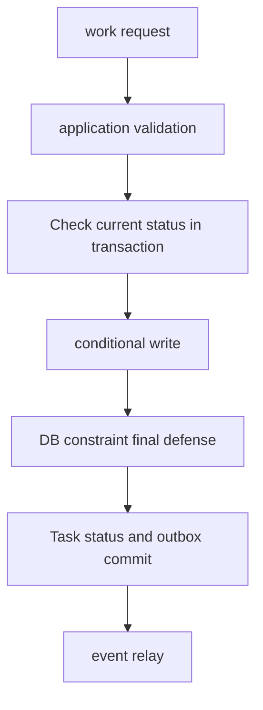

# 도메인 불변식과 데이터 트랜잭션

<!-- source: https://www.postgresql.org/docs/current/transaction-iso.html | checked: 2026-09-03 -->
<!-- source: https://www.postgresql.org/docs/current/ddl-constraints.html | checked: 2026-09-03 -->
<!-- source: https://www.postgresql.org/docs/current/sql-insert.html | checked: 2026-09-03 -->

주문 금액은 음수가 아니어야 하고, 같은 쿠폰은 한 주문에 한 번만 적용되며, 재고는 승인된 정책 아래에서만 감소해야 한다. 이런 불변식은 정상 요청 하나가 아니라 동시 요청, process 종료와 재시도에서도 지켜져야 한다. 코드 검증, DB constraint와 transaction은 서로 대체재가 아니라 다른 실패 지점의 방어선이다.

## 이 장에서 처음 쓰는 말

| 말 | 이 장에서의 뜻 | 왜 필요한가요 · 언제 쓰나요 |
|---|---|---|
| 불변식 | transaction 전후에 반드시 참이어야 하는 업무 규칙 | 업무 정확성을 모든 동시 실행이 지켜야 할 규칙으로 구체화한다. **구체적인 상황(가상 예시):** 동시 구매 두 건이 마지막 재고를 초과 판매할 수 있다. → 재고 불변식과 적용 경계를 정한다. → 함께 커밋돼도 음수 재고가 되지 않는지 시험한다. |
| aggregate | 함께 일관되게 바꿔야 하는 업무 상태의 경계 | 트랜잭션 경계를 정하기 전에 함께 일관되게 바뀌어야 하는 업무 상태를 고른다. **구체적인 상황(가상 예시):** 주문 합계 변경과 항목 변경이 함께 일어난다. → aggregate의 일관성 경계를 정한다. → 관련 상태가 불일치하게 커밋되지 않는지 시험한다. |
| constraint | DB가 모든 쓰기 경로에 강제하는 구조·값·관계 규칙 | 서로 다른 애플리케이션·유지 관리 작업이 쓰더라도 데이터 규칙을 강제한다. **구체적인 상황(가상 예시):** 유지 관리 스크립트가 애플리케이션 검사를 우회한다. → 필수 데이터 제약을 데이터베이스에 적용한다. → 두 쓰기 경로 모두 잘못된 값을 거부하는지 확인한다. |
| isolation | 동시 transaction이 서로의 중간 상태를 얼마나 보게 할지 정한 규칙 | 애플리케이션이 막아야 할 동시성 이상을 선택하고 해당 선택을 명시적으로 시험한다. **구체적인 상황(가상 예시):** 각 검사를 통과한 동시 갱신이 규칙을 깨뜨린다. → 트랜잭션 격리 동작을 재현한다. → 규칙을 유지하는 조정을 선택·시험한다. |
| write skew | 각 transaction이 읽은 조건은 맞지만 함께 commit한 결과가 규칙을 깨는 현상 | 개별로는 올바른 트랜잭션들이 함께 규칙을 깨뜨리는 경우를 찾아 더 강한 조정을 선택한다. **구체적인 상황(가상 예시):** 당직자 둘이 서로 남아 있다고 보고 모두 당직을 해제한다. → 동시 트랜잭션으로 공통 규칙을 시험한다. → 선택한 조정이 최소 한 명을 남기는지 확인한다. |
| outbox | 업무 상태와 발행 예정 event를 같은 commit에 기록하는 table | 업무 데이터 커밋과 다른 시스템으로의 발행 사이에서 필요한 이벤트가 유실되는 것을 막는다. **구체적인 상황(가상 예시):** 주문 커밋 직후 이벤트 발행기가 죽는다. → 주문과 outbox 기록을 한 트랜잭션에 저장한다. → 이후 발행과 소비자 중복 처리를 확인한다. |

1. 먼저 자연어 업무 규칙을 경쟁하는 두 요청으로 바꾼다.
2. 그다음 어느 규칙을 DB가 강제하고 어느 충돌을 application이 재시도할지 정한다.

## 실습 전에 준비할 것

실제 production DB는 필요 없다. 아래 주문·재고 예시를 종이에 두 개 transaction으로 나눠도 된다. SQL을 실행한다면 disposable PostgreSQL database와 test data만 사용하고, 결과를 production 설정으로 일반화하지 않는다.

## 먼저 이해하기

검증의 위치는 실패 범위를 정한다. API handler의 `if`는 빠르고 친절한 오류를 만들지만 다른 worker, migration과 admin query를 막지 못한다. `NOT NULL`, `CHECK`, `UNIQUE`, `FOREIGN KEY` 같은 constraint는 그 table에 들어오는 모든 쓰기에 적용된다. 여러 row와 외부 시스템을 아우르는 규칙은 transaction, lock·compare-and-set 또는 workflow 상태가 추가로 필요하다.



## 주문 불변식 표

| 규칙 | 가장 가까운 방어선 | 동시성 검토 |
|---|---|---|
| 수량은 1 이상 | `CHECK (quantity > 0)` | 모든 쓰기 경로에 동일 적용 |
| request key는 tenant 안에서 유일 | `UNIQUE (tenant_id, request_key)` | concurrent insert 중 하나만 성공 |
| 주문은 존재하는 customer를 참조 | foreign key 또는 명시적 lifecycle | 삭제 정책과 lock 영향 검토 |
| 재고는 정책상 음수가 될 수 없음 | 조건부 `UPDATE`와 affected rows | 읽고 나중에 쓰는 경쟁 방지 |
| 결제 승인 뒤 상태 전이는 허용 순서만 | current state 조건이 있는 `UPDATE` | stale command 거부 |
| 주문 commit 뒤 event 누락 금지 | order와 outbox 같은 transaction | relay 중복 허용·consumer 멱등 필요 |

## 읽고 쓰기보다 조건부 쓰기

실행 가능한 로컬 예제를 위해 임시 PostgreSQL 세션 하나를 열고 다음 임시 테이블을 만든다. 세션을 닫으면 사라지며 영속 저장이 아니라 트랜잭션 의미를 시연한다.

```sql
CREATE TEMP TABLE inventory (sku text PRIMARY KEY, available integer NOT NULL CHECK (available >= 0));
INSERT INTO inventory VALUES ('book-01', 1);
CREATE TEMP TABLE orders (
  order_id bigint GENERATED ALWAYS AS IDENTITY PRIMARY KEY,
  tenant_id text NOT NULL,
  request_key text NOT NULL,
  status text NOT NULL,
  total_amount integer NOT NULL,
  UNIQUE (tenant_id, request_key)
);
CREATE TEMP TABLE outbox (
  event_id text PRIMARY KEY,
  aggregate_id bigint REFERENCES orders(order_id),
  event_type text NOT NULL,
  payload jsonb NOT NULL
);
```

재고를 애플리케이션 메모리로 읽은 뒤 계산값을 나중에 쓰면 두 호출자가 같은 재고를 보고 행동할 수 있다. 아래 조건부 차감은 재고 확인과 쓰기를 하나의 문장으로 묶는다.

```sql
UPDATE inventory
SET available = available - 1
WHERE sku = 'book-01'
  AND available >= 1;
```

application은 affected row count가 1인지 확인한다. 0이면 현재 상태가 precondition을 만족하지 않았다는 뜻이다. 이 패턴이 모든 불변식을 해결하지는 않지만, 같은 row의 비교와 변경을 DB statement 하나로 묶는다.

이름만 보고 격리 수준을 선택하지 않는다. PostgreSQL Read Committed는 문장마다 새 스냅샷을 사용할 수 있으며 Repeatable Read와 Serializable은 이상 현상과 중단 동작이 다르다. 직렬화 실패는 동일한 업무 식별자를 유지하며 제한된 횟수 안에서 트랜잭션 전체를 재시도한다. 수량 누락을 금지한다면 `CHECK (quantity > 0)`과 함께 `NOT NULL`도 필요하다. SQL CHECK는 결과가 미정인 경우를 허용하기 때문이다. 잠금 진단은 [PostgreSQL 운영](#doc=postgresql-roadmap)으로 이어간다.

## transaction 밖으로 나가는 순간

DB transaction 안에서 broker publish나 HTTP 호출을 먼저 수행하면 rollback 뒤 외부 효과만 남을 수 있다. DB commit 뒤 publish하면 process가 그 사이에 죽어 event가 빠질 수 있다. outbox는 업무 row와 event intent를 한 transaction에 기록하고 별도 relay가 publish한다.

```sql
BEGIN;

WITH placed AS (
  INSERT INTO orders (tenant_id, request_key, status, total_amount)
  VALUES ('shop-a', 'web-7731', 'PLACED', 42000)
  RETURNING order_id
)
INSERT INTO outbox (event_id, aggregate_id, event_type, payload)
SELECT 'evt-981', order_id, 'OrderPlaced',
       jsonb_build_object('orderId', order_id)
FROM placed;

COMMIT;
```

이 예시는 `orders.order_id` 기본값과 호환되는 outbox 스키마를 가정한다. `RETURNING`은 실제 생성한 행과 이벤트를 연결한다. 무관한 주문 ID를 하드코딩하면 트랜잭션의 의미가 무너진다. 유일성 충돌 시 두 번째 이벤트를 만들지 말고 기존 테넌트·요청 결과를 찾아 페이로드를 비교해야 한다.

relay는 publish 성공 뒤 mark 과정에서 실패할 수 있으므로 같은 `event_id`를 다시 보낼 수 있다. 따라서 outbox는 event 누락 창을 줄이지만 end-to-end exactly-once를 자동으로 만들지 않는다. [메시징과 이벤트 인프라](#doc=messaging-roadmap)와 [부분 실패와 분산 워크플로](#doc=backend-engineering-distributed-workflow)에서 consumer의 중복 처리까지 닫는다.

## 실행 결과 예시

임시 예제의 예상 PostgreSQL 결과다. 같은 세션에서 조건부 재고 UPDATE를 두 번, outbox 트랜잭션을 한 번 실행한다.

```text
# First inventory decrement
UPDATE 1
# Second decrement: no stock remains
UPDATE 0
# Order and outbox transaction
BEGIN
INSERT 0 1
COMMIT
```

업무 상태와 이벤트의 실제 외래 키를 확인한다.

```sql
SELECT available FROM inventory WHERE sku = 'book-01';
SELECT count(*) FROM orders o JOIN outbox e ON e.aggregate_id = o.order_id
WHERE e.payload->>'orderId' = o.order_id::text;
```

첫 조회는 0, 두 번째는 1을 반환한다. 애플리케이션 수준 멱등 처리 없이 주문 INSERT를 반복하면 유일 키 위반이 나므로 실패한 트랜잭션을 롤백한다. 원자성 시험에서는 새 요청·이벤트 ID를 쓰고 COMMIT을 ROLLBACK으로 바꾼다. 기존 주문 수와 outbox 수가 모두 1로 유지되어야 한다. 이 예제는 브로커를 호출하지 않았다.

## 결과를 이렇게 읽는다

| 관찰 결과 | 뜻 | 다음 행동 |
|---|---|---|
| unique violation | 같은 request key 경쟁 또는 재시도 | 기존 업무 결과를 조회해 수렴 |
| affected rows 0 | 현재 상태가 precondition 불충족 | conflict 반환, blind retry 금지 |
| serialization failure | 동시 실행 순서를 DB가 확정하지 못함 | bounded retry와 전체 transaction 재실행 |
| order 있음, outbox 없음 | write 경로가 원자적이지 않음 | schema·transaction boundary 수정 |
| outbox 중복 publish | 예상 가능한 relay 실패 | consumer inbox·dedupe 확인 |
| DB commit, 사용자 실패 지속 | 저장 성공과 업무 결과가 다름 | dependency·event·read path 조사 |

## 설계 검토 순서

1. 규칙을 “항상”, “최대 하나”, “상태 A 뒤에만 B” 형태로 적는다.
2. 두 요청이 동시에 같은 전제조건을 읽는 schedule을 그린다.
3. 단일 row·table 규칙은 constraint와 조건부 write로 최대한 내린다.
4. transaction 격리와 abort·retry 동작을 실제 DB에서 검증한다.
5. 외부 효과는 intent를 commit하고 relay·consumer의 중복을 설계한다.
6. tenant·subject는 [인프라 보안](#doc=infrastructure-security-trust)의 신뢰 경계에서 DB 정책과 audit까지 전달한다.
7. outcome SLI는 row 수가 아니라 사용자가 받은 주문 결과로 둔다.

## 완료

- 업무 규칙을 동시 요청에서 반증할 수 있는 불변식으로 썼다.
- application validation과 DB constraint의 책임을 나눴다.
- 조건부 write, isolation abort와 재시도 경계를 구분했다.
- 업무 row와 outbox를 같은 transaction에 두고 중복 publish를 후속 계약으로 남겼다.

## 스스로 설명해 보기

- handler의 사전 조회만으로 재고 음수 방지를 보장할 수 없는 이유는 무엇인가?
- constraint 오류를 무조건 `500`으로 반환하면 API 계약에서 무엇을 잃는가?
- outbox가 event 중복까지 제거하지 않는 이유는 무엇인가?
- DB commit 성공과 주문 업무 성공을 각각 어떤 증거로 판정할 것인가?
