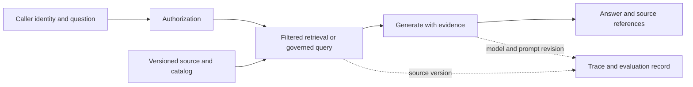

# AI용 데이터·검색·평가

AI 도우미는 깨끗한 행만으로 부족하다. 발견 가능한 의미, 허용된 접근, 최신 근거, 안정된 소스 ID, 신뢰할 답이 불가능함을 보고할 방법이 필요하다. 이 장의 AI-ready는 엔지니어링 점검 기준이며 인증이나 보편적 표준이 아니다.

## 이 장에서 처음 쓰는 말

| 용어 | 의미 | 왜 필요한가요 · 언제 쓰나요 |
|---|---|---|
| 임베딩(embedding) | 유사도 기반 검색에 사용하는 수치 표현 | 질문과 표현이 달라도 의미상 관련된 후보를 검색할 때 쓴다. |
| 하이브리드 검색(hybrid retrieval) | 어휘 기반과 벡터 기반 검색 신호를 결합하는 것 | 한 검색 방식만으로 근거를 놓칠 때 정확한 용어 일치와 의미 기반 일치를 함께 활용한다. |
| 재순위화(reranking) | 더 구체적인 관련성 모델로 후보 집합의 순서를 다시 정하는 것 | 저렴한 1차 검색으로 후보를 좁힌 뒤 최종 관련성을 개선한다. |
| RAG | Retrieval-Augmented Generation, 검색 증강 생성. 검색한 근거를 생성기에 제공하는 방식 | 답에 필요한 출처별 근거를 제공하고 권한·인용의 뒷받침·평가를 확인한다. |
| 의미 계층(semantic layer) | 지표와 허용 차원·관계를 관리하는 정의 계층 | 대시보드·생성된 쿼리 사이에서 업무 지표의 정의를 일관되게 유지한다. |
| 평가 세트(evaluation set) | 동작 평가에 쓰는 버전 있는 예제·기대 기준 | 유리한 예제 몇 개만으로 개선을 판단하지 않고 후보 비교를 재현한다. |

## 먼저 이해하기

1. 소스의 의미·담당자·버전·품질 상태·접근 정책을 등록한다.
2. 소스 참조를 가진 파생 청크나 구조화 질의 인터페이스를 만든다.
3. 호출자에게 사용 권한이 있는 근거만 검색한다.
4. 별도 정책 아래 답을 생성하거나 허용 도구 작업을 실행한다.
5. 디버깅·평가에 필요한 앱 버전과 근거를 기록한다.



검색 텍스트에 지시가 있어도 데이터로 취급한다. 소스 문서는 스스로 접근·도구 호출 권한을 부여할 수 없다. MCP·tool calling 인터페이스는 기능을 설명·노출할 수 있지만 강제는 서버·앱 신원과 정책 경계의 책임이다. 기존 [기업 에이전트 운영](../../content/ai-transformation-platform/04-enterprise-agent-operations.md)과 연결한다.

## 재현 가능한 정형·비정형 입력 준비

정형 데이터의 매출 같은 지표는 행 단위·통화·취소 정책·시간 기준으로 정의한다. 의미 계층은 사용자 간 불일치를 줄이지만 정의에는 담당자·검사가 필요하다. 명시적 개체·관계가 특정 질의를 개선할 때 지식 그래프·온톨로지를 쓴다. 그래프 저장소만 추가해도 신뢰할 의미가 생기는 것은 아니다.

문서는 추출·청크 분할을 거쳐도 소스 ID·버전·절·내용 해시·분류·권한을 보존한다. 분할·임베딩 리비전을 인덱스 버전과 함께 저장한다. 소스 삭제·변경은 청크·임베딩·캐시·관련 평가 예제에도 반영해야 한다.

대표 질문의 검색 실험으로 청크 크기를 정한다. 너무 작으면 맥락을 잃고 크면 무관·충돌 텍스트를 가져올 수 있다. 같은 라벨 후보 집합으로 어휘·벡터·하이브리드·재순위화를 비교한다. 메타데이터 필터는 호출자 권한·소스 상태·유효 버전을 따라야 한다.

## 검색 품질과 답변 품질 구분

| 계층 | 유용한 측정 | 중요한 한계 |
|---|---|---|
| 검색 | Recall@k·순위 품질·허용 소스 범위 | 관련성이 판정된 버전 있는 기준 집합 필요 |
| 생성 | 뒷받침된 주장·과제 정확성·거부·보류 | 유창함은 정확성의 근거가 아님 |
| 도구 | 승인된 성공·인자 유효성·중복 효과 | API 성공도 잘못된 업무 결과일 수 있음 |
| 운영 | 지연·오류·토큰·성공 과제당 비용 | 낮은 비용과 낮은 완료율은 공존 가능 |

보정 없이 모델이 스스로 운영 진입을 채점하게 하지 않는다. 모델 평가기는 사람이 검토한 예제·알려진 실패와 대조하면 유용한 측정이지만 모델 간 동의는 독립 사실 근거가 아니다. 학습·튜닝 예제와 보류 평가 세트를 나누고 승리 점수 하나 대신 표본 수·불확실성을 보고한다.

## OTel·MLflow·Langfuse

검색·모델·도구 호출·앱 단계에 범위 있는 span을 쓴다. 소스·인덱스 버전, 프롬프트 리비전, 모델 ID, 평가 세트 버전을 통제된 기록으로 연결한다. MLflow는 추적·평가, Langfuse는 앱 추적·평가 관련 절차를 제공한다. 운영할 수명 주기로 처음에는 하나를 선택한다. 둘 다 쓰면 기록별 담당 도구를 정하고 우발적 중복 계측·캡처를 피한다.

OTel GenAI 규약은 변화 중이다. 이 검토에서 기존 본 사이트 페이지는 별도 GenAI semantic-conventions 저장소를 가리킨다. 실제 계측 규약 버전을 고정하고 receiver·백엔드 호환성을 확인한다. 블로그 예제·SDK 속성·대시보드가 같은 스키마라고 가정하지 않는다.

프롬프트·응답에는 민감 내용이 있을 수 있다. 과정에서는 가상 문서·질문을 쓴다. 실제 배포는 자동 캡처 전에 본문 기록, 비식별화, 참조 해시, 메타데이터만 유지 중 정책을 정한다. 캡처 내용·평가 데이터의 보존과 접근을 제한한다.

## 임베딩과 벡터 검색: 유사도는 검색 가설이다

임베딩 모델은 입력을 모델별 공간의 벡터로 바꾼다. 질의·문서는 호환 모델·전처리를 써야 한다. 코사인 유사도는 `dot(q,d) / (norm(q) × norm(d))`이며 단위 정규화 벡터에서는 내적과 같다. 모델·차원·정규화·거리 변경은 검색 계약 변경이다. 점수 0.9는 문단이 맞을 확률 90%가 아니다.

정확한 최근접 검색은 대상 자료 집합을 직접 채점한다. HNSW 같은 근사 인덱스는 가까운 벡터 그래프를 탐색하고 IVFFlat은 분할 구조로 범위를 줄인다. 속도·재현율 절충은 구성·검색 설정에 달려 있다. 정확 검색 대비 ANN 이웃 재현율과 사람 질문 라벨 대비 근거 관련성을 따로 측정한다. 벡터 이웃을 완벽히 찾더라도 임베딩 공간이 낮은 관련성을 높게 놓으면 무관한 근거가 나온다.

선택적인 메타데이터 필터는 성능·결과 수를 바꾼다. 근사 후보 열 개 중 접근 필터 후 하나만 남으면 top ten 요청이 허용 후보 열 개를 만든 것은 아니다. 엔진 지원 필터·검색 전략과 충분한 탐색을 사용하면서 접근 강제를 유지한다. 개수를 채우려다 금지 후보를 모델·사용자 디버그 트레이스에 보내서는 안 된다.

## 어휘 검색·하이브리드 결합·재순위화

어휘 검색은 정확한 ID·오류 코드·희귀 용어에 유용하고 벡터 검색은 표현이 달라도 의미 유사성을 찾을 수 있다. 하이브리드는 둘을 결합한다. 원시 점수 척도가 달라 임의로 더하면 한쪽이 지배할 수 있다. RRF는 문서가 나온 각 순위의 `1 / (constant + rank)`를 더한다. 상수·후보 구간 크기는 평가로 선택한다.

재순위기는 질의와 각 후보를 함께 평가하거나 다른 관련성 모델을 적용한다. 순서를 개선해도 두 검색기 모두 놓친 문단을 복원하지 못한다. 후보를 늘리면 범위가 좋아질 수 있지만 지연·비용도 늘어난다. 생성 탓을 하기 전에 검색 범위를 비교한다.

다음 표준 라이브러리 예제는 가상 2차원 벡터·명시적 어휘 순위이며 학습 임베딩·검색 엔진 벤치마크가 아니다. 벡터 후보 채점·선택 전에, 어휘 후보 결합 전에 권한을 적용한다.

<!-- executable: hybrid-retrieval -->
```python
from math import sqrt

vectors = {'a': (1,0), 'b': (0.8,0.6), 'c': (0,1), 'private': (1,0)}
allowed = {'a','b','c'}
query = (1,0)
def cosine(a,b):
    return sum(x*y for x,y in zip(a,b)) / (
        sqrt(sum(x*x for x in a))*sqrt(sum(y*y for y in b)))

vector_rank = sorted(allowed, key=lambda key: (-cosine(query,vectors[key]),key))
lexical_rank = [key for key in ['private','b','c','a'] if key in allowed]
scores = {key:0.0 for key in allowed}
for ranking in (vector_rank,lexical_rank):
    for position,key in enumerate(ranking,1):
        scores[key] += 1/(60+position)
ranked = sorted(scores,key=lambda key:(-scores[key],key))
top = ranked[:2]
relevant = {'a','b'}
recall = len(set(top)&relevant)/len(relevant)
assert vector_rank == ['a','b','c']
assert top == ['b','a'] and recall == 1
assert 'private' not in scores
print('vector_rank:', vector_rank)
print('hybrid_top_2:', top)
print(f'recall_at_2={recall:.1f} forbidden_candidates=0')
```

예상 출력:

```text
vector_rank: ['a', 'b', 'c']
hybrid_top_2: ['b', 'a']
recall_at_2=1.0 forbidden_candidates=0
```

b는 두 목록 모두 상위여서 이긴다. 결합 계산과 예제 허용 집합의 경계를 검증하며 운영 인가 서버를 검증하지 않는다. 신원·정책 통합 검사를 별도로 추가한다. 나중 생성이 우연히 인용하지 않아도 금지 문서는 관문에서 실패해야 한다.

## 청크 분할·메타데이터 필터·인덱스 버전

청크 분할은 검색 단위를 고른다. 가능하면 의미 있는 절에서 나누고 제목·소스 위치를 보존하며 표 헤더와 값을 연결한다. 겹침은 맥락을 보존하지만 근거를 중복시키므로 이웃 청크를 독립 출처로 세지 않는다. 토큰 제한은 실제 토크나이저·모델의 속성이며 보편적인 글자 환산 상수가 아니다.

`source_id`, 소스 버전·해시, 청크 ID, 절·위치, 분류, 허용 사용 메타데이터, 분할기·임베딩 리비전을 함께 둔다. 새 인덱스를 빌드·평가한 뒤 통제된 배포로 참조를 바꾼다. 예전·새 청크 정의가 반씩 섞이면 평가·삭제 재현이 어려워진다.

메타데이터 필터는 유효 시간·공개 상태도 강제한다. 현재 승인 규칙을 묻는데 새 초안 정책이 오래된 승인 정책보다 우선하면 안 된다. 권한 폐기 시 소스와 파생물·캐시를 갱신하고 검색·프롬프트·최종 출력·디버그를 시험한다. 답변 캐시가 우회하면 올바른 소스 ACL만으로 부족하다.

## 의미 계층·온톨로지·지식 그래프

의미 계층은 업무 지표와 허용 차원·조인을 정의한다. 매출에는 주문·항목 중 행 단위, 취소·환불 차감, 통화·환산, 보고 시간대를 명시한다. 그렇지 않으면 같은 쿼리가 서로 다른 질문에 답할 수 있다. 에이전트가 매번 열 이름으로 의미를 재구성하게 하지 말고 관리된 지표 연산을 제공한다.

온톨로지는 개체 유형·관계 의미를 정의한다. 주문은 고객에 속하고 데이터셋은 작업이 만들며 정책은 데이터 분류에 적용된다. 지식 그래프는 그 모델 아래 구체적 개체·관계를 저장한다. 소스·버전 근거가 있는 관계와 모델 추론 관계를 구분한다. 탐색 경로는 조사할 연결을 찾지만 연결된 주장을 자체 입증하지 않는다.

분류된 필드를 포함한 데이터셋의 사용자 찾기처럼 이름 붙일 수 있는 다단계 질문에 그래프 검색을 선택한다. 검증할 원문·시스템 기록을 유지한다. 벡터 이웃은 유사성, 타입 간선은 선언한 관계를 답한다. 어느 쪽도 조용히 다른 쪽을 대신해서는 안 된다.

## MCP·도구 호출·범위가 제한된 에이전트 실행

도구 호출은 모델이 요청할 작업·구조화 인자를 설명한다. MCP는 지원 기능의 탐색·호출을 위한 클라이언트·서버 인터페이스를 표준화한다. 프로토콜이 데이터셋 읽기 권한, 생성 SQL 안전성, 반복 작업의 두 번 실행 여부를 결정하지 않는다. 서비스 경계에서 호출자를 인증하고 정책을 강제한다.

읽기 전용 매출 도구는 데이터셋·지표 ID, 날짜 구간, 허용 그룹 차원처럼 제한된 인자 스키마를 제공한다. 허용 목록으로 지표를 검증하고 값을 매개변수화하며 질의 자원을 제한하고 결과에 공개·소스 버전을 반환한다. SQL `LIMIT`는 반환 행을 제한할 뿐 읽는 바이트·조인 작업을 반드시 제한하지 않는다. 서비스의 실제 질의·시간·비용 예산을 강제한다.

에이전트는 단계 계획, 허용 도구 호출, 결과 확인, 계속·중단의 제어 루프를 추가한다. 총 단계·시간·토큰·비용·재시도를 제한한다. 검색된 지시는 콘텐츠이며 새 권한을 줄 수 없다. 쓰기는 별도 승인 작업·멱등 ID와 불확실한 시간 초과 후 대사가 필요하다. 모든 프롬프트·민감 행을 자동 보존하지 말고 결정·결과 참조를 기록한다.

## 검색·답·도구·운영을 따로 평가하기

Recall@k는 상위 k개에서 찾은 관련 기준 항목을 전체 관련 기준 항목으로 나눈 값이다. Precision@k는 k개 중 관련 항목 비율이다. reciprocal rank는 첫 관련 결과에 집중하고 nDCG는 순위 감쇠와 등급 관련성을 지원한다. 겹친 청크가 점수를 부풀리지 않도록 문서·청크 중 평가 단위를 명시한다.

답변은 뒷받침된 사실 주장, 과제 정확성, 답할 수 없거나 권한 없는 질문의 적절한 보류를 측정한다. 모두 거부하면 오답은 피해도 유용한 서비스가 아니므로 응답 정확도와 범위를 함께 보고한다. 최신·과거 소스, 긴 문서, 정확 ID, 접근 제한, 다단계 질문으로 나눠 본다. 프롬프트·검색기 튜닝 후에도 보류 평가 세트를 유지하고 표본 수·불확실성을 기록한다.

도구는 인자 검증, 허용 효과, 중복 실행, 시간 초과 대사, 소스·결과 버전 ID를 시험한다. 운영은 대기, 검색, 재순위화, 첫 토큰까지 시간, 전체 생성, 도구 시간을 구분한다. 토큰 수와 지연은 교환 가능하지 않으며 시도당 비용은 요청이 일찍 실패해서 좋아질 수도 있다.

### 회귀 판단을 지원하는 MLflow·Langfuse 기록

평가 기록은 앱 묶음을 데이터셋에 연결해야 한다. 코드 리비전, 프롬프트, 모델 ID·생성 설정, 자료·인덱스, 분할기·임베딩, 정책·평가 세트 리비전을 남긴다. 질문별 허용 기준 근거와 관측 결과를 저장한다. MLflow 추적·평가와 Langfuse trace·observation·score는 수명 주기를 조직할 수 있지만 점수는 평가 기준 아래의 측정이며 사실의 권위가 아니다.

그럴듯한 무근거 답과 올바른 보류를 포함한 같은 검토 예제로 모델 평가기를 보정한다. 평가기 버전·프롬프트와 사람의 불일치 기록을 유지한다. 평균 점수 향상이 접근 유출·중요 하위 집단 회귀를 숨길 수 있다. 필수 관문을 통과하고 관련 품질·운영 절충이 수용 가능할 때만 배포한다.

## 실패 실습과 해석

답 불가, 금지 문서, 과거 버전, 지시 같은 텍스트를 포함해 가상 질문 열 개와 명시적 기대 근거를 만든다. 허용 소스를 기록하고 먼저 검색만 실행해 후보 범위를 비교한다. 이어 생성하고 주장이 검색 근거를 인용하는지, 없으면 보류하는지 확인한다.

소스 하나의 접근을 폐기하고 파생 인덱스·정책을 갱신한 뒤 제한 호출자로 반복한다. 검색 결과, 프롬프트, 답, 노출 디버그에 그 소스가 없어야 한다. 소스 값을 바꾸면 새 답이 새 버전까지 추적되고 이전 평가는 보존 예제 정책 아래 재현되는지 확인한다.

## 실행 결과 예시

실제 모델 성능이 아닌 평가 기록 예시다.

```text
questions: 10
answered: 7
supported correct answers: 6
abstained: 3
answered accuracy: 6 / 7
answer coverage: 7 / 10
forbidden-source exposure: 0 required
```

응답 범위·응답 정확도를 함께 보고한다. 최종 답에 없더라도 프롬프트·디버그의 금지 소스는 접근 관문 실패다. 다른 모델의 동의가 아니라 질문별 허용 근거로 채점한다.

## 스스로 설명해 보기

답이 틀리면 어떤 근거로 오래된 데이터, 검색 실패, 모호한 지표 정의, 프롬프트 결함, 모델 오류를 구분할까? 트레이스가 답의 진실성을 입증하지 않으면서 진단을 돕는 이유를 설명한다.

다음은 [플랫폼 운영](../../../docs/guides/data-observability/14-platform-operations.md)으로 이어간다.

<!-- source: https://mlflow.org/docs/latest/genai/tracing/ | checked: 2026-09-10 | tracing and evaluation workflow -->
<!-- source: https://langfuse.com/docs/observability/overview | checked: 2026-09-10 | application tracing responsibilities -->
<!-- source: https://opentelemetry.io/docs/specs/semconv/gen-ai/ | checked: 2026-09-10 | relocation notice; verify active convention repository before implementation -->
<!-- source: https://github.com/pgvector/pgvector | checked: 2026-09-10 | exact versus approximate search and filtering -->
<!-- source: https://www.elastic.co/docs/reference/elasticsearch/rest-apis/reciprocal-rank-fusion | checked: 2026-09-10 | rank fusion formula; example is original fixture -->
<!-- source: https://modelcontextprotocol.io/specification/2025-06-18/server/tools | checked: 2026-09-10 | explicitly scoped protocol version and tool boundary -->
