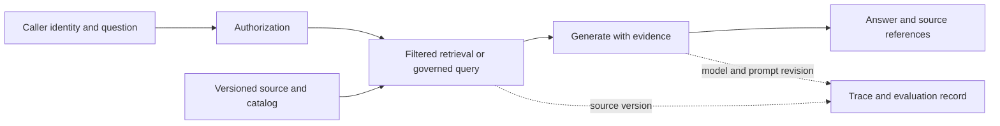

# AI용 데이터·검색·평가

AI 도우미가 형식이 깔끔한 테이블을 찾았다. 하지만 열의 뜻도, 사용자에게 읽기 권한이 있는지도 모른다. 행을 정리하는 것만으로는 부족하다.

데이터의 의미, 접근 검사, 최신 출처가 필요하다. 근거가 부족하면 답할 수 없다고 알려야 한다. 이 장의 **AI-ready**는 이를 확인하는 실무 점검 기준이며 인증이나 보편적 표준은 아니다.

## 이 장에서 처음 쓰는 말

| 용어 | 의미 | 왜 필요한가요 · 언제 쓰나요 |
|---|---|---|
| 임베딩(embedding) | 내용을 숫자 벡터로 표현한 것이다. 검색할 때 내용 사이의 유사성을 비교하는 데 쓴다. | 질문과 문서의 단어가 달라도 관련 내용을 찾는다. **구체적인 상황(가상 예시):** 사용자가 문서와 다른 표현으로 같은 개념을 검색한다. → 호환되는 임베딩 설정으로 질문과 문단을 벡터화한다. → 벡터 거리만 믿지 말고 정답 표본에서 관련 문서 검색을 평가한다. |
| 하이브리드 검색(hybrid retrieval) | 단어를 기준으로 찾는 검색과 벡터 유사도로 찾는 검색을 함께 사용하는 것이다. | 정확한 용어 검색과 의미 검색이 서로 놓치는 자료를 보완한다. **구체적인 상황(가상 예시):** 키워드 검색은 제품 코드를, 의미 검색은 바꿔 쓴 질문을 잘 찾는다. → 명시한 결합 방식으로 어휘 검색과 벡터 검색을 합친다. → 두 유형 질문에서 검색 범위와 순위를 비교한다. |
| 재순위화(reranking) | 이미 찾은 후보들을 더 자세히 관련성을 판단하는 모델로 다시 정렬하는 것이다. | 1차 검색에서 찾은 문단 중 답에 더 유용한 것을 앞에 놓는다. **구체적인 상황(가상 예시):** 정답 문단을 찾았지만 관련성 낮은 후보들 아래에 있다. → 제한된 후보 집합을 관련성 모델로 다시 정렬한다. → 추가 지연·비용과 함께 순위 개선을 측정한다. |
| RAG | 검색 증강 생성이다. 찾은 자료를 모델에 함께 제공해 그 자료를 참고하며 답을 만들게 한다. | 답변에 필요한 자료를 모델에 제공하고 실제로 그 근거에 맞게 답했는지 확인한다. **구체적인 상황(가상 예시):** 지원 도우미가 현재 내부 문서에 근거해 답해야 한다. → 접근이 허용된 문단을 검색해 질문과 함께 생성기에 제공한다. → 답변 근거·인용·자료가 없을 때의 동작을 확인한다. |
| 의미 계층(semantic layer) | 지표의 뜻과 계산에 사용할 차원·관계를 공통으로 정의하고 관리하는 계층이다. | 팀이나 대시보드가 달라도 매출 같은 지표를 같은 규칙으로 계산하게 한다. **구체적인 상황(가상 예시):** 재무와 영업 대시보드의 매출 공식이 다르다. → 의미 계층에 공통 지표·차원·업무 규칙을 정의한다. → 같은 통제 예제로 양쪽 대시보드를 대조한다. |
| 평가 세트(evaluation set) | 시스템의 동작을 비교하는 데 사용하는 예제와 판정 기준을 버전으로 관리한 것이다. | 같은 질문과 판정 기준으로 변경 전후의 품질을 비교한다. **구체적인 상황(가상 예시):** 검색 변경이 골라 본 몇 질문에서는 좋아 보인다. → 현실적인 성공·실패를 포함한 버전 관리 평가 세트로 시험한다. → 범주별 결과를 비교하고 배포 전에 퇴행을 조사한다. |

## 먼저 이해하기

1. 소스의 의미·담당자·버전·품질 상태·접근 정책을 등록한다.
2. 소스 참조를 가진 파생 청크나 구조화 질의 인터페이스를 만든다.
3. 호출자에게 사용 권한이 있는 근거만 검색한다.
4. 별도 정책 아래 답을 생성하거나 허용 도구 작업을 실행한다.
5. 디버깅·평가에 필요한 앱 버전과 근거를 기록한다.



검색 텍스트에 지시가 있어도 데이터로 취급한다. 소스 문서는 스스로 접근·도구 호출 권한을 부여할 수 없다. MCP·tool calling 인터페이스는 기능을 설명·노출할 수 있지만 강제는 서버·앱 신원과 정책 경계의 책임이다. 기존 [기업 에이전트 운영](../../content/ai-transformation-platform/04-enterprise-agent-operations.md)과 연결한다.

## 재현 가능한 정형·비정형 입력 준비

정형 데이터의 매출 같은 지표는 행 단위·통화·취소 정책·시간 기준으로 정의한다. 의미 계층은 사용자 간 불일치를 줄이지만 정의에는 담당자·검사가 필요하다. 명시적 개체·관계가 특정 질의를 개선할 때 지식 그래프·온톨로지를 쓴다. 그래프 저장소만 추가해도 신뢰할 의미가 생기는 것은 아니다.

문서는 추출·청크 분할을 거쳐도 소스 ID·버전·절·내용 해시·분류·권한을 보존한다. 분할·임베딩 리비전을 인덱스 버전과 함께 저장한다. 소스 삭제·변경은 청크·임베딩·캐시·관련 평가 예제에도 반영해야 한다.

대표 질문의 검색 실험으로 청크 크기를 정한다. 너무 작으면 맥락을 잃고 크면 무관·충돌 텍스트를 가져올 수 있다. 같은 라벨 후보 집합으로 어휘·벡터·하이브리드·재순위화를 비교한다. 메타데이터 필터는 호출자 권한·소스 상태·유효 버전을 따라야 한다.

## 검색 품질과 답변 품질 구분

| 계층 | 유용한 측정 | 중요한 한계 |
|---|---|---|
| 검색 | Recall@k·순위 품질·허용 소스 범위 | 관련성이 판정된 버전 있는 기준 집합 필요 |
| 생성 | 뒷받침된 주장·과제 정확성·거부·보류 | 유창함은 정확성의 근거가 아님 |
| 도구 | 승인된 성공·인자 유효성·중복 효과 | API 성공도 잘못된 업무 결과일 수 있음 |
| 운영 | 지연·오류·토큰·성공 과제당 비용 | 낮은 비용과 낮은 완료율은 공존 가능 |

모델이 매긴 점수만으로 배포 여부를 정하지 않는다. 사람이 검토한 예제와 이미 알려진 실패 사례로 먼저 평가 모델의 판단을 확인한다. 모델끼리 같은 답을 했다는 것은 독립적인 사실 검증이 아니다. 개발·튜닝에 사용한 예제와 최종 평가용 예제를 나누고, 개선 점수와 함께 평가한 표본 수와 불확실성을 보고한다.

## OTel·MLflow·Langfuse

검색·모델·도구 호출·앱 단계에 범위 있는 span을 쓴다. 소스·인덱스 버전, 프롬프트 리비전, 모델 ID, 평가 세트 버전을 통제된 기록으로 연결한다. MLflow는 추적·평가, Langfuse는 앱 추적·평가 관련 절차를 제공한다. 운영할 수명 주기로 처음에는 하나를 선택한다. 둘 다 쓰면 기록별 담당 도구를 정하고 우발적 중복 계측·캡처를 피한다.

OTel GenAI 규약은 변화 중이다. 이 검토에서 기존 본 사이트 페이지는 별도 GenAI semantic-conventions 저장소를 가리킨다. 실제 계측 규약 버전을 고정하고 receiver·백엔드 호환성을 확인한다. 블로그 예제·SDK 속성·대시보드가 같은 스키마라고 가정하지 않는다.

프롬프트·응답에는 민감 내용이 있을 수 있다. 과정에서는 가상 문서·질문을 쓴다. 실제 배포는 자동 캡처 전에 본문 기록, 비식별화, 참조 해시, 메타데이터만 유지 중 정책을 정한다. 캡처 내용·평가 데이터의 보존과 접근을 제한한다.

## 임베딩과 벡터 검색: 유사도는 검색 가설이다

임베딩 모델은 입력을 모델별 공간의 벡터로 바꾼다. 질의·문서는 호환 모델·전처리를 써야 한다. 코사인 유사도는 `dot(q,d) / (norm(q) × norm(d))`이며 단위 정규화 벡터에서는 내적과 같다. 모델·차원·정규화·거리 변경은 검색 계약 변경이다. 점수 0.9는 문단이 맞을 확률 90%가 아니다.

정확 검색은 검색 대상의 벡터를 직접 비교해 가장 가까운 것을 찾는다. 근사 검색(ANN)은 일부만 탐색해 시간을 줄인다. HNSW는 가까운 벡터들의 연결을 따라가고, IVFFlat은 나눈 구역 중 일부를 검색한다. 빠르게 찾는 대신 가까운 후보를 놓칠 수 있으므로 정확 검색과 비교한다. 또 “벡터상 가까운 문서를 찾았는가”와 “질문에 답할 근거를 찾았는가”는 별개다. 임베딩이 관련 없는 문서를 가깝게 표현했다면 벡터 검색이 정확해도 답에 필요한 자료는 나오지 않는다.

메타데이터 조건으로 대상을 좁히면 속도와 결과 수가 달라진다. 근사 검색으로 후보 열 개를 찾았는데 권한 검사 후 하나만 남았다면, 허용된 문서 열 개를 찾은 것은 아니다. 엔진이 지원하는 필터·탐색 방식을 사용해 충분한 허용 후보를 찾도록 한다. 개수를 채우기 위해 권한 없는 문서를 모델이나 사용자가 볼 수 있는 디버그 기록에 넘겨서는 안 된다.

## 어휘 검색·하이브리드 결합·재순위화

키워드 검색은 제품 ID, 오류 코드, 드문 전문 용어를 정확히 찾는 데 유용하다. 벡터 검색은 표현이 달라도 비슷한 의미를 찾는 데 도움이 된다. 하이브리드 검색은 이 둘을 합친다. 다만 점수의 기준이 다르므로 그대로 더하면 한쪽 점수만 결과를 좌우할 수 있다. 순위를 합치는 RRF는 각 검색 결과에서 문서의 순위를 구하고 `1 / (constant + rank)`를 더한다. 상수와 가져올 후보 수는 평가 결과를 보고 정한다.

재순위기는 질의와 각 후보를 함께 평가하거나 다른 관련성 모델을 적용한다. 순서를 개선해도 두 검색기 모두 놓친 문단을 복원하지 못한다. 후보를 늘리면 범위가 좋아질 수 있지만 지연·비용도 늘어난다. 생성 탓을 하기 전에 검색 범위를 비교한다.

다음 표준 라이브러리 예제는 가상 2차원 벡터·명시적 어휘 순위이며 학습 임베딩·검색 엔진 벤치마크가 아니다. 벡터 후보 채점·선택 전에, 어휘 후보 결합 전에 권한을 적용한다.

<!-- executable: hybrid-retrieval -->
```python
from math import sqrt

vectors = {'a': (1,0), 'b': (0.8,0.6), 'c': (0,1), 'private': (1,0)}
allowed = {'a','b','c'}
query = (1,0)
def cosine(a,b):
    return sum(x*y for x,y in zip(a,b)) / (
        sqrt(sum(x*x for x in a))*sqrt(sum(y*y for y in b)))

vector_rank = sorted(allowed, key=lambda key: (-cosine(query,vectors[key]),key))
lexical_rank = [key for key in ['private','b','c','a'] if key in allowed]
scores = {key:0.0 for key in allowed}
for ranking in (vector_rank,lexical_rank):
    for position,key in enumerate(ranking,1):
        scores[key] += 1/(60+position)
ranked = sorted(scores,key=lambda key:(-scores[key],key))
top = ranked[:2]
relevant = {'a','b'}
recall = len(set(top)&relevant)/len(relevant)
assert vector_rank == ['a','b','c']
assert top == ['b','a'] and recall == 1
assert 'private' not in scores
print('vector_rank:', vector_rank)
print('hybrid_top_2:', top)
print(f'recall_at_2={recall:.1f} forbidden_candidates=0')
```

예상 출력:

```text
vector_rank: ['a', 'b', 'c']
hybrid_top_2: ['b', 'a']
recall_at_2=1.0 forbidden_candidates=0
```

b는 두 검색 결과에서 모두 높은 순위에 있어 결합 결과의 1위가 된다. 이 예제로 확인한 것은 순위 계산과 예제의 허용 목록 적용이다. 실제 서비스의 인증·권한 처리는 별도 통합 시험이 필요하다. 권한 없는 문서는 검색 단계에서 차단해야 한다. 최종 답변에 우연히 인용되지 않았다는 이유로 통과시켜서는 안 된다.

## 청크 분할·메타데이터 필터·인덱스 버전

청크 분할은 검색 단위를 고른다. 가능하면 의미 있는 절에서 나누고 제목·소스 위치를 보존하며 표 헤더와 값을 연결한다. 겹침은 맥락을 보존하지만 근거를 중복시키므로 이웃 청크를 독립 출처로 세지 않는다. 토큰 제한은 실제 토크나이저·모델의 속성이며 보편적인 글자 환산 상수가 아니다.

`source_id`, 소스 버전·해시, 청크 ID, 절·위치, 분류, 허용 사용 메타데이터, 분할기·임베딩 리비전을 함께 둔다. 새 인덱스를 빌드·평가한 뒤 통제된 배포로 참조를 바꾼다. 예전·새 청크 정의가 반씩 섞이면 평가·삭제 재현이 어려워진다.

메타데이터 필터는 유효 시간·공개 상태도 강제한다. 현재 승인 규칙을 묻는데 새 초안 정책이 오래된 승인 정책보다 우선하면 안 된다. 권한 취소 시 소스와 파생물·캐시를 갱신하고 검색·프롬프트·최종 출력·디버그를 시험한다. 답변 캐시가 우회하면 올바른 소스 ACL만으로 부족하다.

## 의미 계층·온톨로지·지식 그래프

의미 계층은 업무 지표와 허용 차원·조인을 정의한다. 매출에는 주문·항목 중 행 단위, 취소·환불 차감, 통화·환산, 보고 시간대를 명시한다. 그렇지 않으면 같은 쿼리가 서로 다른 질문에 답할 수 있다. 에이전트가 매번 열 이름으로 의미를 재구성하게 하지 말고 관리된 지표 연산을 제공한다.

온톨로지는 어떤 종류의 대상이 있고 서로 어떤 관계를 맺는지 정의한다. 예를 들어 “주문은 고객에 속한다”, “작업은 데이터셋을 만든다” 같은 규칙이다. 지식 그래프에는 이 규칙에 맞춰 실제 주문·고객·작업과 연결 관계를 저장한다. 원본 기록으로 확인한 관계와 모델이 추론한 관계를 구분한다. 그래프를 따라가면 조사할 대상을 찾을 수 있지만, 연결돼 있다는 사실만으로 그 내용이 참이라고 입증되지는 않는다.

“이 민감 필드를 포함한 데이터셋을 어느 팀이 사용하는가?”처럼 여러 관계를 따라가야 하는 질문에는 그래프 검색이 도움이 된다. 찾은 관계를 확인할 원문이나 시스템 기록도 보관한다. 벡터 검색은 내용의 유사성을, 그래프의 연결은 정해진 관계를 보여 준다. 비슷하게 검색됐다는 이유만으로 실제 의존 관계가 있다고 판단하지 않는다.

## MCP·도구 호출·범위가 제한된 에이전트 실행

도구 호출은 모델이 요청할 작업·구조화 인자를 설명한다. MCP는 지원 기능의 탐색·호출을 위한 클라이언트·서버 인터페이스를 표준화한다. 프로토콜이 데이터셋 읽기 권한, 생성 SQL 안전성, 반복 작업의 두 번 실행 여부를 결정하지 않는다. 서비스 경계에서 호출자를 인증하고 정책을 강제한다.

읽기 전용 매출 도구는 데이터셋·지표 ID, 날짜 구간, 허용 그룹 차원처럼 제한된 인자 스키마를 제공한다. 허용 목록으로 지표를 검증하고 값을 매개변수화하며 질의 자원을 제한하고 결과에 공개·소스 버전을 반환한다. SQL `LIMIT`는 반환 행을 제한할 뿐 읽는 바이트·조인 작업을 반드시 제한하지 않는다. 서비스의 실제 질의·시간·비용 예산을 강제한다.

에이전트는 단계 계획, 허용 도구 호출, 결과 확인, 계속·중단의 제어 루프를 추가한다. 총 단계·시간·토큰·비용·재시도를 제한한다. 검색된 지시는 콘텐츠이며 새 권한을 줄 수 없다. 쓰기는 별도 승인 작업·멱등 ID와 불확실한 시간 초과 후 대조가 필요하다. 모든 프롬프트·민감 행을 자동 보존하지 말고 결정·결과 참조를 기록한다.

## 검색·답·도구·운영을 따로 평가하기

Recall@k는 정답으로 정한 관련 자료 중 상위 k개 결과에서 얼마나 찾았는지를 나타낸다. Precision@k는 상위 k개 중 관련 자료의 비율이다. reciprocal rank는 첫 관련 자료가 몇 번째에 나왔는지 평가하고, nDCG는 자료의 관련성 정도와 순서를 함께 평가한다. 겹치는 청크를 여러 정답처럼 세면 점수가 부풀 수 있으므로 문서 단위인지 청크 단위인지 먼저 정한다.

답변은 뒷받침된 사실 주장, 과제 정확성, 답할 수 없거나 권한 없는 질문의 적절한 보류를 측정한다. 모두 거부하면 오답은 피해도 유용한 서비스가 아니므로 답변한 질문 중 정답 비율와 범위를 함께 보고한다. 최신·과거 소스, 긴 문서, 정확 ID, 접근 제한, 다단계 질문으로 나눠 본다. 프롬프트·검색기 튜닝 후에도 개발·튜닝에 쓰지 않은 평가 세트를 유지하고 표본 수·불확실성을 기록한다.

도구는 인자 검증, 허용 효과, 중복 실행, 시간 초과 대조, 소스·결과 버전 ID를 시험한다. 운영은 대기, 검색, 재순위화, 첫 토큰까지 시간, 전체 생성, 도구 시간을 구분한다. 토큰 수와 지연은 교환 가능하지 않으며 시도당 비용은 요청이 일찍 실패해서 좋아질 수도 있다.

### 회귀 판단을 지원하는 MLflow·Langfuse 기록

평가 기록은 앱 묶음을 데이터셋에 연결해야 한다. 코드 리비전, 프롬프트, 모델 ID·생성 설정, 자료·인덱스, 분할기·임베딩, 정책·평가 세트 리비전을 남긴다. 질문별 허용 기준 근거와 관측 결과를 저장한다. MLflow 추적·평가와 Langfuse trace·observation·score는 수명 주기를 조직할 수 있지만 점수는 평가 기준 아래의 측정이며 사실의 권위가 아니다.

사람이 검토한 예제에는 그럴듯하지만 근거 없는 답과, 자료가 없어 올바르게 답을 보류한 경우를 모두 넣는다. 같은 예제로 평가 모델의 판단을 확인하고 평가기 버전·프롬프트·사람과 의견이 갈린 사례를 남긴다. 평균 점수가 올라가도 권한 없는 자료가 노출되거나 중요한 질문 유형의 성능이 떨어질 수 있다. 필수 검사를 통과하고 품질·지연·비용의 변화가 허용 범위에 있을 때 배포한다.

## 실패 실습과 해석

답 불가, 금지 문서, 과거 버전, 지시 같은 텍스트를 포함해 가상 질문 열 개와 명시적 기대 근거를 만든다. 허용 소스를 기록하고 먼저 검색만 실행해 후보 범위를 비교한다. 이어 생성하고 주장이 검색 근거를 인용하는지, 없으면 보류하는지 확인한다.

소스 하나의 접근을 폐기하고 파생 인덱스·정책을 갱신한 뒤 제한 호출자로 반복한다. 검색 결과, 프롬프트, 답, 노출 디버그에 그 소스가 없어야 한다. 소스 값을 바꾸면 새 답이 새 버전까지 추적되고 이전 평가는 보존 예제 정책 아래 재현되는지 확인한다.

## 실행 결과 예시

실제 모델 성능이 아닌 평가 기록 예시다.

```text
questions: 10
answered: 7
supported correct answers: 6
abstained: 3
answered accuracy: 6 / 7
answer coverage: 7 / 10
forbidden-source exposure: 0 required
```

답변한 질문의 비율·답변한 질문 중 정답 비율를 함께 보고한다. 최종 답에 없더라도 프롬프트·디버그의 금지 소스는 접근 권한 검사 실패다. 다른 모델의 동의가 아니라 질문별 허용 근거로 채점한다.

## 스스로 설명해 보기

답이 틀리면 어떤 근거로 오래된 데이터, 검색 실패, 모호한 지표 정의, 프롬프트 결함, 모델 오류를 구분할까? 트레이스가 답의 진실성을 입증하지 않으면서 진단을 돕는 이유를 설명한다.

다음은 [플랫폼 운영](../../../docs/guides/data-observability/14-platform-operations.md)으로 이어간다.

<!-- source: https://mlflow.org/docs/latest/genai/tracing/ | checked: 2026-09-10 | tracing and evaluation workflow -->
<!-- source: https://langfuse.com/docs/observability/overview | checked: 2026-09-10 | application tracing responsibilities -->
<!-- source: https://opentelemetry.io/docs/specs/semconv/gen-ai/ | checked: 2026-09-10 | relocation notice; verify active convention repository before implementation -->
<!-- source: https://github.com/pgvector/pgvector | checked: 2026-09-10 | exact versus approximate search and filtering -->
<!-- source: https://www.elastic.co/docs/reference/elasticsearch/rest-apis/reciprocal-rank-fusion | checked: 2026-09-10 | rank fusion formula; example is original fixture -->
<!-- source: https://modelcontextprotocol.io/specification/2025-06-18/server/tools | checked: 2026-09-10 | explicitly scoped protocol version and tool boundary -->
