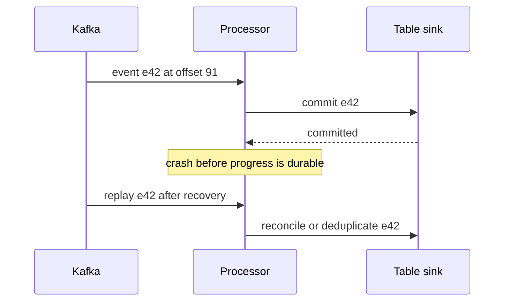

# Kafka·CDC·스트리밍 복구

CDC는 **Change Data Capture**(변경 데이터 캡처)의 약자다. 데이터베이스의 추가·수정·삭제를 수집해 다른 시스템이 변경을 따라가게 한다. 주문 상태가 대기에서 결제로 바뀌었다고 생각해 보자. 분석용 복사본에도 이 수정이 필요하지만 테이블이 커질수록 전체 주문을 반복해서 복사하는 방식은 낭비가 커진다. CDC는 변경을 전달하고, 그 변경을 분석 테이블에 어떻게 반영할지는 소비자가 결정한다.

Debezium은 데이터베이스 커넥터로 CDC를 구현한다. Kafka는 만들어진 이벤트 기록을 보관·전달하고, 스트림 처리기는 이를 변환할 수 있다. 각각의 역할은 다르다. 행이 수정됐다고 새 매출이 생긴 것은 아니며, 이벤트를 저장했다고 매출이 계산되는 것도 아니다. 다음 장의 dbt는 데이터가 적재된 뒤 변환하는 역할을 맡는다.

이벤트를 읽고 출력을 커밋하는 사이에 프로세스가 멈추면 스트리밍 정확성이 드러난다. 처리량 최적화 전에 이 중단을 설계한다.

## 이 장에서 처음 쓰는 말

| 용어 | 의미 |
|---|---|
| 파티션 / 오프셋 | 순서가 있는 로그 구간 / 그 안의 위치 |
| 소비자 그룹(consumer group) | 파티션 소비 책임을 나눠 갖는 소비자들 |
| 재균형(rebalance) | 소비자 사이 파티션 할당의 변경 |
| CDC | Change Data Capture, 변경 데이터 캡처. 데이터베이스 변경을 하위 시스템이 사용할 레코드로 바꾸는 것 |
| 이벤트 시간 / 처리 시간 | 이벤트가 발생한 시각 / 처리기가 다룬 시각 |
| 워터마크(watermark) | 지원되는 상태 유지 연산에 사용하는 이벤트 시간 진척 경계 |
| 체크포인트(checkpoint) | 처리기 복구에 필요한 진척과 상태 기록 |

## 먼저 이해하기

1. 생산자는 원하는 순서 범위를 보존하는 키 등을 사용해 파티션을 선택한다.
2. Kafka는 설정된 승인·복제 정책에 따라 레코드를 추가한다.
3. 소비자나 스트림 처리기가 위치를 읽고 상태를 갱신한다.
4. 출력 대상이 영속 결과를 커밋한다.
5. 복구 시 기록된 진척부터 재개하고 다시 읽을 수 있는 레코드를 처리한다.

Kafka 순서는 파티션 범위다. 파티션을 늘려도 전역 순서는 생기지 않으며 키 배정 방식이 달라질 수 있다. `acks`·복제·동기 복제본 정책은 브로커 내구성을, 생산자 멱등성은 지원되는 재시도 중복을 다룬다. 어느 쪽도 데이터베이스 쓰기나 HTTP 부수 효과를 자동으로 정확히 한 번 만들지 않는다.

## 트랜잭션 경계 그리기



Kafka 트랜잭션은 요구되는 소비자 동작 아래 Kafka 출력과 소비 오프셋을 함께 조정한다. 외부 출력에는 호환되는 자체 트랜잭션·멱등 프로토콜이 필요하다. Spark 문서는 출력별 보장을 구분한다. Kafka sink는 최소 한 번이며 `foreachBatch`도 적절한 중복 제거를 구현하지 않으면 기본적으로 최소 한 번이다. 체크포인트만으로 모든 출력이 정확히 한 번이 되지는 않는다.

## CDC에는 소스 계약이 필요하다

Debezium PostgreSQL 커넥터는 초기 스냅샷과 논리 디코딩을 통한 데이터베이스 변경을 읽는다. 복제 슬롯, WAL 보존, 소스 위치, 트랜잭션 메타데이터, 삭제 이벤트, 재시작 동작을 학습한다. 멈춘 커넥터 때문에 소스에 WAL이 쌓일 수 있으므로 이 저장 위험은 Kafka 소비자 지연과 별도로 감시한다.

애플리케이션이 발행한 주문 이벤트에는 업무 의미가 있고 데이터베이스 행 변경에는 저장 의미가 있다. 삽입·갱신·삭제·트랜잭션 경계·재스냅샷을 하위 레코드에 어떻게 대응시킬지 정한다. 스냅샷과 변경 처리의 중첩을 대사할 수 있게 소스 식별자를 보존한다.

스키마 레지스트리는 설정된 호환성 정책을 검사한다. 그대로인 정수 필드의 단위가 센트에서 달러로 바뀐 의미는 추론하지 못한다. 데이터 계약에서 단위·업무 의미를 버전 관리하고 전환 중 이전·새 소비자를 함께 시험한다.

## 이벤트 시간과 상태

10:01에 발생해 10:12에 도착한 이벤트가 10:00~10:05 집계에 미칠 영향은 지연 도착 정책과 연산자·출력 모드에 달려 있다. 워터마크는 관측 이벤트 시간과 설정에서 추정한 진척이며 모든 생산자가 다 보냈다는 증거가 아니다. 조용한 파티션, 시계 오류, 순서가 바뀐 레코드를 명시적으로 처리한다.

Spark Structured Streaming은 흔히 마이크로 배치를 사용하는 증분 DataFrame 모델이다. Flink는 연속 이벤트 시간 처리, 워터마크, 키별 상태, 체크포인트를 비교하는 데 유용하다. 측정한 지연, 상태 크기, 커넥터 동작, 운영 역량으로 선택한다. 제품 이름만으로 종단 간 의미가 보장되지는 않는다.

## 복제·ISR·승인·순서

파티션마다 리더와 복제본이 있다. ISR은 Kafka 규칙상 충분히 따라잡았다고 간주하는 복제본 집합이다. 복제 계수 3, `min.insync.replicas=2`, 생산자 `acks=all`이면 설정된 최소 ISR 조건을 만족하고 현재 동기 복제본 집합의 승인이 필요하다. `acks=all`은 정확히 두 복제본이나 오프라인까지 포함한 모든 설정 복제본을 뜻하지 않는다. ISR이 최소값보다 줄면 요구를 조용히 약화하는 대신 쓰기가 실패한다.

반면 `acks=1`은 같은 복제 대기 없이 리더 승인만 기다리므로 복제 전 리더가 죽으면 승인한 레코드를 잃을 수 있다. `acks=0`에서는 생산자가 브로커 승인을 받지 않는다. 복제본 장애 중 가용성과 내구성 요구를 비교하고 브로커·생산자 설정을 함께 기록한다. 한 정책에서 전송 성공했다고 다른 정책의 보장이 입증되지는 않는다.

생산자 멱등성은 순번 정보를 붙여 지원되는 재시도 레코드를 브로커에서 중복 제거하게 한다. Kafka 4.1은 `acks`, 재시도, 최대 처리 중 요청 사이의 필수 관계를 문서화한다. 이는 다른 이벤트 식별자를 가진 업무 요청 둘을 합치지 않으며 소비자의 HTTP 요청을 멱등하게 만들지도 않는다. 업무 이벤트 ID는 Kafka 오프셋과 독립적으로 보존한다.

순서는 파티션 로그 안에서 유지된다. 선택한 파티셔너로 고객별 키를 쓰면 관련 이벤트가 모이지만 매우 활발한 고객 하나가 그 파티션을 포화시킬 수 있다. 파티션 증설은 이후 레코드의 키 배치를 바꿀 수 있어 증설 전후 순서에는 전환 설계가 필요하다. 같은 파티션의 레코드를 독립 워커에 보내면 Kafka 전달 순서가 맞아도 완료 순서는 바뀔 수 있다.

## 소비자 할당·재균형·지연

일반적인 소비자 그룹 구독에서는 파티션 하나를 동시에 한 그룹 구성원에게 할당한다. 파티션 6개·소비자 3개면 각각 두 개가 될 수 있고 소비자 8개면 일부는 할당받지 못한다. 다른 그룹은 같은 로그를 독립적으로 읽는다. 멤버나 구독이 바뀔 때 할당 전략·재균형 프로토콜이 소유권 변경 방식을 정하므로 모든 클라이언트가 같은 세대의 동작을 쓴다고 가정하지 않는다.

소유권 이전 시 회수된 파티션의 새 작업을 시작하지 말고 처리 중 작업을 조정한 뒤 진척을 기록한다. 101·103은 끝났는데 102가 미완료라면 다음 위치 104를 커밋할 경우 재시작 후 미완료 작업을 건너뛴다. 이 패턴에서는 연속적으로 완료된 앞 구간까지만 커밋 위치를 전진시킨다.

오프셋은 위치이지 시각이 아니다. 10,000건 지연도 발생률·나이에 따라 수초나 수시간일 수 있다. 파티션별 지연, 가장 오래된 미처리 나이, 처리량, 공개 지연을 함께 본다. 아래 계산은 다음 위치 관례와 빈틈 없는 로그를 가정한 예시다.

```text
partition 0: end position=1000 committed next position=900 lag=100
partition 1: end position=2000 committed next position=1990 lag=10
group lag=110, but partition 0 determines most catch-up work
```

폴링과 처리 수명을 조정하지 않으면 타이머 기반 자동 커밋이 애플리케이션 작업과 경쟁할 수 있다. 외부 효과는 트랜잭션 또는 멱등 설계를 명시하고 각 경계에서 중단을 시험한다. 효과 전 커밋에는 최대 한 번의 유실 구간, 커밋 전 효과에는 최소 한 번의 재생 구간이 생긴다.

## Kafka 트랜잭션과 외부 출력 대상

Kafka 읽기·처리·쓰기 트랜잭션은 출력 레코드와 소비 오프셋을 원자적으로 포함할 수 있다. 하위 소비자는 중단된 출력을 노출하지 않도록 `read_committed` 등 필요한 격리 동작을 사용해야 한다. 안정적인 트랜잭션 식별자와 fencing은 경쟁하는 생산자 인스턴스를 다룬다. 열린 트랜잭션은 read-committed 소비자의 가시성을 늦출 수 있으므로 브로커에 바이트가 있는 위치와 소비자가 읽을 수 있는 위치는 다르다.

데이터베이스 출력은 이벤트 식별자를 inbox에 넣고 같은 데이터베이스 트랜잭션에서 효과를 적용한다. 재시도 시 유일성 충돌이면 이미 적용한 효과를 반복하지 않는다. 이후 소스 진척을 커밋한다. 둘 사이에 죽어도 불변식이 유지되면 재처리는 무해하다. [메시징 재생 실습](../../content/messaging/02-duplicate-dlq-replay-lab.md)에 트랜잭션 구현이 있다. 재시작 시 사라지는 메모리 집합만으로 중복 제거하지 않는다.

## CDC 레코드·삭제·스키마 호환성

Debezium 변경 레코드는 커넥터·스키마 설정에 따라 작업 종류, before/after, 소스 메타데이터를 담는다. 행 갱신이 자동으로 새 매출인 것은 아니다. 삭제는 하위 개체를 제거하거나 유효성을 끝내야 하며 after 값이 NULL이라고 버리면 안 된다. Kafka tombstone은 압축 로그의 삭제 의미도 지원하므로 업무 삭제 레코드와 구분한다.

초기 스냅샷과 이후 WAL 스트림은 일관된 소스 위치 이력으로 이어져야 한다. 복제 슬롯이 보존한 WAL을 감시한다. Kafka 소비자가 따라잡았어도 소스 커넥터가 최신이라고 입증되지는 않는다. 재스냅샷은 새 이벤트처럼 무작정 추가하지 말고 행 식별자·버전을 대사한다. 여러 행으로 된 업무 갱신을 함께 노출해야 한다면 소스 트랜잭션 묶음도 중요하다.

하위 호환성은 새 리더가 이전 데이터를 읽는 것이고 상위 호환성은 이전 리더가 새 데이터를 읽는 것이다. 정확한 규칙은 Avro·Protobuf·JSON Schema와 레지스트리 정책에 달려 있다. 기본값 있는 선택 필드는 검사를 통과할 수 있고 센트→달러 단위 변경은 그대로 놓칠 수 있다. 도메인 계약과 함께 이전·새 리더와 페이로드의 조합을 시험한다.

## Structured Streaming: 마이크로 배치와 출력 모드

마이크로 배치는 제한된 입력 구간을 선택하고 상태를 갱신해 출력한다. 체크포인트는 재개에 필요한 소스 진척·상태를 기록한다. trigger 주기는 배치를 시도할 때를 정한다. 배치가 30초 걸리면 1초 trigger가 1초 완료를 만들지 않는다. 초당 입력·처리 행 수와 배치 단계별 시간을 비교한다.

Append 모드는 확정 가능한 쿼리에서 새로 확정된 결과 행을 내보낸다. Update는 바뀐 결과 행을 내보내므로 출력 대상은 반복 키가 금액 추가가 아닌 교체임을 이해해야 한다. Complete는 매 배치 전체 결과 테이블을 내보내며 집계 상태가 계속 커질 수 있다. 가능한 모드는 연산자·소스·출력 조합에 의해 제한된다.

`foreachBatch` 콜백은 이전에 시도한 배치를 다시 받을 수 있다. 안정된 쿼리·체크포인트 수명 안의 배치 식별자로 중복 제거하거나 출력에서 안정적인 이벤트·버전 키를 대사한다. 체크포인트를 초기화하면 배치 번호가 다시 시작할 수 있으므로 `batch_id`만으로 새 파이프라인 식별자 전반에 유일하지 않다. 다중 테이블 업무 공개의 절반씩 독립 커밋하면서 원자적이라고 불러서도 안 된다.

### 워터마크·윈도·늦은 수정

5분 고정 윈도 `[10:00,10:05)`와 지연 허용 10분을 생각해 보자. 엔진이 이벤트 시간 10:20을 관측하면 후보 워터마크는 10:10이다. 지원되는 집계는 이후 오래된 윈도를 확정하고 상태를 제거할 수 있다. 실제 진척은 엔진의 배치·연산자 규칙을 따르며 벽시계 시간 경과만으로 관측 이벤트 시간이 전진하지는 않는다.

```text
event time 10:01 arrives while window state is open: contributes to [10:00,10:05)
event time 10:04 arrives after a watermark beyond 10:05: may be too late
event time 10:20 observed: progress can advance, even if another source is delayed
```

Spark의 문서화된 지연 보장은 한쪽 방향이다. 임계값보다 덜 늦은 데이터는 해당 워터마크 규칙으로 버리지 않지만, 더 늦은 데이터는 상황에 따라 처리되거나 버려질 수 있다. 보편적인 정확한 수락 경계를 만들지 말고 실습에서 관찰한 연산자·출력 모드 동작을 기록한다.

워터마크 기반 중복 제거에도 기억 기간이 있다. 식별자가 상태에서 만료된 뒤 재시도하면 그 상태만으로 알아볼 수 없다. 금액 정확성에 전체 수명 중복 제거가 필요하면 출력에 영속적인 식별자·버전 규칙을 둔다. 스트림 간 조인은 미대응 행 상태를 제한하려면 시간 관계와 워터마크의 경계가 필요하다. 무제한 조인은 상태를 끝없이 쌓을 수 있다.

## Flink·키별 상태·체크포인트·역압

Flink는 다른 실행 모델을 비교하기에 유용하다. 이벤트가 연산자를 흐르고 키 기반 분배가 상태를 해당 인스턴스에 두며 워터마크가 이벤트 시간 진척을 전달한다. 다중 입력은 흔히 관련 워터마크 중 가장 느린 것에 맞춰 전진한다. 유휴 처리가 없으면 조용한 소스가 진척을 막을 수 있으므로 소스 활동을 CPU와 따로 감시해야 한다.

체크포인트 장벽은 복구 가능한 연산자 상태·소스 진척의 관점을 조정한다. 요구 출력 보장에는 트랜잭션 또는 호환되는 출력 대상이 여전히 필요하다. 큰 상태, 느린 스냅샷, 역압은 체크포인트를 지연시켜 복구 여유를 줄일 수 있다. 체크포인트 완료 후 나이와 소요 시간을 입력 재생 보존 기간과 비교한다.

역압(backpressure)은 하위 연산자가 상위 속도로 작업을 받을 수 없다는 뜻이다. 영속 소스 보존도 유한한 기간만 적체를 흡수한다. 초당 유입 5,000·처리 4,000이면 시간당 360만 이벤트가 쌓인다. 파티션 병렬성을 넘겨 소비자를 추가해도 해결되지 않으며 출력이 포화됐다면 소스 읽기 가속도 해결책이 아니다.

## 단계별 실패 행렬

격리 토픽, 가상 이벤트 ID, 임시 출력 대상, 독립적인 예상 장부를 사용한다. 문제 해결의 지름길로 실제 체크포인트를 삭제하지 않는다.

| 변경 | 예상 근거와 복구 확인 |
|---|---|
| 소비자 중지 | 지연 증가, 재시작 후 고유 대상 ID·출력값 비교 |
| 출력 커밋 뒤 중단 | 재생 발생, 업무 효과 중복 없이 출력 대사 |
| 중복·충돌 ID 전송 | 동일 재시도 처리, 충돌 페이로드의 명시적 결과 |
| 늦은 이벤트 전송 | 선언한 정책별 수락·수정·거부 건수 기록 |
| 스키마 필드 손상 | 사유를 남겨 격리·실패한 뒤 수정·재생 |
| 임시 체크포인트 유실 | 알려진 체크포인트 복원 또는 의도적으로 대사하는 재생 시작 |
| 소스 보존 기간 소진 | 복구 불가 공백 보고 또는 독립 소스 복사본에서 복원 |

입력률, 처리율, 이벤트→공개 지연, 상태 크기, 재시도, 체크포인트 나이, 출력 커밋을 함께 관찰한다. Kafka 지연 0도 마트 최신성을 입증하지 않는다. 하위 처리·공개가 멈췄을 수 있다.

## 실행 결과 예시

종합 프로젝트의 e1=100·e2=250을 사용한 가상 재생 장부이며 브로커 실행 트레이스가 아니다.

```text
input deliveries: e1, e2, e1
accepted unique IDs: e1, e2
published total_cents: 350
crash after sink commit before checkpoint: replay expected
after replay: unique IDs=2, total_cents=350
conflicting e1 payload: BLOCK or explicit quarantine
```

재생 합계 450은 이중 집계다. 공개가 멈췄는데 소스 지연만 0이면 신선도 실패다. 소스 보존과 독립 캡처에 모두 없는 이벤트는 체크포인트 재생성으로 복원할 수 없다.

## 스스로 설명해 보기

오프셋과 출력을 어디에 커밋하며 그 사이에 죽으면 어떻게 되는가? DLQ에 담당자·보존·수정 절차·검증된 재생 경로가 필요한 이유를 설명한다. 레코드를 DLQ로 옮기는 것은 실패를 기록하는 것이며 해결하는 것이 아니다.

다음은 [모델링과 오케스트레이션](../../../docs/guides/data-observability/07-modeling-orchestration.md)으로 이어간다.

<!-- source: https://kafka.apache.org/41/design/design/ | checked: 2026-09-10 | Kafka 4.1 delivery and ordering boundaries -->
<!-- source: https://spark.apache.org/docs/latest/streaming/apis-on-dataframes-and-datasets.html | checked: 2026-09-10 | sink guarantees and checkpoint recovery -->
<!-- source: https://debezium.io/documentation/reference/stable/connectors/postgresql.html | checked: 2026-09-10 | snapshot, replication slots and WAL -->
<!-- source: https://nightlies.apache.org/flink/flink-docs-stable/docs/concepts/time/ | checked: 2026-09-10 | event time and watermarks -->
<!-- source: https://kafka.apache.org/41/configuration/producer-configs/ | checked: 2026-09-10 | acknowledgement and idempotent producer constraints -->
<!-- source: https://kafka.apache.org/41/configuration/consumer-configs/ | checked: 2026-09-10 | group protocol, offsets and isolation -->
<!-- source: https://spark.apache.org/docs/4.0.1/streaming/apis-on-dataframes-and-datasets.html | checked: 2026-09-10 | fixed-version state/output/watermark semantics -->
<!-- source: https://nightlies.apache.org/flink/flink-docs-stable/docs/concepts/stateful-stream-processing/ | checked: 2026-09-10 | keyed state and checkpoint coordination -->
