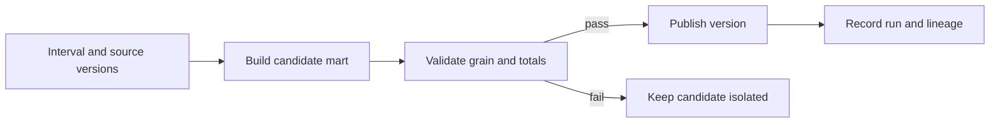

# 모델링·dbt·오케스트레이션: 의미 있는 데이터셋 공개하기

재무팀과 영업팀이 같은 주문 데이터를 쓰는데 일일 매출이 다르다. 각자 작성한 SQL에서 중복이나 환불을 다르게 처리했을 수 있다.

**dbt**는 팀이 함께 쓰는 데이터 변환을 관리하고 실행·검사·문서화하는 도구다. 주로 SQL을 사용한다. **dbt 모델**은 분석용 테이블이나 뷰를 만드는 변환 정의다.

주문 보고서를 만든다면 다음처럼 나눌 수 있다.

1. 적재한 주문을 정리하고 주문 ID가 중복되지 않는지 검사한다.
2. 합의한 환불 규칙에 따라 일일 매출을 계산한다.
3. 결과를 검사한 뒤 사용자에게 공개한다.

행을 저장하고 SQL을 실행하는 곳은 데이터베이스다. CDC는 원본 변경을 수집하고 dbt는 적재된 데이터를 변환한다. Airflow나 Dagster는 의존하는 작업을 언제 실행할지 조정한다. 이 조정 작업이 **오케스트레이션**이다.

실행이 성공해도 매출액이 맞는지는 별도 문제다. 행의 의미, 과거 데이터 처리 방식, 사용자에게 전달된 결과를 확인해야 한다.

## 이 장에서 처음 쓰는 말

| 용어 | 의미 | 왜 필요한가요 · 언제 쓰나요 |
|---|---|---|
| 사실 / 차원 | 사실은 매출처럼 측정할 값이나 사건이다. 차원은 고객 지역·상품 분류처럼 그 사건을 설명하는 정보다. | 합산할 값과 분류에 쓸 속성을 구분해 조인·집계가 틀리지 않게 한다. **구체적인 상황(가상 예시):** 매출 보고서에 금액과 고객·상품 속성이 필요하다. → 명시한 행 단위에 맞춰 매출 사건은 사실, 설명 속성은 차원으로 모델링한다. → 조인이 사건 수와 합계를 보존하는지 확인한다. |
| 스타 스키마(star schema) | 사실 테이블을 중심으로 설명 정보를 담은 차원 테이블들을 정해진 키로 연결한 구조다. | 여러 분석가가 같은 키와 관계를 사용해 일관된 결과를 얻도록 한다. **구체적인 상황(가상 예시):** 분석가마다 매출 조인을 다르게 작성한다. → 관계가 명확한 차원들과 사실 테이블을 제공한다. → 공통 쿼리가 일관된 키를 사용하고 중복을 만들지 않는지 확인한다. |
| SCD Type 1 / Type 2 | Type 1은 이전 속성을 덮어쓴다. Type 2는 유효 기간별 이력을 남겨 당시 속성으로 보고서를 만들 수 있게 한다. | 고객 정보가 바뀌어도 과거 보고서가 어떤 속성을 사용할지 명확하게 한다. **구체적인 상황(가상 예시):** 고객이 지역을 옮기자 과거 매출의 지역 분류가 달라진다. → 보고 목적에 맞춰 덮어쓰기 또는 유효 기간 이력을 선택한다. → 과거 매출에 현재 속성과 당시 속성 중 의도한 값이 적용되는지 시험한다. |
| 증분 모델(incremental model) | 매번 전체 결과를 다시 만드는 대신, 정해진 범위의 새 데이터나 변경 데이터를 처리하는 변환이다. | 전체 이력을 다시 계산하지 않고 바뀐 부분으로 결과를 갱신한다. **구체적인 상황(가상 예시):** 매일 바뀌는 행은 적은데 변환이 전체 이력을 다시 읽는다. → 키와 늦은 수정 처리 방식을 정해 추가·변경 행을 처리한다. → 조건을 정한 예제에서 증분 실행과 전체 재생성 결과를 비교한다. |
| 백필(backfill) | 누락된 날짜를 복구할 때처럼 정해진 과거 기간의 변환을 다시 실행하는 것이다. | 빠졌거나 수정된 과거 기간만 다시 계산해 복구한다. **구체적인 상황(가상 예시):** 수정한 업무 규칙을 지난 세 달 데이터에 적용해야 한다. → 부하와 멱등 쓰기를 관리하며 대상 구간을 다시 처리한다. → 구간별 결과를 대조하고 정기 실행과 충돌하지 않는지 확인한다. |
| 데이터 구간(data interval) | 정기 실행 한 번이 처리해야 하는 기간이다. 실제 실행이 시작된 시각과는 다를 수 있다. | 오늘 재시도하더라도 원래 맡았던 어제 구간을 다시 처리하게 한다. **구체적인 상황(가상 예시):** 오늘 시작한 잡이 어제 영업일을 계산해야 한다. → 현재 시계 대신 명시된 데이터 구간을 사용한다. → 재시도해도 같은 구간을 읽는지 확인한다. |

## 먼저 이해하기

1. 소스 식별자를 포함한 원시 표현을 보존한다.
2. staging에서 타입·타임스탬프·단위·이벤트 버전을 표준화한다.
3. 중간 모델에 재사용 가능한 변환을 만든다.
4. 명시적 사용자 정의를 갖춘 사실·차원·마트를 공개한다.
5. 검사를 공개 조건으로 삼고 입력 버전과 출력 식별자를 기록한다.

Bronze·silver·gold는 조직 관례다. 디렉터리 이름만으로 품질이 강제되지 않는다. 보존·거부 대상, 과거 수정의 전파 방식, 읽을 수 있는 주체를 경계마다 정의한다.

## 이력을 의도적으로 설계하기

주문 상품별 행이 있으면 품목별 매출을 계산할 수 있다. 하지만 일일 합계만 남겼다면 개별 주문을 복원하지 못할 수 있다. 그래서 열을 추가하기 전에 행 하나가 주문, 상품, 하루 중 무엇을 뜻하는지 정한다. 고객 이력을 남기는 Type 2 방식에서는 주문 발생 시각에 유효했던 고객 행을 연결한다. 유효 기간이 겹치지 않게 하고, 시작 시각은 포함하되 끝 시각은 제외하는 구간을 보통 사용한다. 보고서가 당시 지역을 보여 줄지 현재 지역을 보여 줄지도 정한다.

고객이 화요일에 지역을 옮겼다면 월요일 주문은 과거 보고서에서 월요일 지역, 현재 계정 화면에서는 오늘 지역에 속할 수 있다. 둘 다 유용하지만 문서화되지 않은 조인 하나로 두 정의를 안전하게 대신할 수는 없다.

## 사실 행 단위·차원·SCD 이력

주문 항목 사실에는 수량·항목 금액, 고객 차원에는 설명 속성이 들어간다. 스타 스키마는 선언한 키로 연결한다. 가산 측정값은 유효한 차원으로 합산할 수 있지만 계정 잔액은 일반적으로 시간축 합산이 안 되며 평균 가격도 가중치 없이 부분 평균을 평균내면 안 된다. 비율은 의미 계약에 분자·분모를 정의한다.

SCD Type 1은 속성을 덮어써 과거 사실도 현재 차원과 조인하면 오늘 분류를 따른다. Type 2는 대리 식별자와 유효 구간을 가진 새 차원 버전을 만든다. 반개구간 `[valid_from, valid_to)`을 쓰면 변경 시각과 정확히 같은 이벤트는 새 버전에만 대응한다. 중첩을 금지하고 최초 알려진 버전 이전의 사실 처리도 정한다.

다음 실행 가능한 SQLite 예제로 차이를 확인한다. 작은 정수 시각은 순서 있는 가상 시점이다. 실제 모델은 시간대가 명시된 타임스탬프와 동률을 푸는 소스 순번을 사용해야 한다.

<!-- executable: scd-history -->
```python
import sqlite3

with sqlite3.connect(':memory:') as db:
    db.executescript("""
    CREATE TABLE dim_customer(customer TEXT, region TEXT, start_at INT, end_at INT);
    INSERT INTO dim_customer VALUES ('c1','KR',0,20),('c1','US',20,100);
    CREATE TABLE facts(event TEXT, customer TEXT, event_at INT, cents INT);
    INSERT INTO facts VALUES ('e1','c1',10,100),('e2','c1',20,250);
    """)
    naive = db.execute('SELECT SUM(cents) FROM facts JOIN dim_customer USING(customer)').fetchone()[0]
    historical = db.execute("""
      SELECT region, SUM(cents) FROM facts f JOIN dim_customer d
      ON f.customer=d.customer AND f.event_at>=d.start_at AND f.event_at<d.end_at
      GROUP BY region ORDER BY region
    """).fetchall()
    current = db.execute("""
      SELECT region, SUM(cents) FROM facts f JOIN dim_customer d
      ON f.customer=d.customer AND d.end_at=100 GROUP BY region
    """).fetchall()
    assert naive == 700
    assert historical == [('KR',100),('US',250)]
    assert current == [('US',350)]
    print('naive_total:', naive)
    print('type_2_attribution:', historical)
    print('current_attribution:', current)
```

예상 출력:

```text
naive_total: 700
type_2_attribution: [('KR', 100), ('US', 250)]
current_attribution: [('US', 350)]
```

시각 20의 이벤트는 US에 속한다. `< end_at`를 `<= end_at`로 바꾸면 경계에서 두 번 대응하며 일반 NOT NULL 검사로는 못 잡는다. 차원의 늦은 수정은 현재 차원 행뿐 아니라 과거 주문의 분류까지 다시 계산해야 할 수 있다.

## dbt의 역할

`ref`는 다른 dbt 모델의 테이블·뷰를 참조하면서 실행 의존성도 기록한다. `source`는 외부에서 적재한 입력을 가리킨다. 모델에는 변환 SQL을, 매크로에는 반복해서 쓸 SQL 생성 규칙을 둔다. 스냅샷은 관측한 변경 이력을 남기고 문서는 데이터의 뜻을 설명한다. 결과를 테이블이나 뷰로 만드는 방식과 적용할 수 있는 제약은 사용하는 어댑터와 데이터 웨어하우스에 따라 달라진다.

모델 계약은 출력 형태와 지원 제약을 설명한다. 데이터 테스트는 관계가 만들어진 뒤 내용을 평가하고 실패 레코드를 보고한다. 웨어하우스에서 기본 키를 선언해도 유일성이 반드시 강제되지는 않는다. 어댑터·플랫폼 동작을 확인하고 필요하면 명시적 유일성 테스트를 유지한다.

다음 dbt 모델 속성 파일은 예시다. 해당 열을 가진 기존 `fct_orders` 모델과 호환 dbt·어댑터를 가정하며 완전한 프로젝트는 아니다.

```yaml
version: 2
models:
  - name: fct_orders
    description: One accepted current record per order event.
    columns:
      - name: event_id
        data_tests:
          - not_null
          - unique
      - name: amount_cents
        data_tests:
          - not_null
```

이 검사는 통화, 매출 정의, 상위 이벤트 누락, 갱신 이력을 검증하지 않는다. 예시 입력 기반 업무 테스트, 소스 대조, 전달 검사를 추가한다.

## 모델·ref·source·매크로

dbt SQL 모델에는 만들 결과를 SELECT로 작성한다. materialization 설정은 그 결과를 뷰, 테이블, 증분 갱신 테이블 등 어떤 형태로 제공할지 정한다. `ref('stg_orders')`를 쓰면 현재 환경의 stg_orders를 참조하고 그 모델에 의존한다는 사실도 기록된다. `source('commerce','orders')`는 등록된 외부 입력을 가리킬 뿐 데이터를 직접 수집하지 않는다. 운영 테이블 이름을 SQL에 고정해 쓰면 환경에 맞는 이름 선택과 의존성 관리의 이점을 잃는다.

매크로는 컴파일 시 SQL을 생성하며 웨어하우스에서 행마다 실행하는 Python 함수가 아니다. 이름에 단위를 담아 재사용해도 의미가 유지되게 한다. 예를 들어 dbt 프로젝트의 `macros/cents_to_units.sql`에 다음을 저장한다.

```sql

  cast({{ column_name }} as decimal(18,2)) / 100

```

이후 `{{ cents_to_units('amount_cents') }}`는 모델 안의 식을 만든다. 인자는 신뢰한 프로젝트 코드이며 임의 사용자 SQL이 아니다. 다른 자릿수가 필요한 통화에는 다른 규칙을 사용한다. 편리한 매크로가 모든 금액에 소수 두 자리를 조용히 강요해서는 안 된다.

## 증분 모델: 변경 선택과 키 교체

증분 모델에는 관련 변경을 모두 선택하는 일과 기존 출력에 올바르게 적용하는 별도 책임이 있다. `is_incremental()`은 대상 존재, 전체 갱신 아님 등 문서화된 증분 조건에서만 참이다. `unique_key` 설정은 지원 전략의 대응 방법이며 입력 키의 유일성·NOT NULL을 보장하지 않는다.

이 모델은 `delete+insert`를 지원하는 dbt 어댑터용 DuckDB/PostgreSQL 계열 SQL 예시다. `stg_orders(event_id, amount_cents, updated_at, source_seq)`가 있는 기존 프로젝트의 `models/fct_orders.sql`에 저장한다. staging은 같은 이벤트·순번의 충돌을 거부하고 기준으로 삼을 수 있는 순번을 유지해야 한다. 이틀 lookback은 예제 정책이며 보편적인 지연 보장이 아니다.

```sql
{{ config(materialized='incremental', unique_key='event_id',
          incremental_strategy='delete+insert') }}

with candidates as (
  select * from {{ ref('stg_orders') }}
  
  where updated_at >= (
    select coalesce(max(updated_at), timestamp '1900-01-01') from {{ this }}
  ) - interval '2 days'
  
), ranked as (
  select *, row_number() over (
    partition by event_id order by source_seq desc
  ) as position
  from candidates
)
select event_id, amount_cents, updated_at, source_seq
from ranked where position=1
```

이 모델은 같은 키의 기존 행을 새로 선택한 행으로 교체한다. e1=100, e2=250이면 합계는 350센트다. e1을 120으로 수정하면 다음 실행은 370이며, 똑같이 다시 실행해도 370이어야 한다. 교체하지 않고 새 행을 추가하면 470이 된다. 다만 수정 행의 `updated_at`이 이틀 조회 범위 밖에 있으면 이 모델은 놓친다. 믿을 수 있는 변경 시각이나 CDC 위치 등 다른 탐지 방법이 필요하다. 삭제 표시(tombstone)도 별도로 처리해야 한다. SELECT에서 삭제 행을 빼는 것만으로 기존 결과 테이블의 행이 지워지지는 않는다.

임시 스키마에서 `dbt run --select +fct_orders`, `dbt test --select fct_orders`를 실행하고 별도 전체 재계산 결과와 키별로 비교한다. 소스 예시, 어댑터·core 버전, 컴파일 SQL을 보존한다. 증분 호출 성공은 과거 삭제나 늦은 갱신을 포함했다는 근거가 아니다.

## 스냅샷·테스트·계약·문서

dbt 스냅샷은 변경 가능한 소스에서 탐지한 변경을 Type 2 이력으로 보존한다. timestamp 전략은 신뢰할 수 있는 updated-at 열을 쓰고 check 전략은 설정한 값들을 비교한다. 일일 스냅샷은 실행 시점 상태만 보므로 실행 사이 중간 변경 둘이 이력에서 빠질 수 있다. 모든 중간 변경이 중요하면 CDC가 필요하다. 소스 계약 없이 스냅샷 관측 시각을 업무 유효 시각이라고 부르지 않는다.

중복·NULL 검사처럼 여러 모델에 재사용할 검사는 generic data test로 만든다. 개별 업무 규칙은 잘못된 행을 반환하는 singular SQL test로 표현한다. 예를 들어 주문 발생 시각에 맞는 고객 이력이 없거나 두 개 이상 연결되는 주문을 반환하게 할 수 있다. 반환 행이 없으면 통과하므로 입력 자체가 빈 경우도 성공처럼 보일 수 있다. 예상 입력이 모두 있는지는 따로 확인한다. 사용하는 dbt 버전과 어댑터가 지원하면 전체 빌드 전에 작은 입력으로 변환 로직을 시험한다.

모델 계약은 경계에서 출력 열·타입과 지원 제약을 제한하며 실제 강제는 웨어하우스마다 다르다. 문서는 설명, 행 단위, 단위, 담당자, 검사 의미를 담고 실행을 대신하지 않는다. 매니페스트와 실행 결과를 릴리스와 함께 보관해 계보·검사가 같은 리비전을 참조하게 한다. `dbt build`는 그래프 의존성과 지원되는 테스트 차단 동작을 따르지만 프로젝트 전체를 자동으로 하나의 원자적 공개 트랜잭션으로 만들지 않는다.

## 현재 시각을 추측하지 말고 구간을 조정하기

Airflow는 워크플로와 과거 백필을 재처리·동시성 제어와 함께 지원한다. 자산과 의존성 중심 구성이 좋다면 Dagster를 대안으로 평가한다. 처음에는 하나만 사용한다.

태스크는 변환 내내 현재 시각을 호출하지 말고 명시적 입력 구간을 처리한다. 재시도도 같은 논리 입력을 대상으로 외부 효과 중복을 피해야 한다. 실행 ID와 업무 구간을 나눈다. 같은 구간에 두 시도가 있어도 공개 결과는 명확하게 하나여야 한다.



### Airflow DAG와 Dagster 자산

Airflow DAG는 태스크 의존성을 표현한다. 논리 날짜·데이터 구간은 작업 기간을 식별하며 실제 시작은 스케줄·자원 경쟁으로 늦을 수 있다. 재시도는 그 구간의 추가 시도다. 변환에 구간 경계·입력 버전을 명시적으로 전달하고 스케줄러 동시성 제어로 백필이 현재 운영 용량을 소진하지 않게 한다. 태스크 성공은 영속 출력 확인 뒤에 와야 한다.

Dagster 자산 모델은 데이터셋·의존성에 이름을 붙이고 날짜 같은 부분을 파티션으로 표현한다. materialization은 자산 갱신을 기록하며 검사가 속성을 평가한다. 태스크 실행만 보는 것보다 어느 파티션이 없는지 묻기 자연스러울 수 있다. 필요한 운영 질문·연동으로 고른다. 어느 모델도 트랜잭션 공개, 데이터 계약, 소스 보존을 없애지는 않는다.

스케줄러에서 태스크가 시간 초과됐어도 웨어하우스의 쿼리는 계속 실행 중일 수 있다. 곧바로 재시도하면 두 쿼리가 같은 결과를 동시에 바꾸게 된다. 원격 작업 ID를 기록해 두고, 재시도 전에 이전 쿼리가 끝났는지와 어떤 결과를 저장했는지 확인한다. 스케줄러의 재시도 설정만으로 원격 쿼리까지 취소되는 것은 아니다.

## 과거 구간 재처리 실습

임시 모델·스키마, 가상 3일 주문, 명시적인 시작·종료 시각을 받는 스케줄러나 스크립트가 필요하다. 3일 모두 빌드해 합계를 기록하고 둘째 날 주문 하나를 수정한다. 해당 구간만 후보 출력으로 다시 처리하고 예상 합계와 비교한 뒤 지원되는 방식으로 원자적으로 공개한다.

같은 백필을 반복해도 최종 결과는 같아야 한다. 출력 생성 뒤 스케줄러 성공 표시 전에 실패를 주입하고 재시도 시 출력 식별자를 대조한다. 동시 백필 수를 세고 현재 데이터에 필요한 자원을 보호한다. 과거 복구가 오늘의 기한 초과를 만들면 복구가 끝난 것이 아니다.

`max(event_time)`만으로 증분 필터링하면 과거 타임스탬프의 늦은 수정을 놓칠 수 있다. 제한된 lookback과 같은 입력에 같은 결과를 내는 병합, CDC 위치, 소스가 지원하는 다른 변경 탐지 기법을 설계한다. 늦은 갱신·삭제를 포함한 예제로 증분 출력과 전체 재계산을 비교한다.

## 실행 결과 예시

모든 금액이 센트 단위인 3일 장부 예시다.

```text
baseline: day1=100, day2=250, day3=50
day2 correction: replace 250 with 270
after bounded backfill: day1=100, day2=270, day3=50
after identical retry: day1=100, day2=270, day3=50
full rebuild comparison: MATCH
```

둘째 날 520은 덧셈식 재생을 뜻한다. 둘째 날 밖의 설명되지 않은 변경은 복구 범위 위반이다. 전체 재계산 비교에 늦은 삭제를 넣고 스케줄러 승인 실패 후에는 기존 공개 결과를 대조한다.

## 스스로 설명해 보기

모델 빌드 성공이 정확히 무엇을 입증하는가? 행 단위, 구간, 입력 버전, 검사, 공개 경계, 남은 불확실성을 말하고 태스크 재시도와 업무 결과 재공개가 다른 작업인 이유를 설명한다.

다음은 [품질과 SLO](../../../docs/guides/data-observability/08-quality-contracts-slos.md)로 이어간다.

<!-- source: https://docs.getdbt.com/docs/build/data-tests | checked: 2026-09-10 | model data tests -->
<!-- source: https://docs.getdbt.com/docs/mesh/govern/model-contracts | checked: 2026-09-10 | shape versus data tests and adapter constraint support -->
<!-- source: https://airflow.apache.org/docs/apache-airflow/stable/core-concepts/backfill.html | checked: 2026-09-10 | Airflow 3.3.1 backfill semantics at review -->
<!-- source: https://docs.getdbt.com/docs/build/incremental-models | checked: 2026-09-10 | change selection, unique_key and full refresh -->
<!-- source: https://docs.getdbt.com/docs/build/snapshots | checked: 2026-09-10 | timestamp/check strategies and observed history -->
<!-- source: https://docs.getdbt.com/docs/build/jinja-macros | checked: 2026-09-10 | SQL generation and macros -->
<!-- source: https://docs.dagster.io/guides/build/assets | checked: 2026-09-10 | assets, materializations and dependencies -->
