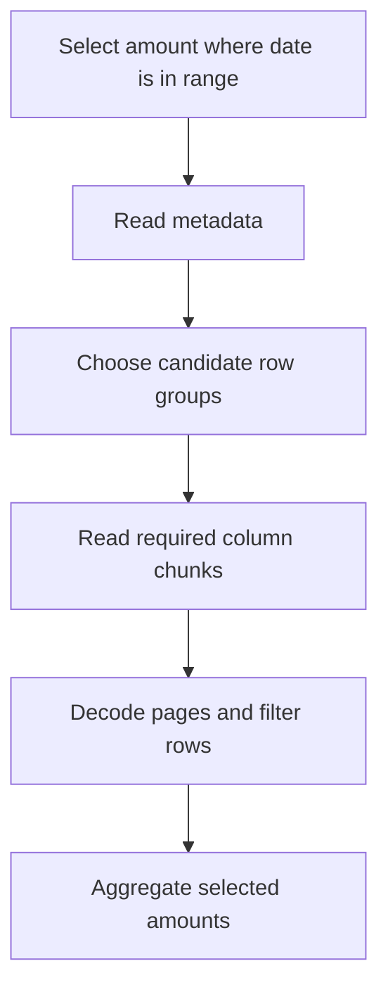

# Parquet와 오브젝트 스토리지: 실제로 읽는 데이터 이해하기

두 열만 요청하는 쿼리가 모든 레코드의 모든 필드를 해독할 필요는 없어야 한다. Parquet는 분석 데이터를 구성해 열을 선택하고, 메타데이터와 조건이 허용하면 파일의 무관한 부분을 건너뛰게 한다.

## 이 장에서 처음 쓰는 말

| 용어 | 의미 | 왜 필요한가요 · 언제 쓰나요 |
|---|---|---|
| 행 그룹(row group) | 여러 행을 수평으로 묶고 각 열을 별도 청크로 저장한 단위 | 스캔 병렬성·통계 기반 제외 효과와 파일 배치의 부가 비용을 함께 조절한다. **구체적인 상황(가상 예시):** 큰 Parquet 파일에서 좁은 날짜 범위만 읽어야 한다. → 행 그룹의 통계와 배치를 살핀다. → 해당 쿼리에서 무관한 그룹을 건너뛸 수 있는지 확인한다. |
| 열 청크(column chunk) | 한 행 그룹 안의 특정 열 데이터 | Parquet 행 그룹 안에서 필요한 열의 바이트 위치를 찾아 읽을 때 쓴다. **구체적인 상황(가상 예시):** 열이 많은 Parquet 테이블에서 보고서는 두 열만 사용한다. → 선택한 행 그룹 안에서 해당 열 청크를 읽는다. → 무관한 열 데이터를 불필요하게 읽지 않는지 확인한다. |
| 페이지(page) | 열 청크 내부의 더 작은 인코딩 단위 | 압축과 지원되는 읽기 제외에 영향을 주는 세부 인코딩·읽기 단위를 이해한다. **구체적인 상황(가상 예시):** Parquet에서 열을 골랐는데도 디코딩 작업이 많다. → 페이지 인코딩과 사용 가능한 페이지 메타데이터를 살핀다. → 지원되는 페이지 건너뛰기나 인코딩 변경이 작업을 줄이는지 측정한다. |
| 열 제거(column pruning) | 쿼리에 필요한 열만 읽는 것 | 넓은 테이블에서 일부 열만 필요한 쿼리가 무관한 열까지 읽는 일을 줄인다. **구체적인 상황(가상 예시):** 대시보드는 긴 텍스트 열이 많은 테이블에서 고객 ID와 매출만 사용한다. → 필요한 열만 선택한다. → 전체 열 조회와 읽은 바이트 수를 비교한다. |
| 조건 밀어 넣기(predicate pushdown) | 읽는 계층에 필터를 전달해 작업을 피하거나 줄이는 것 | 리더가 필터를 평가·활용할 수 있을 때 다음 연산자로 보내는 데이터를 줄인다. **구체적인 상황(가상 예시):** 하루치를 분석하려고 일 년 데이터를 먼저 모두 읽는다. → 리더가 지원하는 필터 푸시다운이 가능하도록 조건을 작성한다. → 실행 계획과 스캔 지표로 읽기 감소를 확인한다. |
| 오브젝트 키(object key) | 저장 서비스에서 오브젝트 하나를 식별하는 이름 | 특정 저장 객체를 지정하고 접근·수명 정책을 지원하는 이름 체계를 설계한다. **구체적인 상황(가상 예시):** 두 내보내기가 객체 저장소의 같은 위치를 덮어쓴다. → 데이터셋·파티션·의도한 버전을 구분하는 키를 정한다. → 재시도가 정해진 덮어쓰기 또는 중복 방지 정책을 따르는지 확인한다. |

## 먼저 이해하기

1. 리더가 열·행 그룹 정보를 포함한 파일 메타데이터를 얻는다.
2. 선택할 열과 리더가 평가할 수 있는 필터를 파악한다.
3. 사용 가능한 통계나 인덱스로 일치할 수 없는 영역을 제외한다.
4. 남은 페이지를 읽고 해독해 결과를 평가한다.



읽기 제외는 조건부다. 리더가 지원하지 않는 필터 함수, 누락 통계, 전체 값 범위가 섞인 행 그룹은 훨씬 많은 스캔을 요구할 수 있다. 압축은 저장 바이트를 줄이고 인코딩은 압축 전이나 그와 함께 데이터 패턴을 활용한다. 어느 쪽도 모든 쿼리가 빨라진다는 약속은 아니다.

## 로컬 파일 배치 실험

새 임시 작업 디렉터리에서 이미 설치된 DuckDB CLI를 사용한다. 명령은 그 위치의 `events.parquet`만 쓴다. 실행 전 DuckDB 버전을 기록한다. 이 SQL은 DuckDB의 Parquet 인터페이스 예시이며 이식 가능한 SQL 표준은 아니다.

```sql
CREATE TABLE events AS
SELECT i AS event_id,
       i % 1000 AS customer_id,
       DATE '2026-01-01' + CAST(i % 30 AS INTEGER) AS event_date,
       100 AS amount_cents
FROM range(100000) t(i);

COPY (SELECT * FROM events ORDER BY event_date)
TO 'events.parquet' (FORMAT PARQUET, ROW_GROUP_SIZE 8192);

SELECT COUNT(*), SUM(amount_cents)
FROM read_parquet('events.parquet');

EXPLAIN ANALYZE
SELECT SUM(amount_cents)
FROM read_parquet('events.parquet')
WHERE event_date = DATE '2026-01-02';

SELECT COUNT(*) AS candidate_row_groups
FROM parquet_metadata('events.parquet')
WHERE path_in_schema = 'event_date'
  AND CAST(stats_min_value AS DATE) <= DATE '2026-01-02'
  AND CAST(stats_max_value AS DATE) >= DATE '2026-01-02';
```

전체 파일은 100,000행, 합계 10,000,000센트여야 한다. 선택한 날짜는 3,334행, 333,400센트다. 계획에서 선택 열과 필터를 확인한다. 벽시계 시간이 짧다는 것만으로 오브젝트 스토리지 바이트를 건너뛰었다고 입증할 수 없다. 이 작은 실험은 로컬 파일시스템 캐시의 영향을 크게 받을 수 있다.

행 그룹 크기를 명시해 작은 예제에도 여러 그룹이 생기게 한다. 기본값이 예제보다 크면 비교가 드러나지 않는다. 같은 `ROW_GROUP_SIZE 8192`로 `event_id` 정렬 파일을 하나 더 쓰고 메타데이터와 가능한 스캔 지표를 비교한 뒤 데이터 크기를 늘린다. 결과 동등성은 유지한다. min/max 메타데이터의 후보 그룹 수는 읽기 제외의 기회이며 실제 가져온 바이트 측정값은 아니다. 핵심은 합리적인 쓰기·유지 비용으로 선택 읽기가 개선되는지다. 완료 후 실습에서 만든 파일만 지운다.

## 오브젝트 스토리지에서는 운영 모델이 달라진다

오브젝트 스토리지는 키와 API 작업으로 접근한다. 키의 슬래시가 파일시스템 디렉터리의 이름 변경·트랜잭션 동작을 자동 제공하지 않는다. 오브젝트 하나의 업로드 성공은 여러 파일로 된 테이블의 원자적 공개가 아니다. 이를 해결하려고 테이블 메타데이터와 커밋 프로토콜이 필요하다.

환경별 접두사나 컨테이너를 분리하고 최소 권한을 강제하며 암호화·보존 선택을 기록한다. 성능 측정에 네트워크 전송, 요청 수, 파일 목록 조회를 포함한다. 작은 파일 100만 개는 전체 바이트가 적어도 스케줄링·메타데이터 비용을 만든다.

큰 파일과 워크로드가 요구하는 쓰기 지연·병렬성을 비교한다. 큰 행 그룹은 압축과 메타데이터 비용에 유리할 수 있지만 일부 선택 쿼리의 읽기량과 리더·라이터 작업 메모리를 늘릴 수 있다. 벤치마크를 대체할 보편적인 파일 크기는 없다.

## 파일 내부: 행 그룹·열 청크·페이지

`event_id`, `country`, `amount`가 있는 12행을 생각해 보자. 네 행씩 세 행 그룹으로 나누면 각 그룹에는 열 청크 세 개가 있다. `amount`만 읽을 때 `event_id` 청크를 해독할 필요가 없다. `country`로 필터링하고 `amount`를 합산하면 결과에는 한 열만 나와도 두 열이 필요하다. footer는 배치와 오프셋을 설명하므로 원격 리더가 오브젝트 전체 대신 메타데이터와 관련 바이트 범위를 요청할 수 있다.

열 청크는 페이지로 구성된다. 인코딩과 압축은 페이지에 적용되고 행 그룹 통계는 더 큰 단위의 읽기 제외 기회를 제공한다. 중첩 값에는 누락과 반복 구조를 복원하는 definition·repetition 정보도 필요하다. 따라서 중첩 스키마 변경이나 물리적 기본값만 해독하는 작업을 일반 CSV 열 분리처럼 취급할 수 없다.

### 인코딩과 압축은 다른 문제를 푼다

사전 인코딩은 `KR, KR, US, KR` 같은 반복값을 `0, 0, 1, 0` 같은 사전 ID로 바꾼다. 런 길이 인코딩은 연속 반복을 줄이고 비트 패킹은 해당 정수를 표현하는 데 필요한 비트만 사용한다. 지원되는 델타 인코딩은 연속값의 관계를 활용한다. 일반 압축 코덱은 그 인코딩 바이트열을 줄인다. 고카디널리티 무작위 식별자는 사전 효과가 작을 수 있다. 낮은 카디널리티 값을 정렬하면 반복 구간이 길어지지만 쓰기 시 정렬 비용이 든다.

코덱, 행 그룹 크기, 정렬 키, 압축 바이트, 인코딩·디코딩 CPU, 쿼리 결과를 함께 기록한다. CPU가 병목인 리더에서는 작은 파일이 더 느릴 수 있다. 빠른 코덱이 큰 파일을 만들면 원격 I/O 비용이 늘 수 있다. 접근 패턴과 계산·저장 비용을 떠난 하나의 최적 압축 설정은 의미가 없다.

### 서로 다른 네 가지 제거 단계

| 단계 | 주문 쿼리의 결정 | 남은 작업 |
|---|---|---|
| 파티션 제거 | 1월 2일 밖의 파일 제외 | 선택 파일의 메타데이터 열기 |
| 행 그룹 통계 | 날짜 min/max가 1월 2일을 제외하는 그룹 건너뛰기 | 후보 열 청크·페이지 읽기 |
| 열 제거 | 고객 텍스트와 미사용 페이로드 제외 | 날짜·금액 읽기 |
| 잔여 필터 | 후보 행의 정확한 날짜 동등성 평가 | 일치 금액 합산 |

통계는 보통 어느 영역이 일치할 수 없음을 입증하며 살아남은 영역의 모든 행이 일치함을 입증하지 않는다. 1월 1~30일 범위인 그룹은 1월 2일 값이 없어도 그 날짜 필터에서 남는다. 지원되는 페이지 인덱스나 Bloom 필터가 추가 제외를 도울 수 있지만 라이터, 리더, 조건, 실제 메타데이터에 달려 있다.

## 같은 데이터 두 개로 배치 효과 측정하기

위 DuckDB 세션에서 계속한다. 두 번째 파일은 날짜를 의도적으로 교차 배치한다. 쿼리는 메타데이터상의 기회와 결과 동등성을 측정하며 S3 트래픽 실측값을 보고하지 않는다.

```sql
COPY (SELECT * FROM events ORDER BY event_id)
TO 'events_unsorted.parquet' (FORMAT PARQUET, ROW_GROUP_SIZE 8192);

SELECT 'sorted' AS layout, COUNT(*) AS candidates
FROM parquet_metadata('events.parquet')
WHERE path_in_schema='event_date'
  AND CAST(stats_min_value AS DATE)<=DATE '2026-01-02'
  AND CAST(stats_max_value AS DATE)>=DATE '2026-01-02'
UNION ALL
SELECT 'interleaved', COUNT(*)
FROM parquet_metadata('events_unsorted.parquet')
WHERE path_in_schema='event_date'
  AND CAST(stats_min_value AS DATE)<=DATE '2026-01-02'
  AND CAST(stats_max_value AS DATE)>=DATE '2026-01-02';

SELECT COUNT(*) AS rows, SUM(amount_cents) AS cents
FROM read_parquet('events_unsorted.parquet')
WHERE event_date=DATE '2026-01-02';
```

DuckDB 1.5.0에서는 다음 결과가 나온다.

```text
layout       candidates
sorted       1
interleaved  13
selected rows=3334 cents=333400
```

교차 배치한 13개 그룹 모두 선택 날짜 범위를 포함한다. 정렬하면 한 그룹으로 모인다. `1/13`은 후보 그룹 비율이며 바이트나 지연 감소를 보장하지 않는다. footer, 선택 열, 마지막 불완전 그룹, 압축, 캐시가 실제 작업량을 바꾼다.

## 파티션과 오브젝트 경계 선택하기

보고 날짜처럼 큰 영역을 자주 제외하는 차원으로 파티셔닝한다. 파티션 내부 클러스터링은 고객 같은 다른 선택 조건에 도움이 될 수 있다. 거의 고유한 이벤트 ID로 파티셔닝하면 과도한 디렉터리·메타데이터 항목과 작은 파일이 생기기 쉽다. 테이블 형식의 숨겨진 파티션 변환은 타임스탬프에서 파티션을 유도해 사용자가 별도 파티션 식 대신 원본 열을 조회하게 한다.

가상의 일일 입력 36 GB를 1 MB 파일 36,000개로 나누면 250 MB 파일 144개보다 열기와 스케줄링 단위가 훨씬 많다. 큰 파일은 비용을 줄이지만 공개를 늦추거나 병렬성을 낮출 수 있다. 신선도 기한에 맞춰 쓰기 버퍼와 flush 정책을 정하고 compaction은 따로 예약한다. 행 그룹은 파일 안의 경계이며 파일 크기·테이블 파티션과는 다르다.

목록 조회 일관성은 선택한 서비스의 속성이므로 모든 오브젝트 스토리지가 같다고 가정하지 않는다. 개별 PUT·LIST가 강한 일관성을 제공해도 오브젝트 열 개의 업로드는 하나의 다중 오브젝트 트랜잭션이 아니다. 테이블 커밋이나 명시적 공개 매니페스트로 파일 업로드와 데이터셋 버전 준비를 구분한다. 재시도가 일부만 채운 접두사를 완전한 배치로 노출해서는 안 된다.

## 실패 실습

예시 파일 두 개를 나열한 매니페스트를 공개하고 임시 복사본에서 하나를 사용할 수 없게 만든다. 남은 파일을 모두 읽는 리더는 그럴듯하지만 불완전한 답을 낼 수 있다. 매니페스트를 검사하는 리더는 누락 오브젝트를 식별할 수 있다. 파일 식별자, 예상 행 수, 체크섬을 기록한다. 복원 후 목록 조회 성공만 확인하지 말고 동일한 결과를 검증한다.

## 실행 결과 예시

결정적인 예제의 예상값이다. CLI 꾸밈과 쿼리 시간은 달라진다.

```text
full_count: 100000
full_sum_cents: 10000000
selected_day_count: 3334
selected_day_sum_cents: 333400
sorted_layout_candidate_row_groups: 1
```

event_id 순서와 같은 행 그룹 크기를 사용하면 후보 그룹이 더 많이 남는다. 건수와 합계는 같아야 한다. 후보 메타데이터는 오브젝트 스토리지에서 가져온 바이트의 측정값이 아니다. 매니페스트의 파일이 없으면 완전성 검사가 실패해야 한다.

## 스스로 설명해 보기

Parquet·오브젝트 스토리지·테이블 형식이 별도 계층인 이유는 무엇인가? Parquet는 파일을 설명하고 저장소는 오브젝트를 보존하며 테이블 메타데이터는 커밋 버전에 속한 오브젝트를 정의한다. 날짜 필터가 있어도 배치가 나쁜 파일 대부분을 읽을 수 있는 이유를 설명해 보자.

다음은 [테이블 형식](../../../docs/guides/data-observability/04-table-formats.md)으로 이어간다.

<!-- source: https://parquet.apache.org/docs/file-format/ | checked: 2026-09-10 | file, row-group, column-chunk and page structure -->
<!-- source: https://duckdb.org/docs/current/data/parquet/overview | checked: 2026-09-10 | DuckDB 1.5 documentation; COPY/read_parquet -->
<!-- source: https://parquet.apache.org/docs/file-format/data-pages/encodings/ | checked: 2026-09-10 | dictionary, RLE, bit packing and delta encodings -->
