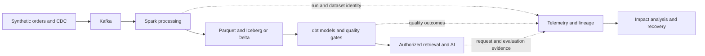

# 데이터·관측성 엔지니어링: 이벤트에서 신뢰할 수 있는 AI까지

어제 매출 보고서가 틀렸다고 생각해 보자. 원본 데이터는 어디에 있고, 어느 단계에서 잘못됐으며, 어떻게 고칠 수 있을까?

이 과정에서는 그 질문에 답할 수 있는 시스템을 만든다. 주문과 보고서에서 시작해 분산 처리, 모니터링, 접근 제어, AI 도우미를 차례로 붙인다.

## 처음 보는 사람을 위한 출발점

주문 대시보드가 오류 없이 열려도 어제 매출만 보여 준다면 오늘 보고서로는 쓸 수 없다. API가 응답하는지와 필요한 데이터가 준비됐는지는 따로 확인해야 한다. 같은 테이블을 읽는 AI 도우미도 오래된 자료로 답할 수 있다. 그래서 이 과정에서는 주문이 들어온 뒤 보고서와 AI 답변에 반영될 때까지의 흐름을 따라간다.

| 처음 만나는 말 | 학습용 쉬운 뜻 | 왜 필요한가요 · 언제 쓰나요 |
|---|---|---|
| 데이터 제품(data product) | 누가 사용할지, 무엇을 뜻하는지, 누가 책임지고 언제 제공할지를 정한 데이터셋이다. | 사용할 팀들이 같은 뜻과 제공 기한을 기준으로 데이터를 쓰게 한다. **구체적인 상황(가상 예시):** 재무와 운영이 일일 주문 데이터셋을 다르게 해석한다. → 소비자·의미·소유자·전달 약속을 정의한다. → 두 팀이 같은 계약을 사용하는지 확인한다. |
| 파이프라인(pipeline) | 데이터를 모으고, 바꾸고, 검사한 뒤 사용자가 쓸 수 있게 하는 작업 순서다. | 어느 단계까지 끝났고 어디서 결과가 빠졌는지 찾기 쉽게 한다. **구체적인 상황(가상 예시):** 행은 수집됐지만 일일 보고서가 공개되지 않는다. → 검증·공개까지 파이프라인을 추적한다. → 마지막 완료 단계와 누락 출력을 찾는다. |
| 관측성(observability) | 지표·로그·트레이스 같은 단서로 시스템 안에서 무슨 일이 일어났는지 설명할 수 있는 능력이다. | 실행 결과가 달라지거나 장애가 났을 때 기록을 연결해 이유를 찾는다. **구체적인 상황(가상 예시):** 작업 종료 코드만으로 데이터 오류를 설명할 수 없다. → 실행 지표·로그·데이터 검사를 연결한다. → 서로 맞는 근거로 원인을 설명한다. |
| 데이터 신뢰성(data reliability) | 약속한 정확성·누락 허용 범위·기한·복구 조건을 지키며 데이터를 제공하는 것이다. | 제때 도착했는지뿐 아니라 사용자가 필요한 내용을 제대로 받았는지 확인한다. **구체적인 상황(가상 예시):** 데이터셋은 제때 왔지만 유효한 원본 기록이 빠졌다. → 전달 시점뿐 아니라 완전성도 검사한다. → 소비자 계약을 못 지키면 공개를 거부한다. |
| 계보(lineage) | 어떤 실행이 어느 입력을 읽고 어떤 출력을 만들었는지 남긴 기록이다. | 원본이 바뀌거나 작업이 실패했을 때 다시 확인할 보고서와 담당자를 찾는다. **구체적인 상황(가상 예시):** 원본 필드 변경이 여러 보고서에 영향을 줄 수 있다. → 기록된 입력·출력 계보를 따라간다. → 검토·재생성이 필요한 하위 버전을 확인한다. |
| SLI / SLO | SLI는 제시간 전달률처럼 결과를 측정한 값이다. SLO는 그 측정값이 달성해야 할 목표다. | 사용자에게 한 약속을 실제 측정값과 목표로 비교할 수 있게 한다. **구체적인 상황(가상 예시):** 소비자는 매일 정해진 시각까지 데이터셋을 기대한다. → 결과 SLI와 SLO를 정의한다. → 전달 성공 계산에 실행 누락도 포함한다. |

셸 명령 실행, 작은 Python 프로그램 읽기, 기본 SQL 작성 능력이 필요하다. 처음이라면 첫 달을 기초 장에 쓴다. Kafka 경험은 도움이 되지만 특정 회사, 직책, 운영 경험을 전제하지 않는다.

## 앞으로 발전시킬 시스템

화살표는 미리 설치된 연동이 아니라 교육 과정의 설계다. 각 연결에는 호환되는 커넥터, 식별자 대응, 실패 시험이 필요하다.

## 학습 순서

| 단계 | 장 | 관찰 가능한 결과 |
|---|---|---|
| 1 | [스택 선택](../../../docs/guides/data-observability/01-stack-and-architecture.md) | 각 구성 요소의 필요성과 미룬 대안을 설명한다. |
| 2 | [SQL·Python·실행](../../../docs/guides/data-observability/02-sql-python-foundations.md) | 중복·NULL·조인 상황에서도 올바른 합계를 계산한다. |
| 3 | [Parquet와 오브젝트 스토리지](../../../docs/guides/data-observability/03-parquet-object-storage.md) | 읽은 바이트, 파일 배치, 읽기 제외(pruning)를 설명한다. |
| 4 | [Iceberg와 Delta](../../../docs/guides/data-observability/04-table-formats.md) | 커밋한 테이블 버전을 파일과 복구 경계까지 추적한다. |
| 5 | [Spark 내부 동작](../../../docs/guides/data-observability/05-spark-performance.md) | 실행 계획과 태스크 분포로 느린 단계를 진단한다. |
| 6 | [Kafka·CDC·스트리밍](../../../docs/guides/data-observability/06-kafka-cdc-streaming.md) | 이중 집계하거나 늦은 이벤트를 숨기지 않고 재생을 복구한다. |
| 7 | [모델링·dbt·오케스트레이션](../../../docs/guides/data-observability/07-modeling-orchestration.md) | 한 구간을 재처리하고 공개된 데이터 마트를 대조한다. |
| 8 | [품질·계약·데이터 SLO](../../../docs/guides/data-observability/08-quality-contracts-slos.md) | 잘못된 공개를 차단하고 관측 누락을 탐지한다. |
| 9 | [OpenTelemetry](../../../docs/guides/data-observability/09-opentelemetry.md) | 파이프라인 실행을 트레이스·로그·차원이 제한된 지표로 연결한다. |
| 10 | [Prometheus·Grafana·텔레메트리 운영](../../../docs/guides/data-observability/10-metrics-logs-traces.md) | 데이터셋 이상과 텔레메트리 장애를 따로 조사한다. |
| 11 | [계보·카탈로그·거버넌스](../../../docs/guides/data-observability/11-lineage-governance.md) | 영향받는 사용자를 찾고 실행 시 접근 권한을 강제한다. |
| 12 | [Databricks와 Snowflake](../../../docs/guides/data-observability/12-cloud-platforms.md) | 같은 계약을 다시 구현하고 측정한 동작을 비교한다. |
| 13 | [AI용 데이터와 평가](../../../docs/guides/data-observability/13-ai-ready-data-evaluation.md) | 답을 권한이 있는 출처 버전까지 추적하고 평가한다. |
| 14 | [플랫폼 운영](../../../docs/guides/data-observability/14-platform-operations.md) | 복원·릴리스 롤백·비용 귀속을 시연한다. |
| 15 | [종합 프로젝트와 장애 훈련](../../../docs/guides/data-observability/15-capstone.md) | 복구 근거를 갖춘 재현 가능한 포트폴리오를 만든다. |
| 참고 | [출처 검토와 범위](../../../docs/guides/data-observability/16-source-review.md) | 공유 대화와 기술적 근거를 구분한다. |

## 각 스택 안의 동작 원리를 학습하기

아래 표는 각 장에서 더 깊이 다룰 내용을 모은 것이다. 처음부터 모든 용어를 알 필요는 없다. 각 절에서 동작 원리를 읽고, 예제를 직접 계산하거나 실행한 뒤, 어떤 경우에 결과가 틀릴 수 있는지 설명해 본다. 출처 검토 장에서는 이 세부 주제들이 어느 자료와 연결되는지 확인할 수 있다.

| 학습 단위 | 세부 내용 |
|---|---|
| [SQL과 Python](../../../docs/guides/data-observability/02-sql-python-foundations.md) | 조인 행 증폭, 윈도 프레임, 재귀 CTE, 그룹 집합, 실행 계획·격리 수준, 검증·제너레이터·비동기·프로세스·메모리·테스트 |
| [파일 배치](../../../docs/guides/data-observability/03-parquet-object-storage.md) | 행 그룹·청크·페이지, 인코딩과 압축, 읽기 제외 계층, 정렬·교차 배치 실험, 파티션·파일 경계 |
| [테이블 프로토콜](../../../docs/guides/data-observability/04-table-formats.md) | Iceberg 메타데이터 추적, Delta 로그·버전 읽기, 낙관적 충돌, 진화, 삭제, 압축 병합·보존 |
| [Spark 실행](../../../docs/guides/data-observability/05-spark-performance.md) | Catalyst·Tungsten, driver·job·stage·task, shuffle·파티션 제어, 세 가지 조인, 메모리·spill·skew, AQE·UI 진단 |
| [스트리밍 시스템](../../../docs/guides/data-observability/06-kafka-cdc-streaming.md) | 복제본·ISR·acks, 멱등성·트랜잭션, 할당·재균형·오프셋, CDC, 출력 모드, 워터마크·상태, Flink·역압 |
| [모델과 스케줄링](../../../docs/guides/data-observability/07-modeling-orchestration.md) | 사실·차원 테이블의 행 단위, Type 1/2 이력, ref·source·매크로, 증분 교체, 스냅샷·테스트·계약, Airflow·Dagster·과거 구간 재처리 |
| [데이터 신뢰성](../../../docs/guides/data-observability/08-quality-contracts-slos.md) | 여섯 품질 차원, 측정 가능한 분모, 공개 상태 머신, 검사 도구, SLO 소진·근거 누락 |
| [OpenTelemetry](../../../docs/guides/data-observability/09-opentelemetry.md) | 리소스·스코프·span, 컨텍스트·baggage·link, 실제 SDK 전파, 지표 계측기·시간 집계 방식, head/tail 샘플링·Collector 큐 |
| [텔레메트리 백엔드](../../../docs/guides/data-observability/10-metrics-logs-traces.md) | 카운터 초기화, rate·increase, 히스토그램 계산, 카디널리티, LogQL, 트레이스 검색, Grafana 연계·알림 수명 주기 |
| [거버넌스](../../../docs/guides/data-observability/11-lineage-governance.md) | 데이터셋·작업·실행·facet, 열 계보, 순환에 안전한 영향 추적, RBAC·ABAC, 행·열 정책 강제, 분류·감사 |
| [Databricks와 Snowflake](../../../docs/guides/data-observability/12-cloud-platforms.md) | 실행 환경을 명시한 파이프라인 예제, expectations, Auto Loader, Jobs·MLflow, Streams·MERGE, Tasks, 동적 갱신, Snowpark, DMF·Horizon·Cortex |
| [AI 데이터와 평가](../../../docs/guides/data-observability/13-ai-ready-data-evaluation.md) | 코사인·ANN, 하이브리드 결합·재순위화, 청크·인덱스 버전, 의미 계층·온톨로지·그래프, MCP·도구·에이전트, 계층별 평가 |
| [플랫폼 전달](../../../docs/guides/data-observability/14-platform-operations.md) | 런타임·신원 경계, 릴리스 묶음, 용량·재생 계산, 복구, 단위 경제성, 데이터셋 등록 |

바로 로컬에서 학습하려면 SQL·모델링·품질·지표·계보·검색 장의 표시된 Python 예제를 실행한다. 가상 입력과 정확한 예상 출력을 사용한다. 로컬 의존성을 사용할 수 있으면 DuckDB/dbt와 메모리 내 OTel SDK 실습도 추가한다. Spark, 테이블 엔진, 관리형 플랫폼 실습에는 별도 사전 조건과 예상 결과를 명시한다. 사용자 인프라에서 실행됐다고 가정하지 않는다.

## 12개월 실행 계획

주당 약 8~10시간 집중 학습을 가정한 계획 예시이며 전문성을 보장하지 않는다. 입증한 결과에 따라 진도를 정한다. Kafka나 관측성 경험이 있으면 장별 실습부터 시도하고 절약한 시간을 Spark 내부 동작과 데이터 정확성에 쓴다.

| 월 | 주요 초점 | 완료 산출물 |
|---|---|---|
| 1 | SQL·Python·Linux·Git, 작은 스크립트 계측 | 정확성 예제와 재현 가능한 실행 매니페스트 |
| 2 | Parquet·오브젝트 스토리지·테이블 형식 하나 | 파일 배치 벤치마크와 스냅샷 복구 기록 |
| 3–4 | Spark SQL·shuffle·skew·상태·장애 진단 | 변경 전후 계획과 측정으로 설명한 성능 |
| 5 | Kafka·CDC·이벤트 시간·재생 | 커밋 출력값 대조를 포함한 실패 행렬 |
| 6 | dbt·오케스트레이션·데이터 계약 | 명시적 품질 검사를 통과해야 공개되는 마트 |
| 7–8 | OTel·Prometheus·Grafana·트레이스·로그 | 종단 간 사고 및 텔레메트리 유실 훈련 |
| 9 | OpenLineage·카탈로그·접근 정책 | 영향 그래프, 담당자 대응, 허용·거부 검사 |
| 10–11 | Databricks 구현과 운영 | 동등한 출력·권한·복구·비용 보고서 |
| 12 | AI 데이터 전달과 평가 | 버전이 있는 검색 자료 집합과 평가된 답변 트레이스 |
| 후속 | Snowflake 비교, 필요 시 Flink·Trino | 같은 워크로드에 대한 아키텍처 비교 |

첫 달부터 스크립트의 실행 시간과 결과를 기록하고, 학습 7~8개월 차에 관측 도구를 깊이 배운다. 앞선 실험에서 기록을 남기지 않으면 나중에 무엇이 빨라졌고 무엇이 달라졌는지 비교하기 어렵다.

매주 원리 하나를 읽고 설명하고, 기능 한 부분을 구현하고, 실패 하나를 주입한 뒤 근거가 입증하는 내용을 기록한다. 마지막 학습 시간은 정리와 이전 가정 재검토에 남겨 둔다.

## 완료

주문 하나를 골라 어디에서 읽었고, 어떤 테이블 버전과 보고서에 반영됐으며, AI가 어떤 자료를 참고했는지 설명할 수 있으면 된다. API가 응답하더라도 데이터가 틀리거나 오래됐을 수 있음을 구분해야 한다. 같은 이벤트를 다시 처리해도 합계가 달라지지 않는지 확인하고, 오류가 나면 영향받는 담당자를 찾아 검증한 절차로 복구한다. 포트폴리오에는 화면과 함께 실제 측정값, 아직 확인하지 못한 부분을 남긴다.

## 처음 이해했는지 확인

1. API가 정상이고 소비자 지연이 0이어도 데이터는 틀릴 수 있는가? 변환·공개·소스 누락 사례를 설명해 보자.
2. trace ID로 재현 가능한 테이블 버전을 식별할 수 없는 이유는 무엇인가? 트레이스는 실행을 식별하며, 입력 스냅샷과 처리 리비전은 읽은 것과 수행한 일을 식별한다.
3. 다른 클라우드를 비교하기 전에 하나를 깊이 배우는 이유는 무엇인가? 비교가 의미 있으려면 구체적인 워크로드와 실패 계약이 필요하다.

## 운영 판단으로 확장하기

구성 요소를 추가할 때마다 해결하는 문제, 새로 생기는 실패, 담당자, 채택 전에 필요한 근거를 말해 본다. 전문성이란 제약 안에서 결정을 내리고 그 근거를 설명하는 능력이며 읽기 목록 완주는 준비일 뿐이다.

사전 학습은 기존 [PostgreSQL 로드맵](../../content/postgresql/00-roadmap.md), [관측성과 SRE 로드맵](../../content/observability-sre/00-roadmap.md), [AI 플랫폼 수명 주기](../../content/ai-transformation-platform/02-mlops-llmops-lifecycle.md)를 참고한다.

<!-- source: https://chatgpt.com/share/6aa266f6-db88-83ee-a8d7-3e7aa8e0821d?ogimg=plain | checked: 2026-09-10 | curriculum input only; not independent factual evidence -->
