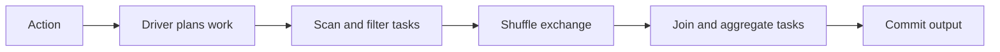

# Spark 내부 동작: 느린 작업의 원인 찾기

Spark 태스크 대부분은 1분 만에 끝나고 하나만 계속 실행된다고 하자. 왜 전체 작업도 함께 기다려야 할까?

DataFrame 변환이 스테이지와 태스크로 나뉘는 과정을 따라가 보자. 실행 기록으로 지연 원인을 찾고, 최적화 뒤에도 결과가 같은지 확인한다.

## 이 장에서 처음 쓰는 말

| 용어 | 의미 | 왜 필요한가요 · 언제 쓰나요 |
|---|---|---|
| 드라이버(driver) | Spark 애플리케이션을 조정하고 실행기들에게 작업을 맡기는 프로세스다. | 전체 작업을 조정하는 쪽의 문제와 실제 데이터를 처리하는 쪽의 문제를 구분한다. **구체적인 상황(가상 예시):** Spark 결과를 한곳에 모으다가 애플리케이션이 실패한다. → 드라이버 메모리를 확인하고 불필요한 데이터 수집을 줄인다. → 드라이버가 메모리 고갈 없이 작업을 조정하는지 확인한다. |
| 실행기(executor) | Spark 태스크를 실행하고 처리에 필요한 데이터를 보관하는 워커 프로세스다. | 태스크를 수행하는 워커의 CPU·메모리·디스크 중 무엇이 부족한지 찾는다. **구체적인 상황(가상 예시):** Spark의 일부 작업이 워커 프로세스에서 반복 실패한다. → 실행기의 로그·메모리·작업 분포를 살핀다. → 확인된 원인을 해결한 뒤 해당 파티션이 완료되는지 확인한다. |
| Job / stage / task | 액션이 잡을 시작한다. 잡은 스테이지로 나뉘고, 각 스테이지에서는 파티션별 태스크가 실행된다. | 전체 작업 중 어느 단계와 파티션이 느린지 찾아간다. **구체적인 상황(가상 예시):** Spark 액션이 느린데 전체가 아니라 일부 실행이 원인이다. → 잡을 스테이지와 개별 태스크로 나누어 추적한다. → 어느 스테이지와 태스크 분포가 지연을 만드는지 확인한다. |
| 셔플(shuffle) | 관련 데이터를 함께 처리하기 위해 레코드를 파티션 사이로 옮기는 것이다. 네트워크와 디스크 작업이 발생할 수 있다. | 같은 키의 데이터를 모아 조인·집계하고, 그때 발생하는 전송량을 확인한다. **구체적인 상황(가상 예시):** 큰 조인이 워커 사이에서 데이터를 옮기는 데 많은 시간을 쓴다. → 셔플 양과 파티셔닝 전략을 살핀다. → 근거 있는 변경 후 네트워크·스필 지표를 비교한다. |
| 쏠림(skew) | 데이터나 작업이 일부 파티션에 몰려 그 파티션들이 훨씬 오래 걸리는 현상이다. | 대부분 끝났는데 일부 태스크만 오래 걸리는 원인을 찾는다. **구체적인 상황(가상 예시):** 조인 태스크 대부분은 끝났는데 하나만 오래 실행된다. → 키 빈도와 파티션 크기로 쏠림을 찾는다. → 완화 후 가장 느린 태스크가 줄고 결과는 같은지 확인한다. |
| 디스크 넘김(spill) | 계산 중인 데이터를 실행 메모리에 모두 담을 수 없어 일부를 디스크에 쓰는 것이다. | 메모리 부족을 피하는 대신 늘어난 디스크 작업이 지연의 원인인지 확인한다. **구체적인 상황(가상 예시):** 집계가 실행 메모리를 넘어선다. → 디스크로 밀려난 바이트를 확인하고 작업이나 자원을 조정한다. → 메모리 실패 없이 디스크 부담이 줄었는지 확인한다. |
| AQE | 적응형 쿼리 실행이다. Spark가 실행 중 얻은 통계를 보고 지원되는 범위에서 처리 계획을 바꾼다. | 예상과 실제 데이터 크기가 다를 때 Spark가 실행 전략을 어떻게 바꾸는지 본다. **구체적인 상황(가상 예시):** 실행 전에 정한 Spark 계획이 실제 데이터 크기와 맞지 않는다. → 실행 통계에 따른 적응형 쿼리 실행 결정을 살핀다. → 최종 계획과 태스크 지표를 초기 계획과 비교한다. |

## 먼저 이해하기

1. DataFrame 연산은 계획을 구성하며 모두 즉시 실행되는 것은 아니다.
2. 액션이 결과를 요청하면 Spark가 필요한 작업을 계획한다.
3. 드라이버가 실행기에 태스크를 배정하며 재분배가 필요한 작업은 exchange로 나뉜다.
4. 태스크가 읽기·필터·조인·집계를 수행하고 필요하면 spill·shuffle한다.
5. 실행기 대부분이 쉬어 보여도 관련 태스크 중 가장 긴 작업이 완료를 늦춘다.

Catalyst는 Spark SQL의 분석·최적화 프레임워크다. 논리 계획은 요청한 변환을, 물리 계획은 실행 전략을 설명한다. 역사적인 Tungsten 이름으로 불리는 코드 생성·실행 메모리 기법은 그 계획 아래에 있다. 내부 이름을 외우기 전에 연산자와 측정값을 읽는다.



## DataFrame에서 실행까지: Catalyst와 물리 계획

DataFrame 변환은 작업 설명을 만든다. `filter`, `select`, `join`은 일반적으로 전체 입력을 즉시 스캔하지 않는다. `count`, `collect`, 쓰기 같은 액션이 실행을 요청한다. 이 지연 경계 덕분에 Spark는 연결된 연산을 함께 최적화해, 미사용 열을 읽고 버리는 대신 스캔 전에 없앨 수 있다.

Catalyst는 작성한 SQL을 실제 실행 단계로 바꾸는 분석·최적화 프레임워크다. 먼저 열 이름과 자료형을 확인한다. 다음으로 같은 결과를 더 적은 작업으로 만들 수 있도록 연산 순서를 바꾸고, 마지막으로 실제 조인·집계 알고리즘을 고른다. 이때 사용할 수 있는 통계가 선택에 영향을 준다. `explain('extended')`로 논리 계획과 물리 계획을 보고, `explain('formatted')`로 실제 연산자를 살펴본다. 같은 코드라도 데이터 통계, 설정, 런타임이 바뀌면 계획이 달라질 수 있다.

이벤트를 하루로 필터링하고 고객·금액을 선택해 작은 고객 차원과 조인한 뒤 지역별로 합산한다고 하자. 유용한 계획은 날짜 조건과 열 선택을 소스 가까이 내린다. 차원을 broadcast할 수 있으면 각 실행기가 로컬 조인할 수 있다. 최종 그룹화에는 여전히 지역별 exchange가 필요할 수 있다. 따라서 broadcast join이 쿼리 전체에 shuffle이 없다는 뜻은 아니다.

### Tungsten·코드 생성·Python 경계

Tungsten은 메모리 표현과 생성 코드에 관한 Spark 실행 효율화 작업을 가리킨다. 호환되는 물리 계획에서 whole-stage 코드 생성은 연산자를 생성 코드로 합쳐 행별 호출과 중간 오브젝트 비용을 줄인다. 코드 생성 단계 표시나 `explain('codegen')`을 확인한다. 애플리케이션 전체가 자동으로 하나의 생성 함수가 되는 것은 아니다.

내장 SQL 식은 옵티마이저에 의미를 드러낸다. Python UDF는 데이터·함수 실행이 JVM과 Python 런타임 사이를 이동해야 할 수 있는 경계를 만든다. Arrow는 지원되는 열 기반 전송을 개선하지만 임의 Python 로직을 Catalyst에 드러내거나 모든 변환을 없애지는 않는다. 같은 의미를 표현할 수 있으면 내장 식을 우선하고 불가피한 UDF는 실제 타입·배치 크기로 측정한다.

## 드라이버·실행기·job·stage·task

드라이버는 전체 애플리케이션의 작업을 계획하고 조정한다. 실행기(executor)는 배정받은 태스크를 실행하고 캐시와 셔플 데이터를 보관한다. 결과를 요구하는 액션이 잡(job)을 시작하며, 복잡한 쿼리는 보조 작업 때문에 잡을 여러 개 만들 수도 있다. 잡은 데이터를 재분배하는 셔플을 기준으로 스테이지(stage)로 나뉜다. 각 스테이지에서 한 파티션을 처리하는 단위가 태스크(task)다. 태스크는 작업 단위이므로 워커나 CPU 하나와 같은 뜻이 아니다.

stage에 태스크 200개와 사용 가능한 슬롯 20개가 있으면 실행 시간이 비슷할 때 대략 열 차례로 처리한다. 대부분 2초인데 한 파티션이 97초라면 마지막 느린 태스크가 완료 시점을 결정할 수 있다. 슬롯 추가는 대기 작업에 도움이 되지만 그 파티션 하나를 자동으로 나누지는 못한다. 태스크 재시도는 같은 논리 작업의 추가 시도이므로 시도 수와 파티션 수는 다를 수 있다.

드라이버의 메모리도 한정돼 있다. `collect()`는 분산된 결과 전체를 드라이버로 가져오고, `toPandas()`는 이를 로컬 pandas 데이터로 변환한다. 아래 예제는 집계가 끝난 1,000행만 가져온다. 큰 결과는 분산 저장소에 남기고 확인할 때는 작은 표본을 사용한다. 원본 전체를 가져와 드라이버에 메모리 부족 오류(OOM)가 났다면 실행기 메모리를 늘려도 해결되지 않는다.

## 셔플과 파티션 제어

shuffle은 같은 조인·집계 키가 호환되는 하위 파티션에 도달하게 레코드를 재분배한다. 직렬화, 네트워크, 로컬 파일, 이후 읽기가 필요할 수 있다. 좁은 map/filter는 기존 파티션 안에서 작동한다. 키 재분배 같은 넓은 연산에서는 상위 파티션이 여러 하위 파티션에 데이터를 보낸다.

`repartition(n, key)`는 키로 의도적인 재분배를 하고 `repartition(n)`은 그 키 계약 없이 분포를 바꾼다. `coalesce(n)`은 흔히 전체 재셔플 없이 파티션 수를 줄여 불균형을 남기거나 작업을 집중시킬 수 있다. 매번 쓰기 직전에 파일 하나로 repartition하면 파이프라인 끝을 직렬화한다. 스캔 파티션·shuffle 파티션·출력 파일은 구분해야 하며 하나의 수를 설정해도 셋 모두 고정되지 않는다.

일부 집계는 각 파티션에서 먼저 부분합을 구한 뒤 그 결과만 셔플한다. 예를 들어 같은 키의 행이 100만 개라도 워커마다 부분합 하나로 줄여 보낼 수 있다. 반면 양쪽에 같은 키가 여러 번 나오는 조인은 합계를 구하기 전에 행 수부터 크게 늘어난다. 따라서 데이터가 한 키에 몰렸다는 사실만 보지 말고, 집계인지 조인인지와 키별 대응 행 수를 함께 확인한다.

### 조인 알고리즘과 비용

| 알고리즘 | 레코드가 만나는 방식 | 적합한 후보 | 확인할 실패 |
|---|---|---|---|
| Broadcast hash join | 작은 쪽 데이터로 해시 테이블을 만들어 실행기마다 보내고, 각 실행기가 큰 쪽 행과 비교한다. | 필터링한 작은 테이블이 메모리에 들어갈 때 | 파일 크기보다 큰 실제 메모리 사용량, 전송 시간 초과·메모리 부족 |
| Sort-merge join | 같은 키가 같은 파티션에 오도록 양쪽을 재분배하고 정렬한 뒤, 일치하는 키의 행을 연결한다. | 양쪽 입력이 크고 파티션별 작업량을 감당할 수 있을 때 | 정렬·디스크 쓰기 비용, 특정 키에 몰린 큰 파티션 |
| Shuffled hash join | 키로 재분배한 뒤 파티션마다 한쪽의 해시 테이블을 만들고 다른 쪽과 비교한다. | 각 파티션에서 해시 테이블을 만들 쪽이 메모리에 들어갈 때 | 일부 큰 파티션의 해시 테이블이 메모리를 넘는 경우 |

조인 유형과 식 지원이 알고리즘 선택을 제한한다. 힌트는 그 제약 안의 선호다. broadcast 힌트가 임의 비동등 조건을 해시 동등 조인으로 바꾸지는 못한다. 특히 AQE 사용 시 실행 후 최종 계획을 검증한다.

## 메모리·spill·skew 진단

실행기 힙은 Spark 메모리 관리 아래 실행 상태와 캐시 저장을 지원한다. 주변 프로세스·컨테이너에는 힙 외 JVM 작업, 네이티브 할당, Python 워커 공간도 필요하다. 컨테이너 메모리 제한과 실행기 힙은 같은 값이 아니다. 힙 크기 변경 전에 구체적인 실행기 종료 사유를 확인한다.

spill은 작업 메모리가 부족하면 중간 데이터를 디스크로 옮긴다. 일부 spill은 통제된 절충이지만 과도한 spill과 느린 디스크가 stage를 지배할 수 있다. 태스크별 최대 입력·shuffle 크기, spill 바이트, GC 시간, 호스트 위치를 비교한다. 모든 태스크가 크면 중간 데이터 폭을 줄이거나 파티션 크기를 바꾼다. 키 하나가 지배하면 일반 파티션을 나눠도 그 키는 함께 남을 수 있다.

Salting은 데이터가 몰린 키에 보조 값을 붙여 여러 작업으로 나누는 방법이다. 집계라면 나눠 계산한 부분합을 다시 합칠 수 있다. 조인에서는 양쪽 행이 계속 만나야 하므로 한쪽에 보조 값을 붙일 때 반대쪽도 그 규칙에 맞춰 복제하거나 변환해야 한다. 양쪽에 제각각 무작위 값을 붙이면 조인할 행을 놓친다. 또한 부분 중앙값의 평균은 전체 중앙값이 아니므로 모든 집계에 적용할 수는 없다. 먼저 데이터 모델을 고치거나 미리 집계해 해결할 수 있는지 본다.

## AQE: 런타임 통계로 결정 수정하기

AQE는 관측된 exchange 통계로 계획의 지원되는 부분을 수정한다. Spark 4.0.1 문서는 작은 shuffle 후 파티션 합치기, 일부 조인 변환, 대상이 되는 쏠린 sort-merge 조인 파티션 나누기를 설명한다. 작은 로컬 예제는 skew 임계값을 만족하지 않을 수 있고 초기·최종 계획도 다를 수 있다.

해석 가능한 실험을 위해 적응 실행과 자동 broadcast를 먼저 끄고 sort-merge 계획을 기록한 뒤 AQE를 복원해 같은 입력으로 반복한다. 시간뿐 아니라 최종 계획과 출력을 비교한다. 두 번째 실행이 파일 캐시나 JVM 준비 효과를 받았다는 이유만으로 AQE가 skew를 해결했다고 말하지 않는다.

다음 세션 설정은 통제된 Spark 4.0.1 비교를 위한 것이다. 바꾸기 전에 원래 값을 저장하고 끝나면 복원한다. 임시 세션에서 실험한다.

```python
# Use inside the active Spark session, before constructing the comparison query.
settings = {
    'spark.sql.adaptive.enabled': 'false',
    'spark.sql.autoBroadcastJoinThreshold': '-1',
    'spark.sql.shuffle.partitions': '8',
}
previous = {key: spark.conf.get(key) for key in settings}
try:
    for key, value in settings.items():
        spark.conf.set(key, value)
    compared = events.join(customers, 'customer_id').groupBy('customer_id').count()
    compared.explain('formatted')
    assert sum(row['count'] for row in compared.collect()) == 1_000_000
finally:
    for key, value in previous.items():
        spark.conf.set(key, value)
```

아래 전체 설정을 대화형 세션에서 먼저 실행하되 `spark.stop()` 전에 멈춰 이 비교를 넣는다. 해당 세션이 필요한 선택 실험이며 독립 예제가 아니다. 기대 근거는 비broadcast 조인과 합계 1,000,000이고 계획 세부는 선택 런타임에 달려 있다. 처리량 결론은 더 큰 통제 워크로드로 확인한다.

## 반복 가능한 성능 실험

사전 조건은 호환되는 로컬 PySpark·Java와 가상 100만 행을 처리할 충분한 메모리다. 클라우드 리소스는 만들지 않는다. `spark.version`, 런타임 버전, 관련 SQL 설정, 물리 계획을 기록한다.

```python
from pyspark.sql import SparkSession, functions as F

spark = SparkSession.builder.master("local[2]").appName("skew-lab").getOrCreate()
events = spark.range(1_000_000).withColumn(
    "customer_id",
    F.when(F.col("id") < 900_000, F.lit(0)).otherwise(F.col("id") % 1000)
)
customers = spark.range(1000).withColumnRenamed("id", "customer_id")
query = events.join(customers, "customer_id").groupBy("customer_id").count()
query.explain("formatted")
rows = query.collect()  # Only the 1,000 aggregated result rows.
assert sum(row["count"] for row in rows) == 1_000_000
spark.stop()
```

애플리케이션 실행 중 SQL·stage 화면을 확인한다. 짧은 작업이면 사전에 이벤트 로깅과 이력 서버를 구성하거나 Spark 종료 전에 대화형 세션을 멈춘다. 차원이 작아 로컬 테스트가 broadcast 조인을 택할 수 있다. 계획이 broadcast이면 shuffle 조인을 진단했다고 말하지 않는다.

비교를 통제하려면 더 큰 차원을 쓰거나 세션의 자동 broadcast 임계값을 바꾸고 결과 계획을 확인한다. 이후 설정을 복원한다. shuffle 읽기·쓰기 바이트, spill, 태스크 시간 백분위, GC, 출력값의 일치 여부를 비교하며 한 번에 요인 하나만 바꾼다.

## 해결책을 고르기 전에 증상 읽기

| 근거 | 설명 후보 | 다음 확인 |
|---|---|---|
| 일부 태스크가 훨씬 많은 입력을 읽음 | 키·파일 쏠림 | 파티션·키 분포와 스캔 크기 |
| 많은 태스크에 큰 spill | 큰 중간 상태 또는 메모리 부족 | 조인 카디널리티, 열 선택, 파티션 크기 |
| 작은 태스크가 대부분 | 과도한 파티션·작은 파일 | 스케줄링 시간과 실행 시간 비교 |
| 실행기 유실과 태스크 반복 | 프로세스·노드·메모리 실패 | 실행기 로그와 인프라 이벤트 |
| 스캔은 길고 CPU는 적음 | 저장소·네트워크 제한 | 바이트, 요청 지연, 파일 배치, 동시 부하 |

AQE는 관측 통계로 shuffle 파티션을 합치고 지원 조인을 바꿀 수 있다. 모든 데이터가 많이 몰린 키를 없애거나 다대다 조인을 고치거나 과도한 드라이버 수집을 안전하게 만들지는 않는다. broadcast 힌트도 메모리가 충분하다는 약속은 아니다.

`repartition`은 shuffle로 재분배할 수 있다. `coalesce`로 수를 줄이면 해당 상황에서 전체 재분배를 피할 수 있지만 병렬성이 줄 수 있다. 계획과 측정으로 확인한다. 폭증하는 조인을 고치기 전에 실행기 메모리부터 늘리면 잘못된 작업이 더 오래 실행되다가 실패할 수 있다.

## 실행 결과 예시

아래 건수는 실행할 때마다 같아야 한다. 결과를 가져오는 순서와 물리 계획은 달라질 수 있다.

```text
aggregated_rows: 1000
sum_of_counts: 1000000
customer_0_count: 900100
each_other_customer_count: 100
```

데이터가 많이 몰린 키에는 명시적 900,000행과 나머지 모듈로 구간의 100행이 들어온다. 작은 차원은 broadcast되고 부분 집계가 shuffle을 줄일 수 있어 느린 skew 조인을 보장하는 예제가 아니다. 시간 변화를 AQE 때문이라고 하기 전에 계획을 본다. 건수가 달라지면 비교 실패다.

## 인과관계를 조사하듯 Spark UI 읽기

SQL 실행에서 시작해 exchange 노드를 stage에 대응시킨다. 느린 stage의 태스크를 시간순으로 정렬하고 최장 태스크와 중앙값을 비교한다. 훨씬 큰 shuffle 입력이면 크기·쏠림 가설, 비슷한 입력에 높은 GC 시간이면 할당·힙 가설, 디스크 오류가 있는 실행기 하나에 느린 태스크가 몰리면 호스트·저장소 가설을 지지한다. 이는 원인을 구분할 검사이며 백분위 하나로 내리는 결론이 아니다.

간결한 실험 기록을 남긴다. 다음 숫자는 해석을 위한 가상 값이며 벤치마크가 아니다.

```text
run A: rows=1000000 sum_counts=1000000
       p50 task=2s p99 task=97s max_shuffle_input=4GB
run B: rows=1000000 sum_counts=1000000
       p50 task=3s p99 task=12s max_shuffle_input=500MB
changed: controlled repartition/skew treatment only
still needed: total runtime, executor-seconds, spill, repeated comparable runs
```

낮은 p99와 더 많은 총 계산량 또는 더 느린 전체 애플리케이션은 함께 나타날 수 있다. 시작·스캔·exchange·계산·커밋 시간을 비교한다. 반복 사용되는 비싼 결과 중 저장 비용이 맞는 것만 캐시한다. Spark 캐시와 OS·오브젝트 스토어 캐시는 다른 계층이다. 재사용이 끝나면 의도적으로 unpersist한다. 작은 파일 병합은 이 조사의 저장 단계이며 이유 없는 실행기 메모리 변경이 아니다.

## 스스로 설명해 보기

태스크 p50이 2초이고 p99가 90초라면 어떤 근거로 쏠림, GC, 느린 호스트를 구분할까? 시간 히스토그램만으로는 원인을 알 수 없다. 입력량, spill, GC 시간, 실행기 위치의 비교 방법을 설명하고 전후 결과 검사·비용 측정을 계획 옆에 보관한다.

다음은 [스트리밍](../../../docs/guides/data-observability/06-kafka-cdc-streaming.md)으로 이어간다.

<!-- source: https://spark.apache.org/docs/latest/cluster-overview.html | checked: 2026-09-10 | driver, executors, tasks -->
<!-- source: https://spark.apache.org/docs/latest/sql-performance-tuning.html | checked: 2026-09-10 | plans, join tuning, partitioning and AQE; latest resolved to 4.2.0 at review -->
<!-- source: https://spark.apache.org/docs/4.0.1/sql-performance-tuning.html | checked: 2026-09-10 | fixed-version AQE and comparison settings -->
<!-- source: https://spark.apache.org/docs/4.0.1/tuning.html | checked: 2026-09-10 | memory, serialization and allocation -->
<!-- source: https://spark.apache.org/docs/4.0.1/web-ui.html | checked: 2026-09-10 | SQL/stage/task diagnostic views -->
<!-- source: https://spark.apache.org/docs/4.0.1/sql-ref-syntax-qry-explain.html | checked: 2026-09-10 | extended, formatted and codegen plans -->
<!-- source: https://www.databricks.com/blog/2015/04/13/deep-dive-into-spark-sqls-catalyst-optimizer.html | checked: 2026-09-11 | historical optimizer design; runtime behavior scoped by Spark 4.0.1 docs -->
<!-- source: https://www.databricks.com/blog/2015/04/28/project-tungsten-bringing-spark-closer-to-bare-metal.html | checked: 2026-09-11 | historical Tungsten design, not current performance numbers -->
