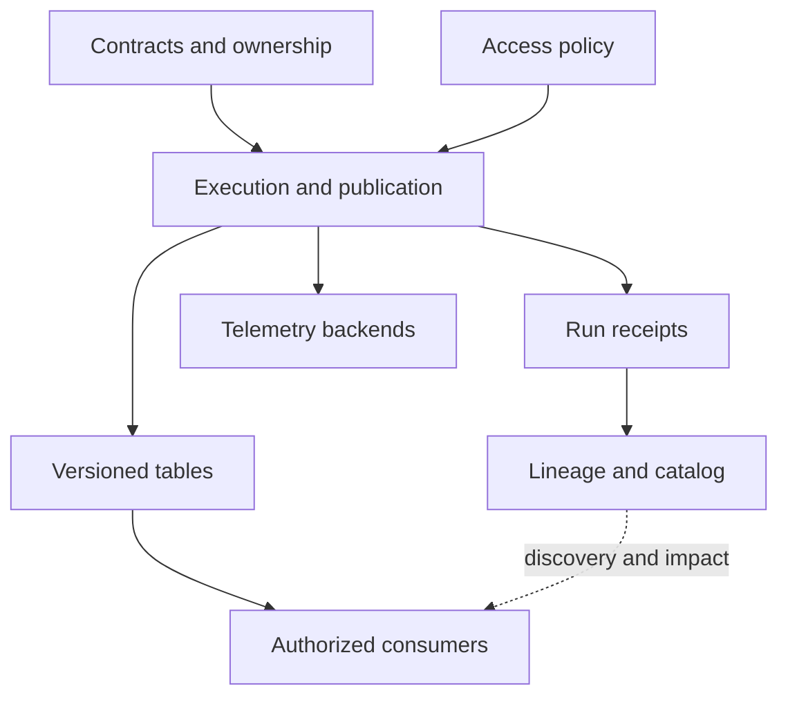

# 책임을 기준으로 기술 스택 선택하기

유용한 플랫폼은 사용자와의 약속에서 출발한다. 예를 들어 검증된 주문이 10분 안에 분석 테이블에 도달하고 모든 결과가 재현 가능해야 한다는 약속이다. 그 약속과 측정한 워크로드에 맞춰 구성 요소를 선택한다.

## 이 장에서 처음 쓰는 말

| 용어 | 의미 | 왜 필요한가요 · 언제 쓰나요 |
|---|---|---|
| 저장 형식(storage format) | Parquet처럼 파일 내부의 바이트를 표현하는 방식 | 분석 접근·압축·상호운용 요구에 맞는 파일 표현을 선택한다. |
| 테이블 형식(table format) | 파일과 메타데이터가 커밋된 테이블 버전을 이루는 방식 | 읽기·쓰기가 동시에 일어날 때 어떤 파일들이 승인된 테이블 상태를 이루는지 정한다. |
| 계산 엔진(compute engine) | 쿼리나 변환을 실행하는 소프트웨어 | 필요한 변환을 실행하고 선택한 계획이 발생시키는 작업량을 측정한다. |
| 제어 평면(control plane) | 실행을 지시하는 정의·권한·스케줄·메타데이터 | 작업을 지시하는 정의·정책과 데이터를 실제 이동시키는 실행을 분리한다. |
| 데이터 평면(data plane) | 실제 데이터를 이동·변환하는 프로세스와 저장소 | 데이터가 실제 처리되는 곳의 처리량·장애·접근 경계를 찾는다. |

## 먼저 이해하기

1. 생산자가 안정적인 식별자와 스키마 버전을 갖춘 이벤트를 만든다.
2. 수집 계층은 재생에 필요한 정보를 보존한다.
3. 처리 계층은 검증된 출력을 만들고 테이블 버전을 커밋한다.
4. 공개 관문이 그 버전을 사용자에게 노출한다.
5. 텔레메트리와 계보는 일어난 일을 설명하지만 데이터의 정본이 되지는 않는다.

카탈로그는 어떤 테이블이 있고 어디서 찾는지 알려 준다. 오브젝트 스토리지는 파일을 보관한다. 엔진은 테이블 메타데이터를 읽어 쿼리할 파일을 선택한다. 대시보드는 백엔드의 관측값을 보여 주며 테이블을 복구하거나 계약을 강제하지 않는다.

## 기본 학습 스택과 의도적으로 미룬 대안

아래 선택은 학습을 위한 권장 구성이다. 순위나 모든 조합의 호환성을 주장하는 것이 아니다.

| 책임 | 시작 도구 | 문제가 요구할 때 추가·비교할 대상 |
|---|---|---|
| 로컬 정확성 | Python·SQLite, 분석 파일에는 DuckDB | 동시 트랜잭션과 CDC에는 PostgreSQL |
| 영속 파일 | Parquet와 로컬 디렉터리, 이후 S3 또는 동등한 오브젝트 스토리지 | 클라우드별 IAM·요청 비용·수명 주기·복구 동작 |
| 분석 테이블 | Iceberg **또는** Delta Lake | 커밋·유지 관리 절차를 구현한 뒤 두 번째 형식 비교 |
| 분산 처리 | Spark SQL / PySpark | 연속 이벤트 시간 처리와 상태를 명확한 목적으로 학습할 때 Flink |
| 전송 | Kafka | 데이터베이스 변경 수집에는 Debezium과 Kafka Connect |
| 스키마 호환성 | Avro·Protobuf·JSON Schema를 지원하는 스키마 레지스트리 | 생산자·소비자 버전 간 호환성과 의미 변경 시험 |
| 대화형 레이크 질의 | 로컬 DuckDB | 독립적인 분산 SQL 접근이 필요하면 Trino |
| 모델링 | 지원되는 어댑터 하나와 dbt | 여러 사용자가 같은 지표 정의를 필요로 하면 의미 계층 |
| 스케줄링 | Airflow **또는** Dagster | 시간 구간 워크플로와 자산 중심 정의 비교 |
| 품질 | SQL 단언문과 dbt 테스트 | 풍부한 검사·보고가 별도 서비스의 필요성을 정당화하면 Great Expectations·Soda |
| 계보와 탐색 | OpenLineage 이벤트와 작은 검색 가능 등록부 | 계보 백엔드로 Marquez, 더 넓은 카탈로그 평가에 DataHub·OpenMetadata |
| 계측 | OTel SDK와 Collector | 라우팅·격리·용량 요구 시 에이전트·게이트웨이 계층 |
| 텔레메트리 저장 | Prometheus·Loki·Tempo, 탐색에는 Grafana | 트레이스 대안 Jaeger, 지표 규모·보존에는 Mimir·Thanos, 프로파일에는 Pyroscope |
| 관리형 플랫폼 | 기초 학습 후 Databricks | 같은 계약의 두 번째 구현으로 Snowflake |
| AI 운영 | 권한을 확인한 검색과 MLflow 또는 Langfuse | 서로 다른 워크플로 책임이 명확할 때만 두 도구를 함께 사용 |
| 전달 | Git·CI·컨테이너 | 운영 요구가 커지면 Terraform·Kubernetes·워크로드 신원·정책·GitOps |

모든 대안을 함께 배포하지 않는다. 로컬 파일 파이프라인으로 시작해 현재 시스템이 충족하지 못하는 요구를 설명할 수 있을 때 서비스를 추가한다. Kafka·Spark·레이크하우스만으로도 상당한 복구·호환성 작업이 생긴다.

## 아키텍처 경계



같은 Kafka를 사용하더라도 업무 이벤트와 텔레메트리는 논리적으로 분리한다. 업무 이벤트 보존은 재생을 보호하고 텔레메트리 보존은 다른 양·개인정보 정책 아래 진단을 지원한다. 텔레메트리 과부하가 주문 처리 용량 전체를 조용히 소모해서는 안 된다.

## 검토 가능한 선택 기록

분산 계산을 추가하기 전에 일일 데이터량, 최대 유입률, 파일 수, 쿼리 패턴, 지연 목표, 허용 복구 시간, 장비 예산을 짧게 기록한다. 이전과 이후에 같은 정확성 예제를 실행한다. 노트북에서 분산 버전이 느리다는 것은 관찰 결과이며 대규모 처리에 부적합하다는 증거는 아니다.

엔진 버전, 커넥터 좌표, Java/Python 버전, 테이블 프로토콜·기능, OTel 배포판, SDK 버전, dbt 어댑터를 호환성 매니페스트에 기록한다. 시험한 조합을 프로젝트 잠금 파일에 고정한다. 각자 최신인 버전들을 모았다고 작동하는 조합이 되는 것은 아니다.

## 다섯 가지 식별자로 이벤트 하나 따라가기

이벤트 식별자, 소스 위치, 처리 실행, 테이블 스냅샷, trace ID는 서로 다른 질문에 답한다. 같은 것으로 취급하면 재생과 사고 분석이 모호해진다. 주문 프로젝트에서는 다음 연결을 명시할 수 있는 참조 정보를 전달한다.

| 참조 | 예시 | 답하는 질문 |
|---|---|---|
| 업무 식별자·버전 | `e1`, 소스 순번 `2` | 어떤 논리적 변경인가? |
| 전송 위치 | orders 토픽, 파티션 0, 오프셋 91 | 어디에서 수집을 재개·재생할 수 있는가? |
| 논리 구간·시도 | 9월 10일, 시도 run-8 | 어느 구간과 실행이 후보를 만들었는가? |
| 입력·출력 버전 | 소스 스냅샷 A, 승인 스냅샷 B | 정확히 어떤 상태를 읽고 공개했는가? |
| trace·span 컨텍스트 | trace T, consume span S | 이 실행에 어떤 작업이 참여했는가? |

생산자가 재생하면 동일한 e1이 서로 다른 두 오프셋에서 전달될 수 있다. 두 시도가 같은 논리 구간을 처리할 수도 있다. 스냅샷 하나가 여러 입력 파티션과 실행을 결합할 수 있으며 트레이스 하나가 전체 수명 주기를 담을 필요는 없다. 업무 대사는 이벤트·버전 식별자를 사용하고 복구에는 소스 위치와 커밋된 출력 참조도 필요하다.

## 두 가지 구체적 구현 비교

일일 100 MB 보고서는 예약된 Python/DuckDB 변환으로 버전 있는 입력을 읽고 후보 Parquet 파일을 쓴 뒤 건수·합계를 검증하고 매니페스트를 공개할 수 있다. 실패 경계는 후보에서 공개 상태로의 전이다. 오늘 후보가 실패하면 나이를 표시하면서 어제 승인된 매니페스트를 유지한다. 측정한 요구가 시작·운영 비용을 정당화하지 않으면 분산 클러스터의 가치는 작다.

이벤트가 계속 들어오면 Kafka가 보존 로그를 제공하고 Spark가 처리 진척과 상태를 제한된 범위에서 관리하며 Iceberg/Delta 출력이 커밋된 테이블의 가시성을 정의한다. 마트 빌더가 사용자용 정의를 공개하고 OTel/OpenLineage가 실행·파생 근거를 제공한다. 경계가 늘 때마다 브로커 승인, 소스 진척, 출력 커밋, 마트 승인, 관측 전달의 실패를 시험해야 한다.

Spark가 테이블 커밋 뒤 진척 기록 전에 죽으면 출력 대사가 재생을 감당해야 한다. dbt는 성공했지만 공개 관문이 실패하면 사용자가 미승인 후보를 실수로 읽어서는 안 된다. 텔레메트리 전송이 멈춰도 독립적인 공개 장부가 업무 결과를 확인할 수 있어야 하며 모니터링은 관측 범위 불완전을 보고해야 한다. 관리형 제품을 고르기 전에 시험할 수 있는 아키텍처 요구들이다.

## 실습과 해석

일일 100 MB 보고서와 신선도 목표 5분인 연속 스트림의 설계를 각각 그린다. 저장·처리·스케줄링·계약 검사·텔레메트리를 배정하고 두 번째 설계의 추가 프로세스마다 이유를 설명한다. 이후 하위 시스템이 한 시간 중단되는 상황을 넣어 적체 위치, 보존 가능 시간, 복구 담당자를 표시한다.

## 실행 결과 예시

실행 중인 플랫폼이 아닌 설계 검토 예시다.

```text
daily 100 MB report: versioned files + scheduled transform + publication checks
five-minute stream: retained log + checkpointed processing + freshness checks
100 events/s paused for one hour: backlog = 360000
recovery 300/s minus incoming 100/s: net drain = 200/s
estimated drain time = 1800 seconds
```

이 추정은 지속 처리율과 충분한 보존을 가정한다. 적체 담당자나 보존 한도가 없는 그림은 검토 실패다.

## 스스로 설명해 보기

OpenLineage와 OpenTelemetry가 서로 대체하지 않고 공존하는 이유는 무엇인가? 계보 이벤트는 데이터 파생을, span은 작업을 기록한다. 실행 식별자를 연결하면 함께 유용하게 쓸 수 있다. 어느 쪽도 데이터셋 읽기 권한을 부여하지 않는다.

다음은 [기초](../../../docs/guides/data-observability/02-sql-python-foundations.md)로 이어간다.

<!-- source: https://openlineage.io/docs/spec/object-model/ | checked: 2026-09-10 | dataset/job/run responsibilities -->
<!-- source: https://opentelemetry.io/docs/collector/configuration/ | checked: 2026-09-10 | Collector component responsibilities; stack choices are curriculum synthesis -->
