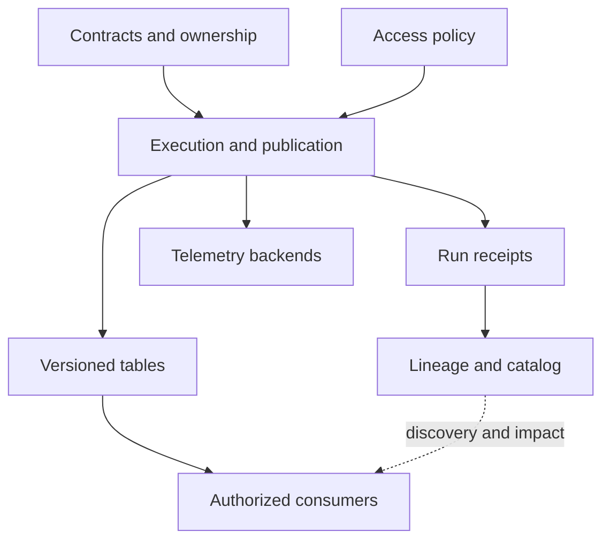

# 책임을 기준으로 기술 스택 선택하기

영업팀이 새 주문을 10분 안에 보고서에서 보고 싶다고 하자. 데이터 검사를 통과해야 하고, 나중에 같은 결과를 다시 만들 수도 있어야 한다.

도구를 고르기 전에 이 요구부터 적는다. 그다음 변경 수집, 데이터 저장, 결과 계산, 전달 확인을 각각 어느 도구가 맡을지 정한다.

## 이 장에서 처음 쓰는 말

| 용어 | 의미 | 왜 필요한가요 · 언제 쓰나요 |
|---|---|---|
| 저장 형식(storage format) | 파일 안에 데이터를 배치하는 규칙이다. Parquet가 한 예다. | 어떤 열을 자주 읽는지, 파일 크기와 읽기 속도가 어떤지에 맞춰 형식을 고른다. **구체적인 상황(가상 예시):** 열이 많은 주문 테이블에서 날짜와 금액만 필요하다. → 필요한 열을 골라 읽을 수 있는 형식을 비교한다. → 결과가 같은지 확인하고 읽은 바이트와 처리 시간을 잰다. |
| 테이블 형식(table format) | 테이블의 각 버전에 어떤 파일이 속하는지 기록하고, 변경을 확정하는 규칙이다. | 여러 파일을 쓰는 도중에도 읽는 쪽이 완료된 결과를 선택할 수 있게 한다. **구체적인 상황(가상 예시):** 새 파일을 쓰는 동안 다른 작업이 테이블을 조회한다. → 테이블 형식의 커밋 절차로 변경을 확정한다. → 쓰다 만 파일이 섞이지 않고 한 버전의 결과를 읽는지 확인한다. |
| 계산 엔진(compute engine) | SQL이나 변환 코드를 실행해 결과를 만드는 소프트웨어다. | 어떤 순서로 데이터를 읽고 처리하는지 살펴보고 느린 단계를 찾을 때 쓴다. **구체적인 상황(가상 예시):** 변환 작업이 데이터를 옮기는 데 시간을 많이 쓴다. → 실행 계획에서 데이터 이동 단계를 찾는다. → 계획을 바꾼 뒤 결과와 처리 시간을 비교한다. |
| 제어 평면(control plane) | 무슨 작업을 언제, 어떤 권한으로 실행할지 관리하는 부분이다. | 작업 설정의 문제인지 실제 처리 과정의 문제인지 구분할 때 쓴다. **구체적인 상황(가상 예시):** 작업 코드는 있지만 예약 시간이나 실행 권한이 틀렸다. → 스케줄과 권한 설정을 살핀다. → 작업이 정한 시간에 실행될 수 있는지 확인한다. |
| 데이터 평면(data plane) | 데이터를 실제로 읽고 옮기고 변환하는 워커와 저장소다. | 실제 처리 속도를 떨어뜨리거나 전송을 막는 부분을 찾을 때 쓴다. **구체적인 상황(가상 예시):** 예약 작업은 시작됐지만 데이터 전송이 멈췄다. → 워커와 저장소의 상태를 살핀다. → 읽기 권한 문제인지 처리 용량 문제인지 확인한다. |

## 먼저 이해하기

1. 주문을 만든 시스템이 이벤트 ID와 스키마 버전을 붙여 변경 기록을 보낸다.
2. 수집 단계는 장애가 나도 같은 기록을 다시 읽을 수 있도록 원본과 읽은 위치를 보관한다.
3. 처리 단계는 데이터를 변환하고 검사한 뒤 새 테이블 버전을 저장한다.
4. 공개 단계는 검사를 통과한 버전만 보고서나 다른 사용자가 읽게 한다. 여기서 공개는 인터넷 게시가 아니라 사용할 데이터 버전을 확정한다는 뜻이다.
5. 지표·로그·트레이스는 실행 중 무슨 일이 있었는지, 계보는 어떤 입력으로 결과를 만들었는지 기록한다. 원본 데이터는 별도로 보관한다.

카탈로그는 어떤 테이블이 있고 어디서 찾는지 알려 준다. 오브젝트 스토리지는 파일을 보관한다. 엔진은 테이블 메타데이터를 읽어 쿼리할 파일을 선택한다. 대시보드는 백엔드의 관측값을 보여 주며 테이블을 복구하거나 계약을 강제하지 않는다.

## 기본 학습 스택과 의도적으로 미룬 대안

아래 선택은 학습을 위한 권장 구성이다. 순위나 모든 조합의 호환성을 주장하는 것이 아니다.

| 책임 | 시작 도구 | 문제가 요구할 때 추가·비교할 대상 |
|---|---|---|
| 로컬 정확성 | Python·SQLite, 분석 파일에는 DuckDB | 동시 트랜잭션과 CDC에는 PostgreSQL |
| 영속 파일 | Parquet와 로컬 디렉터리, 이후 S3 또는 동등한 오브젝트 스토리지 | 클라우드별 IAM·요청 비용·수명 주기·복구 동작 |
| 분석 테이블 | Iceberg **또는** Delta Lake | 커밋·유지 관리 절차를 구현한 뒤 두 번째 형식 비교 |
| 분산 처리 | Spark SQL / PySpark | 연속 이벤트 시간 처리와 상태를 명확한 목적으로 학습할 때 Flink |
| 전송 | Kafka | 데이터베이스 변경 수집에는 Debezium과 Kafka Connect |
| 스키마 호환성 | Avro·Protobuf·JSON Schema를 지원하는 스키마 레지스트리 | 생산자·소비자 버전 간 호환성과 의미 변경 시험 |
| 대화형 레이크 질의 | 로컬 DuckDB | 독립적인 분산 SQL 접근이 필요하면 Trino |
| 모델링 | 지원되는 어댑터 하나와 dbt | 여러 사용자가 같은 지표 정의를 필요로 하면 의미 계층 |
| 스케줄링 | Airflow **또는** Dagster | 시간 구간 워크플로와 자산 중심 정의 비교 |
| 품질 | SQL 단언문과 dbt 테스트 | 풍부한 검사·보고가 별도 서비스의 필요성을 정당화하면 Great Expectations·Soda |
| 계보와 탐색 | OpenLineage 이벤트와 작은 검색 가능 등록부 | 계보 백엔드로 Marquez, 더 넓은 카탈로그 평가에 DataHub·OpenMetadata |
| 계측 | OTel SDK와 Collector | 라우팅·격리·용량 요구 시 에이전트·게이트웨이 계층 |
| 텔레메트리 저장 | Prometheus·Loki·Tempo, 탐색에는 Grafana | 트레이스 대안 Jaeger, 지표 규모·보존에는 Mimir·Thanos, 프로파일에는 Pyroscope |
| 관리형 플랫폼 | 기초 학습 후 Databricks | 같은 계약의 두 번째 구현으로 Snowflake |
| AI 운영 | 권한을 확인한 검색과 MLflow 또는 Langfuse | 서로 다른 워크플로 책임이 명확할 때만 두 도구를 함께 사용 |
| 전달 | Git·CI·컨테이너 | 운영 요구가 커지면 Terraform·Kubernetes·워크로드 신원·정책·GitOps |

모든 대안을 함께 배포하지 않는다. 로컬 파일 파이프라인으로 시작해 현재 시스템이 충족하지 못하는 요구를 설명할 수 있을 때 서비스를 추가한다. Kafka·Spark·레이크하우스만으로도 상당한 복구·호환성 작업이 생긴다.

## 아키텍처 경계



업무 이벤트와 지표·로그를 모두 Kafka로 보내더라도 용도별로 분리해 관리한다. 주문 이벤트는 장애 후 다시 처리할 수 있어야 하고, 로그는 장애를 조사하는 데 필요하다. 둘은 발생량과 개인정보 처리 규칙이 다르므로 보존 기간도 따로 정한다. 로그가 갑자기 늘어 주문 처리에 필요한 용량까지 소모하지 않도록 한다.

## 검토 가능한 선택 기록

분산 계산을 추가하기 전에 일일 데이터량, 최대 유입률, 파일 수, 쿼리 패턴, 지연 목표, 허용 복구 시간, 장비 예산을 짧게 기록한다. 이전과 이후에 같은 정확성 예제를 실행한다. 노트북에서 분산 버전이 느리다는 것은 관찰 결과이며 대규모 처리에 부적합하다는 증거는 아니다.

함께 실행할 소프트웨어의 버전을 한 파일에 기록한다. 엔진과 커넥터의 정확한 패키지 이름·버전, Java/Python, 테이블 기능, OTel SDK·배포판, dbt 어댑터가 그 대상이다. 실제로 시험한 조합을 잠금 파일에 고정한다. 각 도구의 최신 버전을 모았더라도 서로 호환되는지는 따로 확인해야 한다.

## 다섯 가지 식별자로 이벤트 하나 따라가기

이벤트 식별자, 소스 위치, 처리 실행, 테이블 스냅샷, trace ID는 서로 다른 질문에 답한다. 같은 것으로 취급하면 재생과 사고 분석이 모호해진다. 주문 프로젝트에서는 다음 연결을 명시할 수 있는 참조 정보를 전달한다.

| 참조 | 예시 | 답하는 질문 |
|---|---|---|
| 업무 식별자·버전 | `e1`, 소스 순번 `2` | 어떤 논리적 변경인가? |
| 전송 위치 | orders 토픽, 파티션 0, 오프셋 91 | 어디에서 수집을 재개·재생할 수 있는가? |
| 논리 구간·시도 | 9월 10일, 시도 run-8 | 어느 구간과 실행이 후보를 만들었는가? |
| 입력·출력 버전 | 소스 스냅샷 A, 승인 스냅샷 B | 정확히 어떤 상태를 읽고 공개했는가? |
| trace·span 컨텍스트 | trace T, consume span S | 이 실행에 어떤 작업이 참여했는가? |

같은 주문 이벤트 e1을 다시 보내면 Kafka에는 서로 다른 두 오프셋으로 저장될 수 있다. 따라서 오프셋이 다르다고 새 주문으로 세면 안 된다. 같은 하루치 데이터를 두 번 실행할 수도 있고, 한 스냅샷에 여러 실행의 결과가 들어갈 수도 있다. 주문 누락·중복은 이벤트 ID와 버전으로 비교하고, 처리 재개 위치는 Kafka 오프셋으로 찾으며, 실제 저장된 결과는 테이블 버전으로 확인한다. 트레이스는 이 작업들의 실행 경로를 조사할 때 쓴다.

## 두 가지 구체적 구현 비교

하루 100 MB 보고서라면 예약된 Python/DuckDB 작업으로 시작할 수 있다. 버전이 기록된 입력을 읽고 임시 Parquet 결과를 만든 뒤, 건수와 합계를 검사한다. 통과하면 사용할 파일 목록인 매니페스트를 바꿔 새 결과를 제공한다. 오늘 결과가 검사에 실패하면 어제 승인한 결과를 유지하되 기준 날짜를 표시한다. 분산 클러스터는 이런 작은 구성으로 요구를 충족하지 못할 때, 추가 운영 비용까지 측정한 뒤 도입한다.

이벤트가 계속 들어오면 Kafka가 보존 로그를 제공하고 Spark가 처리 진행 상태과 상태를 제한된 범위에서 관리하며 Iceberg/Delta 출력이 커밋된 테이블의 가시성을 정의한다. 마트 빌더가 사용자용 정의를 공개하고 OTel/OpenLineage가 실행·파생 근거를 제공한다. 경계가 늘 때마다 브로커 승인, 소스 진행 상태, 출력 커밋, 마트 승인, 관측 전달의 실패를 시험해야 한다.

Spark가 테이블 저장을 끝내고 읽은 위치를 기록하기 전에 멈추면, 재시작 후 같은 입력을 다시 읽을 수 있다. 이미 저장된 결과와 비교해 중복 반영을 막아야 한다. dbt 실행은 성공했어도 공개 전 검사가 끝나지 않았다면 사용자가 그 결과를 읽지 못하게 한다. 로그 전송이 멈춘 경우에도 별도의 공개 이력에서 어떤 결과를 제공했는지 확인할 수 있어야 한다. 동시에 모니터링 화면에는 관측 데이터가 누락됐음을 표시한다.

## 실습과 해석

일일 100 MB 보고서와 신선도 목표 5분인 연속 스트림의 설계를 각각 그린다. 저장·처리·스케줄링·계약 검사·텔레메트리를 배정하고 두 번째 설계의 추가 프로세스마다 이유를 설명한다. 이후 하위 시스템이 한 시간 중단되는 상황을 넣어 적체 위치, 보존 가능 시간, 복구 담당자를 표시한다.

## 실행 결과 예시

실행 중인 플랫폼이 아닌 설계 검토 예시다.

```text
daily 100 MB report: versioned files + scheduled transform + publication checks
five-minute stream: retained log + checkpointed processing + freshness checks
100 events/s paused for one hour: backlog = 360000
recovery 300/s minus incoming 100/s: net drain = 200/s
estimated drain time = 1800 seconds
```

이 추정은 지속 처리율과 충분한 보존을 가정한다. 적체 담당자나 보존 한도가 없는 그림은 검토 실패다.

## 스스로 설명해 보기

OpenLineage와 OpenTelemetry가 서로 대체하지 않고 공존하는 이유는 무엇인가? 계보 이벤트는 데이터 파생을, span은 작업을 기록한다. 실행 식별자를 연결하면 함께 유용하게 쓸 수 있다. 어느 쪽도 데이터셋 읽기 권한을 부여하지 않는다.

다음은 [기초](../../../docs/guides/data-observability/02-sql-python-foundations.md)로 이어간다.

<!-- source: https://openlineage.io/docs/spec/object-model/ | checked: 2026-09-10 | dataset/job/run responsibilities -->
<!-- source: https://opentelemetry.io/docs/collector/configuration/ | checked: 2026-09-10 | Collector component responsibilities; stack choices are curriculum synthesis -->
