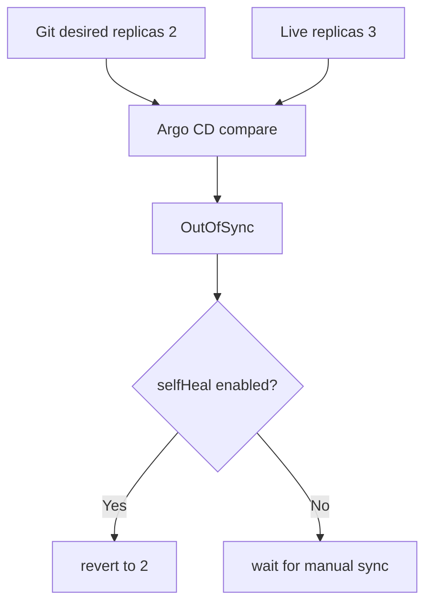

# Render, upgrade와 drift 실습

> 실습 등급: render 단계는 **Local**, install·upgrade는 **Local Kubernetes**다. 공개 registry에 push하지 않으며 AWS 비용은 없다.

## 실습 전에 준비할 것

- **도구**: `helm version`과 `kubectl version --client`가 성공해야 한다.
- **cluster**: install 단계까지 하려면 kind나 minikube 같은 disposable local Kubernetes가 필요하다. cluster가 없으면 render 단계까지만 진행한다.
- **현재 대상 확인**: `kubectl config current-context`로 운영 cluster가 아닌지 반드시 확인한다.
- **디렉터리**: 빈 실습 디렉터리에서 시작해 아래 파일 네 개를 만든다. 이 템플릿은 스캐폴드 헬퍼에 의존하지 않는다.
- **관찰 순서**: chart 검사 → 최종 YAML 생성 → Kubernetes 형식 검사 → 실제 설치 순서로 진행한다.
- **정리 대상**: Helm release, `infra-study` namespace, `sample-api/` directory와 `rendered.yaml`이다.

처음에는 `helm lint`와 `helm template`까지만 실행해도 된다. 생성된 YAML에서 image와 replica 수를 직접 찾을 수 있을 때 cluster 설치로 넘어간다.

## 먼저 이해하기

이 실습은 같은 chart를 네 단계에서 확인한다. lint는 chart 자체의 기본 오류를 찾고, template은 values가 적용된 최종 YAML을 보여 준다. Kubernetes dry-run은 API 형식과 일부 admission 조건을 확인하며 실제 install은 controller가 Pod를 만들어 readiness에 도달하는지 확인한다. 앞 단계가 뒤 단계의 성공을 보장하지 않는다.

| gate | 성공의 의미 | 아직 모르는 것 |
|---|---|---|
| `helm lint` | chart 관례·일부 template 검사 통과 | 특정 values의 모든 결과 |
| `helm template` | 원하는 YAML 생성 | cluster API·admission 수용 여부 |
| client dry-run | local schema 처리 가능 | server CRD·policy·quota |
| install/upgrade | release action 완료 | 사용자 요청과 외부 dependency 정상 |
| rollout check | controller readiness 달성 | SLO와 business 결과 |

각 명령 뒤에 “성공”만 적지 말고 무엇을 새로 알았고 무엇은 아직 모르는지 기록한다.

## 1. Chart 생성과 최소화

`sample-api/templates/`를 만든다. 다음 내용을 `sample-api/Chart.yaml`로 저장한다.

```yaml
apiVersion: v2
name: sample-api
type: application
version: 0.1.0
```

다음 내용을 `sample-api/values.yaml`로 저장한다. 0으로 채운 digest는 렌더링 전용 예시로, 형식만 맞으며 실행 가능한 이미지를 가리키지 않는다. 설치 전 클러스터 아키텍처에서 사용할 수 있고 검토를 마친 nginx digest로 교체한다.

```yaml
replicaCount: 1
image:
  repository: nginx
  digest: sha256:0000000000000000000000000000000000000000000000000000000000000000
service:
  port: 80
```

다음 내용을 `sample-api/templates/deployment.yaml`로 저장한다.

```yaml
apiVersion: apps/v1
kind: Deployment
metadata:
  name: {{ .Release.Name }}
spec:
  replicas: {{ .Values.replicaCount }}
  selector:
    matchLabels:
      app.kubernetes.io/instance: {{ .Release.Name }}
  template:
    metadata:
      labels:
        app.kubernetes.io/instance: {{ .Release.Name }}
    spec:
      containers:
        - name: http
          image: "{{ .Values.image.repository }}@{{ required "image.digest is required" .Values.image.digest }}"
          ports:
            - name: http
              containerPort: 80
          readinessProbe:
            httpGet:
              path: /
              port: http
          resources:
            requests:
              cpu: 50m
              memory: 32Mi
            limits:
              memory: 128Mi
```

다음 내용을 `sample-api/templates/service.yaml`로 저장한다.

```yaml
apiVersion: v1
kind: Service
metadata:
  name: {{ .Release.Name }}
spec:
  selector:
    app.kubernetes.io/instance: {{ .Release.Name }}
  ports:
    - port: {{ .Values.service.port }}
      targetPort: http
```

## 2. Render gate

```bash
helm lint sample-api
helm template sample-api sample-api \
  --namespace infra-study \
  --values sample-api/values.yaml \
  > rendered.yaml
```

이 차트는 클러스터 없이 `helm lint`와 `helm template`을 실행할 수 있다. Deployment와 Service가 정확히 하나씩이고 셀렉터가 일치하며 이미지와 복제본 수가 기대값인지 확인한다. `--set replicaCount=2`로 다시 렌더링해 매니페스트를 비교한다. 선택적으로 앞 장의 값 스키마를 `sample-api/values.schema.json`으로 저장하면 `--set replicaCount=0`은 스키마 검증에 실패해야 한다.

임시 클러스터를 선택하고 네임스페이스가 존재하는 상태에서 `kubectl apply --dry-run=server -n infra-study -f rendered.yaml`을 실행한다. 클라이언트 dry-run도 API 검색이 필요할 수 있으므로 admission 호환성의 오프라인 증거가 아니다. dry-run은 이미지를 받지 않으며 준비 완료를 입증하지 않는다.

## 3. Install, upgrade와 rollback

검증한 digest를 넣은 뒤 local cluster에서 실행한다.

```bash
kubectl create namespace infra-study
helm upgrade --install sample-api sample-api \
  --namespace infra-study \
  --wait=watcher --timeout 3m
helm list -n infra-study
helm history sample-api -n infra-study
kubectl get deployment,pod,service -n infra-study
```

replica 수를 2로 바꾸어 upgrade한 뒤 rollout을 확인한다.

```bash
helm upgrade sample-api sample-api -n infra-study --set replicaCount=2 --wait=watcher --timeout 3m
kubectl rollout status deployment/sample-api -n infra-study
helm history sample-api -n infra-study
```

Helm 4에서는 렌더링 전용 0 digest, `--rollback-on-failure`, `--timeout 1m`으로 업그레이드를 반복한다. 0이 아닌 종료 코드, 실패 리비전, Pod 이벤트, 복구된 Deployment 이미지를 기록한다. Helm 3은 `--atomic`을 사용하므로 설치한 주 버전의 도움말로 옵션을 선택한다. 두 옵션 모두 훅이 수행한 외부 데이터베이스 쓰기를 되돌리지는 않는다.

```bash
helm rollback sample-api 1 -n infra-study --wait=watcher --timeout 3m
kubectl rollout status deployment/sample-api -n infra-study
```

rollback 성공 판정은 Helm status뿐 아니라 workload readiness와 요청 성공을 포함한다.

## 4. GitOps drift 사고 실험

이것은 별도의 사고 실험이다. 위 Helm CLI 실습은 Argo CD를 설치하거나 Application을 만들지 않았다. Argo CD가 관리하는 예시에서는 Git에 복제본 두 개가 선언되어 있는데 Deployment를 직접 확장한다고 가정한다. CLI가 관리하는 실습 리소스에 두 번째 수명 주기 관리 주체를 추가하지 않는다.

```bash
kubectl scale deployment/sample-api -n infra-study --replicas=3
```



긴급 조치가 필요한 조직은 self-heal을 끄는 대신 변경 TTL·승인·Git 반영 절차를 정할 수 있다. 중요한 것은 drift를 숨기지 않고 누가 언제 target state에 반영할지 정하는 것이다.

## 정리

```bash
helm uninstall sample-api -n infra-study
kubectl delete namespace infra-study
rm -f rendered.yaml
```

CRD나 cluster-scoped resource가 chart에 있었다면 namespace 삭제만으로 정리되지 않는다. 이 실습 chart에는 넣지 않는다.

## 실행 결과 예시

예상 출력 일부다. 렌더링 단계에는 클러스터가 필요 없다. 아래 릴리스 리비전은 새 릴리스를 실제 이미지 digest로 성공적으로 설치한 경우를 가정한다.

```text
# helm lint sample-api
1 chart(s) linted, 0 chart(s) failed
# helm template ... --set replicaCount=2
kind: Deployment
...
  replicas: 2
...
kind: Service
# Optional schema, replicaCount=0
- at '/replicaCount': minimum: got 0, want 1
# Live rollout with a valid digest
deployment "sample-api" successfully rolled out
```

새 설치는 리비전 1에서 시작하고 복제본 업그레이드에 성공하면 리비전 2가 된다. 롤백은 또 다른 리비전을 만들며 이력을 지우지 않는다. 0 digest 업그레이드는 0이 아닌 코드로 종료해야 한다. 복구 기록에는 복원된 이미지, 준비된 복제본, 요청 성공이 모두 필요하다. 0 digest도 렌더링 자체는 성공하는 것이 정상이며 이미지 존재를 입증하지 않는다.

## 결과를 이렇게 읽는다

`helm template` 결과에서 image, replica, label selector와 Service port를 먼저 찾는다. chart source가 복잡해도 cluster가 받는 것은 이 manifest다. 예상한 value가 보이지 않으면 cluster를 조사하기 전에 values precedence와 template reference를 고친다.

`helm history`에 새 리비전이 생겼다는 것은 CLI가 관리하는 릴리스 기록이 갱신됐다는 뜻이다. `kubectl rollout status`가 실패하면 Pod 이벤트, 이미지 받기, 프로브, 할당량을 확인한다. 자동 롤백 이후에도 워크로드와 요청을 검증하고 외부 마이그레이션이나 훅의 부수 효과를 별도로 확인해야 한다.

Argo CD가 `OutOfSync`를 보이면 compare가 drift를 발견한 것이다. self-heal로 replica가 돌아와도 긴급 변경의 이유가 Git과 incident 기록에 남지 않으면 운영 경로는 닫히지 않았다.

## 스스로 설명해 보기

1. `helm lint`, client dry-run과 실제 cluster admission이 각각 잡지 못하는 것은 무엇인가?
2. Helm rollback 후에도 외부 DB migration이 남을 수 있는 이유는 무엇인가?
3. auto-sync, prune과 self-heal을 독립적으로 검토해야 하는 이유는 무엇인가?

<!-- source: https://helm.sh/docs/helm/helm_lint/ | checked: 2026-09-03 | docs-version: Helm 4.2.4 -->
<!-- source: https://helm.sh/docs/helm/helm_template/ | checked: 2026-09-03 | docs-version: Helm 4.2.4 -->
<!-- source: https://helm.sh/docs/helm/helm_upgrade/ | checked: 2026-09-03 | docs-version: Helm 4.2.4 -->
<!-- source: https://helm.sh/docs/helm/helm_rollback/ | checked: 2026-09-03 | docs-version: Helm 4.2.4 -->
<!-- source: https://argo-cd.readthedocs.io/en/stable/user-guide/auto_sync/ | checked: 2026-09-03 -->
<!-- source: https://helm.sh/docs/helm/helm_upgrade/ | checked: 2026-09-10 | version-scope: Helm 4 rollback-on-failure and watcher wait -->
