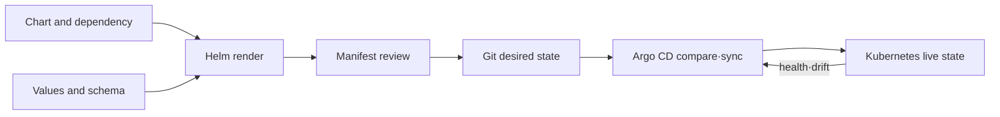

# Helm Charts와 GitOps 로드맵

## 처음 보는 사람을 위한 출발점

Kubernetes에 애플리케이션 하나를 배포하려면 Deployment, Service, 설정처럼 여러 YAML 파일이 필요하다. 개발·검증·운영 환경마다 복사해서 고치면 서로 다른 파일이 늘어나고 어떤 값이 실제로 배포됐는지 알기 어려워진다. Helm은 반복되는 YAML의 틀과 바뀌는 값을 묶어 관리한다.

| 처음 만나는 말 | 학습용 쉬운 뜻 | 왜 필요한가요 · 언제 쓰나요 |
|---|---|---|
| 매니페스트(manifest) | Kubernetes에 만들 대상을 적은 YAML 문서 | 검토하고 다시 적용할 수 있는 형태로 Kubernetes 객체를 선언할 때 쓴다. **구체적인 상황(가상 예시):** 수동 삭제 후 Deployment가 다르게 재생성된다. → 검토한 매니페스트를 버전 관리한다. → 시험 클러스터에 다시 적용해 설정을 비교한다. |
| 차트(chart) | 매니페스트의 틀과 기본값을 묶은 Helm 패키지 | 서로 관련된 Kubernetes 자원을 설정 가능한 설치 단위로 묶을 때 쓴다. **구체적인 상황(가상 예시):** 애플리케이션에 여러 Kubernetes 자원이 함께 필요하다. → 템플릿·기본값을 차트로 묶는다. → 전체 설치 내용을 렌더링해 함께 검토한다. |
| 템플릿(template) | 값을 넣으면 최종 YAML이 만들어지는 문서 틀 | 환경별 입력만 바꾸면서 동일한 자원 구조를 재사용할 때 쓴다. **구체적인 상황(가상 예시):** 모든 환경에 같은 Deployment 구조가 필요하다. → 바뀌는 입력을 템플릿에 반영한다. → 렌더링 결과의 우발적 구조 변경을 확인한다. |
| 값(values) | 환경마다 달라지는 image, replica 수 같은 입력 | 템플릿 전체를 복사·수정하지 않고 배포 설정을 바꾸기 위해 쓴다. **구체적인 상황(가상 예시):** 시험 환경에는 복제본 하나, 운영에는 더 많은 복제본이 필요하다. → 환경별 값을 설정한다. → 렌더링된 복제본 수와 이미지 필드를 확인한다. |
| 릴리스(release) | 하나의 차트를 특정 값으로 클러스터에 설치한 기록 | 설치한 차트·값을 추적해 업그레이드와 롤백 대상을 식별할 때 쓴다. **구체적인 상황(가상 예시):** 업그레이드가 실패해 설치된 설정이 불분명하다. → 릴리스 리비전과 값을 조사한다. → 호환되는 복구 리비전을 찾고 요청을 검증한다. |
| GitOps | Git에 적힌 원하는 상태와 실제 클러스터를 계속 비교해 맞추는 운영 방식 | 검토한 Git 변경을 운영 목표로 삼고 클러스터 상태를 지속적으로 맞출 때 쓴다. **구체적인 상황(가상 예시):** 수동 클러스터 변경이 반복해서 사라진다. → GitOps 컨트롤러의 목표 설정과 비교한다. → 조정이 검토한 Git 상태를 복원하는지 확인한다. |

Helm은 YAML을 만들어 설치하는 도구이고 GitOps는 실제 상태가 Git과 계속 같은지 관리하는 방식이다. 두 개념을 한꺼번에 외우지 않고, 먼저 Helm이 만든 최종 YAML을 눈으로 확인한 다음 GitOps의 자동 수렴을 배운다.

Helm과 GitOps는 같은 문제가 아니다. Helm은 values와 template로 Kubernetes object를 **렌더링·패키징**하고, Argo CD는 Git의 desired state와 cluster live state를 **비교·수렴**시킨다.

## 한 문장 모델

> `chart + values → rendered manifests → review → Git desired state → Argo CD sync → live resources`이며 각 화살표마다 다른 실패와 owner가 있다.

## 읽는 순서

1. [Chart, release와 desired state](../../content/helm-gitops/01-chart-release-gitops-model.md): chart 구조, values, hooks, CRD와 Argo CD ownership을 구분한다.
2. [Render, upgrade와 drift 실습](../../content/helm-gitops/02-render-upgrade-drift-lab.md): lint·template·install·upgrade·rollback과 GitOps drift를 관찰한다.

## 핵심 범위

- Chart API v2, SemVer, `Chart.yaml`, `values.yaml`, `values.schema.json`, `templates/`, `charts/`, `crds/`
- values precedence와 최종 manifest 검토
- dependency, hook와 CRD lifecycle
- release history, upgrade와 rollback
- OCI registry의 chart push/pull
- 사내 object 변형에서 Kustomize와의 경계
- Argo CD Application, target/live state, sync·prune·self-heal

## 버전 주의

확인일 현재 공식 사이트는 Helm 4.2.4를 표시하지만, Charts 설명 페이지 자체는 아직 Helm 4에 맞게 갱신되지 않아 일부 내용이 정확하지 않거나 적용되지 않을 수 있다고 경고한다. 이 과정은 chart directory와 values·template 같은 공통 구조를 학습 출발점으로 사용한다. Helm 4의 새 기능·호환성·명령 동작은 해당 버전의 Overview와 command reference를 별도로 확인한다.

## Ownership 원칙

| 대상 | 기본 owner |
|---|---|
| VPC·EKS cluster·IAM 기반 | Terraform |
| cluster 안 application desired state | Git과 Argo CD |
| third-party package 구조 | Helm chart |
| environment별 작은 object patch | Kustomize 또는 명시적 values |

경계는 조직마다 다를 수 있지만 하나의 object를 Terraform Helm provider와 Argo CD가 동시에 관리하지 않는다.

## 완료

이 주제는 한 번 읽고 끝내지 않는다. 먼저 용어 표를 자신의 말로 바꾸고, 개념 장에서 한 요청의 흐름을 따라간다. 실습에서는 정상 상태를 먼저 기록한 뒤 조건 하나만 바꿔 실패를 만들고, 증거로 원인을 설명한 뒤 복구한다. 마지막으로 아래 운영 판단 질문에 답하면서 더 복잡한 환경으로 확장한다.

- `helm lint` 성공과 Kubernetes에서 안전한 manifest라는 판단을 구분한다.
- final values와 rendered manifest를 code review 대상으로 만든다.
- hook job, CRD와 application resource의 삭제·rollback 수명이 다름을 설명한다.
- auto-sync·prune·self-heal을 각각 켰을 때 blast radius를 예측한다.

## 처음 이해했는지 확인

1. chart, values와 rendered manifest는 어떤 순서로 연결되는가?
2. Helm과 GitOps가 해결하는 문제는 어떻게 다른가?

**확인 기준:** chart의 template에 values를 넣어 최종 manifest를 만들며, Helm은 이 생성·설치를 맡고 GitOps는 Git과 cluster의 차이를 계속 비교한다고 설명할 수 있으면 된다.

## 운영 판단으로 확장하기

1. chart version과 container image version을 분리해야 하는 이유는 무엇인가?
2. Helm rollback이 database migration을 자동으로 되돌리지 못하는 이유는 무엇인가?
3. Argo CD가 drift를 발견하는 것과 안전하게 복구하는 것은 왜 다른가?

<!-- source: https://helm.sh/docs/topics/charts/ | checked: 2026-09-03 | docs-version: Helm 4.2.4 | retrieval-warning: page states it is not yet updated for Helm 4 -->
<!-- source: https://helm.sh/docs/topics/registries/ | checked: 2026-09-03 | docs-version: Helm 4.2.4 -->
<!-- source: https://argo-cd.readthedocs.io/en/stable/core_concepts/ | checked: 2026-09-03 -->
