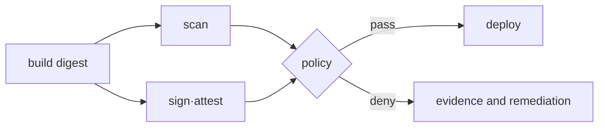

# Allow·deny와 artifact 수명주기 실습

<!-- source: https://docs.aws.amazon.com/awscloudtrail/latest/userguide/logging-data-events-with-cloudtrail.html | checked: 2026-09-10 | object-level audit coverage is not enabled by default -->

> 실습 등급: policy 검토는 **Local/Plan only**, AWS API 검증은 **AWS optional**이다. temporary role과 격리된 test resource만 사용하며 secret 값과 account ID를 기록하지 않는다.

## 실습 전에 준비할 것

- **첫 단계**: AWS 없이 JSON policy의 `Action`, `Resource`, `Condition`이 각각 동작·대상·조건을 뜻하는지 읽는다.
- **AWS 선택 단계**: 전용 test bucket·prefix와 temporary role을 사용한다. 운영 bucket이나 사람의 기본 role은 사용하지 않는다.
- **시험 쌍**: 허용돼야 하는 read 한 개와 거부돼야 하는 write 한 개를 실행 전에 적는다.
- **안전 조건**: test object에는 공개해도 되는 임시 문자열만 넣고 실제 secret이나 고객 데이터를 사용하지 않는다.
- **기록**: 성공·실패뿐 아니라 caller, action, resource, 결정에 관여한 policy 범위를 남긴다.
- **정리 대상**: test object, bucket, temporary role·policy와 local verification artifact다.

보안 실습에서 예상한 거부는 성공적인 관찰이다. 오류를 없애려고 곧바로 `*` 권한을 추가하지 말고 어떤 경계가 요청을 거부했는지 먼저 확인한다.

## 먼저 이해하기

least privilege는 허용된 한 동작이 성공하는지만 보는 테스트가 아니다. 의도한 read는 성공하고 인접한 prefix read, write와 delete는 실패해야 policy boundary를 확인할 수 있다. 허용과 거부를 쌍으로 시험해야 wildcard나 잘못된 resource ARN을 발견할 수 있다.

IAM에서 **implicit deny**는 어떤 Allow에도 해당하지 않는 기본 결과다. **explicit deny**는 identity/resource policy나 상위 guardrail이 명시적으로 거부하는 경우이며 Allow보다 우선한다. AccessDenied 하나만으로 어느 계층이 결정했는지는 알 수 없으므로 caller, action, resource와 evaluation context를 수집한다.

| 시험 | 기대 결과 | 확인하는 경계 |
|---|---|---|
| release object read | allow | 필요한 업무 동작 |
| private prefix read | deny | resource scope |
| object write/delete | deny | action scope |
| 다른 role session | deny | principal·trust scope |
| 잘못 서명된 digest | deploy deny | artifact identity |
| 대상 서비스의 이전 자격 증명 | 폐기 후 거부 | 자격 증명 수명 |

## 1. 최소 policy 설계

특정 prefix의 object read만 허용하는 예다. bucket 이름은 별도 variable로 주입한다.

```json
{
  "Version": "2012-10-17",
  "Statement": [
    {
      "Effect": "Allow",
      "Action": ["s3:GetObject"],
      "Resource": "arn:aws:s3:::replace-study-bucket/releases/*"
    }
  ]
}
```

검토 질문은 “무엇이 허용되는가”와 “무엇이 허용되지 않아야 하는가”를 쌍으로 만든다.

| request | 예상 |
|---|---|
| `releases/app.tar` read | allow |
| 같은 bucket의 `private/key` read | deny |
| object write·delete | deny |
| 다른 bucket read | deny |

## 2. Policy simulation과 실제 deny

권한이 있다면 IAM policy simulator로 먼저 확인한다. 실제 API 시험은 전용 role session에서 수행한다.

```bash
aws sts get-caller-identity
aws s3api head-object \
  --bucket replace-study-bucket \
  --key releases/app.tar
printf 'public lab fixture\n' > denied.txt
aws s3api put-object \
  --bucket replace-study-bucket \
  --key releases/denied.txt \
  --body denied.txt
```

빈 실습 디렉터리에서만 무해한 `denied.txt` 예시 파일을 만든다. 로컬 파일이 없는 것은 IAM 거부의 증거가 아니다. 쓰기 요청이 S3에 도달해 예상한 인가 오류를 반환해야 한다. STS 신원 조회 성공만으로 S3 권한이 입증되지 않는다. CloudTrail 오브젝트 수준 이벤트는 데이터 이벤트 로깅이 필요하며 기본 이벤트 기록에는 없다. 계정 메타데이터를 공개하지 않고 오류와 설정된 감사 범위를 기록한다.

## 3. Artifact gate 사고 실험

```bash
cosign verify \
  --certificate-identity replace-with-workflow-identity \
  --certificate-oidc-issuer replace-with-issuer \
  registry.example.invalid/sample@sha256:replace-with-digest
```

`.invalid` 주소는 실행용 registry가 아니다. 실제 조직 registry에서는 다음 경우를 각각 시험한다.

- 올바른 digest와 기대한 workflow identity: 통과
- 같은 tag가 가리키는 다른 digest: 거부
- signature 없음 또는 다른 issuer: 거부
- scan policy가 정한 심각도 초과: 별도 gate에서 거부



## 4. Secret rotation 완료 기준

1. 새 secret version을 생성한다.
2. canary consumer가 새 version으로 인증하는지 확인한다.
3. 모든 consumer를 전환하고 authentication error를 관측한다.
4. 대상 서비스에서 이전 자격 증명을 폐기하고 그 자격 증명으로 인증이 실패하는지 확인한다. Secrets Manager 버전 라벨을 옮기는 것만으로 데이터베이스 비밀번호가 폐기되지는 않는다. 저장된 이전 버전을 권한에 따라 조회할 수 있는지는 별도 정책 문제다.
5. rollback window와 audit receipt를 닫는다.

AWS optional resource를 만들었다면 test object, bucket, role·policy, CloudTrail 보관 범위를 inventory와 역순으로 정리한다. audit 보존 정책 때문에 즉시 삭제하지 않는 로그가 있다면 명시한다.

## 실행 결과 예시

격리된 읽기 전용 테스트 역할을 가정한 AWS 예시 일부이며 실제 인가 검증 기록이 아니다.

```text
# head-object on the allowed, pre-created releases object (selected fields)
ContentLength: 19
ContentType: text/plain
# Write of the locally created denied.txt
An error occurred (AccessDenied) when calling the PutObject operation
# After actual target-service credential revocation
authentication rejected
```

처음 두 줄은 JSON 응답의 필드를 요약한 것이다. 실제 크기와 콘텐츠 유형은 미리 만든 예시 오브젝트에 따라 달라진다. HEAD 성공은 메타데이터 접근을 입증하며 본문 다운로드를 입증하지 않는다. 로컬 업로드 파일이나 원본 오브젝트가 없다는 것은 IAM 거부의 증거가 아니다. 마지막 줄은 실제 AWS CLI 문구가 아니라 대상 서비스에서 기록할 의미상의 결과다. 시크릿 버전 라벨 변경만으로 이전 자격 증명이 폐기되지는 않는다.

## 결과를 이렇게 읽는다

expected read가 실패하면 곧바로 wildcard 권한을 붙이지 않는다. caller가 예상 role인지, object ARN이 정확한지, bucket policy·KMS key policy·organization guardrail 같은 다른 계층이 있는지 확인한다. 반대로 write가 성공하면 테스트는 실패다. “명령이 성공했다”보다 policy가 의도한 경계를 지켰는지가 판정 기준이다.

Cosign 검증 성공은 내려받은 digest가 기대한 identity·issuer의 signature 조건을 만족했다는 뜻이다. image의 취약점이 없거나 runtime 설정이 안전하다는 뜻은 아니다. scan, provenance policy와 admission 결과를 별도 gate로 연결한다.

rotation에서는 새 credential 성공과 이전 credential 실패가 모두 필요하다. 이전 값이 계속 동작하면 노출된 credential의 위험 window가 닫히지 않았고, 일부 consumer가 이전 값을 cache하고 있다면 폐기 순간 장애가 날 수 있다.

## 스스로 설명해 보기

1. 예상한 AccessDenied와 잘못된 credential을 어떤 증거로 구분하는가?
2. tag를 검증하고 digest를 배포하지 않으면 어떤 race가 생길 수 있는가?
3. 새 secret이 동작한다는 사실만으로 rotation이 끝나지 않은 이유는 무엇인가?

<!-- source: https://docs.aws.amazon.com/IAM/latest/UserGuide/access_policies_testing-policies.html | checked: 2026-09-03 -->
<!-- source: https://docs.aws.amazon.com/cli/latest/reference/sts/get-caller-identity.html | checked: 2026-09-03 -->
<!-- source: https://docs.sigstore.dev/cosign/verifying/verify/ | checked: 2026-09-03 -->
<!-- source: https://docs.aws.amazon.com/secretsmanager/latest/userguide/rotating-secrets.html | checked: 2026-09-03 -->
