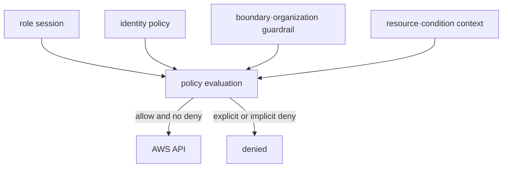
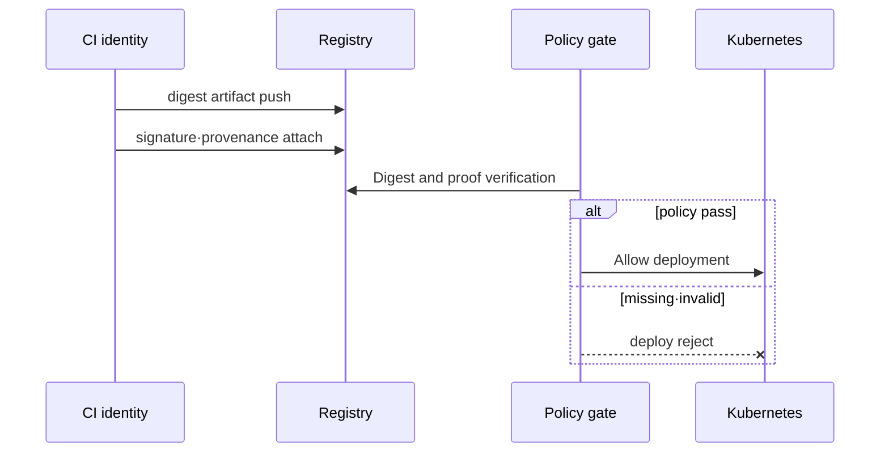

# Identity, secret과 artifact trust model

## 이 장에서 처음 쓰는 말

- **least privilege**: 작업에 필요한 최소 권한만 주고 필요하지 않은 작업은 허용하지 않는 원칙이다. **왜 필요한가요 · 언제 쓰나요:** 탈취되거나 잘못 동작하는 신원이 일으킬 수 있는 피해 범위를 줄인다. **구체적인 상황(가상 예시):** 보고 작업이 운영 데이터를 삭제할 수도 있다. → 필요한 읽기 권한으로 줄인다. → 보고는 성공하고 삭제는 거부되는지 확인한다.
- **temporary credential**: 정해진 시간이 지나면 사용할 수 없게 되는 임시 로그인 정보다. **왜 필요한가요 · 언제 쓰나요:** 자격 증명이 유출됐을 때 재사용될 수 있는 기간을 줄인다. **구체적인 상황(가상 예시):** 짧은 CI 작업이 영구 클라우드 키를 사용한다. → 범위가 제한된 임시 자격 증명으로 바꾼다. → 만료와 다음 작업의 갱신 절차를 확인한다.
- **encryption key**: 데이터를 읽을 수 없는 형태로 바꾸고 다시 복원할 때 사용하는 비밀 값이다. **왜 필요한가요 · 언제 쓰나요:** 보호된 데이터를 복호화할 수 있는 주체를 정하고 저장소 접근과 별도로 관리한다. **구체적인 상황(가상 예시):** 워크로드가 암호화 저장소는 읽지만 내용을 복호화하지 못한다. → 해당 키 권한을 조사한다. → 무관한 접근을 늘리지 않고 허용된 복호화를 확인한다.
- **rotation**: secret이나 key를 새 값으로 교체하고 이전 값을 안전하게 폐기하는 과정이다. **왜 필요한가요 · 언제 쓰나요:** 노출되거나 오래된 자격 증명을 교체하고 사용자가 새 값으로 동작하는지 확인한다. **구체적인 상황(가상 예시):** 클라이언트가 실행 중인 채 데이터베이스 자격 증명을 교체해야 한다. → 검토한 순서로 사용자를 전환한다. → 새 인증과 이전 값의 폐기를 확인한다.
- **digest**: 파일 내용으로 계산한 고정 길이 값이다. 내용이 달라졌는지 비교할 때 쓴다. **왜 필요한가요 · 언제 쓰나요:** 정확한 내용을 식별하고 불일치를 찾을 때 쓰며 진위 확인에는 신뢰할 기준값도 필요하다. **구체적인 상황(가상 예시):** 다운로드한 패키지 두 개의 파일명이 같다. → 신뢰할 릴리스 기준과 digest를 비교한다. → 예상하지 못한 내용 식별자를 거부한다.
- **provenance**: artifact가 어떤 source와 build 과정에서 만들어졌는지 보여 주는 출처 기록이다. **왜 필요한가요 · 언제 쓰나요:** 배포할 아티팩트의 출처를 신뢰하기 전에 소스·빌드 과정까지 추적한다. **구체적인 상황(가상 예시):** 배포할 이미지의 출처가 불분명하다. → 소스와 빌드 신원을 연결하는 검증된 출처 정보를 살핀다. → 승인 전에 아티팩트 다이제스트와 신뢰하는 빌더 정책을 확인한다.

처음에는 한 주체에게 한 작업만 허용하고 다른 작업이 거부되는지 확인한다. 그다음 신원, secret, artifact가 만들어지고 사용되고 폐기되는 전체 수명주기로 범위를 넓힌다.

## 먼저 이해하기

배포된 Pod가 S3 object를 읽고 database에 연결하는 흐름을 생각해 보자. Pod는 먼저 자신이 어떤 workload identity인지 증명하고, IAM은 그 identity가 특정 object를 읽어도 되는지 판단한다. application은 secret 값을 전달받아 database에 인증하고, 실행 중인 image는 CI가 만든 바로 그 artifact인지 검증돼야 한다. 이후 누가 어떤 변경과 접근을 했는지 audit trail이 남아야 한다.

| 질문 | 담당하는 개념 | 실패 시 보이는 현상 |
|---|---|---|
| 누구인가? | authentication, role session, workload identity | credential 없음·만료·issuer 불일치 |
| 무엇을 해도 되는가? | authorization와 policy evaluation | explicit/implicit deny |
| 민감 값은 어떻게 전달되는가? | secret store, encryption, rotation | 오래된 version·과다 노출 |
| 실행 파일을 믿을 수 있는가? | digest, scan, signature, provenance | 검증되지 않은 artifact 차단 |
| 나중에 설명할 수 있는가? | audit log와 변경 이력 | actor·resource·decision 추적 불가 |

이 경로에서 encryption 하나가 모든 문제를 해결하지 않는다. 암호화된 secret도 너무 많은 principal이 decrypt할 수 있으면 과권한이고, 서명된 image도 취약한 dependency를 포함할 수 있다. 각 통제는 서로 다른 질문에 답한다.

## 배포 요청 하나를 한 단계씩 따라가기

1. 개발자나 CI가 자신의 identity를 credential로 증명한다.
2. policy engine이 그 principal에게 image 업로드나 배포 action을 허용할지 판단한다.
3. build가 source로부터 artifact를 만들고 digest와 provenance를 남긴다.
4. 배포 gate가 허용한 builder의 artifact인지, 취약점·signature 정책을 통과했는지 확인한다.
5. workload는 실행 중 필요한 secret만 temporary identity로 읽는다.
6. 배포와 secret 접근 결과가 audit trail에 남는다.
7. credential·secret·artifact가 만료되거나 교체될 때 이전 대상의 사용을 중단하고 폐기한다.

한 단계의 성공이 전체 신뢰를 보장하지 않는다. 로그인에 성공해도 배포 권한은 없을 수 있고, signature가 맞아도 그 image에 알려진 취약점이 없다는 뜻은 아니다.

## Authentication과 authorization을 나눈다

AWS STS가 발급한 temporary credential은 identity와 session context를 나타낸다. 실제 허용 여부는 identity policy, resource policy, permissions boundary, organization policy와 explicit deny 같은 평가 요소의 결합으로 결정된다.

least privilege는 “작은 policy”가 아니라 필요한 action, resource와 condition을 workload의 실제 call로 좁히고 시간이 지나도 검토하는 과정이다. human, CI와 runtime role을 재사용하지 않는다.

## Secret과 key의 경계

- KMS key는 cryptographic operation과 access policy를 제공한다. 애플리케이션 password 자체를 임의로 KMS metadata에 저장하지 않는다.
- Secrets Manager는 secret value, version과 rotation workflow를 관리한다.
- Kubernetes Secret은 기본적으로 confidential storage 자체를 보장하는 vault가 아니다. API·etcd encryption, RBAC, external secret delivery와 Pod 노출 경로를 함께 검토한다.
- rotation은 새 값 생성만이 아니라 consumer 전환, 이전 값 폐기와 실패 rollback까지 포함한다.

## Artifact provenance

scan은 알려진 취약점과 설정 문제를 찾지만 build identity를 증명하지 않는다. SBOM은 포함 component의 inventory지만 안전성을 보증하지 않는다. signature와 provenance는 artifact가 기대한 builder와 workflow에서 생성됐는지 검증하는 근거를 제공한다.

mutable tag가 아니라 digest를 deployment identity로 사용해야 검증한 bytes와 실행할 bytes를 연결하기 쉽다.

## Audit trail

누가, 어떤 session으로, 어떤 resource에, 어떤 결정을 거쳐 접근했는지 기록한다. application log에 secret 값을 남기지 않고, denial과 policy change도 중앙 audit 흐름으로 보낸다. 로그 보존과 접근 자체도 별도 권한이다.

## 스스로 설명해 보기

1. IAM policy에 `Allow`가 있어도 요청이 거부될 수 있는 이유는 무엇인가?
2. secret rotation 완료 판정에 이전 credential 폐기가 포함되는 이유는 무엇인가?
3. SBOM, scan, signature와 provenance가 각각 답하는 질문은 무엇인가?

<!-- source: https://docs.aws.amazon.com/IAM/latest/UserGuide/reference_policies_evaluation-logic.html | checked: 2026-09-03 -->
<!-- source: https://docs.aws.amazon.com/kms/latest/developerguide/overview.html | checked: 2026-09-03 -->
<!-- source: https://docs.aws.amazon.com/secretsmanager/latest/userguide/intro.html | checked: 2026-09-03 -->
<!-- source: https://docs.aws.amazon.com/AmazonECR/latest/userguide/image-scanning.html | checked: 2026-09-03 -->
<!-- source: https://docs.sigstore.dev/cosign/verifying/verify/ | checked: 2026-09-03 -->
