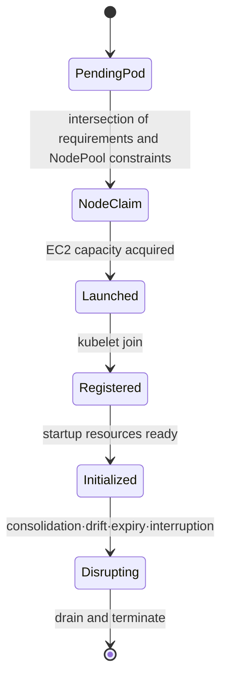
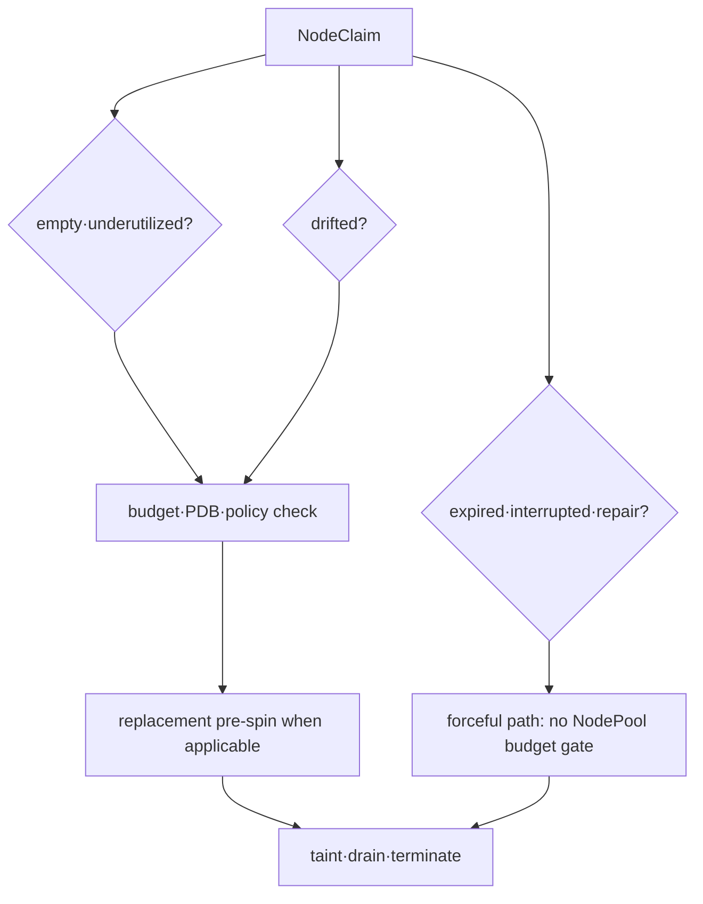

# Provisioning과 disruption model

## 이 장에서 처음 쓰는 말

- **provisioning**: workload를 실행할 수 있도록 새 compute resource를 선택하고 준비하는 과정이다. **왜 필요한가요 · 언제 쓰나요:** 실행 조건에 맞는 워크로드가 기존 Node에 들어가지 못할 때 계산 용량을 공급한다.
- **requirement**: Pod나 NodePool이 허용하거나 요구하는 CPU architecture, zone, capacity type 같은 조건이다. **왜 필요한가요 · 언제 쓰나요:** 호환되지 않는 하드웨어·가용 영역·구매 옵션에 워크로드가 배치되는 것을 막는다.
- **capacity type**: EC2를 On-Demand나 Spot 같은 구매 방식으로 구분한 값이다. **왜 필요한가요 · 언제 쓰나요:** 계산 자원을 선택할 때 워크로드의 중단 허용도와 구매 조건을 함께 판단한다.
- **consolidation**: workload를 더 적은 Node로 안전하게 옮길 수 있을 때 불필요한 Node를 줄이는 동작이다. **왜 필요한가요 · 언제 쓰나요:** 남은 배치가 워크로드를 유지할 수 있음을 확인한 뒤 유휴 용량 비용을 줄인다.
- **PDB**: 자발적인 중단 중 동시에 사용할 수 없게 되어도 되는 Pod 수를 제한하는 Kubernetes 정책이다. **왜 필요한가요 · 언제 쓰나요:** 계획된 유지 관리 중 동시 자발적 퇴거를 제한해 워크로드의 가용성 요구를 반영한다.
- **graceful termination**: process가 진행 중인 일을 정리할 시간을 주고 종료하는 절차다. **왜 필요한가요 · 언제 쓰나요:** 프로세스를 멈추기 전에 진행 중인 작업을 끝내거나 복구 지점을 남길 시간을 준다.

처음에는 Node를 만드는 경로와 Node를 없애는 경로를 따로 본다. 빠르게 만들 수 있다는 사실만으로 안전하게 줄일 수 있는 것은 아니며 두 경로의 성공 증거도 다르다.

## 먼저 이해하기

Kubernetes scheduler가 Pod를 놓을 node를 찾지 못하면 Pod는 Pending에 남는다. Karpenter는 그 Pending Pod들의 CPU·memory request, architecture, zone, taint·toleration과 volume topology를 모아 “어떤 새 node라면 이 Pod들을 실행할 수 있는가?”를 계산한다. EC2 capacity를 확보해 node가 cluster에 등록되면 scheduler가 다시 Pod를 배치한다.

여기서 Karpenter가 scheduler를 대신하는 것은 아니다. scheduler는 존재하는 node에 Pod를 bind하고, Karpenter는 요구를 만족할 node capacity가 없을 때 공급한다.

| resource | 사람이 선언하는 것 | controller가 구체화하는 것 |
|---|---|---|
| Pod | request와 scheduling constraint | 필요한 capacity의 입력 |
| NodePool | 허용 범위·limit·disruption policy | 어떤 NodeClaim을 만들 수 있는지 |
| EC2NodeClass | AWS subnet·AMI·role·storage 선택 | EC2 launch 설정 |
| NodeClaim | 한 node의 구체적 요구와 상태 | instance launch·register·terminate 수명주기 |
| Node | Kubernetes가 보는 실행 capacity | scheduler가 Pod를 배치할 대상 |

예를 들어 Pod가 arm64를 요구하지만 NodePool이 amd64만 허용하면 둘의 교집합이 없다. AWS에 arm64 instance가 충분해도 provisioning되지 않는다. 반대로 instance type을 하나만 허용하면 요구 조건은 맞아도 그 zone에 capacity가 없어 launch가 실패할 수 있다. constraint의 정확성과 선택지의 폭을 함께 설계해야 한다.

## 기다리는 Pod가 실행되기까지 한 단계씩 보기

1. scheduler가 기존 Node를 살펴보지만 Pod의 CPU·memory·배치 조건을 모두 만족하는 곳을 찾지 못한다.
2. Pod가 Pending 상태로 남고 배치되지 못한 이유가 event에 기록된다.
3. Karpenter가 Pending Pod의 requirement와 허용된 NodePool 조건의 교집합을 계산한다.
4. EC2NodeClass의 subnet·security group·AMI·role 조건을 사용해 만들 수 있는 EC2 선택지를 찾는다.
5. 구체적인 Node 하나의 요청인 NodeClaim을 만들고 EC2 instance 시작을 요청한다.
6. instance가 cluster에 Node로 등록되고 필요한 startup resource가 준비된다.
7. Kubernetes scheduler가 새 Node에 Pod를 배치한다.

Karpenter는 3~6단계에서 capacity를 준비한다. 마지막 Pod 배치는 Kubernetes scheduler가 하므로 두 구성 요소의 log와 event를 함께 봐야 한다.

## 세 resource의 책임

- **NodePool**: 허용할 requirement, taint, limit, disruption policy와 template를 정의한다.
- **EC2NodeClass**: AMI, subnet, security group, role, storage와 EC2-specific discovery를 정의한다.
- **NodeClaim**: 한 node capacity 요청의 구체화된 수명주기다. 일반적으로 controller가 만들고 관리한다.

Pod requests가 없거나 실제 사용량보다 지나치게 작으면 Karpenter의 bin-packing 판단도 잘못된 입력을 받는다. node selector, required affinity, topology spread, toleration과 volume topology는 가능한 offering을 좁힌다. NodePool requirement와 Pod requirement의 교집합이 비면 provisioning되지 않는다.

## Capacity type과 diversification

Karpenter는 환경과 설정에 따라 reserved, spot, on-demand capacity type requirement를 사용할 수 있다. Spot은 interruption을 수용할 workload와 넓은 instance family·size·zone 선택으로 설계한다. critical stateful workload에 비용 이유만으로 Spot을 강제하지 않는다.

## Disruption의 종류

Consolidation과 drift는 NodePool 중단 예산을 따르는 점진적 중단 방식이다. 만료, 인스턴스 회수, 노드 복구는 강제 중단 방식이다. 이들의 시작 속도는 그 예산으로 제한되지 않으며 정상 대체 노드를 기다리지 않고 드레이닝할 수 있다. 노드 생성 시기를 분산하고 실제 종료 기한 안에 애플리케이션이 종료되는지 시험한다. 예산 1이 동시에 만료된 노드를 하나씩만 드레이닝한다는 보장은 아니다.

PDB는 eviction 요청을 제한하지만 제공자가 인스턴스를 회수하는 것을 막을 수는 없다. 노드 `terminationGracePeriod` 설정도 남은 Pod를 강제 삭제해 드레이닝을 끝낼 수 있다. PDB, Pod 종료 유예 시간, 큐 인계, 노드·제공자의 기한을 별도 경계로 시험한다.

## 관측과 비용

Kubernetes event, Karpenter controller log·metric, NodeClaim condition, Pod scheduling event와 EC2 instance identity를 같은 timestamp로 연결한다. provisioning latency, pending duration, failed launch, interruption, consolidation savings뿐 아니라 rescheduling 오류와 SLO impact를 본다.

## 스스로 설명해 보기

1. EC2NodeClass와 NodePool을 분리하면 어떤 변경 경계를 얻는가?
2. Pod request 오류가 node 비용과 안정성에 동시에 영향을 주는 이유는 무엇인가?
3. PDB가 허용해도 application shutdown이 실패할 수 있는 이유는 무엇인가?

<!-- source: https://karpenter.sh/docs/concepts/nodepools/ | checked: 2026-09-03 | api-version: karpenter.sh/v1 -->
<!-- source: https://karpenter.sh/docs/concepts/nodeclasses/ | checked: 2026-09-03 | api-version: karpenter.sh/v1 -->
<!-- source: https://karpenter.sh/docs/concepts/nodeclaims/ | checked: 2026-09-03 | api-version: karpenter.sh/v1 -->
<!-- source: https://karpenter.sh/docs/concepts/disruption/ | checked: 2026-09-03 | api-version: karpenter.sh/v1 -->
<!-- source: https://karpenter.sh/docs/concepts/scheduling/ | checked: 2026-09-03 | api-version: karpenter.sh/v1 -->
<!-- source: https://karpenter.sh/docs/concepts/disruption/ | checked: 2026-09-10 | scope: graceful versus forceful disruption -->
