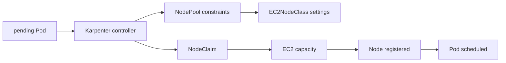

# Karpenter 심화 로드맵

## 처음 보는 사람을 위한 출발점

Kubernetes에 Pod를 만들었지만 실행할 Node에 CPU나 메모리가 부족하면 Pod는 `Pending`, 즉 배치되지 못하고 기다리는 상태가 된다. 사람이 EC2 서버를 추가할 수도 있지만 요청이 갑자기 늘고 줄 때마다 수동으로 맞추기는 어렵다. Karpenter는 기다리는 Pod의 요구를 읽고 적합한 AWS EC2 자원을 선택해 Node를 준비한다.

| 처음 만나는 말 | 학습용 쉬운 뜻 | 왜 필요한가요 · 언제 쓰나요 |
|---|---|---|
| Pod | Kubernetes가 함께 실행하고 관리하는 컨테이너 묶음 | 밀접하게 연결된 컨테이너를 같은 곳에 배치하고 함께 관리할 때 쓴다. **구체적인 상황(가상 예시):** API와 보조 프로세스가 로컬 파일과 수명을 공유해야 한다. → 밀접한 컨테이너를 한 Pod에 배치한다. → 공유 볼륨 접근과 재시작 동작을 확인한다. |
| Node | Pod가 실제로 실행되는 서버 | 워크로드가 실행될 계산 자원과 호스트 장애의 위치를 파악할 때 필요하다. **구체적인 상황(가상 예시):** 이미지가 다른 여러 Pod가 함께 실패한다. → 이들이 공유하는 Node의 상태와 자원을 조사한다. → 실패가 해당 호스트에 집중되는지 확인한다. |
| 스케줄러(scheduler) | 어떤 Pod를 어느 Node에 둘지 결정하는 Kubernetes 구성 요소 | 대기 중인 Pod를 선언된 자원·제약에 맞는 Node에 배치할 때 필요하다. **구체적인 상황(가상 예시):** CPU가 남아 보이는데 Pod는 Pending이다. → 스케줄러 이벤트와 모든 배치 조건을 조사한다. → 실제로 충족하지 못한 요구를 찾는다. |
| 요청량(request) | Pod가 실행되기 위해 필요하다고 선언한 CPU·메모리 양 | 배치와 용량 계획이 막연한 추측 대신 선언한 자원 요구를 기준으로 동작하도록 한다. **구체적인 상황(가상 예시):** Pod가 빽빽하게 배치돼 메모리 압박을 겪는다. → 선언한 request와 대표 사용량을 비교한다. → 조정한 요구량과 배치 결과를 시험한다. |
| NodePool | Karpenter가 만들 수 있는 Node의 공통 조건과 한도 | Karpenter가 만들 수 있는 Node의 범위를 정해 자원 공급이 운영 정책을 따르게 한다. **구체적인 상황(가상 예시):** Karpenter가 의도한 하드웨어 정책 밖의 Node를 제안한다. → NodePool 조건과 한도를 조사한다. → 남은 선택지가 워크로드에 맞는지 확인한다. |
| NodeClaim | 특정 Node 하나가 필요하다는 Karpenter의 구체적인 요청 | 자원 공급 시도 하나를 요청한 용량부터 생성된 Node까지 추적할 때 쓴다. **구체적인 상황(가상 예시):** 대기 작업이 자원 공급을 유발했지만 사용할 Node가 없다. → NodeClaim의 수명을 조사한다. → 공급·등록 중 실패한 단계를 찾는다. |
| 중단(disruption) | 교체·통합·만료 등을 위해 실행 중인 Node를 안전하게 비우고 없애는 과정 | 워크로드 가용성을 고려하는 퇴거 절차로 Node를 교체·제거할 때 쓴다. **구체적인 상황(가상 예시):** Node 교체가 처리 중인 요청을 끊는다. → 중단 조건과 퇴거 동작을 검토한다. → 제거 전에 대체 용량과 요청 연속성을 확인한다. |

이 과정은 Kubernetes scheduling과 AWS 기초를 배운 뒤 진행한다. 처음에는 `Pod가 기다림 → Node 요청 생성 → EC2 시작 → Pod 실행` 한 경로만 따라가고, 그다음 비용 절감을 위한 Node 제거가 서비스에 미치는 영향을 배운다.

## 이 과정만 심화인 이유

Karpenter는 pending Pod의 scheduling 요구를 AWS compute capacity 선택과 직접 연결한다. Kubernetes scheduler, EKS, IAM, EC2 capacity와 비용·disruption을 모두 이해한 뒤 다뤄야 하므로 기본 과정과 분리한다.

## 선수 지식

- [Kubernetes scheduling](../../content/kubernetes/07-scheduling-and-autoscaling.md)의 requests, affinity, taint와 topology
- AWS IAM, subnet·security group, EC2 purchase options와 EKS
- SLO·PDB·RPO/RTO·cost budget

## 학습 순서

1. **Provisioning·disruption model**: NodePool, EC2NodeClass와 NodeClaim의 책임을 구분한다.
2. **Pending Pod·consolidation 실습**: capacity 수렴과 disruption 결과를 event·node·AWS resource에서 확인한다.

## 완료

이 주제는 한 번 읽고 끝내지 않는다. 먼저 용어 표를 자신의 말로 바꾸고, 개념 장에서 한 요청의 흐름을 따라간다. 실습에서는 정상 상태를 먼저 기록한 뒤 조건 하나만 바꿔 실패를 만들고, 증거로 원인을 설명한 뒤 복구한다. 마지막으로 아래 운영 판단 질문에 답하면서 더 복잡한 환경으로 확장한다.

- Pod requirement와 NodePool constraint의 intersection을 설명한다.
- Spot·On-Demand 선택, diversification과 fallback 정책을 정의한다.
- consolidation, drift, expiry와 interruption에서 PDB·graceful termination의 영향을 검증한다.

## 범위 밖

다른 autoscaler 제품 비교, custom provider 개발과 모든 EC2 instance type 최적화는 포함하지 않는다.

## 버전 주의

확인일 현재 공식 current 문서는 `karpenter.sh/v1`의 NodePool과 NodeClaim 예제를 사용한다. 그러나 Karpenter release, Kubernetes·EKS version과 AWS provider 설정의 호환성은 설치 환경마다 다시 확인해야 한다. 이 문서의 YAML을 특정 클러스터에 그대로 적용할 수 있다는 의미는 아니다.

## 처음 이해했는지 확인

1. Pod가 `Pending`이라는 것은 무엇을 뜻하는가?
2. scheduler와 Karpenter는 각각 어떤 결정을 하는가?

**확인 기준:** Pending에는 스케줄링 대기와 이미지 다운로드 같은 컨테이너 준비 대기가 모두 포함된다. 용량을 진단하기 전에 `PodScheduled`, `spec.nodeName`, 이벤트를 확인한다. 스케줄러는 Pod를 노드에 바인딩하고, Karpenter는 조건에 맞지만 스케줄할 수 없는 Pod를 위한 용량을 공급한다.

## 운영 판단으로 확장하기

1. Karpenter가 Pod를 직접 node에 bind하는 scheduler가 아닌 이유는 무엇인가?
2. 가장 싼 instance 하나만 허용하면 provisioning reliability가 낮아질 수 있는 이유는 무엇인가?
3. node 수가 줄었다는 사실만으로 consolidation 성공을 판정할 수 없는 이유는 무엇인가?

<!-- source: https://karpenter.sh/docs/concepts/ | checked: 2026-09-03 | api-version: karpenter.sh/v1 -->
<!-- source: https://karpenter.sh/docs/concepts/nodepools/ | checked: 2026-09-03 | api-version: karpenter.sh/v1 -->
<!-- source: https://karpenter.sh/docs/concepts/nodeclaims/ | checked: 2026-09-03 | api-version: karpenter.sh/v1 -->
