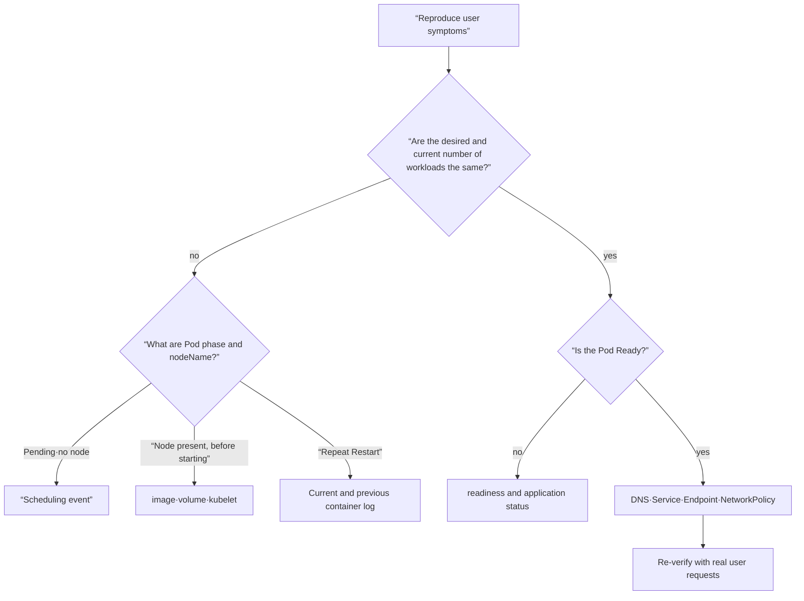
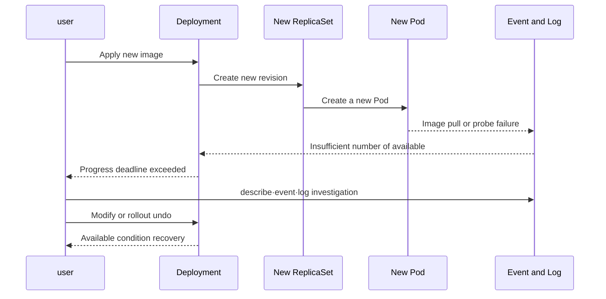

# 09. 관측과 트러블슈팅

<!-- source: https://kubernetes.io/docs/reference/kubectl/generated/kubectl_debug/ | checked: 2026-09-10 | copied Pod image replacement -->

좋은 트러블슈팅은 명령어를 많이 아는 것이 아니라 **증상을 재현하고 실패 계층을 빠르게 반으로 나누는 과정**이다. 먼저 사용자 영향을 확인하고, 원하는 상태와 현재 상태의 차이를 찾은 뒤, event·log·metric을 시간순으로 연결한다.

## 도구마다 답하는 질문이 다르다

| 증거 | 답하는 질문 | 대표 명령 |
|---|---|---|
| `get` | 어떤 리소스가 지금 어떤 요약 상태인가? | `kubectl get deploy,rs,pod` |
| YAML·jsonpath | API가 알고 있는 원본 필드는 무엇인가? | `kubectl get pod -o yaml` |
| `describe` | condition, 컨테이너 state, 최근 event는 무엇인가? | `kubectl describe pod` |
| event | scheduler·kubelet·controller가 무엇을 시도했나? | `kubectl get events` |
| log | 애플리케이션과 컨테이너가 무엇을 기록했나? | `kubectl logs --previous` |
| metric | 자원과 지연이 언제부터 얼마나 변했나? | `kubectl top`, 관측 시스템 |

event는 영구 감사 로그가 아니며 반복 event가 합쳐질 수 있다. 장애 타임라인이 필요하면 로그와 metric을 중앙 수집하고 시간 동기화·보존 정책을 준비한다.

## 증상에서 실패 계층으로 이동하기



항상 상위 controller부터 내려간다. Pod 하나만 고치려 하면 Deployment가 다시 덮어쓰거나 새 Pod로 교체한다. 반대로 클러스터 전체 장애가 아닌데 노드부터 들어가면 조사 범위가 불필요하게 커진다.

## 기본 진단 루프

```bash
kubectl config current-context
kubectl get namespace
kubectl get deployment,replicaset,pod -n <namespace> -o wide
kubectl describe deployment <name> -n <namespace>
kubectl describe pod <pod-name> -n <namespace>
kubectl get events -n <namespace> --sort-by=.metadata.creationTimestamp
kubectl logs <pod-name> -n <namespace> -c <container-name>
kubectl logs <pod-name> -n <namespace> -c <container-name> --previous
```

context와 Namespace를 첫 줄에서 확인하는 이유는 잘못된 클러스터를 보고 내린 결론이 기술적으로 완벽해도 쓸모없기 때문이다. 읽기 명령에서 시작하고, 수정 전에 현재 YAML과 변경 diff를 보존한다.

## 자주 만나는 상태를 정확히 읽기

### Pending

Pod가 scheduler에 의해 노드에 배치되지 못했거나, 배치는 됐지만 volume 준비 등 시작 전 단계일 수 있다. `spec.nodeName`과 event를 확인한다. `FailedScheduling`이면 requests, taint, affinity, PVC topology를 본다.

### ImagePullBackOff

이미지 이름·tag·digest, registry DNS와 네트워크, imagePullSecret, pull rate limit을 확인한다. BackOff는 원인이 아니라 실패 재시도 간격이 늘어난 상태다. 구체적 원인은 event에 있다.

### CrashLoopBackOff

컨테이너가 시작된 뒤 종료되고 재시작이 반복된다. 현재 로그만 보면 새 인스턴스의 빈 로그일 수 있으므로 `--previous`, 종료 reason과 code, 명령어·args·환경·mount를 확인한다. OOMKilled면 메모리 limit뿐 아니라 누수, startup peak, tmpfs 사용도 본다.

### Running이지만 NotReady

프로세스는 실행 중이지만 readiness 조건을 통과하지 못했다. Service 엔드포인트와 사용자 트래픽에서 빠질 수 있다. probe path·port·timeout과 실제 앱 준비 상태를 함께 확인한다.

## 실행 예제: 실패한 rollout 진단하기

`broken.yaml`을 만든다.

```yaml
apiVersion: apps/v1
kind: Deployment
metadata:
  name: broken-web
spec:
  replicas: 2
  progressDeadlineSeconds: 60
  selector:
    matchLabels:
      app: broken-web
  template:
    metadata:
      labels:
        app: broken-web
    spec:
      containers:
        - name: web
          image: nginx:this-tag-does-not-exist
          ports:
            - containerPort: 80
          readinessProbe:
            httpGet:
              path: /
              port: 80
```

```bash
kubectl apply -f broken.yaml
kubectl rollout status deployment/broken-web --timeout=75s
kubectl get deployment,replicaset,pod -l app=broken-web
kubectl describe deployment broken-web
kubectl describe pod -l app=broken-web
kubectl get events --sort-by=.metadata.creationTimestamp
```

진단 가설은 “애플리케이션이 crash했다”가 아니라 “컨테이너가 시작되기 전 이미지 가져오기에서 실패했다”여야 한다. 그래서 log보다 event가 먼저다.

```bash
kubectl set image deployment/broken-web web=nginx:1.27-alpine
kubectl rollout status deployment/broken-web
kubectl get pods -l app=broken-web
kubectl delete deployment broken-web
```

## rollout 장애의 시간선



rollout 상태는 controller 관점의 진행 여부다. 복구 뒤에는 `Available=True`만 보지 말고 실제 사용자 경로로 요청을 보내고 error rate와 latency가 회복됐는지 확인한다.

## Service 경로 진단

```bash
kubectl get service <service> -o yaml
kubectl get endpointslice -l kubernetes.io/service-name=<service> -o wide
kubectl get pods -l <selector> -o wide --show-labels
kubectl run netcheck --rm -it --restart=Never --image=curlimages/curl -- \
  curl -v http://<service>:<port>/health
```

Service에 엔드포인트가 없으면 먼저 selector와 readiness다. 엔드포인트는 있는데 timeout이면 targetPort, Pod 리스너, NetworkPolicy, CNI와 노드 경로로 이동한다. 한 Pod IP로 직접 시험하는 것은 계층을 나누는 진단일 뿐, Service를 우회하는 운영 해법이 아니다.

## distroless 이미지와 `kubectl debug`

운영 이미지에 shell과 패키지 관리자를 억지로 넣지 않아도 된다. 이미지에 도구가 없거나 프로세스가 너무 빨리 crash하면 ephemeral debug 컨테이너나 복제 Pod를 사용할 수 있다.

```bash
kubectl debug -it <pod-name> --image=busybox:1.36 --target=<container-name>
kubectl debug <pod-name> -it --copy-to=<pod-name>-debug \
  --set-image=<container-name>=busybox:1.36 --container=<container-name> -- sh
```

이 기능에는 강한 권한과 민감 데이터 노출 위험이 따를 수 있다. 누가 언제 debug 컨테이너를 만들 수 있는지 RBAC과 감사 정책으로 제한하고, 만들어진 debug Pod를 정리한다.

## metric, log, trace를 사용자 영향에 연결하기

CPU가 높다는 사실만으로 장애 원인을 확정할 수 없다. 사용자 요청량, error rate, latency, queue 대기, saturation과 같은 신호를 같은 시간축에 놓는다.

- **metric**은 범위와 변화 시점을 빠르게 찾는다.
- **log**는 특정 실패의 문맥과 값을 찾는다.
- **trace**는 여러 서비스와 구간 중 시간이 소비된 곳을 찾는다.
- **Kubernetes 상태·event**는 orchestration 계층의 결정을 설명한다.

요청 ID와 trace ID는 로그와 트레이스에 둔다. 요청 지표에는 값의 범위가 제한된 워크로드, 네임스페이스, 환경 차원을 사용하고 개별 요청 ID를 지표 라벨로 넣지 않는다. Pod UID와 리비전은 인프라 진단에 유용하지만, 이들의 잦은 변경에도 시계열 수 예산과 보존 정책이 필요하다.

## 조사 중 흔한 실수

- 재현과 증거 보존 전에 Pod를 지워 이전 상태를 잃는다.
- 최신 event 한 줄만 보고 더 이른 원인을 놓친다.
- `Running`을 서비스 정상으로 해석한다.
- 평균 CPU만 보고 OOM, throttling, queue와 p99 지연을 놓친다.
- 임시 `kubectl edit`로 복구하고 Git 정본을 갱신하지 않는다.
- 원인이 불명확한데 재시작으로 증상만 지운다.

## 실행 결과 예시

의도적으로 잘못 지정한 이미지의 예시 출력이다.

```text
# rollout status ... --timeout=75s
error: timed out waiting for the condition
# describe pod / events
Warning  Failed  ... failed to pull image ...
Warning  BackOff  ... Back-off pulling image ...
# After set image ... nginx:1.27-alpine
deployment "broken-web" successfully rolled out
```

이미지 받기 실패는 애플리케이션 시작 전에 발생하므로 애플리케이션 로그가 없는 것이 정상이다. 원인을 단정하기 전에 이벤트 사유를 레지스트리 인증, DNS, 이미지 이름 실패와 대조한다. 복구에는 의도한 이미지와 준비된 Pod, 관련 요청 검증이 모두 필요하며 명령 종료만으로는 부족하다.

## 스스로 설명해 보기

1. ImagePullBackOff에서 `kubectl logs`보다 event가 먼저인 이유는 무엇인가?
2. Running Pod가 사용자 요청을 전혀 받지 못할 수 있는 경로 두 가지는 무엇인가?
3. `logs --previous`가 CrashLoopBackOff에서 중요한 이유는 무엇인가?
4. controller condition이 회복된 뒤에도 실제 사용자 요청을 검증해야 하는 이유는 무엇인가?

[← 보안과 정책](../../content/kubernetes/08-security-and-policy.md) · [프로덕션 운영과 확장 →](../../content/kubernetes/10-production-and-extension.md)

<!-- source: https://kubernetes.io/ko/docs/tasks/debug/debug-application/ | checked: 2026-09-03 -->
<!-- source: https://kubernetes.io/ko/docs/tasks/debug/debug-application/debug-running-pod/ | checked: 2026-09-03 -->
<!-- source: https://kubernetes.io/ko/docs/tasks/debug/debug-cluster/ | checked: 2026-09-03 -->
<!-- source: https://kubernetes.io/ko/docs/concepts/workloads/pods/pod-lifecycle/ | checked: 2026-09-03 -->
<!-- source: https://kubernetes.io/ko/docs/concepts/cluster-administration/system-logs/ | checked: 2026-09-03 -->
