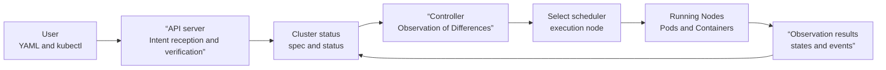
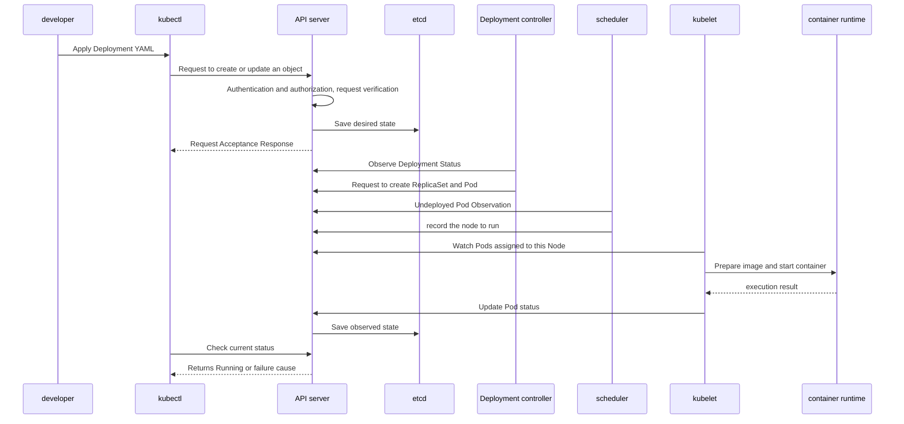

# 쿠버네티스 전체 학습 로드맵

## 처음 보는 사람을 위한 출발점

애플리케이션을 컨테이너 하나로 실행하는 데 성공했다고 가정하자. 사용자가 늘어 같은 컨테이너를 세 개 실행해야 하고, 하나가 멈추면 자동으로 교체하고, 새 version을 서비스 중단 없이 배포하려면 여러 상태를 계속 확인해야 한다. Kubernetes는 이 반복 운영을 API와 controller로 자동화한다.

| 처음 만나는 말 | 학습용 쉬운 뜻 | 왜 필요한가요 · 언제 쓰나요 |
|---|---|---|
| 컨테이너(container) | 애플리케이션 프로세스와 실행에 필요한 파일을 격리해 실행하는 단위 | 의존성과 격리된 프로세스를 함께 구성해 애플리케이션 실행 환경을 재현할 때 쓴다. **구체적인 상황(가상 예시):** 노트북에서는 API가 실행되지만 서버에는 필요한 라이브러리가 없다. → 의존성을 컨테이너 이미지에 담는다. → 깨끗한 환경에서 시작되는지 확인한다. |
| 이미지(image) | 컨테이너를 만들 때 사용하는 읽기 전용 실행 재료 | 개발·시험·운영 환경에 검토한 동일한 애플리케이션 내용을 배포할 때 쓴다. **구체적인 상황(가상 예시):** 같은 태그인데 서버 두 대에서 서로 다른 빌드가 실행된다. → 검토한 이미지 digest로 배포한다. → 실행 중인 이미지 식별자를 비교한다. |
| 클러스터(cluster) | Kubernetes가 함께 관리하는 control plane과 여러 서버의 집합 | 여러 서버의 애플리케이션 배치와 복구를 함께 조정할 때 필요하다. **구체적인 상황(가상 예시):** 서버 한 대가 고장 나도 애플리케이션을 제공해야 한다. → 클러스터의 적합한 Node들에 복제본을 나눈다. → 시험 Node 하나를 중단하고 요청 복구를 확인한다. |
| 노드(Node) | 컨테이너가 실제로 실행되는 서버 | 워크로드가 실행될 계산 자원과 호스트 장애의 위치를 파악할 때 필요하다. **구체적인 상황(가상 예시):** 이미지가 다른 여러 Pod가 함께 실패한다. → 이들이 공유하는 Node의 상태와 자원을 조사한다. → 실패가 해당 호스트에 집중되는지 확인한다. |
| 파드(Pod) | Kubernetes가 한 Node에 함께 배치하고 관리하는 컨테이너 묶음 | 밀접하게 연결된 컨테이너를 같은 곳에 배치하고 함께 관리할 때 쓴다. **구체적인 상황(가상 예시):** API와 보조 프로세스가 로컬 파일과 수명을 공유해야 한다. → 밀접한 컨테이너를 한 Pod에 배치한다. → 공유 볼륨 접근과 재시작 동작을 확인한다. |
| 네임스페이스(Namespace) | 한 클러스터 안에서 관련 resource의 이름·조회·권한·정책 범위를 나누는 논리적 경계 | 클러스터 안에서 팀별 자원을 정리하고 이름·권한·할당량의 적용 범위를 나눌 때 쓴다. **구체적인 상황(가상 예시):** 두 팀이 모두 api라는 이름으로 배포한다. → 팀별 Namespace와 범위가 제한된 권한을 준다. → 이름 조회와 접근 권한을 각각 확인한다. |
| kubectl | 사용자가 Kubernetes API에 조회·변경 요청을 보내는 명령행 도구 | 워크로드 문제를 진단하면서 클러스터 객체를 조회하고 선언한 변경을 전달할 때 쓴다. **구체적인 상황(가상 예시):** 배포 후 Pod가 Pending에 머문다. → kubectl로 상세 정보와 이벤트를 조회한다. → 자원을 바꾸기 전에 기록된 스케줄링 사유를 찾는다. |
| 원하는 상태(desired state) | “Pod 세 개가 계속 준비돼 있어야 한다”처럼 사용자가 선언한 목표 | 컨트롤러가 목표와 실제 상태를 비교해 차이를 반복해서 복구하게 할 때 쓴다. **구체적인 상황(가상 예시):** Deployment는 복제본 세 개를 요구하지만 두 개만 준비됐다. → 목표와 관측 상태를 비교한다. → 조정 후 정상 복제본 세 개로 복구되는지 본다. |

처음에는 local 클러스터에 웹 서버 한 개를 배포하고, Pod를 지웠을 때 왜 새 Pod가 생기는지만 확인한다. 그 경험 위에서 API object, controller, scheduler와 네트워크를 차례로 배운다.

쿠버네티스는 **컨테이너화된 애플리케이션의 배포, 확장과 관리를 자동화하는 오픈소스 플랫폼**이다. 하지만 이 한 문장만 외우면 왜 API 오브젝트와 컨트롤러가 필요한지 이해하기 어렵다. 이 과정은 쿠버네티스를 “명령을 순서대로 실행하는 도구”가 아니라 **원하는 상태와 실제 상태의 차이를 계속 줄이는 시스템**으로 이해하는 데서 시작한다.

이 문서만 읽어도 전체 구조를 잡을 수 있도록 원자료의 링크 목록을 그대로 옮기지 않았다. 이후 장도 같은 방식으로 외부 페이지를 대신하는 설명, 다이어그램, 실행 예시와 실패 사례를 내부에 축적한다.

## 한 문장 모델

> 사용자는 API에 원하는 상태를 선언하고, 쿠버네티스의 여러 제어 루프는 현재 상태를 관찰해 그 차이가 없어질 때까지 실제 자원을 조정한다.

이 그림에서 가장 중요한 화살표는 마지막의 **관측 결과 → 클러스터 상태**다. 한 번 실행하고 끝나는 스크립트라면 실패 뒤에 사람이 다시 실행해야 한다. 쿠버네티스는 실제 결과를 다시 상태로 받아 다음 조정의 입력으로 사용한다.

## 컨테이너만으로 부족해지는 순간

컨테이너 런타임은 한 머신에서 이미지를 내려받고 프로세스를 실행하는 일을 잘한다. 그러나 서비스가 여러 머신과 여러 복제본으로 늘어나면 다음 질문은 런타임 하나가 답하지 못한다.

- 컨테이너가 죽었을 때 누가 다시 만들 것인가?
- 복제본 세 개를 어느 머신에 배치할 것인가?
- 교체될 때마다 IP가 달라지는 인스턴스를 클라이언트가 어떻게 찾을 것인가?
- 새 버전을 몇 개씩 교체하고, 실패하면 어떻게 이전 버전으로 돌아갈 것인가?
- CPU와 메모리가 부족할 때 무엇을 먼저 배치하고 무엇을 축출할 것인가?

쿠버네티스는 이 문제를 개별 명령 모음이 아니라 API 오브젝트와 제어 루프로 푼다. 예를 들어 `replicas: 3`인 Deployment는 “Pod 세 개를 지금 만들라”는 일회성 명령이 아니다. **세 개가 존재해야 한다는 지속적인 의도**다. 한 개가 사라져 실제 개수가 두 개가 되면 컨트롤러가 차이를 발견하고 새 Pod 생성을 요청한다.

## 쿠버네티스가 제공하는 자동화

| 문제 | 쿠버네티스의 기본 해법 | 이후 자세히 볼 장 |
|---|---|---|
| 여러 복제본의 생성과 교체 | Deployment 같은 워크로드 컨트롤러 | [Pod와 워크로드](../../content/kubernetes/04-pods-and-workloads.md) |
| 바뀌는 Pod 주소에 안정적으로 접근 | Service, EndpointSlice와 DNS | [Service와 네트워킹](../../content/kubernetes/05-services-and-networking.md) |
| 데이터와 설정의 수명 분리 | Volume, PV/PVC, ConfigMap과 Secret | [스토리지와 애플리케이션 구성](../../content/kubernetes/06-storage-and-configuration.md) |
| 적절한 노드 선택과 자원 배분 | scheduler, requests와 배치 제약 | [스케줄링과 리소스·오토스케일링](../../content/kubernetes/07-scheduling-and-autoscaling.md) |
| API 접근과 실행 권한 제한 | 인증·인가, RBAC와 보안 정책 | [보안과 정책](../../content/kubernetes/08-security-and-policy.md) |
| 장애 감지와 상태 복구 | probe, controller, event와 상태 관측 | [관측과 트러블슈팅](../../content/kubernetes/09-observability-and-troubleshooting.md) |

## 쿠버네티스가 대신하지 않는 것

쿠버네티스를 도입하면 운영의 모든 문제가 자동으로 사라지는 것은 아니다.

| 쿠버네티스가 하는 일 | 별도로 설계해야 하는 일 |
|---|---|
| 컨테이너 이미지 실행과 배치 | 애플리케이션 소스 빌드와 테스트 |
| 워크로드 복제본과 롤아웃 관리 | 데이터베이스 트랜잭션과 데이터 정합성 |
| 메트릭을 노출할 수 있는 기반 제공 | 조직에 맞는 모니터링·로그·알림 제품 선택 |
| Secret 오브젝트와 전달 메커니즘 제공 | 키 생성·회전·외부 비밀 저장소 운영 정책 |
| 장애 난 컨테이너나 Pod 교체 | 요청 멱등성, 사용자 오류 처리와 비즈니스 복구 |

즉, 쿠버네티스는 완성된 PaaS가 아니라 플랫폼을 만들 수 있는 구성 요소다. 선택권이 큰 만큼 네트워크 구현, 관측 도구, 배포 정책과 보안 기준은 운영자가 명시해야 한다.

## 배포 요청이 실제 컨테이너가 되기까지

다음 시퀀스는 세부 구현을 모두 나타내기보다 각 컴포넌트의 책임 경계를 보여준다. 컨트롤러, 스케줄러와 kubelet은 etcd를 직접 수정하지 않고 API 서버를 통해 상태를 읽고 갱신한다.

`kubectl apply`의 성공 응답은 컨테이너가 이미 정상이라는 뜻이 아니다. API가 요청을 받아 저장했다는 뜻에 가깝다. 실제 실행 여부는 뒤이어 갱신되는 `status`, condition과 event로 확인해야 한다.

## 같은 사건을 세 관점으로 읽기

“Pod 하나가 삭제됐다”는 사건은 어느 층을 보는지에 따라 의미가 달라진다.

1. **Pod 관점** — 기존 Pod의 수명은 끝났다. 같은 이름과 IP로 되살아나는 것이 아니다.
2. **Deployment 관점** — 원하는 복제본 수보다 하나 부족하므로 새 Pod를 만든다.
3. **Service 관점** — 준비되지 않은 기존 엔드포인트를 제외하고 새 Pod가 준비되면 대상에 포함한다.

이 구분을 이해하면 “쿠버네티스가 Pod를 부활시켰다”보다 정확하게 설명할 수 있다. 사라진 인스턴스를 복구한 것이 아니라 상위 컨트롤러가 **새 인스턴스로 원하는 상태를 다시 만족시킨 것**이다.

## 내부 학습 순서

| 순서 | 내부 문서 | 이 장에서 답할 질문 | 직접 확인할 결과 |
|---:|---|---|---|
| 1 | [왜 Kubernetes인가와 첫 클러스터](../../content/kubernetes/01-why-and-first-cluster.md) | 어떤 운영 문제를 해결하며 첫 애플리케이션은 어떻게 실행되는가? | 로컬 클러스터, Deployment와 Service |
| 2 | [API와 오브젝트](../../content/kubernetes/02-api-and-objects.md) | YAML이 어떻게 지속적인 시스템 의도가 되는가? | spec·status와 오브젝트 변경 |
| 3 | [클러스터 아키텍처와 제어 루프](../../content/kubernetes/03-cluster-architecture.md) | 누가 상태를 읽고 실제 자원을 바꾸는가? | API 요청부터 컨테이너 실행까지 추적 |
| 4 | [Pod와 워크로드](../../content/kubernetes/04-pods-and-workloads.md) | 수명주기별로 어떤 컨트롤러를 선택하는가? | 무상태·상태·배치 워크로드 |
| 5 | [Service와 네트워킹](../../content/kubernetes/05-services-and-networking.md) | 계속 바뀌는 Pod에 어떻게 안정적으로 접근하는가? | 내부·외부 요청 경로 |
| 6 | [스토리지와 애플리케이션 구성](../../content/kubernetes/06-storage-and-configuration.md) | 코드·설정·데이터의 수명을 어떻게 나누는가? | 설정과 영속 데이터 연결 |
| 7 | [스케줄링과 리소스·오토스케일링](../../content/kubernetes/07-scheduling-and-autoscaling.md) | 어느 노드에 놓고 몇 개까지 늘릴 것인가? | 배치 제약과 HPA |
| 8 | [보안과 정책](../../content/kubernetes/08-security-and-policy.md) | 누가 무엇을 실행하고 어디까지 통신할 수 있는가? | 최소 권한과 네트워크 정책 |
| 9 | [관측과 트러블슈팅](../../content/kubernetes/09-observability-and-troubleshooting.md) | 원하는 상태와 실제 상태가 왜 다른가? | 고장난 배포의 원인 추적 |
| 10 | [프로덕션 운영과 확장](../../content/kubernetes/10-production-and-extension.md) | 클러스터와 플랫폼 기능을 어떻게 오래 운영하는가? | 운영 체크리스트와 확장 방식 |

## 앞으로 링크를 받으면 하는 일

링크는 사이트에서 다시 연결할 목적지가 아니라 작성 근거다. 내용을 확인한 뒤 해당 내부 문서에 다음 요소를 넣는다.

1. 해결하는 문제를 설명하는 한 문장 모델
2. 관계·데이터·제어 흐름 다이어그램
3. 정상 동작을 추적하는 시퀀스 다이어그램
4. 그대로 실행할 수 있는 최소 YAML과 명령
5. 각 필드와 상태 변화의 상세 해설
6. 흔한 실패, 관측 신호와 복구 순서
7. 개발 환경과 프로덕션 환경의 선택 차이
8. 원리를 다시 설명하게 하는 복습 질문

원자료 URL과 확인일은 저장소 Markdown에 근거 메타데이터로 남기지만, 공개 본문은 그 링크를 읽지 않아도 이해되고 실습할 수 있어야 한다.

## 처음 이해했는지 확인

1. image와 실행 중인 컨테이너는 어떻게 다른가?
2. Pod를 직접 하나 실행하는 것과 Deployment에 `replicas: 1`을 선언하는 것은 실패 뒤 어떤 차이를 만드는가?

**확인 기준:** image는 실행 재료이고 컨테이너는 그것으로 만든 실행 instance라고 설명할 수 있으면 된다. Deployment의 원하는 상태가 남아 있으면 기존 Pod가 사라져도 controller가 새 Pod를 요청한다.

## 운영 판단으로 확장하기

1. `kubectl apply`가 성공해도 사용자 요청이 실패할 수 있는 이유는 무엇인가?
2. Pod, Deployment와 Service는 각각 어떤 상태를 소유하는가?
3. Kubernetes가 database transaction과 application 오류까지 자동으로 해결하지 못하는 이유는 무엇인가?

<!-- source: https://kubernetes.io/ko/docs/home/ | checked: 2026-09-03 -->
<!-- source: https://kubernetes.io/ko/docs/concepts/overview/ | checked: 2026-09-03 | translation-warning: true -->
<!-- source: https://kubernetes.io/ko/docs/concepts/overview/components/ | checked: 2026-09-03 | translation-warning: true -->
<!-- source: https://kubernetes.io/ko/docs/concepts/overview/working-with-objects/kubernetes-objects/ | checked: 2026-09-03 -->
