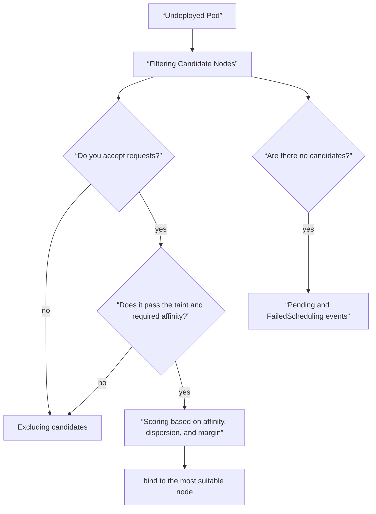
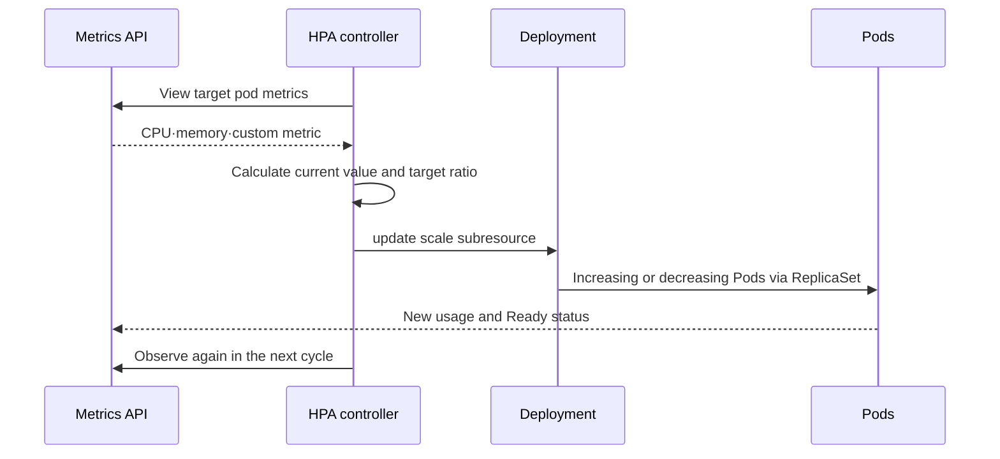

# 07. 스케줄링과 리소스·오토스케일링

스케줄링은 “지금 CPU 사용률이 낮은 노드”를 고르는 단순 문제가 아니다. Pod가 요구한 자원과 제약을 만족하는 노드를 찾고, 장애 도메인·선호도를 반영해 하나를 선택하는 과정이다. 배치 뒤에는 kubelet과 런타임이 limits를 집행하고, HPA 같은 제어 루프가 관측값을 보고 복제본 수를 바꾼다.

## requests와 limits를 먼저 구분한다

| 설정 | 주로 사용하는 주체 | 의미 |
|---|---|---|
| CPU request | scheduler, CPU contention 시 runtime | 배치에 예약할 CPU 양과 상대적 가중치 |
| memory request | scheduler | 배치에 예약할 메모리 양 |
| CPU limit | runtime과 커널 | 사용할 수 있는 CPU 시간의 상한, 초과 시 throttling 가능 |
| memory limit | runtime과 커널 | 메모리 상한, 초과 시 OOM 종료 가능 |

request는 비용 태그가 아니다. 실제 사용량이 낮아도 요청 합이 노드의 allocatable을 넘으면 새 Pod는 배치되지 않는다. 반대로 request를 지나치게 낮추면 scheduler가 과밀 배치하고, CPU 사용률 기반 HPA의 분모도 왜곡된다.

`400m` CPU는 0.4 CPU를 뜻하지만 `400m` 메모리는 0.4 byte라는 전혀 다른 값이다. 메모리는 `400Mi`처럼 단위를 명시한다.

## Scheduler의 결정 흐름



`nodeSelector`와 required node affinity는 반드시 만족해야 하는 조건이다. preferred affinity는 가능하면 따르는 선호다. Pod anti-affinity와 topology spread는 복제본을 노드·zone에 분산하지만, 제약이 너무 엄격하면 장애 시 남은 노드에 배치할 수 없다.

taint는 노드가 Pod를 밀어내는 조건이고 toleration은 그 taint를 **견딜 수 있음**을 나타낸다. toleration만으로 해당 노드를 선택하는 것은 아니므로 affinity나 selector와 함께 써야 전용 노드 배치가 된다.

## 배치 실패, 선점, 축출은 시점이 다르다

- **Pending**에는 스케줄되지 않은 Pod뿐 아니라 컨테이너 준비가 끝나지 않은 Pod도 포함된다. `nodeName`, `PodScheduled`, 이벤트를 확인한 뒤 스케줄링을 진단한다.
- **preemption**은 높은 우선순위 Pod를 배치하기 위해 낮은 우선순위 Pod 제거를 검토하는 scheduler 동작이다.
- **node-pressure eviction**은 실행 중인 노드의 메모리·디스크 등 압박 때문에 kubelet이 Pod를 축출하는 동작이다.
- **API-initiated eviction**은 drain 같은 관리 작업이 eviction API를 이용하는 경우다.
- **PodDisruptionBudget**은 자발적 중단에서 동시에 줄어들 수 있는 가용 Pod 수를 제한하지만 노드 장애 같은 모든 비자발적 장애를 막아주지는 않는다.

## 실행 예제: 배치 계약을 눈으로 확인하기

`schedule.yaml`을 만든다. `kubernetes.io/os: linux`는 일반적인 표준 노드 label이지만 실제 클러스터 label은 먼저 확인한다.

```yaml
apiVersion: apps/v1
kind: Deployment
metadata:
  name: compute-demo
spec:
  replicas: 3
  selector:
    matchLabels:
      app: compute-demo
  template:
    metadata:
      labels:
        app: compute-demo
    spec:
      affinity:
        nodeAffinity:
          requiredDuringSchedulingIgnoredDuringExecution:
            nodeSelectorTerms:
              - matchExpressions:
                  - key: kubernetes.io/os
                    operator: In
                    values: ["linux"]
      topologySpreadConstraints:
        - maxSkew: 1
          topologyKey: kubernetes.io/hostname
          whenUnsatisfiable: ScheduleAnyway
          labelSelector:
            matchLabels:
              app: compute-demo
      containers:
        - name: app
          image: nginx:1.27-alpine
          resources:
            requests:
              cpu: 100m
              memory: 64Mi
            limits:
              cpu: 500m
              memory: 128Mi
```

```bash
kubectl get nodes --show-labels
kubectl apply --dry-run=server -f schedule.yaml
kubectl apply -f schedule.yaml
kubectl get pods -l app=compute-demo -o wide
kubectl describe pod -l app=compute-demo
kubectl describe nodes
```

의도적으로 존재하지 않는 node label을 required 조건에 넣으면 Pod가 Pending이 된다. 이때 컨테이너 log가 아니라 Pod event의 `FailedScheduling`부터 읽는다.

## HPA는 지연이 있는 피드백 제어기다

HPA는 주기적으로 metric을 읽고 Deployment나 StatefulSet 같은 target의 scale을 조절한다. 기본적인 계산은 다음과 같은 비율이다.

`desired replicas = ceil(current replicas × current metric / target metric)`

예를 들어 현재 3개 Pod의 평균 CPU가 request 대비 80%이고 목표가 50%면 `ceil(3 × 80 / 50) = 5`를 제안한다. 실제 계산은 준비되지 않은 Pod, 누락 metric, tolerance, 최소·최대 복제본, 안정화 정책 등을 반영해 더 보수적으로 동작할 수 있다.



metric 수집, HPA reconcile, Pod scheduling, image pull, startup과 readiness까지 시간이 걸린다. HPA는 순간 spike를 즉시 흡수하는 버퍼가 아니다. queue, concurrency limit, timeout과 backpressure도 필요하다.

## HPA 예제

아래 리소스를 `schedule.yaml` 뒤에 추가한다. CPU resource metric을 쓰려면 클러스터에 resource metrics API가 제공되어야 한다.

```yaml
apiVersion: autoscaling/v2
kind: HorizontalPodAutoscaler
metadata:
  name: compute-demo
spec:
  scaleTargetRef:
    apiVersion: apps/v1
    kind: Deployment
    name: compute-demo
  minReplicas: 2
  maxReplicas: 10
  behavior:
    scaleDown:
      stabilizationWindowSeconds: 300
  metrics:
    - type: Resource
      resource:
        name: cpu
        target:
          type: Utilization
          averageUtilization: 60
```

```bash
kubectl apply -f schedule.yaml
kubectl get hpa compute-demo
kubectl describe hpa compute-demo
kubectl top pods -l app=compute-demo
```

HPA가 `unknown`을 표시하면 target Pod의 CPU request, metrics API와 selector를 확인한다. HPA가 복제본을 관리할 때 Git 매니페스트의 `spec.replicas`를 계속 덮어쓰는 자동화와 충돌하지 않도록 소유권을 정한다.

HPA를 덧붙일 때는 `---`로 YAML 문서를 분리한다. 여기에는 부하 발생기가 없으므로 HPA 조회를 실제 확장 시연으로 보면 안 된다. 선택 실습을 완료하려면 지표 비율, 권장 복제본 수, 결과 Ready 복제본, 하위 서비스 지연을 기록하고 선언한 부하 한도에서 중단한다. 이후 `kubectl delete -f schedule.yaml`로 실습 HPA와 Deployment를 삭제한다. 종료 코드 137만으로 알 수 있는 것은 SIGKILL이며 OOM의 증거는 아니다. 컨테이너 종료 사유와 노드 메모리 근거로 확인한다.

## 어떤 스케일러가 무엇을 바꾸는가

| 방식 | 조절 대상 | 해결하지 못하는 것 |
|---|---|---|
| HPA | Pod 복제본 수 | 한 Pod만 가능한 워크로드, downstream 고정 병목 |
| VPA | Pod request·limit 권고 또는 변경 | 복제본 수와 노드 자체 부족 |
| node autoscaling | 노드 수나 노드 자원 | 잘못된 Pod 제약, 앱 내부 병목 |

세 제어 루프를 함께 쓰면 관측 창과 변경 충돌을 시험해야 한다. Pod가 늘어도 DB 연결 limit, queue partition, 외부 API quota가 고정이면 병목이 이동할 뿐이다.

## 실패를 증상에서 원인으로 좁히기

| 증상 | 증거 | 다음 판단 |
|---|---|---|
| Pending + Insufficient cpu | Pod event, Node allocatable | request 조정 또는 용량 추가 |
| Pending + taint | event, node taint | 의도한 전용 노드인지 확인 후 toleration |
| OOMKilled | `describe pod`, 종료 코드 137 | 누수·peak 측정 후 request와 limit 검토 |
| CPU는 높고 지연 증가 | throttling metric, limit | CPU limit와 앱 concurrency 함께 점검 |
| HPA target unknown | `describe hpa`, metrics API | requests 누락 또는 metric 수집 실패 |
| replica가 계속 출렁임 | HPA condition과 metric 시계열 | noisy metric, startup, stabilization 검토 |

## 실행 결과 예시

스케줄링과 HPA 관찰의 예시다. 이 매니페스트는 지속적인 CPU 부하를 발생시키지 않는다.

```text
# If placement constraints cannot be met
PodScheduled=False
Warning  FailedScheduling  ... didn't match Pod's node affinity/selector
# HPA without working resource metrics
TARGETS
<unknown>/50%
# Worksheet only: 3 replicas, measured utilization 80%, target 50%
ceil(3 * 80 / 50) = 5 proposed replicas
```

알 수 없는 지표는 사용률 0이 아니다. 복제본 다섯 개라는 계산은 단순화한 예이며 실제 결과를 보장하지 않는다. 준비 상태, 누락된 지표, 허용 오차, 제한, 안정화 설정이 컨트롤러에 영향을 준다. 제약을 바꾸기 전에 실제 스케줄링 사유를 기록한다.

## 스스로 설명해 보기

1. 실제 CPU 사용률이 낮은데도 Pod가 `Insufficient cpu`로 Pending일 수 있는 이유는 무엇인가?
2. toleration을 추가해도 전용 노드에 반드시 배치되지 않는 이유는 무엇인가?
3. CPU request가 없는 컨테이너가 CPU utilization 기반 HPA에 문제를 만드는 이유는 무엇인가?
4. HPA가 복제본을 늘려도 응답 지연이 개선되지 않는 downstream 병목 예시는 무엇인가?

[← 스토리지와 구성](../../content/kubernetes/06-storage-and-configuration.md) · [보안과 정책 →](../../content/kubernetes/08-security-and-policy.md)

<!-- source: https://kubernetes.io/ko/docs/concepts/configuration/manage-resources-containers/ | checked: 2026-09-03 -->
<!-- source: https://kubernetes.io/ko/docs/concepts/scheduling-eviction/assign-pod-node/ | checked: 2026-09-03 -->
<!-- source: https://kubernetes.io/ko/docs/concepts/scheduling-eviction/taint-and-toleration/ | checked: 2026-09-03 -->
<!-- source: https://kubernetes.io/docs/tasks/run-application/horizontal-pod-autoscale/ | checked: 2026-09-03 -->
<!-- source: https://kubernetes.io/ko/docs/concepts/workloads/pods/disruptions/ | checked: 2026-09-03 -->
