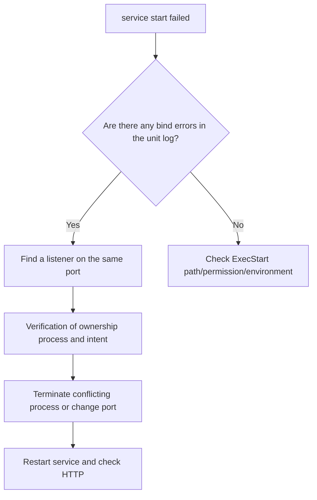

# Service 장애 진단 실습

<!-- source: https://github.com/systemd/systemd/blob/main/man/systemd.exec.xml | checked: 2026-09-10 | DynamicUser and RuntimeDirectory lifecycle; upstream manual source used because rendered manual was unavailable -->

> 실습 분류: systemd를 실행하는 **로컬 — 임시 Linux VM 또는 Linux 호스트**. 시스템 관리자 작업에는 권한이 필요하며 HTTP 서비스 자체는 일시적인 비특권 계정으로 실행된다.

## 실습 전에 준비할 것

- **환경**: macOS가 아니라 systemd가 실행되는 disposable Linux VM을 사용한다. 운영 서버에서는 실행하지 않는다.
- **도구**: `python3`, `curl`, `ss`, `systemctl`, `journalctl`이 필요하다.
- **권한**: 시스템 유닛의 생성·삭제와 시작·중지·다시 읽기에는 해당 시스템 관리자 권한이 필요하다. 저널과 프로세스 소유 정보의 읽기도 제한될 수 있다.
- **터미널**: port를 차지한 프로세스를 유지할 창과 진단 명령을 실행할 창, 두 개를 연다.
- **만들 대상**: `/etc/systemd/system/infra-http.service` 한 파일과 임시 Python HTTP 프로세스다.
- **끝난 상태**: unit 파일과 임시 프로세스가 사라지고 `18080` port를 아무 프로세스도 사용하지 않는다.

명령어를 입력하기 전에 위 파일 경로가 실습 전에는 존재하지 않는지 확인한다. 이미 같은 이름의 unit이 있다면 이 실습을 중단하고 다른 VM을 사용한다.

## 먼저 이해하기

이 실습은 일부러 두 프로세스가 같은 port를 가지려고 경쟁하게 만든다. TCP 리스너는 IP address와 port 조합에 bind된다. 첫 번째 Python 프로세스가 `127.0.0.1:18080`을 차지한 상태에서 systemd가 두 번째 프로세스를 시작하면 새 프로세스는 socket을 만들지 못하고 종료한다. systemd의 `failed`, journal의 bind error, `ss`에 보이는 기존 PID는 같은 사건을 서로 다른 관점에서 보여 준다.

| 관찰 | 답하는 질문 | 답하지 못하는 질문 |
|---|---|---|
| unit `active` | manager가 main 프로세스를 실행 중인가? | 올바른 port에서 정상 응답하는가? |
| listening socket | 커널이 어느 프로세스에 address를 할당했는가? | HTTP handler가 정상인가? |
| `curl` 성공 | 이 클라이언트 위치에서 요청·응답이 끝났는가? | 다른 네트워크 위치에서도 접근 가능한가? |

세 관찰을 모두 정상 기준으로 만든 뒤 장애를 주입한다. 그래야 실패 후 무엇이 달라졌는지 비교할 수 있다.

## 목표

정상 서비스의 unit·PID·socket·log 기준을 기록한 뒤 port 충돌을 만들어 `failed`라는 결과가 아니라 실패 원인을 찾는다.

## 1. 임시 서비스 만들기

다음 unit은 loopback의 18080 port에서 정적 HTTP 서버를 실행한다.

```ini
# /etc/systemd/system/infra-http.service
[Unit]
Description=DevOps study HTTP server
After=network.target

[Service]
Type=simple
DynamicUser=yes
RuntimeDirectory=infra-http
WorkingDirectory=/run/infra-http
ExecStart=/usr/bin/python3 -m http.server 18080 --bind 127.0.0.1
Restart=no
MemoryMax=128M

[Install]
WantedBy=multi-user.target
```

```bash
sudo systemctl daemon-reload
sudo systemctl start infra-http
systemctl is-active infra-http
curl -fsS http://127.0.0.1:18080/ >/dev/null
systemctl show infra-http -p MainPID -p ControlGroup -p MemoryCurrent
ss -ltnp | grep ':18080'
```

완료 기준은 네 가지다.

- unit이 `active`다.
- `MainPID`가 0이 아니다.
- `127.0.0.1:18080`에 listening socket이 있다.
- HTTP 요청이 성공한다.

## 2. port 충돌 만들기

```bash
sudo systemctl stop infra-http
python3 -m http.server 18080 --bind 127.0.0.1
```

위 foreground 프로세스를 유지한 다른 terminal에서 서비스를 시작한다.

```bash
sudo systemctl start infra-http
systemctl status infra-http --no-pager
journalctl -u infra-http -n 20 --no-pager
ss -ltnp | grep ':18080'
```



핵심은 `curl` 실패를 곧바로 네트워크 문제라고 부르지 않는 것이다. 이 경우 커널은 이미 다른 프로세스에 port를 할당했고 새 프로세스의 bind를 거부한다. `journalctl`의 bind 오류와 `ss`의 기존 리스너가 같은 원인을 가리켜야 한다.

## 3. 복구하고 증거 남기기

foreground 서버를 `Ctrl-C`로 종료한 뒤 다음을 실행한다.

```bash
sudo systemctl reset-failed infra-http
sudo systemctl start infra-http
systemctl is-active infra-http
curl -i http://127.0.0.1:18080/
```

incident 기록에는 증상, 최초 실패 시각, 기존 리스너 PID, 복구 동작과 마지막 성공 요청 시각을 남긴다.

## resource pressure 확장 실습

`MemoryMax`를 무작정 낮춰 production 프로세스를 죽이지 않는다. 별도 VM에서만 test 프로세스를 사용하고 다음 증거를 준비한다.

```bash
systemctl show infra-http -p MemoryCurrent -p MemoryMax -p NRestarts
journalctl -k --since "10 minutes ago" | grep -i -E 'oom|killed process'
cat /proc/pressure/memory
```

OOM을 재현하지 않았으면 “OOM 복구 완료”라고 기록하지 않는다. 위 명령은 재현 전 관측 경로만 확인한다.

## 정리

```bash
sudo systemctl stop infra-http
sudo systemctl reset-failed infra-http
sudo rm /etc/systemd/system/infra-http.service
sudo systemctl daemon-reload
```

삭제 대상이 정확히 `/etc/systemd/system/infra-http.service`인지 확인한다. 유닛은 일시적인 비특권 계정을 사용하며 비어 있는 자체 런타임 디렉터리만 제공한다. 부팅 자동 시작을 활성화하지 않았으므로 disable은 필요 없다. 이 유닛의 실패 상태만 초기화한다. 인자 없는 `systemctl reset-failed`는 무관한 진단 상태까지 지운다. 포트 충돌용 포그라운드 프로세스도 종료되고 18080 포트가 비었는지 확인한다.

## 실행 결과 예시

Linux의 예시 출력이다. PID, 메모리 값, 시각, errno 번호는 달라진다. 충돌 단계에서도 포그라운드 서버가 HTTP 200을 반환할 수 있으므로 curl만으로 통과를 판단하지 않는다.

```text
# Baseline: systemctl is-active infra-http
active
# Baseline: systemctl show ... -p MainPID
MainPID=2401
# Conflict: journalctl -u infra-http
OSError: [Errno 98] Address already in use
# Conflict: ss identifies the foreground Python process, not PID 2401.
# Recovery: systemctl is-active infra-http
active
# Recovery: curl -i http://127.0.0.1:18080/
HTTP/1.0 200 OK
```

복구된 유닛의 0이 아닌 MainPID가 기대한 리스너를 소유하고 HTTP가 성공해야 통과다. 정리 뒤에는 리스너가 사라져야 한다. 포그라운드 프로세스가 남았다면 정리가 끝나지 않은 것이다.

## 결과를 이렇게 읽는다

정상 상태에서는 `MainPID`와 `ss`의 프로세스가 같고 `curl`이 성공한다. 충돌 상태에서는 systemd가 시작한 프로세스가 bind 단계에서 종료하므로 안정된 `MainPID`가 없고, journal에는 address 사용 중이라는 원인이 남는다. 동시에 `ss`에는 foreground Python 프로세스가 계속 보인다. 이 세 증거가 일치할 때 port 충돌로 판정한다.

`ss`에 리스너가 없다면 port를 차지한 프로세스가 원인이 아니다. 리스너가 있고 local `curl`은 성공하지만 remote request만 실패하면 bind address, route, host firewall과 상위 네트워크 policy로 조사 범위를 옮긴다. 복구 후에는 새 `MainPID`, 기대한 리스너 owner와 마지막 HTTP 성공을 다시 확인한다.

## 스스로 설명해 보기

1. `active`, listening socket, HTTP 성공 중 어느 하나만 확인하면 부족한 이유는 무엇인가?
2. port 충돌과 firewall 차단은 어떤 관찰값이 다른가?
3. OOM 의심 시 application log만으로 결론내리면 안 되는 이유는 무엇인가?

<!-- source: https://www.freedesktop.org/software/systemd/man/latest/systemd.service.html | checked: 2026-09-03 | retrieval-warning: direct page unavailable -->
<!-- source: https://docs.kernel.org/admin-guide/cgroup-v2.html | checked: 2026-09-03 -->
<!-- source: https://docs.kernel.org/accounting/psi.html | checked: 2026-09-03 -->
