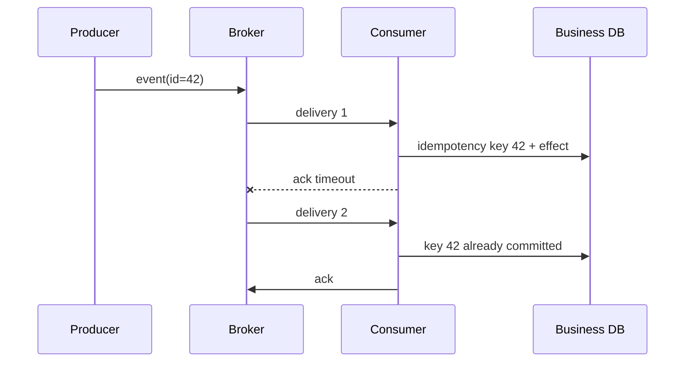

# Delivery, ordering과 replay model

## 이 장에서 처음 쓰는 말

- **broker**: 생산자에게 메시지를 받아 보관하고 소비자에게 전달하는 중간 시스템이다. **왜 필요한가요 · 언제 쓰나요:** 전달 동작이 정해진 중개자를 두어 생산자와 소비자의 가용성을 분리할 때 쓴다. **구체적인 상황(가상 예시):** 알림 서비스가 잠시 중단된다. → 브로커의 설정된 정책으로 대상 메시지를 보관한다. → 보존 만료 전에 전달이 재개되는지 확인한다.
- **delivery**: broker가 소비자에게 message 처리를 시도하는 일이다. **왜 필요한가요 · 언제 쓰나요:** 수신을 완료와 동일시하지 않고 소비자가 처리해야 할 유실·중복 가능성을 정한다. **구체적인 상황(가상 예시):** 소비자가 재시작 뒤 같은 이벤트를 다시 받는다. → 전달 계약과 중복 처리 규칙을 적용한다. → 수신 횟수뿐 아니라 업무 효과를 확인한다.
- **retry**: 실패한 처리를 일정 조건에 따라 다시 시도하는 것이다. **왜 필요한가요 · 언제 쓰나요:** 추가 시도가 안전하고 남은 예산 안에 들어갈 때 일시적 장애에서 회복하기 위해 쓴다. **구체적인 상황(가상 예시):** 의존 서비스가 일시적 오류를 반환한다. → 예산 안에서 안전한 작업만 재시도한다. → 복구가 부하나 효과 중복을 늘리지 않는지 확인한다.
- **DLQ**: 여러 번 처리하지 못한 message를 주 흐름에서 분리해 조사하도록 보관하는 queue다. **왜 필요한가요 · 언제 쓰나요:** 반복 실패 기록을 격리해 전체 작업을 막지 않고 조사·수정할 수 있게 한다. **구체적인 상황(가상 예시):** 잘못된 레코드 하나가 반복해서 처리를 막는다. → DLQ 정책으로 격리한다. → 수정·재생하면서 다른 작업의 진행을 확인한다.
- **ordering**: 여러 message가 생산자가 보낸 순서와 어떤 범위에서 같게 처리되는지에 관한 보장이다. **왜 필요한가요 · 언제 쓰나요:** 나중 이벤트를 먼저 처리하면 결과가 달라지는 업무에서 필요한 순서를 정한다. **구체적인 상황(가상 예시):** 취소가 주문 생성보다 먼저 처리된다. → 해당 주문 식별자의 순서를 정의·유지한다. → 지연 도착과 병렬 처리를 시험한다.
- **replay**: 과거에 보관한 message나 event를 다시 읽어 처리하는 작업이다. **왜 필요한가요 · 언제 쓰나요:** 보존한 이벤트와 중복 처리 정책으로 파생 상태를 재구성하거나 누락 처리를 복구한다. **구체적인 상황(가상 예시):** 파생 대시보드가 한 시간의 이벤트를 놓쳤다. → 같은 이벤트 식별자로 보존 구간을 재생한다. → 합계와 중복 효과 여부를 확인한다.

메시지가 broker에 저장됐다는 사실과 업무 처리가 끝났다는 사실은 다르다. 처음에는 `전달 → 업무 변경 → 완료 응답` 세 단계 사이 어디에서 프로세스가 종료될 수 있는지 살펴본다.

## 먼저 이해하기

주문 서비스가 `order.accepted` event를 보낸 뒤 결제 소비자가 처리한다고 하자. 생산자는 broker에 event를 기록했지만 소비자가 결제 DB를 갱신한 직후 acknowledgement를 보내기 전에 죽을 수 있다. broker는 처리되지 않았다고 판단해 같은 event를 다시 전달한다. 메시징 시스템이 정상 작동했는데도 business side effect가 두 번 실행될 수 있는 이유다.

| 시점 | broker가 아는 것 | broker가 모르는 것 |
|---|---|---|
| publish 성공 | event를 수락했다 | 모든 소비자의 business 처리 성공 |
| delivery | 소비자에게 보냈다 | 소비자 transaction commit 여부 |
| acknowledgement | 소비자가 완료라고 응답했다 | 외부 시스템 전체의 일관성 |
| retention/replay | event를 다시 읽을 수 있다 | 재실행해도 side effect가 안전한지 |

그래서 delivery guarantee와 processing outcome을 분리한다. at-least-once delivery에서는 중복 가능성을 인정하고 소비자가 durable idempotency key를 사용한다. ordering도 “전체가 순서대로”가 아니라 queue group이나 Kafka partition처럼 보장되는 범위를 명시한다.

SQS·SNS·EventBridge·Kafka는 이 문제의 서로 다른 모양을 해결한다. SQS는 작업을 소비자 사이에 분배하는 queue에 가깝고, SNS와 EventBridge는 여러 target으로 fan-out·routing하며, Kafka는 retained partition log를 소비자 group이 offset으로 읽는다. 이름을 고르기 전에 누가 event를 소유하고 누가 retry·replay를 책임지는지 정해야 한다.

## 메시지 한 건이 처리되는 과정을 따라가기

1. 생산자가 고유한 event ID와 업무 data를 message에 넣어 broker에 보낸다.
2. broker가 허용한 보존 기간과 전달 규칙에 따라 message를 저장한다.
3. 소비자가 message를 받아 업무 database를 변경한다.
4. 변경이 commit된 뒤 소비자가 broker에 완료 acknowledgement를 보낸다.
5. 3단계 뒤 4단계 전에 소비자가 종료되면 broker는 같은 message를 다시 전달할 수 있다.
6. 소비자는 event ID를 이용해 이미 완료한 업무 결과가 중복되지 않게 한다.
7. 반복해서 실패한 message는 DLQ로 분리하고 원인을 고친 뒤 제한된 속도로 다시 처리한다.

broker에 저장된 것, 소비자에게 전달된 것, 업무 결과가 commit된 것은 서로 다른 완료 지점이다. 메시징 설계는 이 사이의 실패를 다룬다.

## 서비스 이름보다 책임을 본다

| 구성 | 주된 목적 | 운영 질문 |
|---|---|---|
| SQS queue | 소비자 간 작업 분배와 buffering | visibility timeout, retry, DLQ, standard/FIFO |
| SNS topic | subscriber fan-out | subscription filter, delivery retry, target failure |
| EventBridge bus | event routing과 target integration | rule, schema, archive/replay, target DLQ |
| Kafka log | partitioned durable log와 소비자 group | partition key, offset, retention, rebalance |

SQS standard queue는 at-least-once delivery와 best-effort ordering을 전제로 소비자를 설계한다. FIFO 기능도 ordering과 deduplication scope·throughput 조건을 확인해야 하며 외부 side effect의 transaction을 대신하지 않는다.

Kafka의 ordering은 topic 전체가 아니라 partition 안에서 이해한다. partition을 늘리면 병렬성은 커질 수 있지만 같은 key의 ordering, rebalance와 소비자 state에 영향을 준다.

## Retry와 DLQ

retry는 transient failure를 흡수하지만 immediate retry storm은 downstream 장애를 키운다. exponential backoff, jitter와 retry budget을 둔다. poison message는 retry 횟수만 늘리지 말고 격리해 payload, schema version과 소비자 error를 조사한다.

DLQ redrive 전에 다음을 확인한다.

1. 원인이 code, dependency, permission 또는 data 중 무엇인지 분류한다.
2. 소비자 fix와 idempotency가 배포됐는지 확인한다.
3. redrive rate가 정상 트래픽과 downstream capacity를 압도하지 않는지 정한다.
4. 성공·재실패·누락 수를 reconciliation한다.

## Schema evolution과 replay

생산자와 소비자가 동시에 배포되지 않는다면 schema는 additive change와 compatibility 규칙을 가져야 한다. retained event를 새 소비자로 replay할 때 당시 의미와 현재 reference data가 달라질 수 있다. event time, schema version, 생산자 identity와 replay run ID를 기록한다.

## 스스로 설명해 보기

1. visibility timeout이 너무 짧거나 길 때 각각 어떤 문제가 생기는가?
2. Kafka partition key가 ordering과 load distribution을 동시에 좌우하는 이유는 무엇인가?
3. event replay가 단순 파일 재읽기가 아닌 운영 변경인 이유는 무엇인가?

<!-- source: https://docs.aws.amazon.com/AWSSimpleQueueService/latest/SQSDeveloperGuide/standard-queues-at-least-once-delivery.html | checked: 2026-09-03 -->
<!-- source: https://docs.aws.amazon.com/AWSSimpleQueueService/latest/SQSDeveloperGuide/sqs-visibility-timeout.html | checked: 2026-09-03 -->
<!-- source: https://docs.aws.amazon.com/eventbridge/latest/userguide/eb-archive-event.html | checked: 2026-09-03 -->
<!-- source: https://kafka.apache.org/documentation/#intro_concepts_and_terms | checked: 2026-09-03 -->
