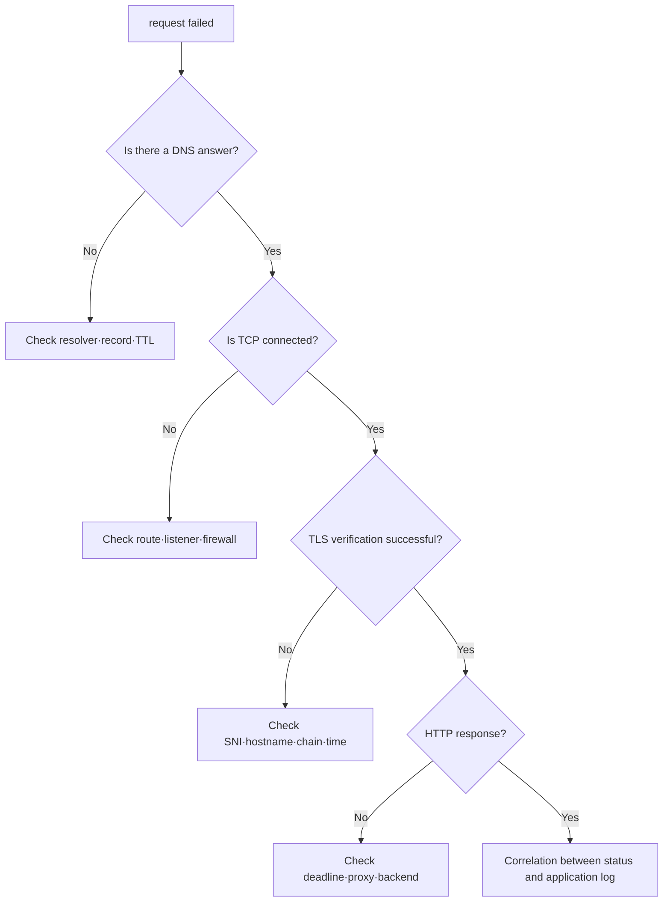

# 계층별 장애 분리 실습

> 실습 등급: **Local**. `tcpdump`만 packet capture 권한이 필요하며 나머지는 일반 사용자로 실행할 수 있다.

## 실습 전에 준비할 것

- **환경**: 인터넷에 접속할 수 있는 Linux 또는 macOS terminal을 사용한다.
- **도구**: `dig`, `curl`, `openssl`이 필요하다. Linux의 route·socket 확인에는 `ip`와 `ss`를 사용한다.
- **대상**: 처음에는 본인이 운영하지 않는 production 주소 대신 `example.com`과 예약된 `.invalid` 이름을 사용한다.
- **기록**: 각 명령마다 `성공/실패`, 마지막으로 성공한 단계, 다음에 확인할 항목을 한 줄씩 적는다.
- **정리**: 이 기본 실습은 resource를 만들지 않는다. 선택적인 Kubernetes test Pod를 만들었다면 명령의 `--rm` 동작으로 삭제됐는지 확인한다.

macOS에는 Linux의 `ip`와 `ss`가 기본 제공되지 않는다. 아래에서 대상 주소를 해석한 뒤 `route -n get "$target_ip"`를 사용하고, 리스너는 `lsof -nP -iTCP -sTCP:LISTEN`으로 확인한다. 출력 필드가 다르다는 점도 기록한다.

## 먼저 이해하기

이 실습의 목적은 많은 네트워크 명령을 실행하는 것이 아니라 실패 지점을 이분하는 것이다. 매 단계에서 “여기까지는 성공했는가?”를 묻고, 성공한 계층보다 아래를 다시 조사하지 않는다.

예를 들어 DNS가 올바른 address를 반환하고 TCP probe가 연결 성공을 보여 줬다면 basic name resolution과 TCP 443 path는 작동한다. 이후 `curl`이 certificate error를 낸다면 문제 범위는 TLS identity로 좁아진다. 반대로 TCP가 timeout이면 HTTP status를 논할 단계가 아니다.

| 확인 순서 | 사용할 증거 | 성공 기준 | 실패 시 다음 조사 |
|---:|---|---|---|
| 1 | `dig` 또는 `nslookup` | 예상 resolver와 address | record·resolver·search domain |
| 2 | route 조회 | 예상 interface·next hop | local route·VPN·NAT |
| 3 | TCP 탐사 | 의도한 엔드포인트와 연결됨 | 명시적 연결 거부는 실패 근거다. 리스너, 거부 정책, 반환 경로를 확인한다. |
| 4 | `openssl s_client` | hostname과 chain 검증 | certificate·SNI·clock·trust store |
| 5 | `curl -v` | 기대한 status와 body | proxy·backend·application |

## 목표

URL 하나를 같은 명령으로 반복 호출하지 않고 DNS, route, TCP, TLS, HTTP 증거로 나눈다.

## 1. 정상 기준 만들기

공개 대상 대신 자신이 운영하거나 실습용으로 허용된 hostname을 사용한다.

```bash
target_host="example.com"
target_url="https://example.com/"

dig +noall +answer "$target_host" A
target_ip="$(dig +short "$target_host" A | awk '/^[0-9]+\.[0-9]+\.[0-9]+\.[0-9]+$/ { print; exit }')"
test -n "$target_ip" || exit 1
ip route get "$target_ip"
curl -sSvo /dev/null --connect-timeout 3 --max-time 8 "$target_url"
openssl s_client -connect "${target_host}:443" -servername "$target_host" \
  -verify_hostname "$target_host" -verify_return_error </dev/null
```

DNS 응답, TTL, 선택한 경로, 실제 원격 IP, 인증서 검증, HTTP 상태와 시간을 기록한다. macOS에서는 `route -n get "$target_ip"`를 사용한다. curl이 다른 IPv4 주소나 IPv6를 선택했다면 그 실제 주소도 조사한다. 무관한 공용 리졸버에 대한 경로 조회는 이 서버까지의 경로를 입증하지 않는다. 검증 옵션을 지원하는 OpenSSL 버전과 설정된 신뢰 저장소를 사용하고, 신뢰 저장소 실패와 호스트 이름 불일치를 구분한다.

## 2. 실패 모양 비교

### DNS 실패

```bash
dig +noall +comments +answer does-not-exist.invalid A
```

`.invalid`는 이름 해석 실패 실습용으로 예약된 top-level domain이다. answer가 없다는 사실과 resolver가 반환한 status를 본다.

### TCP refused

```bash
curl -v --connect-timeout 2 http://127.0.0.1:65535/
ss -ltn | grep ':65535' || true
```

local에서 리스너가 없으면 일반적으로 즉시 거절된다. 반면 packet이 중간에서 버려지면 connect timeout으로 보일 수 있다.

### TLS 이름 불일치 관찰

```bash
openssl s_client -connect example.com:443 -servername example.com \
  -verify_hostname wrong.invalid -verify_return_error </dev/null
```

서버 선택용 SNI는 `example.com`으로 유지하면서 검증 대상 이름을 `wrong.invalid`로 지정한다. 예상 결과는 호스트 이름 검증 실패다. SNI만 바꾸면 클라이언트의 호스트 이름 검증을 강제할 수 없으며, 다른 인증서가 선택되거나 서버가 핸드셰이크를 거부할 수 있다. `-k`는 시험 중인 검증 자체를 건너뛰므로 복구 방법으로 사용하지 않는다.



## Kubernetes 확장

```bash
kubectl get service,endpointslice -A
kubectl describe service -n default sample
kubectl get networkpolicy -A
kubectl run netcheck --rm -it --restart=Never --image=curlimages/curl -- \
  curl -sv --max-time 5 http://sample.default.svc.cluster.local/
```

이미지 pull이라는 별도 외부 dependency가 있으므로 Pod 생성 실패를 서비스 네트워크 실패로 오해하지 않는다. 먼저 `kubectl get pod`와 event를 확인한다.

## incident 기록 형식

| 시각 | 계층 | 관찰 | 판정 |
|---|---|---|---|
| T0 | DNS | answer와 TTL | 이름 해석 성공/실패 |
| T1 | TCP | remote IP, connect 결과 | path·리스너 후보 |
| T2 | TLS | SNI, certificate 검증 | identity 성공/실패 |
| T3 | HTTP | status, latency | proxy/backend 후보 |

## 실행 결과 예시

공개 엔드포인트에서 수집한 기록이 아닌 예시 출력 일부다. DNS 주소, TTL, 인증서 체인, 프로토콜 버전은 바뀔 수 있다.

```text
# Normal TLS verification
Verify return code: 0 (ok)
# Reserved .invalid query
;; ->>HEADER<<- opcode: QUERY, status: NXDOMAIN, ...
# Closed local TCP port
curl: (7) Failed to connect to 127.0.0.1 port 65535
# Explicit wrong hostname verification
verify error:num=62:hostname mismatch
```

의도한 계층에서 실패해야 실패 실습 통과다. NXDOMAIN은 리졸버에 도달하지 못한 상태와 다르며, 인증서 체인 오류는 의도한 호스트 이름 불일치를 입증하지 않는다. 올바른 검증 이름을 복구한 뒤 다시 검증에 성공해야 한다.

## 결과를 이렇게 읽는다

`connection refused`는 destination까지 packet이 갔고 해당 port를 받아 줄 리스너가 없거나 명시적으로 거부됐을 가능성을 보여 준다. `timeout`은 packet drop, 잘못된 route, return path, stateful policy 등 더 넓은 범위를 남긴다. 두 결과를 같은 “연결 실패”로 처리하면 조사 순서가 흐려진다.

TLS에서 certificate를 받았다는 사실만으로 검증이 끝나지 않는다. 요청 hostname과 Subject Alternative Name, 유효 기간, issuer chain과 클라이언트 trust를 확인한다. `-k`로 검증을 끈 curl 성공은 암호화된 연결 가능성을 볼 뿐 production identity 검증 성공을 증명하지 않는다.

HTTP status가 보이면 그 응답을 누가 만들었는지 확인한다. proxy, load balancer와 application이 모두 status를 만들 수 있다. response header, request ID와 hop별 log timestamp를 연결하면 마지막으로 request를 본 component를 찾을 수 있다.

## 스스로 설명해 보기

1. `connection refused`가 firewall 차단보다 리스너 부재를 먼저 의심하게 하는 이유는 무엇인가?
2. `openssl s_client` 출력만 보고 application TLS 검증 성공을 선언하면 안 되는 이유는 무엇인가?
3. Pod 안에서만 실패한다면 host와 비교할 DNS·route·policy 차이는 무엇인가?

<!-- source: https://datatracker.ietf.org/doc/html/rfc2606 | checked: 2026-09-03 -->
<!-- source: https://datatracker.ietf.org/doc/html/rfc9293 | checked: 2026-09-03 -->
<!-- source: https://datatracker.ietf.org/doc/html/rfc8446 | checked: 2026-09-03 -->
<!-- source: https://docs.openssl.org/3.0/man1/openssl-s_client/ | checked: 2026-09-10 | explicit hostname verification and failure propagation -->
<!-- source: https://kubernetes.io/docs/tasks/administer-cluster/dns-debugging-resolution/ | checked: 2026-09-03 -->
