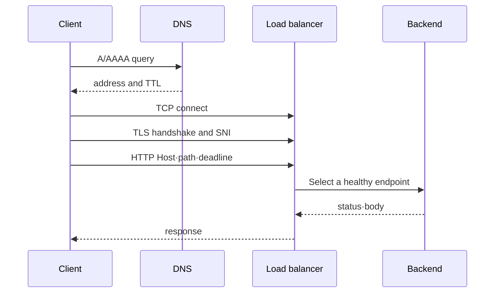

# DNS부터 backend까지

<!-- source: https://www.rfc-editor.org/rfc/rfc9114.html | checked: 2026-09-10 | TCP scope and HTTP/3 over QUIC -->

## 이 장에서 처음 쓰는 말

- **client**: 요청을 시작하는 프로그램이다. 브라우저나 `curl`이 될 수 있다. **왜 필요한가요 · 언제 쓰나요:** 요청의 시작점을 찾고 호출자의 시간 제한·재시도·관측을 설계할 때 필요하다. **구체적인 상황(가상 예시):** 브라우저가 시간 초과돼도 서버는 계속 일한다. → 클라이언트의 제한 시간과 재시도를 조사한다. → 반복 요청이 서버 작업을 중복시키는지 확인한다.
- **backend**: 실제 업무 로직을 처리하고 응답을 만드는 서버 프로그램이다. **왜 필요한가요 · 언제 쓰나요:** 요청 전달 역할과 실제 업무 결과를 책임지는 애플리케이션을 구분할 때 필요하다. **구체적인 상황(가상 예시):** 프록시는 트래픽을 받지만 결제가 실패한다. → 결제 백엔드까지 요청을 따라간다. → 해당 응답과 의존성 오류를 확인한다.
- **packet**: 네트워크가 데이터를 나누어 전달하는 작은 단위다. **왜 필요한가요 · 언제 쓰나요:** 요청 실패 시 네트워크 계층의 유실·라우팅·전달을 조사하는 단위로 쓴다. **구체적인 상황(가상 예시):** 연결에서 데이터 재전송이 간헐적으로 발생한다. → 허용된 시험 캡처에서 패킷 근거를 조사한다. → 재전송과 애플리케이션 지연을 비교한다.
- **TCP**: 두 프로그램 사이에 순서가 있는 byte 전달 통로를 만드는 규칙이다. **왜 필요한가요 · 언제 쓰나요:** 애플리케이션이 두 엔드포인트 사이에서 순서가 유지되는 바이트 전송을 필요로 할 때 쓴다. **구체적인 상황(가상 예시):** TCP 연결은 성공하지만 API는 오류를 반환한다. → 전송 연결 수립과 애플리케이션 응답을 구분한다. → 연결 성공으로 끝내지 말고 HTTP 결과를 확인한다.
- **TLS**: 상대 서버의 신원을 확인하고 통신 내용을 암호화하는 규칙이다. **왜 필요한가요 · 언제 쓰나요:** 민감한 데이터를 주고받기 전에 통신 상대를 확인하고 전송 중 내용을 보호할 때 쓴다. **구체적인 상황(가상 예시):** 클라이언트가 서버 인증서를 거부한다. → 요청 이름·유효 기간·신뢰 체인을 확인한다. → 인증서 검사를 켠 상태로 다시 검증한다.
- **load balancer**: 들어온 요청을 여러 backend 중 하나로 전달하는 중간 지점이다. **왜 필요한가요 · 언제 쓰나요:** 요청을 사용 가능한 백엔드로 분산하고 비정상 목적지로의 전달을 줄일 때 쓴다. **구체적인 상황(가상 예시):** 특정 복제본으로 간 요청만 실패한다. → 백엔드 상태와 직접 시험 요청을 비교한다. → 비정상 대상으로의 전달이 제외되는지 확인한다.

이 장의 핵심은 약어를 외우는 것이 아니라, 앞 단계의 결과가 다음 단계의 입력이 된다는 점이다. DNS가 IP를 주지 못하면 TCP 연결은 아직 시도할 대상도 없다.

## 먼저 이해하기

TCP 위에서 HTTP/1.1 또는 HTTP/2를 사용하는 새 HTTPS 연결은 주소를 해석하고 경로를 선택한 뒤 TCP를 연결하고 TLS를 협상한 후 HTTP 데이터를 교환한다. 주소 캐시나 기존 풀 연결을 사용하면 다음 요청에서 일부 작업을 생략할 수 있다. HTTP/3는 UDP 위의 QUIC을 사용하므로 아래 TCP 전용 순서는 해당 전송 방식을 설명하지 않는다.

| 단계 | 입력 | 성공했을 때 얻는 것 | 대표 실패 |
|---|---|---|---|
| DNS | hostname | 하나 이상의 IP address | NXDOMAIN, timeout, 오래된 record |
| route | destination IP | interface와 next hop | no route, 잘못된 NAT path |
| TCP | IP와 port | 양방향 byte stream | refused, timeout, reset |
| TLS | TCP stream과 서버 name | 검증된 encrypted session | 이름 불일치, 만료, trust failure |
| HTTP | method·path·header·body | status·header·body | 4xx, 5xx, upstream timeout |

각 단계의 출력이 다음 단계의 입력이다. 사용자가 보는 증상은 대개 “접속 안 됨” 하나지만, DNS가 틀렸는데 load balancer health check를 고치거나 TLS 이름이 틀렸는데 security group을 여는 조치는 도움이 되지 않는다. 마지막으로 성공한 계층을 찾으면 조사 범위를 줄일 수 있다.

## 요청 하나를 한 단계씩 따라가기

1. 클라이언트가 `api.example.com`을 DNS에 물어 IP 주소를 얻는다.
2. 운영체제가 그 IP로 packet을 보낼 interface와 다음 gateway를 고른다.
3. 클라이언트가 선택한 IP와 port로 TCP 연결을 만든다.
4. HTTPS라면 TLS가 certificate의 이름과 신뢰 체인을 확인하고 암호화 통로를 만든다.
5. 클라이언트가 그 통로로 HTTP method, path와 header를 보낸다.
6. load balancer가 건강한 backend를 선택하고 요청을 전달한다.
7. backend의 응답이 반대 경로로 클라이언트에 돌아온다.

여기서 모델링한 새 TCP 연결은 앞 단계가 실패하면 그 단계에 의존하는 다음 단계로 진행할 수 없다. 실제 클라이언트는 IPv4/IPv6 주소로 경쟁 연결하거나 연결을 재사용할 수 있고 다른 위치에서 DNS를 해석하는 프록시를 사용할 수도 있다. 계층별 원인을 판단하기 전에 실제 프로토콜, 프록시, 원격 주소를 확인한다.

## 계층은 책임 분리 도구다

실제 packet은 교과서의 층을 차례로 “호출”하지 않지만, 운영자는 실패를 분리하기 위해 각 계층의 계약을 사용한다.

| 단계 | 성공 증거 | 대표 실패 |
|---|---|---|
| DNS | 질문한 이름에 기대한 record와 TTL 응답 | NXDOMAIN, stale 캐시, split-horizon 차이 |
| route | 목적지에 선택된 interface와 next hop | 잘못된 route, blackhole, NAT 경로 누락 |
| TCP | SYN 이후 연결 성립 | timeout, refused, conntrack·backlog 고갈 |
| TLS | certificate chain과 hostname 검증 | 만료, 이름 불일치, trust root 누락 |
| HTTP | status·header·body와 deadline | 4xx, 5xx, redirect loop, upstream timeout |
| backend | 선택된 엔드포인트의 readiness와 처리 결과 | 엔드포인트 없음, overload, dependency failure |

TCP는 신뢰 가능한 byte stream을 제공하지만 요청의 의미를 알지 못한다. TLS는 peer identity와 암호화 경계를 만들지만 application authorization을 대신하지 않는다. HTTP status는 연결이 성립한 뒤 application 또는 proxy가 반환한 결과다.



## 주소와 경로

CIDR은 주소 범위를 표현하고 subnet은 그 범위를 한 routing domain의 일부로 배치한다. route table은 목적지 prefix에 따라 next hop을 고른다. NAT는 주소를 바꾸지만 접근 허용 정책과 동일하지 않다.

AWS에서는 subnet이 한 Availability Zone에 속하고 route table이 트래픽의 방향을 정한다. internet gateway, NAT gateway와 VPC 엔드포인트는 목적에 따라 다른 next hop이다. Kubernetes에서는 Pod 네트워크가 Pod 간 경로를 제공하고 Service가 바뀌는 엔드포인트 집합 앞에 안정된 접근점을 둔다.

## allow 정책은 양쪽을 본다

연결 실패를 볼 때 source egress와 destination ingress를 함께 확인한다. 중간 장비의 stateful 허용, stateless ACL, host firewall, Kubernetes NetworkPolicy가 동시에 존재할 수 있다.

“security group이 열려 있다”는 한 문장은 충분한 증거가 아니다. source, destination, protocol, port, direction과 실제 flow log 또는 packet 관찰이 필요하다.

## timeout budget

클라이언트 deadline보다 내부 retry들의 합이 길면 클라이언트는 실패했는데 backend는 계속 일하는 결과가 생긴다.

```text
DNS + connect + TLS + proxy queue + backend + response
  <                    client deadline                    >
```

retry는 새로운 트래픽이다. 실패율이 올라갈수록 retry가 부하를 증폭하지 않도록 per-attempt timeout, 최대 횟수와 backoff를 함께 둔다.

## 스스로 설명해 보기

1. NAT gateway가 있다고 inbound 연결이 자동 허용되지 않는 이유는 무엇인가?
2. TCP 연결 성공 뒤에도 TLS가 실패하는 세 가지 경우를 말해 보자.
3. Service IP가 살아 있지만 backend가 0개일 때 어떤 관찰값을 볼 것인가?

<!-- source: https://datatracker.ietf.org/doc/html/rfc9293 | checked: 2026-09-03 -->
<!-- source: https://datatracker.ietf.org/doc/html/rfc8446 | checked: 2026-09-03 -->
<!-- source: https://datatracker.ietf.org/doc/html/rfc9110 | checked: 2026-09-03 -->
<!-- source: https://docs.aws.amazon.com/vpc/latest/userguide/what-is-amazon-vpc.html | checked: 2026-09-03 -->
<!-- source: https://kubernetes.io/docs/concepts/services-networking/ | checked: 2026-09-03 -->
