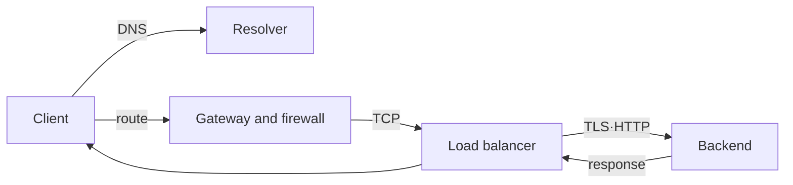

# 네트워크와 요청 경로 로드맵

## 처음 보는 사람을 위한 출발점

브라우저에서 주소를 입력했는데 화면이 열리지 않는 상황부터 시작한다. “인터넷이 안 된다”는 한 문장만으로는 고칠 수 없다. 주소를 숫자로 바꾸는 데 실패했는지, 서버까지 가는 길이 막혔는지, 서버가 요청을 받을 준비가 안 됐는지부터 나눠야 한다.

| 처음 만나는 말 | 학습용 쉬운 뜻 | 왜 필요한가요 · 언제 쓰나요 |
|---|---|---|
| 호스트 이름(hostname) | 사람이 기억하기 쉬운 서버 이름. 예: `api.example.com` | 서비스 주소를 이해하기 쉬운 이름으로 유지하면서 실제 주소 기록은 별도로 바꾸도록 한다. |
| IP 주소 | 네트워크에서 컴퓨터나 연결 지점을 찾기 위한 숫자 주소 | 라우팅과 엔드포인트 도달 여부를 확인할 때 네트워크 목적지를 식별한다. |
| DNS | 이름에 대한 레코드를 조회하는 시스템. A/AAAA 레코드로 주소를 조회하며 역방향 조회는 별도 질의다. | 연결 전에 서비스 이름을 해석하고 이름 해석 장애와 전송 장애를 구분한다. |
| 경로(route) | 목적지 IP까지 패킷을 어느 방향으로 보낼지 정한 규칙 | 다음 네트워크 경유지를 정하고 패킷이 목적지에 도달하거나 빗나가는 이유를 찾는다. |
| 포트(port) | 한 컴퓨터 안에서 요청을 받을 프로그램을 구분하는 번호 | 트래픽을 원하는 리스너로 보내고 네트워크 도달 여부와 애플리케이션 준비 상태를 구분한다. |
| 연결(connection) | 두 프로그램이 데이터를 주고받을 수 있도록 만든 통신 상태 | 요청 경로에서 연결 수립·재사용·시간 초과·종료에 드는 비용을 분석할 때 필요하다. |

이 과정에서는 이름 확인부터 애플리케이션 응답까지 한 단계씩 시험한다. 처음에는 `curl` 한 번의 성공과 실패만 비교하고, 이후 TCP, TLS, load balancer처럼 전문적인 경계로 범위를 넓힌다.

네트워크 장애는 “연결이 안 된다”가 아니라 **이름, 경로, 연결, 암호화, 애플리케이션 응답 중 어느 단계가 실패했는지**로 나눠야 진단할 수 있다.

## 한 문장 모델

> 새 HTTPS 요청은 이름 해석, 네트워크 경로, 전송 계층, TLS, HTTP 처리 순으로 진단한다. 로드 밸런서는 일부 계층을 종료하고 별도의 백엔드 연결을 만들 수 있다. 연결 재사용과 HTTP/3에서는 관찰 순서가 달라진다.

## 읽는 순서

1. [DNS부터 backend까지](../../content/networking/01-request-path-model.md): 각 계층의 입력·출력과 AWS·Kubernetes 대응을 연결한다.
2. [계층별 장애 분리 실습](../../content/networking/02-layered-diagnosis-lab.md): `dig`, `ip route`, `curl`, `openssl`, `ss`로 실패 위치를 좁힌다.

## DevOps specialist가 지켜야 할 경계

| 질문 | 답을 주는 계층 |
|---|---|
| 이름이 어느 주소로 풀리는가? | DNS record, resolver와 cache |
| packet이 어느 interface·gateway로 나가는가? | route table과 policy routing |
| 연결을 허용하는가? | security group, NACL, host firewall, NetworkPolicy |
| server가 port를 받고 있는가? | listening socket과 load balancer listener |
| 상대가 맞고 암호화됐는가? | TLS certificate, hostname과 trust store |
| 요청 의미가 맞는가? | HTTP method, host, path, status와 timeout |

AWS VPC와 Kubernetes network는 이 모델을 다른 resource로 구현한다. VPC route table·gateway·security group과 Kubernetes Service·EndpointSlice·Gateway·NetworkPolicy의 이름을 섞지 말고 packet이 지나는 실제 순서로 연결한다.

## 완료

이 주제는 한 번 읽고 끝내지 않는다. 먼저 용어 표를 자신의 말로 바꾸고, 개념 장에서 한 요청의 흐름을 따라간다. 실습에서는 정상 상태를 먼저 기록한 뒤 조건 하나만 바꿔 실패를 만들고, 증거로 원인을 설명한 뒤 복구한다. 마지막으로 아래 운영 판단 질문에 답하면서 더 복잡한 환경으로 확장한다.

- 하나의 URL을 DNS answer, destination IP, route, TCP peer, TLS identity, HTTP status와 backend로 분해한다.
- timeout, connection refused, TLS verification failure와 HTTP 5xx를 서로 다른 실패로 진단한다.
- [AWS 인프라 기반](../../content/aws-foundations/00-roadmap.md)에서 subnet·route·gateway의 reachability를 설명할 수 있다.

## 처음 이해했는지 확인

1. `api.example.com` 같은 이름과 IP 주소는 각각 무엇인가?
2. DNS 조회가 성공해도 웹 요청이 실패할 수 있는 이유는 무엇인가?

**확인 기준:** DNS는 이름을 주소로 바꾸는 단계일 뿐이며, 이후 route·TCP·TLS·HTTP 단계가 따로 남는다고 설명할 수 있으면 된다.

## 운영 판단으로 확장하기

1. DNS가 성공했는데 TCP timeout이 날 수 있는 이유는 무엇인가?
2. load balancer health check 성공과 실제 사용자 요청 성공이 다른 이유는 무엇인가?
3. 같은 `403`이라도 network policy가 아니라 HTTP 계층 문제라고 볼 근거는 무엇인가?

<!-- source: https://datatracker.ietf.org/doc/html/rfc9293 | checked: 2026-09-03 -->
<!-- source: https://datatracker.ietf.org/doc/html/rfc8446 | checked: 2026-09-03 -->
<!-- source: https://datatracker.ietf.org/doc/html/rfc9110 | checked: 2026-09-03 -->
<!-- source: https://kubernetes.io/docs/concepts/services-networking/ | checked: 2026-09-03 -->
