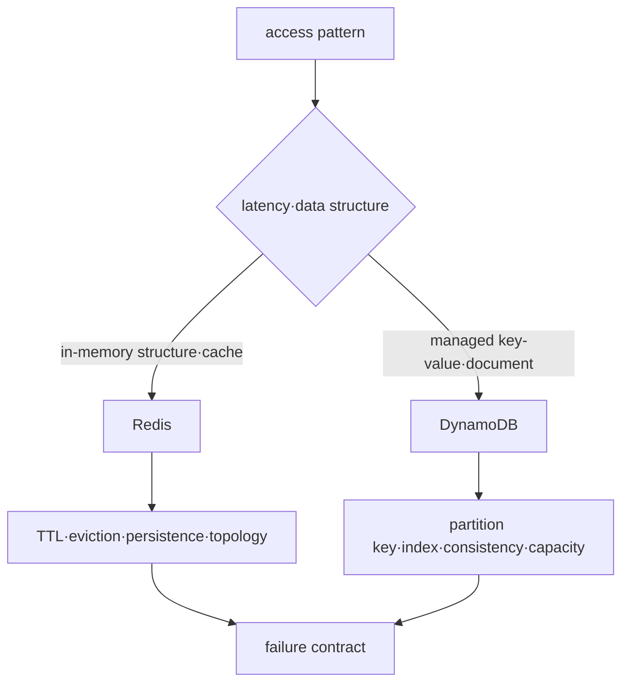

# Redis와 DynamoDB 로드맵

## 처음 보는 사람을 위한 출발점

모든 데이터를 같은 데이터베이스에 같은 모양으로 저장할 필요는 없다. 10분 뒤 사라져도 되는 로그인 인증 정보와 수년간 남아야 하는 주문 기록은 요구가 다르다. 이 과정은 “NoSQL이 더 빠르다”는 결론에서 시작하지 않고, 어떤 질문을 얼마나 자주 하고 데이터가 사라져도 되는지를 먼저 정한다.

| 처음 만나는 말 | 학습용 쉬운 뜻 | 왜 필요한가요 · 언제 쓰나요 |
|---|---|---|
| 키(key) | 데이터를 다시 찾을 때 사용하는 고유한 이름 | 무관한 값을 모두 훑지 않고 원하는 항목을 조회·갱신할 때 쓴다. **구체적인 상황(가상 예시):** 사용자 두 명의 세션이 서로 덮어쓴다. → 세션 키 구성 방식을 조사한다. → 다른 신원에 다른 키가 만들어지는지 확인한다. |
| 값(value) | 키에 연결해 저장하는 실제 데이터 | 키로 다시 조회할 실제 애플리케이션 정보를 담는 데 쓴다. **구체적인 상황(가상 예시):** 캐시가 오래된 고객 프로필을 반환한다. → 해당 고객 키에 저장된 값을 조사한다. → 기준 프로필과 내용·버전을 비교한다. |
| TTL | 데이터가 자동으로 사라질 때까지 남은 시간 | 세션·캐시 같은 임시 데이터에 수명 정책을 적용할 때 쓴다. **구체적인 상황(가상 예시):** 만료된 세션이 저장소에 남아 보인다. → 저장소 만료 방식과 애플리케이션 유효성 검사를 확인한다. → 즉시 물리 삭제를 가정하지 말고 만료된 접근을 거부한다. |
| 메모리(memory) | 매우 빠르지만 전원 장애 뒤 보존 방법을 따로 고려해야 하는 저장 공간 | 자주 읽는 데이터를 빠르게 제공할 때 쓰며 영속성과 용량은 별도로 설계한다. **구체적인 상황(가상 예시):** 시험에서는 맞던 캐시가 운영 메모리를 넘는다. → 키·값의 메모리 소비를 측정한다. → 용량·퇴출·영속성 요구를 함께 확인한다. |
| 파티션 키(partition key) | DynamoDB가 데이터를 어느 저장 구역에 둘지 결정할 때 쓰는 키 | DynamoDB 접근을 분산하고 소수의 배치 키에 부하가 집중되지 않도록 설계할 때 쓴다. **구체적인 상황(가상 예시):** DynamoDB에서 한 테넌트에 요청이 몰린다. → 파티션 키 분포와 접근 방식을 조사한다. → 질의를 깨뜨리지 않고 부하를 나누는 설계를 시험한다. |
| 일관성(consistency) | 쓰기 직후 읽었을 때 최신 값이 보이는지에 관한 보장 | 오래된 값이 애플리케이션 판단을 바꿀 수 있을 때 필요한 읽기 가시성을 정한다. **구체적인 상황(가상 예시):** 쓰기 직후 사용자가 이전 값을 읽는다. → 선택한 읽기 일관성 방식과 지원 연산을 확인한다. → 애플리케이션 요구에 맞는 가시성을 시험한다. |

Redis와 DynamoDB는 둘 다 key를 사용하지만 같은 제품의 대체재가 아니다. Redis의 만료되는 캐시와 DynamoDB의 지속되는 주문 조회를 별도 사례로 따라가며 차이를 배운다.

## 먼저 제품이 아니라 access pattern을 고른다

Redis와 DynamoDB는 모두 “NoSQL”로 묶이지만 상태 위치, durability, partition, consistency와 failure boundary가 다르다. 이 과정은 동일 제품의 대체재 비교가 아니라 각 access pattern에 어떤 운영 계약이 필요한지 다룬다.

## 선수 지식

- key-value, hash와 partition의 기본 개념
- latency, throughput, durability와 consistency의 차이
- AWS IAM과 VPC 엔드포인트의 기본 경계

## 학습 순서

1. **두 저장 모델**: Redis와 DynamoDB의 state·partition·failure를 구분한다.
2. **TTL·hot key 실습**: Redis expiration을 관찰하고 DynamoDB key design을 검증한다.

## 완료

이 주제는 한 번 읽고 끝내지 않는다. 먼저 용어 표를 자신의 말로 바꾸고, 개념 장에서 한 요청의 흐름을 따라간다. 실습에서는 정상 상태를 먼저 기록한 뒤 조건 하나만 바꿔 실패를 만들고, 증거로 원인을 설명한 뒤 복구한다. 마지막으로 아래 운영 판단 질문에 답하면서 더 복잡한 환경으로 확장한다.

- 캐시 miss와 durable data loss를 구분한다.
- DynamoDB access pattern에서 partition key와 index를 먼저 설계한다.
- hot key가 클라이언트 retry, capacity와 latency에 미치는 영향을 설명한다.

## 범위 밖

MongoDB·Cassandra·OpenSearch 운영과 제품별 migration 비교는 포함하지 않는다.

## 처음 이해했는지 확인

1. 캐시와 source of truth는 데이터가 사라졌을 때 어떤 차이가 있는가?
2. Redis와 DynamoDB가 모두 key를 사용해도 같은 역할이라고 볼 수 없는 이유는 무엇인가?

**확인 기준:** 캐시는 원본에서 다시 만들 수 있지만 source of truth 손실은 업무 데이터 손실이 될 수 있다고 구분하면 된다. 두 제품은 저장 위치·지속성·분산 방식과 조회 계약이 다르다.

## 운영 판단으로 확장하기

1. Redis를 캐시로 쓰는 경우와 source of truth로 쓰는 경우의 복구 계약은 어떻게 다른가?
2. DynamoDB에서 임의 ad-hoc query를 나중에 추가하기 어려울 수 있는 이유는 무엇인가?
3. 평균 트래픽이 낮아도 hot partition이 생길 수 있는 이유는 무엇인가?

<!-- source: https://redis.io/docs/latest/develop/data-types/ | checked: 2026-09-03 -->
<!-- source: https://redis.io/docs/latest/operate/oss_and_stack/management/persistence/ | checked: 2026-09-03 -->
<!-- source: https://docs.aws.amazon.com/amazondynamodb/latest/developerguide/HowItWorks.CoreComponents.html | checked: 2026-09-03 -->
