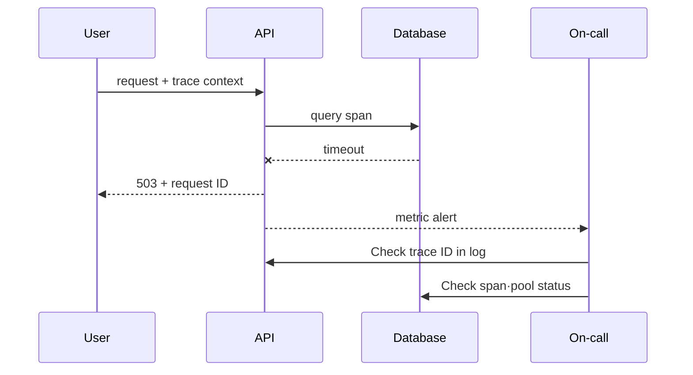

# 같은 요청의 기록을 연결하고 SLO 알림 시험하기

> 실습 등급: **Local**. 이미 Prometheus와 OpenTelemetry 데모 환경이 있다면 그 환경을 사용하고, 없으면 아래 데이터로 질의 의미를 먼저 검증한다.

## 실습 전에 준비할 것

- **선행 이해**: HTTP 상태 코드, 요청 처리 시간, 지표·로그·트레이스의 차이를 먼저 설명할 수 있어야 한다.
- **실행 환경**: Prometheus와 OpenTelemetry 데모가 있으면 실제 조회를 실행한다. 없다면 이 장은 수식과 사건 기록을 읽는 실습 기록표이며 실행 실습으로 완료 처리하지 않는다.
- **필요한 데이터**: 요청 수 카운터, 처리 시간 히스토그램, 요청 ID가 있는 로그, 트레이스 ID가 있는 트레이스가 필요하다.
- **시간 고정**: 장애 시작·완화·회복 시각과 조회 시간 구간을 같은 시간대로 기록한다.
- **변경 범위**: 첫 실행에서는 알림을 운영 담당자 호출 시스템에 연결하지 않고 로컬 알림 규칙 평가만 확인한다.
- **끝난 상태**: 임시 규칙과 시험 트래픽을 제거하고 원래 지표 추세로 돌아왔는지 확인한다.

아래 PromQL을 그대로 입력하기 전에 자신의 지표 이름과 라벨을 확인한다. 이름이 다르면 문법이 맞아도 데이터가 나오지 않으며, 그 결과는 서비스가 정상이라는 뜻이 아니다.

## 먼저 이해하기

이 실습의 목표는 실패한 요청 하나를 근거로 설명하는 것이다. 먼저 요청 ID와 트레이스 ID로 관련 기록을 찾는다. 전체 실패율이 증가한 시간대와 비교한 뒤, 트레이스에서 어느 작업이 늦어졌는지 확인한다. 이어 그 작업이 호출한 서비스나 DB를 조사해 원인을 좁힌다.

`http_server_requests_total` 같은 카운터는 프로세스 시작 이후의 요청 수를 누적한다. 지금 보이는 누적값만 나누면 오래전 요청까지 섞이므로, 최근 상태를 볼 때는 정해진 구간의 증가율인 `rate`를 사용한다. 히스토그램 버킷은 “이 시간 이하로 끝난 요청 수”를 누적해 기록한다. `histogram_quantile`은 이 버킷들로 p95 같은 백분위 값을 추정한다. 개별 요청의 시간을 기록한 트레이스와 구분한다.

| 관찰 | 알 수 있는 것 | 주의할 점 |
|---|---|---|
| 5분 오류 비율 | 최근 트래픽에서 실패 비중 | 트래픽이 적으면 작은 수에도 크게 흔들림 |
| p95 지연 | 관측값의 95%가 그 이하에 놓이는 것으로 추정한 경계값 | 버킷 해상도가 정확도를 제한한다. 가장 느린 요청의 시간이 아니다. |
| 트레이스의 스팬 | 선택된 요청의 구간별 시간 | 샘플링으로 모든 요청을 대표하지 않음 |
| 오류 로그 | 구성 요소가 기록한 상세 맥락 | 기록 누락과 시계 차이 가능 |
| 오류 예산 소진율 알림 | 오류 예산 소진 속도가 대응 기준을 넘음 | 기준값은 SLO 관측 구간에서 계산해야 함 |

## 1. 요청 계약 정하기

예제 API에 다음 공통 필드를 둔다.

```text
request_id=8f3... trace_id=4bf... route=/checkout status=503 duration_ms=842
```

카운터는 `http_server_requests_total{route,status_class}`처럼 값의 종류가 제한된 라벨을 사용한다. 요청마다 달라지는 `request_id`나 `user_id`를 넣으면 새 시계열이 계속 생겨 저장량과 조회 부담이 커진다. 개별 요청을 찾는 ID는 로그와 트레이스에 남긴다.

## 2. 가용성과 처리 시간 관찰

이 학습 계약은 5xx가 아닌 응답을 정상으로 분류하고 서비스 하나를 측정한다. 실제 결제 SLI는 거부, 취소, 시간 초과, 미기록 요청을 명시적으로 분류해야 한다. HTTP 상태만으로 주문 성공을 표현하지 못할 수 있다. 범위가 제한된 상태 클래스별 카운터를 0으로 초기화해 오류가 없는 시계열도 관측되게 한다.

```promql
sum(rate(http_server_requests_total{service="sample-api",status_class!="5xx"}[5m]))
/
sum(rate(http_server_requests_total{service="sample-api"}[5m]))
```

히스토그램에서 95번째 백분위를 계산하는 예다.

```promql
histogram_quantile(
  0.95,
  sum by (le, route) (rate(http_server_request_duration_seconds_bucket{service="sample-api"}[5m]))
)
```

트래픽이 0일 때 분모가 0이 되는 상황, 재시도가 요청 수를 늘리는 상황과 서버 진입점과 클라이언트 중 어느 지점에서 측정하는지를 기록한다.

## 3. 장애 시간축 연결

오류 요청 하나를 골라 다음 표를 채운다.

| 시간 | 증거 | 가설 | 조치 | 판정 |
|---|---|---|---|---|
| T0 | 성공 요청 비율 하락 | 호출한 서비스에 오류가 있을 수 있음 | 트레이스 ID로 요청 조회 | 조사 중 |
| T1 | DB 작업의 소요 시간 증가 | 사용할 DB 연결이 부족할 수 있음 | 연결 풀 지표 확인 | active=max, 사용 중인 연결 수가 한도에 도달 |
| T2 | 연결 풀 한도 조정 후 오류 예산 소진율 감소 | 연결 부족이 완화됐을 수 있음 | 필요하면 되돌릴 준비 | 관찰 중 |



## 4. 알림 검증

학습용 SLO가 30일 동안 99.9%라면 허용 오류 비율은 `0.001`이다. 소진율 `14.4`가 한 시간 지속되면 해당 기간 예산의 `14.4 × 1 / 720 = 2%`를 소모한다. 짧은 관측 구간도 함께 만족하도록 하면 소진이 여전히 진행 중인지 확인하는 데 도움이 된다. 다음 완전한 규칙을 `sample-api.rules.yml`로 저장한다.

```yaml
groups:
  - name: sample-api-slo
    rules:
      - record: sample_api:error_budget_burn_rate5m
        expr: sum(rate(http_server_requests_total{service="sample-api",status_class="5xx"}[5m])) / sum(rate(http_server_requests_total{service="sample-api"}[5m])) / 0.001
      - record: sample_api:error_budget_burn_rate1h
        expr: sum(rate(http_server_requests_total{service="sample-api",status_class="5xx"}[1h])) / sum(rate(http_server_requests_total{service="sample-api"}[1h])) / 0.001
      - alert: SampleApiFastBurn
        expr: (sample_api:error_budget_burn_rate1h > 14.4) and (sample_api:error_budget_burn_rate5m > 14.4)
        for: 2m
        labels:
          severity: page
        annotations:
          summary: Sample API error budget is burning quickly
```

Prometheus 도구가 있으면 `promtool check rules sample-api.rules.yml`로 규칙의 유효성을 확인한다. 이 명령만으로 지표가 수집되거나 알림이 시험되는 것은 아니다. 다음으로 2% 오류가 계속되는 경우, 0.1% 오류, 짧은 급증 후 회복, 카운터 초기화, 트래픽 없음, 수집 누락을 각각 시험한다. 2% 오류는 소진율 20이므로 두 관측 구간과 2분 지속 조건을 모두 만족하면 발동한다. 0.1% 오류는 소진율 1이어서 이 급속 소진 규칙은 발동하지 않는다. 트래픽이 0이면 비율을 계산할 수 없고, 시계열이 없으면 결과도 비어 있을 수 있다. 둘 다 정상으로 처리하지 말고 별도 규칙과 담당자를 둔다. 낮은 오류율이 오래 지속되는 경우를 잡으려면 더 긴 구간도 필요하다.

## 완료 판정과 정리

- 알림에서 사용자 피해를 확인할 대시보드와 대응 절차서(runbook)를 바로 열 수 있다.
- 요청 또는 트레이스 ID로 로그와 트레이스를 오갈 수 있다.
- 복구 후 짧은 관측 구간과 긴 관측 구간이 정상화되는 시점을 확인한다.
- 임시 규칙과 데모 워크로드만 제거한다. 사고 근거는 실습 보존 정책에 따라 유지한다.

## 실행 결과 예시

배포된 API의 측정값이 아니라 명시한 가상 요청 계약의 계산 예시다.

| 두 관측 구간의 입력 | 가용성 | 소진율 | 급속 소진 판정 |
|---|---:|---:|---|
| 1,000건 중 정상 980 + 실패 20 | 0.98 | 20 | 조건이 2분 지속되면 발동 |
| 1,000건 중 정상 999 + 실패 1 | 0.999 | 1 | 발동하지 않음 |
| 두 카운터 모두 증가 없음 | 정의되지 않음(NaN) | 정의되지 않음 | 정상 여부를 판정할 수 없음 |
| 모든 시계열 없음 | 빈 결과 | 빈 결과 | 관측 범위를 조사 |

```text
# promtool check rules sample-api.rules.yml (expected)
SUCCESS: 3 rules found
# Synthetic firing alert labels
alertname=SampleApiFastBurn severity=page
```

급증이 끝나도 1시간 비율은 높게 남고 5분 조건은 해제될 수 있다. 이때 두 조건의 논리곱은 발동을 멈춰야 한다. 시계열 예시 데이터로 검증한다. 알림 화면 캡처만으로 복구를 입증할 수 없다.

## 결과를 이렇게 읽는다

가용성 식의 결과가 `0.98`이면 선택한 라벨 범위와 최근 5분에서 약 98%의 요청을 정상으로 분류했다는 뜻이다. 어떤 요청을 측정 대상이나 성공 요청에서 제외했는지에 따라 의미가 달라진다. 상태 확인 요청이나 클라이언트 취소를 분모에서 제외할 때도, 실제 사용자 실패를 가리지 않는지 확인한다.

p95가 오른 시각에 DB 작업도 느려졌다면 DB 쪽 병목을 의심할 수 있다. 하지만 같은 때 일어났다는 이유만으로 원인이 확정되지는 않는다. 같은 트레이스 안에서 부모·자식 작업의 시간, 연결 풀 상태, DB 대기, 최근 변경을 함께 본다. 조치 후에는 요청 하나의 성공만 보지 말고 오류 예산 소진율, 느린 요청들의 지연, 밀린 작업량이 정상 범위로 돌아왔는지 확인한다.

알림이 와도 당직자가 할 수 있는 일이 없다면 먼저 대응 절차를 보완한다. 어떤 사용자 피해인지, 누가 맡는지, 어떤 조회부터 할지, 어떻게 피해를 줄일지 대응 절차서에 적는다. 임계값만 낮추면 행동에 도움이 되지 않는 알림이 더 자주 올 수 있다.

## 스스로 설명해 보기

1. 요청 ID를 지표 라벨에 넣으면 왜 위험한가?
2. 503 증가와 DB 스팬의 처리 시간 증가가 인과관계를 곧바로 증명하지는 않는 이유는 무엇인가?
3. 알림 해제를 시험하지 않으면 어떤 운영 문제가 남는가?

<!-- source: https://prometheus.io/docs/prometheus/latest/querying/basics/ | checked: 2026-09-03 -->
<!-- source: https://prometheus.io/docs/prometheus/latest/configuration/alerting_rules/ | checked: 2026-09-03 -->
<!-- source: https://opentelemetry.io/docs/concepts/signals/ | checked: 2026-09-03 -->
<!-- source: https://sre.google/workbook/alerting-on-slos/ | checked: 2026-09-03 -->
