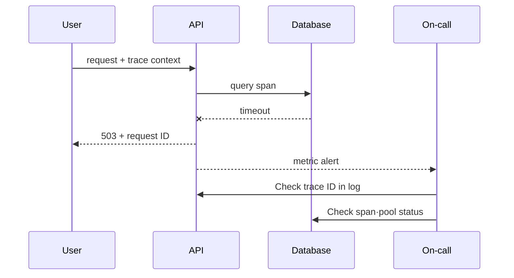

# Signal 상관관계와 SLO alert 실습

> 실습 등급: **Local**. 이미 Prometheus와 OpenTelemetry demo 환경이 있다면 그 환경을 사용하고, 없으면 아래 데이터로 질의 의미를 먼저 검증한다.

## 실습 전에 준비할 것

- **선행 이해**: HTTP status, 요청 처리 시간, metric·log·trace의 차이를 먼저 설명할 수 있어야 한다.
- **실행 환경**: Prometheus와 OpenTelemetry demo가 있으면 실제 query를 실행한다. 없다면 이 장은 수식과 사건 기록을 읽는 worksheet이며 실행 실습으로 완료 처리하지 않는다.
- **필요한 데이터**: request 수 counter, latency histogram, request ID가 있는 log, trace ID가 있는 trace가 필요하다.
- **시간 고정**: 장애 시작·완화·회복 시각과 query window를 같은 timezone으로 기록한다.
- **변경 범위**: 첫 실행에서는 alert를 production pager에 연결하지 않고 local rule 평가만 확인한다.
- **끝난 상태**: 임시 rule과 test traffic을 제거하고 원래 metric 추세로 돌아왔는지 확인한다.

아래 PromQL을 그대로 입력하기 전에 자신의 metric 이름과 label을 확인한다. 이름이 다르면 문법이 맞아도 데이터가 나오지 않으며, 그 결과는 서비스가 정상이라는 뜻이 아니다.

## 먼저 이해하기

이 실습에서 만들려는 것은 dashboard가 아니라 하나의 설명 가능한 incident chain이다. 사용자가 실패한 요청 하나를 출발점으로 request ID와 trace ID를 찾고, 그 요청이 전체 실패율에 포함됐는지 확인한 뒤 어떤 span과 dependency에서 시간이 늘었는지 좁힌다.

`http_server_requests_total` 같은 counter는 process가 시작된 뒤 누적된다. 따라서 현재 값끼리 나누기보다 일정 window의 `rate`를 사용한다. histogram bucket은 각 latency 경계 이하의 누적 요청 수이며 `histogram_quantile`이 여러 bucket을 이용해 percentile을 추정한다. 개별 요청의 정확한 시간을 보여 주는 trace와 역할이 다르다.

| 관찰 | 알 수 있는 것 | 주의할 점 |
|---|---|---|
| 5분 error ratio | 최근 traffic에서 실패 비중 | traffic이 적으면 작은 수에도 크게 흔들림 |
| p95 지연 | 관측값의 95%가 그 이하에 놓이는 것으로 추정한 경계값 | 버킷 해상도가 정확도를 제한한다. 가장 느린 요청의 시간이 아니다. |
| trace span | 선택된 요청의 hop별 시간 | sampling으로 모든 요청을 대표하지 않음 |
| error log | component가 기록한 상세 맥락 | 기록 누락과 clock 차이 가능 |
| burn-rate alert | budget 소진 속도가 대응 기준을 넘음 | threshold는 SLO window에서 계산해야 함 |

## 1. 요청 계약 정하기

sample API에 다음 공통 필드를 둔다.

```text
request_id=8f3... trace_id=4bf... route=/checkout status=503 duration_ms=842
```

counter는 `http_server_requests_total{route,status_class}`처럼 bounded label을 쓴다. `request_id`나 `user_id`를 metric label로 넣지 않는다. 개별 요청 identity는 log와 trace에 둔다.

## 2. Availability와 latency 관찰

이 학습 계약은 5xx가 아닌 응답을 정상으로 분류하고 서비스 하나를 측정한다. 실제 결제 SLI는 거부, 취소, 시간 초과, 미기록 요청을 명시적으로 분류해야 한다. HTTP 상태만으로 주문 성공을 표현하지 못할 수 있다. 범위가 제한된 상태 클래스별 카운터를 0으로 초기화해 오류가 없는 시계열도 관측되게 한다.

```promql
sum(rate(http_server_requests_total{service="sample-api",status_class!="5xx"}[5m]))
/
sum(rate(http_server_requests_total{service="sample-api"}[5m]))
```

histogram에서 95 percentile을 계산하는 예다.

```promql
histogram_quantile(
  0.95,
  sum by (le, route) (rate(http_server_request_duration_seconds_bucket{service="sample-api"}[5m]))
)
```

traffic이 0일 때 분모가 0이 되는 상황, retry가 요청 수를 늘리는 상황과 ingress/client 중 어느 지점에서 측정하는지를 기록한다.

## 3. 장애 시간축 연결

오류 요청 하나를 골라 다음 표를 채운다.

| 시간 | 증거 | 가설 | 조치 | 판정 |
|---|---|---|---|---|
| T0 | availability SLI 하락 | upstream 오류 | trace ID 조회 | 조사 중 |
| T1 | DB span latency 증가 | connection saturation | pool metric 확인 | active=max |
| T2 | pool 제한 조정 후 burn 감소 | 병목 완화 | rollback 준비 | 관찰 중 |



## 4. Alert 검증

학습용 SLO가 30일 동안 99.9%라면 허용 오류 비율은 `0.001`이다. 소진율 `14.4`가 한 시간 지속되면 해당 기간 예산의 `14.4 × 1 / 720 = 2%`를 소모한다. 짧은 관측 구간도 함께 만족하도록 하면 소진이 여전히 진행 중인지 확인하는 데 도움이 된다. 다음 완전한 규칙을 `sample-api.rules.yml`로 저장한다.

```yaml
groups:
  - name: sample-api-slo
    rules:
      - record: sample_api:error_budget_burn_rate5m
        expr: sum(rate(http_server_requests_total{service="sample-api",status_class="5xx"}[5m])) / sum(rate(http_server_requests_total{service="sample-api"}[5m])) / 0.001
      - record: sample_api:error_budget_burn_rate1h
        expr: sum(rate(http_server_requests_total{service="sample-api",status_class="5xx"}[1h])) / sum(rate(http_server_requests_total{service="sample-api"}[1h])) / 0.001
      - alert: SampleApiFastBurn
        expr: (sample_api:error_budget_burn_rate1h > 14.4) and (sample_api:error_budget_burn_rate5m > 14.4)
        for: 2m
        labels:
          severity: page
        annotations:
          summary: Sample API error budget is burning quickly
```

Prometheus 도구를 사용할 수 있으면 `promtool check rules sample-api.rules.yml`을 실행한다. 이것은 규칙의 유효성을 확인할 뿐 수집 데이터를 제공하지 않는다. 지속적인 2% 오류(소진율 20, 두 구간과 `for` 조건 충족 후 호출), 0.1% 오류(소진율 1, 급속 소진 호출 없음), 짧은 급증 후 회복, 카운터 초기화, 트래픽 없음, 수집 누락을 시험한다. 트래픽이 0이면 비율이 정의되지 않으며 시계열 누락은 빈 결과를 만들 수 있다. 둘 다 정상의 증거가 아니다. 수집 가용성과 기대한 트래픽의 부재에는 별도 규칙과 담당자를 둔다. 낮은 비율의 장기 손실에는 더 긴 관측 구간을 추가한다. 이 최소 급속 소진 규칙이 전체 호출 정책은 아니다.

## 완료 판정과 정리

- alert 발생 시 사용자 impact와 연결되는 dashboard·runbook이 열린다.
- request 또는 trace ID로 log와 trace를 오갈 수 있다.
- 복구 후 짧은 window와 긴 window가 정상화되는 시점을 확인한다.
- 임시 규칙과 데모 워크로드만 제거한다. 사고 근거는 실습 보존 정책에 따라 유지한다.

## 실행 결과 예시

배포된 API의 측정값이 아니라 명시한 가상 요청 계약의 계산 예시다.

| 두 관측 구간의 입력 | 가용성 | 소진율 | 급속 소진 판정 |
|---|---:|---:|---|
| 1,000건 중 정상 980 + 실패 20 | 0.98 | 20 | 조건이 2분 지속되면 발동 |
| 1,000건 중 정상 999 + 실패 1 | 0.999 | 1 | 발동하지 않음 |
| 두 카운터 모두 증가 없음 | 정의되지 않음(NaN) | 정의되지 않음 | 정상 여부를 판정할 수 없음 |
| 모든 시계열 없음 | 빈 결과 | 빈 결과 | 관측 범위를 조사 |

```text
# promtool check rules sample-api.rules.yml (expected)
SUCCESS: 3 rules found
# Synthetic firing alert labels
alertname=SampleApiFastBurn severity=page
```

급증이 끝나도 1시간 비율은 높게 남고 5분 조건은 해제될 수 있다. 이때 두 조건의 논리곱은 발동을 멈춰야 한다. 시계열 예시 데이터로 검증한다. 알림 화면 캡처만으로 복구를 입증할 수 없다.

## 결과를 이렇게 읽는다

availability 식의 값이 `0.98`이면 선택한 5분 window와 label 범위에서 약 98%가 good으로 분류됐다는 뜻이다. 어떤 request를 valid 또는 good에서 제외했는지에 따라 의미가 달라진다. health check나 client cancel을 무심코 분모에서 빼면 실제 사용자 실패를 숨길 수 있다.

p95가 상승한 시각과 DB span 증가가 겹치면 dependency 병목 가설이 강해지지만 아직 인과관계가 확정된 것은 아니다. 같은 trace의 parent-child 시간, connection pool, DB wait와 변경 시점을 함께 본다. 완화 후에는 단일 성공 요청뿐 아니라 burn rate, tail latency와 backlog가 정상 범위로 돌아오는지 확인한다.

alert가 firing됐지만 on-call이 할 수 있는 행동이 없다면 rule을 더 민감하게 만드는 것이 해법이 아니다. 사용자 영향과 연결되는 조건, owner, 첫 진단 query와 안전한 완화 동작을 runbook에 묶어야 한다.

## 스스로 설명해 보기

1. request ID를 metric label에 넣으면 왜 위험한가?
2. 503 증가와 DB span latency 증가가 인과관계를 곧바로 증명하지는 않는 이유는 무엇인가?
3. alert recovery를 시험하지 않으면 어떤 운영 문제가 남는가?

<!-- source: https://prometheus.io/docs/prometheus/latest/querying/basics/ | checked: 2026-09-03 -->
<!-- source: https://prometheus.io/docs/prometheus/latest/configuration/alerting_rules/ | checked: 2026-09-03 -->
<!-- source: https://opentelemetry.io/docs/concepts/signals/ | checked: 2026-09-03 -->
<!-- source: https://sre.google/workbook/alerting-on-slos/ | checked: 2026-09-03 -->
