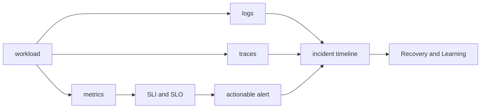

# Observability와 SRE 로드맵

## 처음 보는 사람을 위한 출발점

사용자가 “서비스가 느리다”고 알려 왔을 때 CPU 그래프 하나만 봐서는 어느 요청이 왜 느린지 알 수 없다. 프로그램이 남긴 숫자, 사건 기록과 요청 경로를 함께 봐야 사용자에게 실제로 어떤 문제가 생겼는지 설명할 수 있다. 관측 가능성은 그 증거를 설계하는 일이고, SRE는 신뢰성 목표와 운영 방법을 연결하는 접근이다.

| 처음 만나는 말 | 학습용 쉬운 뜻 | 왜 필요한가요 · 언제 쓰나요 |
|---|---|---|
| 지표(metric) | 시간에 따라 반복해서 측정한 숫자. 예: 초당 요청 수 | 모든 이벤트를 개별 조회하지 않고 많은 작업의 추세와 비율을 관찰할 때 쓴다. **구체적인 상황(가상 예시):** 오늘 아침 결제 실패 문의가 늘었다. → 같은 구간의 실패·시도 지표를 비교한다. → 실패 비율이 실제 증가했는지 확인한다. |
| 로그(log) | 프로그램에서 발생한 사건을 시간과 함께 남긴 기록 | 집계 지표만으로 설명되지 않는 개별 작업의 사건을 확인할 때 쓴다. **구체적인 상황(가상 예시):** 전체 트래픽은 정상인데 주문 하나가 실패했다. → 해당 주문과 연결된 로그를 찾는다. → 평균으로 추측하지 말고 기록된 오류를 확인한다. |
| 추적(trace) | 요청 하나가 여러 서비스를 지난 경로와 소요 시간 | 요청 하나의 지연이나 실패에 어느 서비스·작업이 기여했는지 찾는 데 쓴다. **구체적인 상황(가상 예시):** 여러 서비스를 거치는 결제가 3초 걸린다. → 요청 트레이스를 조사한다. → 지연을 만든 작업을 찾고 다른 근거로 확인한다. |
| SLI | 사용자가 받은 결과를 숫자로 측정하는 방법 | 사용자의 성공·실패를 일관되게 측정할 수 있는 운영 신호로 바꿀 때 쓴다. **구체적인 상황(가상 예시):** 주문이 거부돼도 대시보드는 HTTP 성공으로 센다. → 승인된 주문 결과를 기준으로 SLI를 정의한다. → 요청 기록과 분자·분모를 대조한다. |
| SLO | 그 측정값이 어느 수준이어야 하는지 정한 목표 | 허용할 서비스 결과에 합의하고 그 목표를 기준으로 작업의 우선순위를 정한다. **구체적인 상황(가상 예시):** 느린 서비스를 허용할 수 있는지 팀의 의견이 다르다. → 측정 결과와 SLO 기간에 합의한다. → 관측을 해당 목표와 비교한다. |
| 알림(alert) | 사람이 행동해야 할 상태임을 알려 주는 신호 | 신속한 조사나 조치가 필요한 조건을 대응자에게 알릴 때 쓴다. **구체적인 상황(가상 예시):** 사용자 영향이 없는데 시끄러운 임계값이 대응자를 깨운다. → 경보 조건과 필요한 대응을 검토한다. → 조치가 필요한 실패가 명확한 알림을 만드는지 시험한다. |

처음에는 요청 하나를 보내고 metric·log·trace에서 같은 사건을 찾는다. 그다음 여러 요청을 묶어 SLI를 계산하고, 실제 행동으로 이어지는 alert를 설계한다.

## 무엇을 해결하는가

관측 도구가 많아도 사용자가 겪는 실패와 연결되지 않으면 운영 판단에 도움이 되지 않는다. 이 과정은 metric·log·trace를 같은 요청과 시간축에 놓고, SLI·SLO·error budget으로 대응 우선순위를 정하는 법을 다룬다.

## 선수 지식

- [Kubernetes 로드맵](../../content/kubernetes/00-roadmap.md)의 workload와 Service
- Linux process·socket과 네트워크 요청 경로
- 비율, percentile과 시간 구간을 읽는 기본 수학

## 학습 순서

1. **Signal과 reliability model**: Prometheus, Alertmanager, OpenTelemetry와 SLO의 책임을 구분한다.
2. **상관관계·alert 실습**: 같은 요청의 metric·log·trace를 연결하고 SLO alert를 판정한다.

## 완료

이 주제는 한 번 읽고 끝내지 않는다. 먼저 용어 표를 자신의 말로 바꾸고, 개념 장에서 한 요청의 흐름을 따라간다. 실습에서는 정상 상태를 먼저 기록한 뒤 조건 하나만 바꿔 실패를 만들고, 증거로 원인을 설명한 뒤 복구한다. 마지막으로 아래 운영 판단 질문에 답하면서 더 복잡한 환경으로 확장한다.

- 사용자 관점의 SLI를 정의하고 측정식의 분자·분모를 설명한다.
- page alert와 조사 dashboard의 목적을 구분한다.
- incident timeline에 증거, 가설, 조치와 결과를 분리해 기록한다.

## 범위 밖

Grafana 화면 제작 강좌, 특정 SaaS 선택 비교와 모든 exporter 목록은 다루지 않는다. 도구보다 운영 계약을 우선한다.

## 처음 이해했는지 확인

1. metric, log와 trace는 각각 어떤 질문에 답하는가?
2. SLI와 SLO는 어떻게 다른가?

**확인 기준:** metric은 전체 추세, log는 개별 사건, trace는 요청 경로를 주로 보여 주며, SLI는 측정 방법이고 SLO는 그 값의 목표라고 설명할 수 있으면 된다.

## 운영 판단으로 확장하기

1. CPU가 높다는 사실만으로 page를 보내면 안 되는 이유는 무엇인가?
2. trace ID가 log와 metric 조사에 어떤 연결 고리를 제공하는가?
3. error budget을 배포 속도와 연결할 때 필요한 조직적 합의는 무엇인가?

<!-- source: https://prometheus.io/docs/introduction/overview/ | checked: 2026-09-03 -->
<!-- source: https://opentelemetry.io/docs/collector/ | checked: 2026-09-03 -->
<!-- source: https://sre.google/workbook/implementing-slos/ | checked: 2026-09-03 -->
