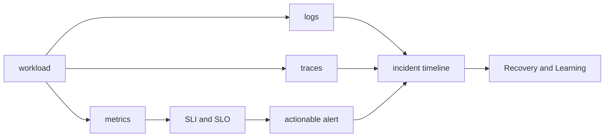

# 관측성과 SRE: 장애를 찾고 복구하는 학습 순서

## 처음 보는 사람을 위한 출발점

사용자가 “서비스가 느리다”고 알려 왔다. CPU 그래프만으로는 어떤 요청이 어디서 늦어졌는지 알기 어렵다. 요청 수와 처리 시간 같은 지표, 오류를 남긴 로그, 여러 서비스를 거친 경로인 트레이스를 함께 봐야 한다. 이렇게 기록으로 시스템의 동작을 설명할 수 있는 능력이 관측성(observability)이다. SRE는 사용자에게 필요한 신뢰성 목표를 정하고 그 목표에 맞춰 서비스를 운영하는 접근이다.

| 처음 만나는 말 | 학습용 쉬운 뜻 | 왜 필요한가요 · 언제 쓰나요 |
|---|---|---|
| 지표(metric) | 시간에 따라 반복해서 측정한 숫자. 예: 초당 요청 수 | 모든 이벤트를 개별 조회하지 않고 많은 작업의 추세와 비율을 관찰할 때 쓴다. **구체적인 상황(가상 예시):** 오늘 아침 결제 실패 문의가 늘었다. → 같은 구간의 실패·시도 지표를 비교한다. → 실패 비율이 실제 증가했는지 확인한다. |
| 로그(log) | 프로그램에서 발생한 사건을 시간과 함께 남긴 기록 | 집계 지표만으로 설명되지 않는 개별 작업의 사건을 확인할 때 쓴다. **구체적인 상황(가상 예시):** 전체 트래픽은 정상인데 주문 하나가 실패했다. → 해당 주문과 연결된 로그를 찾는다. → 평균으로 추측하지 말고 기록된 오류를 확인한다. |
| 트레이스(trace) | 요청 하나가 여러 서비스를 지난 경로와 소요 시간 | 요청 하나의 지연이나 실패에 어느 서비스·작업이 기여했는지 찾는 데 쓴다. **구체적인 상황(가상 예시):** 여러 서비스를 거치는 결제가 3초 걸린다. → 요청 트레이스를 조사한다. → 지연을 만든 작업을 찾고 다른 근거로 확인한다. |
| SLI | 성공 요청 비율처럼 사용자가 받은 결과를 측정하는 지표 | 사용자에게 서비스가 제대로 제공됐는지 숫자로 확인한다. **구체적인 상황(가상 예시):** 주문이 거부됐는데도 HTTP 응답이 정상이어서 성공으로 집계된다. → 실제 주문 승인 여부로 성공을 정의한다. → 승인 건수와 전체 대상 요청 수가 기록과 맞는지 확인한다. |
| SLO | 정해진 기간에 SLI가 달성해야 하는 목표 | 팀이 지켜야 할 수준에 합의하고 개선 작업의 우선순위를 정한다. **구체적인 상황(가상 예시):** 서비스가 얼마나 느려져도 괜찮은지 팀마다 생각이 다르다. → 지표, 목표값, 평가 기간을 정한다. → 실제 결과가 그 목표에 도달했는지 비교한다. |
| 알림(alert) | 담당자의 확인이나 조치가 필요한 상태를 알려 주는 신호 | 실제 대응이 필요한 문제를 담당자에게 제때 알린다. **구체적인 상황(가상 예시):** 사용자에게 문제가 없는데도 알림이 당직자를 깨운다. → 알림 조건과 해야 할 조치를 함께 검토한다. → 실제 조치가 필요한 실패에서 알림이 오는지 시험한다. |

처음에는 요청 하나를 보내고 지표·로그·트레이스에서 그 요청의 흔적을 찾는다. 그다음 여러 요청의 성공률을 구해 목표와 비교한다. 마지막으로 어떤 상황에서 누구에게 알리고 무엇을 할지 정한다.

## 무엇을 해결하는가

관측 도구를 많이 설치해도 사용자 문제와 연결하지 못하면 대응하기 어렵다. 이 과정에서는 같은 요청과 시간대를 기준으로 지표·로그·트레이스를 연결한다. 이어 실제 성공률 같은 SLI, 목표인 SLO, 허용 실패량인 오류 예산을 이용해 어떤 문제부터 해결할지 판단한다.

## 선수 지식

- [Kubernetes 로드맵](../../content/kubernetes/00-roadmap.md)의 워크로드와 Service
- Linux 프로세스·소켓과 네트워크 요청 경로
- 비율, 백분위와 시간 구간을 읽는 기본 수학

## 학습 순서

1. **관측 신호와 신뢰성 목표**: Prometheus는 지표를, Alertmanager는 알림 전달을, OpenTelemetry는 계측·수집·전송을 어떻게 맡는지 배운다. 이를 사용자 관점의 SLO와 연결한다.
2. **기록 연결과 알림 실습**: 같은 요청의 지표·로그·트레이스를 찾아보고, SLO를 위협하는 실패가 알림으로 이어지는지 확인한다.

## 완료

이 주제는 한 번 읽고 끝내지 않는다. 먼저 용어 표를 자신의 말로 바꾸고, 개념 장에서 한 요청의 흐름을 따라간다. 실습에서는 정상 상태를 먼저 기록한 뒤 조건 하나만 바꿔 실패를 만들고, 증거로 원인을 설명한 뒤 복구한다. 마지막으로 아래 운영 판단 질문에 답하면서 더 복잡한 환경으로 확장한다.

- 사용자 관점의 SLI를 정의하고 측정식의 분자·분모를 설명한다.
- 긴급 호출 알림과 조사 대시보드의 목적을 구분한다.
- 장애 대응 시간순 기록에 증거, 가설, 조치와 결과를 분리해 기록한다.

## 범위 밖

Grafana 화면 제작법, 특정 SaaS의 제품 비교, 모든 exporter 목록은 다루지 않는다. 먼저 어떤 사용자 결과를 측정하고 어느 조건에서 대응할지 정한다.

## 처음 이해했는지 확인

1. 지표, 로그와 트레이스는 각각 어떤 질문에 답하는가?
2. SLI와 SLO는 어떻게 다른가?

**확인 기준:** 지표는 전체 추세, 로그는 개별 사건, 트레이스는 요청 경로를 주로 보여 주며, SLI는 측정 방법이고 SLO는 그 값의 목표라고 설명할 수 있으면 된다.

## 운영 판단으로 확장하기

1. CPU가 높다는 사실만으로 긴급 호출을 보내면 안 되는 이유는 무엇인가?
2. 트레이스 ID가 로그와 지표 조사에 어떤 연결 고리를 제공하는가?
3. 오류 예산을 배포 속도와 연결할 때 필요한 조직적 합의는 무엇인가?

<!-- source: https://prometheus.io/docs/introduction/overview/ | checked: 2026-09-03 -->
<!-- source: https://opentelemetry.io/docs/collector/ | checked: 2026-09-03 -->
<!-- source: https://sre.google/workbook/implementing-slos/ | checked: 2026-09-03 -->
