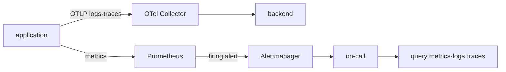
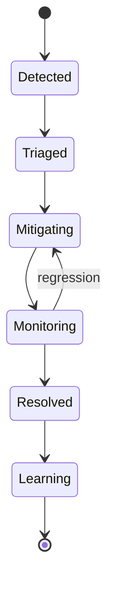

# 지표·로그·트레이스로 장애를 이해하고 SLO로 판단하기

## 이 장에서 처음 쓰는 말

- **텔레메트리(telemetry)**: 시스템이 상태를 알리기 위해 내보내는 지표·로그·트레이스 등의 데이터다. **왜 필요한가요 · 언제 쓰나요:** 시스템 밖에서 동작을 확인하고 장애 원인을 찾을 때 쓴다. **구체적인 상황(가상 예시):** 서비스는 동작하지만 모니터링 데이터가 끊겼다. → 기록을 만드는 단계와 전송하는 단계를 따로 확인한다. → 기록이 없으면 정상으로 보지 말고 상태를 확인할 수 없다고 표시한다.
- **처리 시간(latency)**: 요청을 보낸 뒤 응답을 받을 때까지 걸린 시간이다. **왜 필요한가요 · 언제 쓰나요:** 사용자가 얼마나 기다리는지 재고 느린 작업을 찾는다. **구체적인 상황(가상 예시):** 평균은 그대로인데 일부 사용자가 오래 기다린다. → 처리 시간 분포와 느린 요청의 트레이스를 본다. → 오래 걸린 요청들이 사용자에게 약속한 시간을 넘었는지 확인한다.
- **오류율(error rate)**: 전체 요청 중 실패한 요청의 비율이다. **왜 필요한가요 · 언제 쓰나요:** 요청이 늘어 실패 건수도 늘어난 것인지, 실제로 실패할 확률이 높아진 것인지 구분한다. **구체적인 상황(가상 예시):** 실패 건수는 두 배가 됐지만 요청 수는 세 배가 됐다. → 실패 건수를 전체 요청 수로 나눈다. → 실패 건수만 보지 말고 전후 오류율을 비교한다.
- **SLI**: 성공 요청 비율처럼 사용자가 받은 결과를 실제로 측정하는 지표다. **왜 필요한가요 · 언제 쓰나요:** 사용자에게 서비스가 제대로 제공됐는지 숫자로 확인한다. **구체적인 상황(가상 예시):** 주문이 거부됐는데도 HTTP 응답이 정상이어서 성공으로 집계된다. → 실제 주문 승인 여부로 성공을 정의한다. → 승인 건수와 전체 대상 요청 수가 기록과 맞는지 확인한다.
- **SLO**: 정해진 기간에 SLI가 달성해야 하는 목표다. **왜 필요한가요 · 언제 쓰나요:** 어떤 수준을 유지할지 합의하고 개선 작업의 우선순위를 정한다. **구체적인 상황(가상 예시):** 서비스가 얼마나 느려져도 괜찮은지 팀마다 생각이 다르다. → 측정할 지표, 목표값, 평가 기간을 정한다. → 실제 결과가 그 목표에 도달했는지 비교한다.
- **장애(incident)**: 사용자에게 문제가 생겨 대응과 복구가 필요한 사건이다. **왜 필요한가요 · 언제 쓰나요:** 피해 범위를 파악하고 복구와 재발 방지 작업을 함께 관리한다. **구체적인 상황(가상 예시):** 배포 중 결제가 멈췄다. → 언제부터 누구의 결제가 실패했는지 확인한다. → 조치 후 실제 결제가 다시 성공하는지 확인한다.

지표, 로그, 트레이스는 서로 경쟁하는 도구가 아니다. 같은 요청을 서로 다른 각도에서 설명한다. 처음에는 요청 ID와 발생 시각 두 단서로 세 신호를 연결한다.

## 먼저 이해하기

사용자가 결제를 시도했는데 10초 뒤 `503` 오류를 받았다고 하자. 지표로는 전체 결제 중 실패가 얼마나 늘었는지 본다. 로그로는 이 요청에서 어떤 오류가 기록됐는지 찾는다. 트레이스로는 API → 결제 서비스 → 데이터베이스 중 어느 작업이 시간을 썼는지 살핀다. 세 기록을 연결해야 실패 규모와 개별 원인을 함께 설명할 수 있다.

여기에 신뢰성 용어를 연결한다.

| 용어 | 의미 | 결제 API 예시 |
|---|---|---|
| SLI | 실제로 측정하는 신뢰성 지표 | 유효 결제 요청 중 성공한 비율 |
| SLO | 일정 기간 동안 달성하려는 SLI 목표 | 30일 성공률 99.9% |
| 오류 예산 | 목표가 허용하는 실패 여유 | 전체 유효 요청의 0.1% |
| 알림(alert) | 담당자의 조치가 필요한 조건 | 허용 실패량이 빠르게 소진됨 |
| 장애(incident) | 사용자 피해를 줄이고 복구한 뒤 재발을 줄이는 대응 과정 | 탐지 → 피해 완화 → 복구 → 사후 개선 |

CPU 사용률은 원인을 찾는 단서지만 사용자의 결제 성공률을 직접 알려 주지는 않는다. CPU가 높아도 결제가 정상일 수 있고, CPU가 낮아도 외부 서비스의 시간 초과로 결제가 모두 실패할 수 있다. 먼저 사용자 결과가 SLO를 벗어났는지 보고, 인프라 지표로 원인을 조사한다. CPU가 높다는 사실만으로 담당자를 즉시 호출할지는 신중히 정한다.

## 실패한 요청 하나가 대응으로 이어지는 과정

1. 클라이언트가 요청 ID를 가진 HTTP 요청을 보낸다.
2. 애플리케이션이 처리 중 중요한 사건을 로그로 남기고 트레이스에 구간별 시간을 기록한다.
3. 성공·실패 수와 처리 시간이 지표에 누적된다.
4. 운영자는 같은 요청 ID와 시각으로 로그와 트레이스를 연결해 직접 실패 지점을 찾는다.
5. 여러 요청의 지표로 SLI를 계산하고 정한 SLO와 비교한다.
6. 오류 예산이 빠르게 줄어 대응이 필요한 수준이면 알림을 보내 장애 대응을 시작한다.
7. 복구 뒤 사용자 요청과 SLI가 정상 범위로 돌아왔는지 확인한다.

개별 트레이스 하나는 전체 사용자의 상태를 대표하지 않고, 전체 오류율 하나는 어느 요청이 왜 실패했는지 알려 주지 않는다. 서로 다른 증거를 연결해야 한다.

## 관측 신호의 역할은 서로 다르다

| 관측 신호 | 강한 질문 | 흔한 한계 |
|---|---|---|
| 지표 | 얼마나 자주, 얼마나 오래 발생했는가? | 개별 요청의 상세 맥락이 적다 |
| 로그 | 그 시점에 구성 요소가 무엇을 기록했는가? | 기록량·형식·누락에 민감하다 |
| 트레이스 | 한 요청이 어디서 시간을 썼는가? | 샘플링과 문맥 전파가 필요하다 |

Prometheus는 서비스·경로 같은 라벨을 붙인 지표를 시간에 따라 수집하고 PromQL로 조회한다. Prometheus의 알림 규칙이 조건을 평가하면 Alertmanager가 관련 알림을 묶어 담당자에게 보낸다. 상위 장애 때문에 중복된 알림을 억제하거나 일정 시간 알림을 끄는 기능도 맡는다. OpenTelemetry Collector는 receiver → processor → exporter 순서로 관측 데이터를 받고 가공해 목적지로 전송한다.



## SLI에서 알림까지

가용성 SLI의 한 예는 다음과 같다.

```text
good requests / valid requests
```

먼저 어떤 요청을 전체 대상에 넣고 어떤 결과를 성공으로 셀지, 어디서 측정할지 정한다. 30일 성공률 목표가 99.9%라면 허용 실패 비율은 0.1%다. 요청 기반 지표라면 실제 대상 요청 수에 이 비율을 적용해 허용 실패 건수를 구한다. 시간 기반 지표라면 대상 시간을 기준으로 계산한다.

소진율(burn rate)은 실제 실패율이 허용 실패율의 몇 배인지를 나타낸다. 짧은 구간과 긴 구간을 함께 보면 지금도 실패가 계속되는지, 일시적인 급증인지 구분하는 데 도움이 된다. 이를 여러 구간을 함께 보는 소진율 알림이라고 한다. 어느 길이의 구간과 어느 기준값을 쓸지는 트래픽과 대응에 걸리는 시간에 맞춰 시험한다.

## 장애 상태 전이



장애 중에는 근본 원인을 완전히 밝히기 전에 사용자 피해를 줄이는 조치가 필요할 수 있다. 시간순 기록에는 관찰한 사실, 당시의 추측, 실행한 조치, 그 결과를 구분해 남긴다. 사후 분석에서는 개인의 실수만 나열하기보다 시스템과 절차를 어떻게 바꿔 재발을 줄일지 정한다.

## 운영 판단

- 라벨마다 가능한 값이 많으면 조합 수가 늘어 저장 비용과 조회 부담이 커질 수 있다.
- 모든 트레이스를 보관하면 조사 자료는 많아지지만 저장 비용도 커진다. 샘플링할 때는 비용과 놓칠 수 있는 기록을 함께 고려한다.
- 대시보드가 유용해도 즉시 행동할 수 없는 조건이면 긴급 호출 알림으로 만들지 않는다.
- 관측 데이터 전송 경로 자체의 대기열, 유실, 전송 실패도 관측한다.

## 스스로 설명해 보기

1. Alertmanager가 지표를 직접 평가하는 구성 요소가 아닌 이유는 무엇인가?
2. 상태 확인 요청(health check)을 SLO 분모에서 제외할지 정하려면 무엇을 확인해야 하는가?
3. 샘플링된 트레이스만으로 장애 범위를 과신하면 안 되는 이유는 무엇인가?

<!-- source: https://prometheus.io/docs/introduction/overview/ | checked: 2026-09-03 -->
<!-- source: https://prometheus.io/docs/alerting/latest/alertmanager/ | checked: 2026-09-03 -->
<!-- source: https://opentelemetry.io/docs/collector/configuration/ | checked: 2026-09-03 -->
<!-- source: https://sre.google/sre-book/service-level-objectives/ | checked: 2026-09-03 -->
