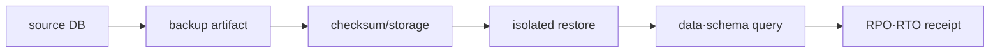

# Lock, backup과 restore 실습

> 실습 등급: **Local**. disposable PostgreSQL 18 instance를 사용한다. production query를 그대로 복사해 실행하지 않는다.

## 실습 전에 준비할 것

- **환경**: PostgreSQL 18 test instance를 사용한다. 운영 database나 중요한 local database에는 연결하지 않는다.
- **도구**: `psql`, `pg_dump`, `pg_restore`, `createdb`, `dropdb`가 같은 major version 기준으로 준비돼야 한다.
- **database**: 실습용 source database를 하나 만들고 문서의 `replace_source_db`를 실제 이름으로 바꾼다.
- **terminal**: lock을 보유할 session A, 기다릴 session B, 상태를 조회할 session C까지 세 개를 연다.
- **파일**: 현재 directory에 `accounts.dump`가 없어야 한다. 같은 이름의 파일이 있으면 덮어쓰지 말고 별도 directory를 사용한다.
- **정리 대상**: 새로 만든 테스트 데이터베이스 두 개, 덤프 파일, 미완료 트랜잭션.

먼저 세 terminal이 모두 같은 test instance와 database를 보고 있는지 `SELECT current_database(), pg_backend_pid();`로 확인한다. PID가 서로 달라야 세 개의 별도 session이다.

## 먼저 이해하기

첫 실습에서는 session A가 row lock을 가진 채 transaction을 끝내지 않아 session B가 기다린다. B의 query가 느린 것이지만 CPU나 disk가 원인인 것은 아니다. PostgreSQL은 같은 row의 충돌하는 변경이 일관성을 깨지 않도록 B를 대기시키고, `pg_blocking_pids`는 대기의 직접 원인인 session A를 가리킨다.

두 번째 실습은 backup 생성과 restore 성공을 분리한다. `pg_dump` exit code 0은 dump artifact를 만들었다는 뜻이고, 별도 database에 `pg_restore`한 뒤 schema·constraint·대표 row를 읽어야 복구 경로가 실제로 작동했음을 확인할 수 있다.

| 단계 | 성공 기준 | 성공해도 남는 확인 |
|---|---|---|
| lock 관찰 | waiter와 blocker PID 연결 | blocker transaction의 업무 의미 |
| blocker 종료 | waiter 진행·rollback 완료 | application retry와 일관성 |
| dump 생성 | exit code·artifact 존재 | artifact 손상·복원 가능성 |
| restore | 별도 DB에 schema와 data 생성 | application query·RPO·RTO |
| failover | 새 primary가 write 수락 | 클라이언트 엔드포인트·old primary 처리 |

## 1. 실습 데이터

이 장 전체에서 `replace_source_db`와 `replace_restore_db`에는 사용 중이 아닌 이름을 지정한다. `createdb replace_source_db`가 실패하면 기존 데이터베이스를 재사용하지 말고 중단한다. 각 세션은 `psql -X --set ON_ERROR_STOP=1 replace_source_db`로 연다. 세션 C에서 테이블을 한 번 생성한다.

```sql
CREATE TABLE accounts (
  id bigint PRIMARY KEY,
  balance numeric(12,2) NOT NULL CHECK (balance >= 0)
);
INSERT INTO accounts VALUES (1, 100.00), (2, 100.00);
```

두 session을 연다. session A에서 row를 변경하고 transaction을 유지한다.

```sql
BEGIN;
UPDATE accounts SET balance = balance - 10 WHERE id = 1;
```

session B에서 같은 row를 변경하면 대기한다.

```sql
SET lock_timeout = '60s';
UPDATE accounts SET balance = balance + 10 WHERE id = 1;
```

세 번째 session에서 waiter와 blocker를 관찰한다.

```sql
SELECT a.pid, a.wait_event_type, a.wait_event, pg_blocking_pids(a.pid) AS blockers, a.query
FROM pg_stat_activity AS a
WHERE cardinality(pg_blocking_pids(a.pid)) > 0;
```

A를 60초 안에 끝낸다. A가 커밋하면 B가 완료된 후 계정 1은 `100.00`으로 돌아오고, A가 롤백하면 B가 완료된 후 `110.00`이 된다. B에 잠금 시간 초과가 나면 문장은 실패했으므로 A 종료 후 의도적으로 다시 실행하기 전에는 어느 예상값도 적용되지 않는다. B에서 `RESET lock_timeout;`을 실행한다. C에서 `TABLE accounts ORDER BY id;`를 확인하고 백업 전에 모든 열린 트랜잭션을 끝낸다.

## 2. Logical backup과 별도 restore

```bash
pg_dump --format=custom --file=accounts.dump replace_source_db
createdb replace_restore_db
pg_restore --exit-on-error --dbname=replace_restore_db accounts.dump
psql -X --set ON_ERROR_STOP=1 replace_restore_db -c 'TABLE accounts ORDER BY id;'
```

backup 성공 exit code와 파일 size만으로 복구 가능성을 증명하지 않는다. 별도 database에 restore하고 row count, constraint, 대표 query와 application compatibility를 확인한다.



## 3. PITR와 failover 판정

PITR에는 연속적인 WAL archive와 그보다 앞선 base backup, recovery target이 필요하다. 실제 운영 훈련에서는 다음을 기록한다.

- 마지막 복구 가능한 timestamp와 예상 RPO
- restore 시작부터 read/write 승인까지 실제 RTO
- timeline과 target 전후의 marker row
- application DNS/endpoint 전환과 stale 클라이언트 처리
- 복제본 promotion 뒤 원 primary 재합류 절차

managed 서비스가 backup과 promotion API를 제공해도 application consistency와 클라이언트 전환 검증 책임은 사라지지 않는다.

## 정리

두 test database와 `accounts.dump`를 삭제한다. 실제 backup 보관 정책의 artifact에는 동일한 cleanup을 적용하지 않는다.

```bash
dropdb replace_restore_db
dropdb replace_source_db
rm -f accounts.dump
```

## 실행 결과 예시

명시한 초기 잔액의 예상 SQL 결과다. 백엔드 PID와 측정 시간은 달라진다.

```text
# While Session A holds the row, Session B has not printed UPDATE 1.
# The observer should show B waiting with a nonempty pg_blocking_pids array.
# After A COMMIT and B completes:
UPDATE 1
# If the starting balance is 100 and A subtracts 10, then B adds 10:
balance = 100
# If A instead ROLLBACKs before B adds 10:
balance = 110
# If A remains open beyond B's lock_timeout:
ERROR: canceling statement due to lock timeout
```

덤프 직전에 원본 행 수와 잔액 합계를 기록한다. 격리된 복원 데이터베이스의 두 값이 모두 그 기준과 같아야 한다. 복원 명령은 성공해도 출력이 없을 수 있으므로 SQL 값과 종료 코드를 비교한다. 시간 초과가 난 UPDATE는 성공한 동시 트랜잭션이 아니다.

## 결과를 이렇게 읽는다

session B의 `wait_event_type`이 `Lock`이고 `pg_blocking_pids`가 A를 가리키면 B가 스스로 느린 것이 아니라 A의 transaction 종료를 기다리는 상태다. A를 종료하기 전에 어떤 변경이 rollback될지, application이 retry할 수 있는지 확인한다. waiter만 취소하면 blocker는 그대로 남아 다음 요청을 다시 막을 수 있다.

restore된 `accounts` row가 보이면 dump→restore의 최소 경로는 검증됐다. production 완료 판정에는 owner·privilege, sequence, extension, large object와 application query 같은 실제 사용 요소가 더 필요하다. logical backup은 WAL 기반 PITR과도 다른 복구 방식이다.

RTO는 restore 명령 수행 시간만 재지 않는다. DNS 또는 엔드포인트 전환, 연결 pool 갱신, application readiness와 write 승인까지 포함한다. RPO는 backup schedule이 아니라 marker data로 실제 마지막 복구 시점을 확인한다.

## 스스로 설명해 보기

1. waiter가 아니라 blocker를 먼저 찾아야 하는 이유는 무엇인가?
2. restore된 row count만 같아도 복구 검증이 부족한 이유는 무엇인가?
3. database promotion 완료와 서비스 복구 완료는 어떻게 다른가?

<!-- source: https://www.postgresql.org/docs/18/explicit-locking.html | checked: 2026-09-03 | version: PostgreSQL 18 -->
<!-- source: https://www.postgresql.org/docs/18/monitoring-stats.html | checked: 2026-09-03 | version: PostgreSQL 18 -->
<!-- source: https://www.postgresql.org/docs/18/app-pgdump.html | checked: 2026-09-03 | version: PostgreSQL 18 -->
<!-- source: https://www.postgresql.org/docs/18/continuous-archiving.html | checked: 2026-09-03 | version: PostgreSQL 18 -->
