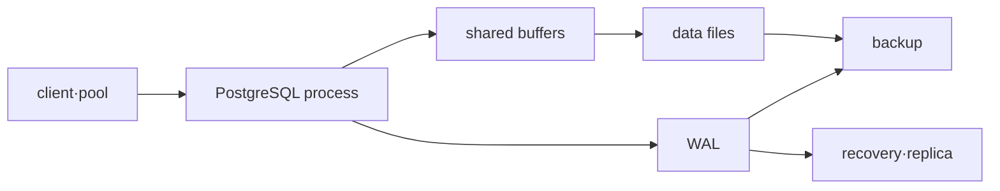

# PostgreSQL 운영 로드맵

## 처음 보는 사람을 위한 출발점

애플리케이션이 “계좌 잔액을 1만 원 줄였다”고 응답했다고 가정하자. 다른 사용자가 동시에 잔액을 바꾸고 있거나 서버가 직후 종료돼도 그 결과가 정확히 한 번, 안전하게 남아야 한다. PostgreSQL 운영은 SQL 문법을 쓰는 것을 넘어 여러 요청이 동시에 데이터를 바꿀 때 무엇이 보이고 디스크에 무엇이 남는지 관리하는 일이다.

| 처음 만나는 말 | 학습용 쉬운 뜻 | 왜 필요한가요 · 언제 쓰나요 |
|---|---|---|
| 데이터베이스 | 구조화한 데이터를 저장하고 여러 프로그램의 읽기·쓰기를 조정하는 시스템 | 공유 데이터를 지속적으로 보관하고 정해진 규칙으로 동시 접근을 조정할 때 쓴다. **구체적인 상황(가상 예시):** API 복제본 두 개가 같은 주문을 읽고 수정해야 한다. → 데이터베이스 제약 아래 공유 기록을 저장한다. → 동시 갱신과 커밋 결과 보존을 시험한다. |
| 트랜잭션(transaction) | 여러 데이터 변경을 전부 성공시키거나 전부 취소하는 작업 단위 | 관련 데이터 변경을 하나로 묶어 일부만 끝난 업무 처리가 승인되지 않도록 한다. **구체적인 상황(가상 예시):** 이체가 한 계좌를 차감한 뒤 두 번째 갱신에 실패한다. → 관련 갱신을 트랜잭션으로 실행한다. → 일부 잔액만 커밋되지 않는지 확인한다. |
| 행(row) | 표에서 하나의 대상을 나타내는 데이터 한 줄 | 키·조인·합계를 설계하기 전에 레코드가 표현하는 단위를 분명히 할 때 필요하다. **구체적인 상황(가상 예시):** 보고서가 주문 항목 행을 주문 한 건으로 센다. → 행 하나가 무엇인지 정의한다. → 적절한 식별자로 주문 수를 비교한다. |
| 잠금(lock) | 충돌하는 변경이 동시에 완료되지 않도록 일부 작업을 기다리게 하는 장치 | 동시 완료가 데이터 규칙을 깨뜨리는 경우 충돌 작업의 실행을 조정한다. **구체적인 상황(가상 예시):** 워커 두 개가 같은 계좌를 갱신하려 한다. → 충돌하는 잠금과 트랜잭션 경계를 조사한다. → 최종 잔액과 대기 동작을 확인한다. |
| 인덱스(index) | 모든 행을 읽지 않고 원하는 데이터를 빠르게 찾도록 돕는 별도 구조 | 선택적인 조회의 작업량을 줄일 때 쓰며 추가 저장 공간·쓰기 유지 비용도 고려한다. **구체적인 상황(가상 예시):** 고객 한 명을 조회하는데 큰 테이블 전체를 훑는다. → 질의 방식에 맞는 인덱스를 검토한다. → 계획·읽기량·쓰기 부담을 비교한다. |
| 백업(backup) | 원본이 사라졌을 때 복구하기 위해 따로 보관한 데이터 사본 | 삭제·손상·인프라 유실로 원본에 문제가 생겼을 때 복구할 복사본을 남긴다. **구체적인 상황(가상 예시):** 시험 테이블이 실수로 삭제됐다. → 검증한 백업을 격리 데이터베이스에 복원한다. → 필요한 행과 복구 지점의 나이를 확인한다. |

MVCC, WAL, VACUUM 같은 용어는 위 문제를 해결하는 내부 방식이다. 먼저 transaction과 lock을 직접 관찰한 뒤, 데이터가 보이는 시점과 디스크에 안전하게 남는 과정을 연결한다.

## 무엇을 해결하는가

SQL 작성 능력과 데이터베이스 운영 능력은 다르다. 이 과정은 transaction의 보이는 상태, WAL과 checkpoint, VACUUM, query plan, lock, backup·restore를 연결해 “데이터가 안전하고 서비스가 회복됐다”는 판정 기준을 만든다.

## 선수 지식

- Linux 프로세스·메모리·파일 시스템과 TCP 연결
- transaction, index와 SQL의 기본 개념
- RPO·RTO는 [신뢰성·DR·FinOps](../../content/reliability-finops/00-roadmap.md)에서 확장한다.

## 학습 순서

1. **MVCC·WAL·query model**: transaction과 durable change의 경로를 설명한다.
2. **Lock·backup·restore 실습**: blocking을 관찰하고 restore 결과를 query로 검증한다.

## 완료

이 주제는 한 번 읽고 끝내지 않는다. 먼저 용어 표를 자신의 말로 바꾸고, 개념 장에서 한 요청의 흐름을 따라간다. 실습에서는 정상 상태를 먼저 기록한 뒤 조건 하나만 바꿔 실패를 만들고, 증거로 원인을 설명한 뒤 복구한다. 마지막으로 아래 운영 판단 질문에 답하면서 더 복잡한 환경으로 확장한다.

- long transaction이 VACUUM과 storage에 미치는 영향을 설명한다.
- `EXPLAIN` 추정과 `EXPLAIN ANALYZE` 실측을 구분한다.
- backup 파일 존재가 아니라 별도 instance의 restore와 데이터 검증으로 완료를 판정한다.

## 버전 기준

이 과정은 확인일 현재 PostgreSQL 18 문서를 기준으로 한다. managed RDS의 parameter, extension, backup와 failover 책임은 PostgreSQL 자체 동작과 분리해 확인한다.

## 처음 이해했는지 확인

1. transaction에서 commit과 rollback은 각각 어떤 결과를 만드는가?
2. backup 파일을 만들었다는 사실만으로 복구가 가능하다고 말할 수 없는 이유는 무엇인가?

**확인 기준:** commit은 변경 확정, rollback은 취소이며, backup은 별도 database에 restore한 뒤 데이터를 읽어야 복구 경로를 확인할 수 있다고 설명하면 된다.

## 운영 판단으로 확장하기

1. MVCC가 lock을 모두 없애 주지 않는 이유는 무엇인가?
2. WAL archive만 있고 base backup이 없으면 복구가 불완전할 수 있는 이유는 무엇인가?
3. 연결 수를 늘리는 것이 처리량을 항상 높이지 않는 이유는 무엇인가?

<!-- source: https://www.postgresql.org/docs/18/mvcc.html | checked: 2026-09-03 | version: PostgreSQL 18 -->
<!-- source: https://www.postgresql.org/docs/18/wal-intro.html | checked: 2026-09-03 | version: PostgreSQL 18 -->
<!-- source: https://www.postgresql.org/docs/18/backup.html | checked: 2026-09-03 | version: PostgreSQL 18 -->
