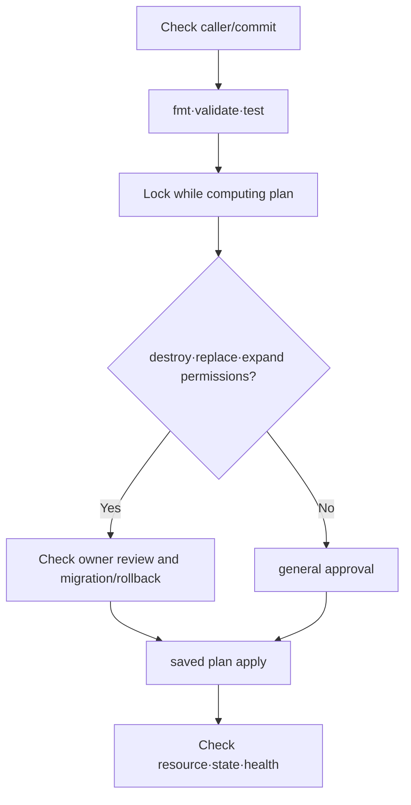

# Plan, drift와 import 실습

> 실습 등급: 첫 절은 **Local**, AWS 예시는 **Plan only**다. 이 장은 `terraform apply`를 실행하지 않는다.

## 실습 전에 준비할 것

- **도구**: Terraform 1.16.x를 설치하고 `terraform version`으로 확인한다.
- **directory**: 다른 Terraform state가 없는 새 directory를 만든 뒤 그 안에서만 실행한다.
- **파일**: 첫 단계에서 `main.tf`, 두 번째 단계에서 `contract.tftest.hcl`을 만든다.
- **AWS 단계**: 선택 사항이다. AWS CLI와 temporary credential, 조회·plan에 필요한 최소 권한이 있을 때만 진행한다.
- **생성 여부**: 이 장은 `apply`하지 않으므로 AWS resource를 만들지 않는다. local saved plan 파일만 생긴다.
- **정리 대상**: `study.tfplan`, `planned-change.tfplan`, `.terraform/`이며 실제 backend state와 `.terraform.lock.hcl`은 같은 대상으로 취급하지 않는다.

Terraform을 처음 쓴다면 첫 절의 성공 기준은 `plan`에 `terraform_data.contract` 하나의 생성 제안이 보이는 것이다. AWS 연결은 그 결과를 설명할 수 있게 된 다음에 진행한다.

## 먼저 이해하기

이 실습은 Terraform 명령의 성공 여부보다 각 단계가 어떤 불확실성을 줄이는지 확인한다. `fmt`는 표현 형식을 통일하지만 의미를 검증하지 않는다. `validate`는 configuration 구조와 provider schema를 검사하지만 어느 AWS account를 바꿀지는 판단하지 않는다. `plan`은 state와 remote object를 읽어 변경안을 만들지만 application health를 보장하지 않는다.

| 단계 | 확인하는 것 | 통과해도 남는 위험 |
|---|---|---|
| `fmt -check` | canonical formatting | 잘못된 resource 설계 |
| `init` | backend·module·provider 준비 | 올바른 account·변경 여부 |
| `validate` | syntax와 내부 consistency | quota·비용·runtime 영향 |
| `test` | 작성한 assertion | assertion에 쓰지 않은 동작 |
| `plan` | 현재 입력 기준 변경 proposal | apply 중 race와 서비스 정상성 |
| post-apply check | 실제 resource와 health | 장기 운영·복구 가능성 |

처음 두 절은 AWS provider 없이도 이 차이를 확인하도록 `terraform_data`를 쓴다. AWS plan 단계에서는 credential과 remote state가 추가되므로 출력과 artifact를 민감하게 다룬다.

## 1. Provider 없는 core workflow

빈 directory에 `main.tf`를 만든다.

```hcl
terraform {
  required_version = "~> 1.16.0"
}

variable "environment" {
  type        = string
  description = "Logical environment name"

  validation {
    condition     = contains(["dev", "stage", "prod"], var.environment)
    error_message = "environment must be dev, stage, or prod"
  }
}

resource "terraform_data" "contract" {
  input = {
    environment = var.environment
    owner       = "platform"
  }
}

output "contract" {
  value = terraform_data.contract.output
}
```

```bash
terraform fmt -check
terraform init
terraform validate
terraform plan -var='environment=dev' -out=study.tfplan
terraform show study.tfplan
```

`terraform_data`는 provider download 없이 Terraform lifecycle을 연습하는 built-in resource다. `study.tfplan`은 실습 후 삭제하며 실제 environment에서는 공개 artifact로 취급하지 않는다.

## 2. Test로 contract 고정

```hcl
# contract.tftest.hcl
run "valid_dev_contract" {
  command = plan

  variables {
    environment = "dev"
  }

  assert {
    condition     = terraform_data.contract.input.environment == "dev"
    error_message = "planned environment must remain dev"
  }
}
```

```bash
terraform test
terraform plan -var='environment=unknown'
```

두 번째 plan은 유효성 검사로 실패해야 한다. 테스트 성공과 잘못된 입력 거부를 함께 확인한다. 단언문은 의도적으로 `input`을 읽는다. 새 리소스의 계산된 `output`은 apply 전까지 미정일 수 있어 plan 전용 테스트에서는 의미 있는 비교도 하기 전에 실패할 수 있기 때문이다. plan 테스트는 계획한 입력을 확인한다. apply 테스트는 결과 상태를 확인할 수 있지만 리소스와 provisioner를 실행할 수 있다.

기존 프로젝트의 `terraform test`는 본질적으로 읽기 전용이 아니다. 기본 테스트 명령이 리소스를 적용할 수 있으므로 아래 선택 AWS 절차를 재사용하기 전에 모든 run 블록과 테스트 모듈을 검토한다. 이 장에서는 검토한 `command = plan` 실행만 사용한다.

## 3. AWS plan review 설계

AWS provider를 쓰는 configuration에는 최소한 다음 gate를 둔다.

```bash
aws sts get-caller-identity
terraform fmt -check -recursive
terraform init -lockfile=readonly
terraform validate
terraform test
terraform plan -detailed-exitcode -out=planned-change.tfplan
terraform show -no-color planned-change.tfplan
```

`-detailed-exitcode`는 차이가 없으면 0, 변경 제안이 있으면 2, 오류면 1을 반환한다. 2는 실행 실패가 아니라 검토 가능한 계획이다. apply 작업은 의도한 커밋, 워크스페이스, 백엔드, 계정에 대해 검토한 저장 계획을 사용해야 한다. plan 잠금은 계획 종료 시 해제되며 사람의 검토 기간 전체에 유지되지 않는다. 오래된 저장 계획은 다시 생성해야 할 수 있다.

```bash
plan_status=0
terraform plan -detailed-exitcode -out=planned-change.tfplan || plan_status=$?
case "$plan_status" in
  0) printf '%s\n' 'No proposed changes' ;;
  2) printf '%s\n' 'Changes require review' ;;
  *) printf '%s\n' 'Plan failed' >&2; exit "$plan_status" ;;
esac
```



## Drift 진단

plan이 예상 밖 변경을 보이면 다음 셋을 비교한다.

1. 현재 commit의 configuration
2. backend가 가진 state binding
3. AWS API가 반환하는 remote object

console 변경을 무조건 되돌릴지, configuration에 채택할지는 ownership 정책의 결정이다. 먼저 plan과 CloudTrail 등 변경 주체 증거를 남긴다.

## Import와 rename

기존 object를 import할 때는 configuration을 먼저 작성하고 정확한 resource address와 remote ID를 확인한다. import 뒤에는 반드시 plan이 추가 변경 0인지 또는 의도한 차이만 있는지 검토한다.

address rename은 remote object rename과 다르다. `moved` block으로 old address와 new address의 binding 이동 의도를 기록한다.

## 실패와 복구

| 실패 | 먼저 확인 | 금지할 반응 |
|---|---|---|
| state lock 획득 실패 | active run과 lock owner | 확인 없이 force-unlock |
| wrong account | caller identity와 allowed account | plan을 계속 진행 |
| 예상 밖 destroy | address rename, count/for_each key, import | plan review 생략 |
| state object 손상·삭제 | S3 version과 audit log | 빈 state로 apply |

## 정리

```bash
rm -f study.tfplan planned-change.tfplan
rm -rf .terraform
```

이 정리는 실습 directory 안에서 경로를 확인한 뒤 실행한다. 실제 backend state나 lockfile은 삭제하지 않는다.

## 실행 결과 예시

로컬 내장 리소스에 대한 예상 출력 일부다. 형식과 진단 문구는 Terraform 패치 버전에 따라 달라질 수 있다.

```text
# terraform validate
Success! The configuration is valid.
# terraform plan -var='environment=dev'
Plan: 1 to add, 0 to change, 0 to destroy.
# terraform test
Success! 1 passed, 0 failed.
# terraform plan -var='environment=unknown'
Error: Invalid value for variable
environment must be dev, stage, or prod
```

`fmt -check`가 출력 없이 성공하는 것은 정상이다. 잘못된 입력의 plan은 0이 아닌 코드로 종료해야 한다. 이 실습은 apply하지 않으므로 올바른 plan을 반복해도 생성 한 건을 계속 제안한다. 선택적인 detailed-exitcode 절차에서 2는 차이가 있는 계획을 성공적으로 계산했다는 뜻이다.

## 결과를 이렇게 읽는다

첫 plan의 `+ create`는 built-in resource가 아직 state에 없어서 생긴다. apply하지 않았으므로 같은 plan을 다시 만들어도 create 제안이 남는 것이 정상이다. `environment=unknown`이 실패하면 variable validation이 입력 경계에서 작동한 것이다. 이것은 AWS resource가 안전하다는 검증이 아니라 module contract 한 조각의 검증이다.

AWS plan의 `known after apply`는 API가 생성 뒤에만 결정하는 값일 수 있다. 오류라고 지우기보다 그 unknown 값에 의존하는 policy나 route가 계획 단계에서 지나치게 넓어지지 않는지 확인한다.

drift plan이 나오면 console 변경이 잘못됐다고 즉시 단정하지 않는다. emergency change가 정당할 수도 있고 configuration 배포가 누락됐을 수도 있다. 변경 주체와 시각, owner를 확인한 뒤 remote를 코드로 채택할지 코드대로 되돌릴지 결정한다.

## 스스로 설명해 보기

1. `validate` 성공이 AWS plan의 안전성을 보장하지 않는 이유는 무엇인가?
2. force-unlock 전에 active apply 여부를 확인해야 하는 이유는 무엇인가?
3. import 직후 plan이 0이 아니면 어떤 세 상태를 비교할 것인가?

<!-- source: https://developer.hashicorp.com/terraform/cli/commands/plan | checked: 2026-09-03 | version: Terraform 1.16.x -->
<!-- source: https://developer.hashicorp.com/terraform/language/tests | checked: 2026-09-03 | version: Terraform 1.16.x -->
<!-- source: https://developer.hashicorp.com/terraform/language/resources/terraform-data | checked: 2026-09-10 | plan-time input versus computed output correction -->
<!-- source: https://developer.hashicorp.com/terraform/language/import | checked: 2026-09-03 | version: Terraform 1.16.x -->
<!-- source: https://developer.hashicorp.com/terraform/language/modules/develop/refactoring | checked: 2026-09-03 | version: Terraform 1.16.x -->
