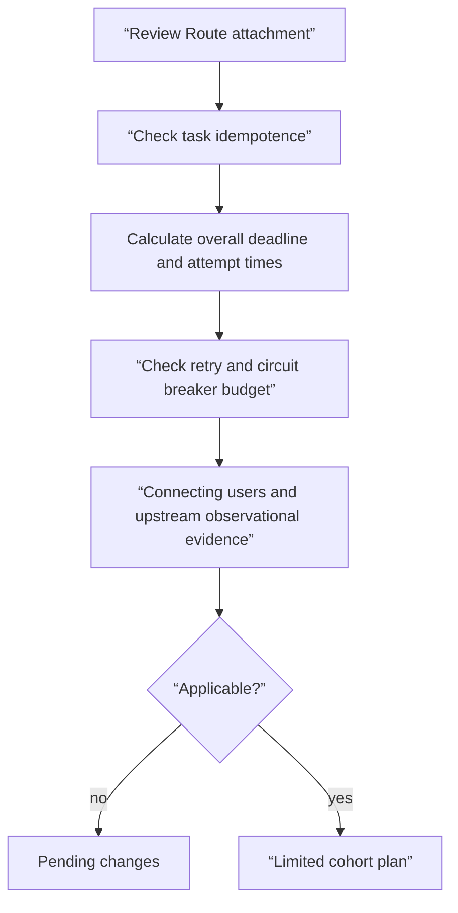

# Route 소유권과 retry storm 검토 실습

<!-- source: https://gateway-api.sigs.k8s.io/guides/user-guides/tls/ | checked: 2026-09-10 | HTTPS listener termination and certificate reference -->

## 실습 전에 준비할 것

이 실습은 cluster나 proxy 설정을 바꾸지 않는 **Plan only** 검토다. 텍스트 편집기만 있으면 되고, YAML parser가 있으면 문법 확인에 사용할 수 있다. 예시는 실제 hostname이나 credential을 포함하지 않는다. 목표는 “적용이 성공하는가”가 아니라 “누가 무엇을 허용했고, 실패 시 추가 traffic과 중복 작업이 어디까지 늘 수 있는가”를 설명하는 것이다.

| 준비 항목 | 값 |
|---|---|
| 변경 대상 | 없음 |
| 입력 | Gateway·HTTPRoute·복원력 정책 초안 |
| 관찰 증거 | attachment 조건, deadline 합, retry 비율, rollback pointer |
| 중단 조건 | 소유자·멱등성·사용자 영향 지표 중 하나라도 없음 |
| cleanup | 만든 임시 메모 파일만 삭제 |

## 먼저 이해하기

Route 검토와 retry 검토는 순서가 있다. 먼저 이 route가 어느 listener에 어떤 권한으로 붙는지 확인해야 한다. 그다음 실제 요청이 실패했을 때 누가 재시도하며, 시도 총시간과 동시 추가 요청량이 상한 안에 있는지 본다. `kubectl apply --dry-run=server`가 통과해도 이 업무 의미와 부하 예산을 증명하지 않는다.



## 검토할 초안

```yaml
apiVersion: gateway.networking.k8s.io/v1
kind: Gateway
metadata:
  name: shared-web
  namespace: infra
spec:
  gatewayClassName: managed-gateway
  listeners:
    - name: https
      protocol: HTTPS
      port: 443
      hostname: "*.example.test"
      tls:
        mode: Terminate
        certificateRefs:
          - kind: Secret
            name: study-tls
      allowedRoutes:
        namespaces:
          from: Selector
          selector:
            matchLabels:
              shared-gateway-access: "true"
---
apiVersion: gateway.networking.k8s.io/v1
kind: HTTPRoute
metadata:
  name: checkout
  namespace: shop
spec:
  parentRefs:
    - name: shared-web
      namespace: infra
      sectionName: https
  hostnames:
    - "checkout.example.test"
  rules:
    - backendRefs:
        - name: checkout-api
          port: 8080
```

연결을 검토하기 전에 참조한 GatewayClass, `infra`의 `study-tls` 인증서 Secret과 그 호스트 이름 범위, 백엔드 Service를 확인한다. 이들은 계획 전용 예시에 포함된 리소스가 아니라 사전 조건이다. `shop` 네임스페이스는 허용 라벨 셀렉터와 일치해야 한다. 다른 네임스페이스의 백엔드 참조에는 대상 네임스페이스의 ReferenceGrant가 필요하다. 리스너 권한은 이와 별도로 네임스페이스를 넘는 라우트 연결을 제어한다.

다음 복원력 초안은 특정 proxy 제품에 바로 넣는 완성 설정이 아니라 리뷰용 계약이다.

```yaml
requestPolicy:
  outerDeadlineMs: 900
  connectTimeoutMs: 100
  perTryTimeoutMs: 250
  maxAttempts: 2
  retryOn:
    - connect-failure
    - reset
    - 503
  retryBudgetPercent: 15
  circuitBreaker:
    maxConnections: 200
    maxPendingRequests: 100
    maxRequests: 400
  outlierDetection:
    consecutive5xx: 5
    baseEjectionTimeSeconds: 30
    maxEjectionPercent: 50
evidence:
  userSignal: checkout_success_ratio
  saturationSignal: checkout_upstream_pending_requests
  retrySignal: checkout_upstream_retry_attempts
  rollbackPointer: route-policy-v17
```

## 단계별 검토

1. 시간을 더하기 전에 어떤 구간이 겹치는지 정한다. 두 시도 각각 연결 100 ms와 처리 250 ms가 필요하면 소계는 700 ms이며 대기열, 백오프, 응답 전달에 200 ms만 남는다. 연결을 재사용하거나 시도별 타이머에 연결 시간이 포함되면 계산이 달라진다. 초안만으로 여유 300 ms를 입증할 수 없다.
2. 이 워크시트의 `maxAttempts: 2`는 첫 시도와 재시도 한 번을 뜻한다. 선택한 프록시의 시도·재시도 필드와 명시적으로 대응시킨다. 재시도 횟수를 세는 필드에 2를 복사하면 총 세 번의 시도가 허용된다.
3. 503이 업무 처리 전 반환된다는 보장이 있는지 확인한다. 결제 side effect 뒤 응답만 유실될 수 있다면 idempotency key 없이 retry하면 안 된다.
4. 정상 1,000개 진행 요청에서 15% retry budget이 어떤 동시 추가량을 허용하는지 계산한다. static `maxRetries`와 함께 있을 때 어느 설정이 우선하는지도 구현 문서에서 확인한다.
5. backend 절반이 공통 DB 장애로 5xx를 낼 때 host를 제외하는 것이 해결인지 검토한다. 공통 원인이라면 남은 host에 traffic이 몰릴 수 있다.
6. `checkout_success_ratio`가 회복되지 않거나 pending request가 상승하면 자동 변경을 중단하고 이전 policy revision으로 돌아가도록 abort condition을 적는다.

## 실행 결과 예시

프록시 출력이 아닌 워크시트 계산 결과다.

```text
attempts: 2 total = 1 initial + 1 retry
worst_case_attempt_subtotal_ms: 2 * (100 + 250) = 700
remaining_deadline_ms: 900 - 700 = 200
illustrative_retry_allowance: 1000 * 0.15 = 150
attachment_without_required_namespace_label: REJECT
overall_verdict_without_backend_and_certificate_checks: NOT READY
```

허용량 150은 워크시트의 요청 1,000건 기준이다. 실제 프록시는 대기 요청, 최소 동시성, 다른 예산 구간을 포함할 수 있다. 명시한 비중첩 타이머에서 백오프와 대기열에 250 ms가 들면 총 950 ms가 되어 900 ms 마감 시간을 초과한다.

## 결과를 이렇게 읽는다

| 관찰 | 의미 | 다음 행동 |
|---|---|---|
| Route `Accepted=False` | traffic policy 이전에 attachment 계약이 실패 | status reason과 listener 허용 범위 확인 |
| retry는 증가하고 성공률은 그대로 | 추가 시도가 복구 효과 없이 부하만 더함 | retry 축소 또는 차단, 원인 조사 |
| ejection 뒤 성공률 상승·포화 안정 | 일부 host 실패를 격리했을 가능성 | 제외 host의 실제 원인과 복귀 조건 확인 |
| ejection 뒤 pending 증가 | 남은 capacity가 부족하거나 공통 원인 | ejection 확대 중단, load shedding 검토 |
| rollback 명령 성공 | spec이 이전 revision으로 바뀜 | 사용자 결과와 queue 회복은 별도 검증 |

이 표에서 가장 중요한 구분은 **완화 성공과 근본 원인 해결이 다르다**는 점이다. traffic을 되돌려 오류율이 낮아져도 새 release의 어떤 결함이 실패를 만들었는지는 postmortem과 재현 테스트로 남겨야 한다. 반대로 원인 후보를 맞혔더라도 사용자 오류가 계속되면 incident는 끝나지 않았다.

## 완료와 cleanup

- Gateway owner, Route owner, backend owner와 정책 승인자를 적었다.
- hostname·namespace·reference 조건을 모두 확인했다.
- 전체 deadline과 최대 시도량을 계산했다.
- 멱등하지 않은 요청의 retry를 금지하거나 idempotency 계약을 연결했다.
- 사용자 증상, upstream 포화, retry·overflow 신호와 rollback pointer를 적었다.
- 임시 검토 파일을 만들었다면 정확한 파일만 삭제했다.

## 스스로 설명해 보기

- server-side dry-run이 retry storm 가능성을 찾아주지 못하는 이유는 무엇인가?
- `maxEjectionPercent: 50`이 남은 처리 용량 시험을 여전히 요구하는 제안 상한에 불과한 이유는 무엇인가?
- 자동 rollback의 성공 판정을 rollout status 하나로 끝내면 무엇을 놓치는가?
- 이 incident evidence를 [AIOps alert correlation](../../content/aiops-diagnosis/02-alert-correlation-triage-lab.md)에 넘길 때 어떤 ID와 timestamp가 필요한가?

<!-- source: https://gateway-api.sigs.k8s.io/docs/concepts/security/ | checked: 2026-09-03 -->
<!-- source: https://gateway-api.sigs.k8s.io/docs/concepts/hostnames/ | checked: 2026-09-03 -->
<!-- source: https://www.envoyproxy.io/docs/envoy/latest/faq/load_balancing/transient_failures.html | checked: 2026-09-03 -->
<!-- source: https://www.envoyproxy.io/docs/envoy/latest/intro/arch_overview/upstream/circuit_breaking | checked: 2026-09-03 -->
