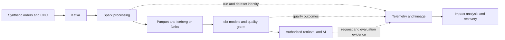

# Data and Observability Engineering: from events to trusted AI

Build the ability to explain where data came from, why a result is trustworthy, what failed, who is affected, and how to recover it. This course connects distributed data processing, telemetry, data reliability, governance, and AI through one evolving system.

## Starting point for beginners

Imagine an order dashboard that returns HTTP 200 while showing yesterday's revenue. The API is available, but the data product is failing. Now imagine an assistant answering from that same table: a fast model produces a confidently outdated answer. Learning to diagnose both situations requires following the data beyond individual tools.

| New term | Plain-language meaning | Why it matters / when to use it |
|---|---|---|
| Data product | A dataset with a defined consumer, meaning, owner, and delivery promise | Give consumers a dependable agreement about a dataset's meaning, owner, and delivery. |
| Pipeline | Steps that ingest, transform, validate, and publish data | Organize ingestion through publication into steps whose failures and outputs can be checked. |
| Observability | Evidence that helps explain behavior inside a system | Explain failures and changing behavior using evidence from inside the running system. |
| Data reliability | Delivering correct-enough, complete-enough data within an agreed time and recovery boundary | Align quality and delivery checks with what the data consumer actually needs. |
| Lineage | Recorded relationships between inputs, processing runs, and outputs | Find upstream inputs and downstream consequences when data changes or a run fails. |
| SLI / SLO | A measured outcome / the target agreed for that outcome | Express the consumer's service promise as a measurable outcome and agreed target. |

You should be able to run a shell command, read a small Python program, and write a basic SQL query. If these are new, spend the first month on the foundations chapter. Kafka experience helps, but the progression does not assume an employer, job title, or particular production history.

## The system you will grow

The arrows are a curriculum design, not a preinstalled integration. Every connection needs its own compatible connector, identity mapping, and failure test.

## Read in this order

| Step | Chapter | Observable result |
|---|---|---|
| 1 | [Stack selection](01-stack-and-architecture.md) | Explain why each component exists and which alternatives you are postponing |
| 2 | [SQL, Python, and execution](02-sql-python-foundations.md) | Produce correct totals under duplicates, nulls, and joins |
| 3 | [Parquet and object storage](03-parquet-object-storage.md) | Explain scanned bytes, file layout, and pruning |
| 4 | [Iceberg and Delta](04-table-formats.md) | Trace a committed table version to its files and recovery boundary |
| 5 | [Spark internals](05-spark-performance.md) | Diagnose a slow stage with plans and task distributions |
| 6 | [Kafka, CDC, and streaming](06-kafka-cdc-streaming.md) | Recover a replay without double-counting or hiding late events |
| 7 | [Modeling, dbt, and orchestration](07-modeling-orchestration.md) | Backfill one interval and reconcile the published mart |
| 8 | [Quality, contracts, and data SLOs](08-quality-contracts-slos.md) | Block a broken publication and detect missing observations |
| 9 | [OpenTelemetry](09-opentelemetry.md) | Connect a pipeline run to traces, logs, and bounded metrics |
| 10 | [Prometheus, Grafana, and telemetry operations](10-metrics-logs-traces.md) | Investigate a dataset symptom and a telemetry outage separately |
| 11 | [Lineage, catalog, and governance](11-lineage-governance.md) | Find affected consumers and enforce access at execution time |
| 12 | [Databricks and Snowflake](12-cloud-platforms.md) | Reimplement the same contract and compare measured behavior |
| 13 | [AI-ready data and evaluation](13-ai-ready-data-evaluation.md) | Trace an answer to authorized source versions and evaluate it |
| 14 | [Platform operations](14-platform-operations.md) | Demonstrate restore, release rollback, and cost attribution |
| 15 | [Capstone and failure drills](15-capstone.md) | Produce a reproducible portfolio with evidence of recovery |
| Reference | [Source review and scope](16-source-review.md) | Distinguish the shared conversation from technical evidence |

## Study the mechanism inside each stack

Each technical chapter now separates the individual mechanisms below. Read one section, calculate or run its example, then explain the failure case before continuing. The source register maps the shared conversation's detailed topics to these chapters; it is not enough to recognize their names.

| Study unit | Detailed work |
|---|---|
| [SQL and Python](02-sql-python-foundations.md) | Join multiplication, window frames, recursive CTEs, grouping sets, plans/isolation; validation, generators, async/processes, memory and tests |
| [File layout](03-parquet-object-storage.md) | Row groups/chunks/pages, encoding versus compression, pruning layers, sorted/interleaved experiment, partition/file boundaries |
| [Table protocols](04-table-formats.md) | Iceberg metadata walk, Delta log/version reads, optimistic conflicts, evolution, deletes, compaction and retention |
| [Spark execution](05-spark-performance.md) | Catalyst/Tungsten, driver/jobs/stages/tasks, shuffle/partition control, three joins, memory/spill/skew, AQE and UI diagnosis |
| [Streaming systems](06-kafka-cdc-streaming.md) | Replicas/ISR/acks, idempotence/transactions, assignment/rebalance/offsets, CDC, output modes, watermarks/state, Flink and backpressure |
| [Models and scheduling](07-modeling-orchestration.md) | Fact/dimension grain, Type 1/2 history, ref/source/macros, incremental replacement, snapshots/tests/contracts, Airflow/Dagster and backfill |
| [Data reliability](08-quality-contracts-slos.md) | Six quality dimensions, measurable denominators, publication state machine, check tools, SLO burn and missing evidence |
| [OpenTelemetry](09-opentelemetry.md) | Resources/scopes/spans, context/baggage/links, real SDK propagation, instruments/temporality, head/tail sampling and Collector queues |
| [Telemetry backends](10-metrics-logs-traces.md) | Counter resets, rate/increase, histogram math, cardinality, LogQL, trace search, Grafana correlation and alert lifecycle |
| [Governance](11-lineage-governance.md) | Dataset/job/run/facets, column lineage, cycle-safe impact traversal, RBAC/ABAC, row/column enforcement, classification/audit |
| [Databricks and Snowflake](12-cloud-platforms.md) | Executable-environment pipeline examples, expectations, Auto Loader, Jobs/MLflow; Streams/MERGE, Tasks, dynamic refresh, Snowpark, DMF/Horizon/Cortex |
| [AI data and evaluation](13-ai-ready-data-evaluation.md) | Cosine/ANN, hybrid fusion/reranking, chunk/index versions, semantic layer/ontology/graph, MCP/tools/agents and layered evaluation |
| [Platform delivery](14-platform-operations.md) | Runtime/identity boundaries, release bundles, capacity/replay arithmetic, recovery, unit economics and dataset registration |

For an immediate local session, run the marked Python examples in SQL, modeling, quality, metrics, lineage, and retrieval. They use synthetic inputs and print exact expected results. Add DuckDB/dbt and the in-memory OTel SDK lab when those local dependencies are available. Spark, table-engine, and managed-platform exercises state their separate prerequisites and expected results; the course does not imply they ran on your infrastructure.

## A twelve-month working plan

This is a planning example for roughly eight to ten focused hours per week, not a guarantee of expertise. Advance by demonstrated outcomes. With existing Kafka or observability skills, attempt the chapter exercise first and spend saved time on Spark internals and data correctness.

| Month | Main focus | Exit artifact |
|---|---|---|
| 1 | SQL, Python, Linux, Git; instrument a small script | Correctness fixtures and a reproducible run manifest |
| 2 | Parquet, object storage, one table format | Layout benchmark and snapshot recovery notes |
| 3–4 | Spark SQL, shuffle, skew, state, failure diagnosis | Before/after plans and a measured performance explanation |
| 5 | Kafka, CDC, event time, replay | Failure matrix with committed output reconciliation |
| 6 | dbt, orchestration, data contracts | A mart whose publication depends on explicit quality gates |
| 7–8 | OTel, Prometheus, Grafana, traces and logs | End-to-end incident and telemetry-loss drills |
| 9 | OpenLineage, catalog, access policies | Impact graph, owner mapping, allow/deny checks |
| 10–11 | Databricks implementation and operations | Equivalent outputs, permissions, recovery, and cost report |
| 12 | AI data delivery and evaluation | Versioned retrieval corpus and evaluated answer traces |
| Follow-up | Snowflake comparison; Flink or Trino when needed | Architecture comparison against the same workload |

Start basic instrumentation in month one; months seven and eight deepen it. Waiting until the end to collect evidence would make earlier performance experiments difficult to interpret.

Each week: read and explain one mechanism, implement one slice, inject one failure, then write down what the evidence proves. Reserve the final session for cleanup and revisiting an earlier assumption.

## Completion criteria

You can reconstruct an event's path from source offset to table snapshot, mart, retrieval index, and answer. You can distinguish service health from dataset health, demonstrate replay correctness, find an affected owner through lineage, and recover using a tested procedure. Your portfolio includes measurements and limitations rather than screenshots alone.

## Check your understanding

1. An API is healthy and consumer lag is zero. Could its data still be wrong? Explain a transformation, publication, and missing-source case.
2. Why does a trace ID not identify a reproducible table version? A trace identifies an execution; the input snapshot and processing revision identify what it read and did.
3. Why learn one cloud platform deeply before comparing another? You need a concrete workload and failure contract to make the comparison meaningful.

## Develop operational judgment

For each new component, name the problem it solves, the new failure it introduces, its owner, and the evidence required before adopting it. Expertise means making and defending these decisions under constraints; completing a reading list is only preparation.

For prerequisites, see the existing [PostgreSQL roadmap](../../../docs-site/content/postgresql/00-roadmap.md), [observability and SRE roadmap](../../../docs-site/content/observability-sre/00-roadmap.md), and [AI platform lifecycle](../../../docs-site/content/ai-transformation-platform/02-mlops-llmops-lifecycle.md).

<!-- source: https://chatgpt.com/share/6aa266f6-db88-83ee-a8d7-3e7aa8e0821d?ogimg=plain | checked: 2026-09-10 | curriculum input only; not independent factual evidence -->
