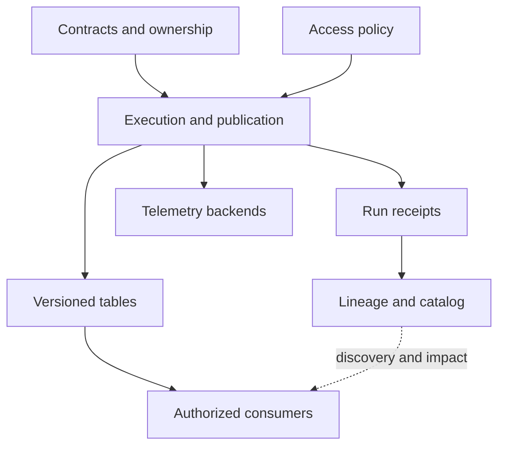

# Choose a stack by responsibility

A useful platform starts with a consumer promise: for example, validated orders must reach an analytical table within ten minutes, and every result must be reproducible. Component selection follows that promise and a measured workload.

## Terms introduced in this chapter

| Term | Meaning |
|---|---|
| Storage format | How bytes are represented inside a file, such as Parquet |
| Table format | How files and metadata form a committed table version |
| Compute engine | Software that executes a query or transformation |
| Control plane | Definitions, permissions, schedules, and metadata that direct execution |
| Data plane | Processes and storage that actually move and transform data |

## Understand the model first

1. A producer emits an event with a stable identity and a schema version.
2. Ingestion preserves enough information to replay it.
3. Processing creates validated output and commits a table version.
4. A publication gate exposes that version to consumers.
5. Telemetry and lineage explain what happened without becoming the data's source of truth.

The catalog tells a reader which table exists and how to find it. Object storage holds the files. An engine reads the table metadata to choose the files for a query. A dashboard renders observations from backends; it does not repair the table or enforce its contract.

## A default learning stack and deliberate alternatives

The choices below are teaching recommendations. They are not rankings or claims that every combination is compatible.

| Responsibility | Start with | Add or compare when the problem requires it |
|---|---|---|
| Local correctness | Python, SQLite; DuckDB for analytical files | PostgreSQL for concurrent transactions and CDC |
| Durable files | Parquet and a local directory, then S3 or equivalent object storage | Cloud-specific IAM, request cost, lifecycle and recovery behavior |
| Analytical tables | Iceberg **or** Delta Lake | Compare the second format after implementing commit and maintenance workflows |
| Distributed processing | Spark SQL / PySpark | Flink for a deliberate study of continuous event-time processing and state |
| Transport | Kafka | Debezium and Kafka Connect for database change capture |
| Schema compatibility | A schema registry with Avro, Protobuf, or JSON Schema | Compatibility and semantic migration tests across producer/consumer versions |
| Interactive lake queries | DuckDB locally | Trino when independent distributed SQL access is needed |
| Modeling | dbt with one supported adapter | A semantic layer when several consumers need identical metric definitions |
| Scheduling | Airflow **or** Dagster | Compare time-interval workflows with asset-oriented definitions |
| Quality | SQL assertions and dbt tests | Great Expectations or Soda when richer checks and reporting justify another service |
| Lineage and discovery | OpenLineage events and a small searchable registry | Marquez as a lineage backend; DataHub or OpenMetadata for broader catalog evaluation |
| Instrumentation | OTel SDK and Collector | Agent/gateway tiers when routing, isolation, or capacity requires them |
| Telemetry storage | Prometheus, Loki, Tempo; Grafana for exploration | Jaeger as a trace alternative; Mimir or Thanos for metrics scale and retention; Pyroscope for profiles |
| Managed platform | Databricks after the fundamentals | Snowflake as the second implementation of the same contracts |
| AI operations | Authorized retrieval plus MLflow or Langfuse | Both only when their distinct workflow responsibilities are explicit |
| Delivery | Git, CI, containers | Terraform, Kubernetes, workload identity, policy and GitOps as operating needs grow |

Do not deploy all alternatives together. Start with a local file pipeline. Add a service when you can state which requirement cannot be met by the current system. Kafka, Spark, and a lakehouse already introduce substantial recovery and compatibility work.

## Architecture boundaries



Keep business events and telemetry logically separate even when both use Kafka. Business-event retention protects replay. Telemetry retention supports diagnosis under a different volume and privacy policy. A telemetry overload should not silently consume all capacity needed for order processing.

## A reviewable selection record

Write a short decision before adding distributed compute: current daily bytes, peak rate, file count, query patterns, latency target, acceptable recovery time, and machine budget. Run the same correctness fixtures before and after the migration. If the distributed version is slower on a laptop, that is an observation, not proof that the engine is unsuitable at scale.

Maintain a compatibility manifest containing engine version, connector coordinates, Java/Python versions, table protocol/features, OTel distribution, SDK versions, and dbt adapter. Pin a tested set in the project lockfiles. A set of independently current versions is not necessarily a working set.

## Exercise and interpretation

Draw two designs: a daily 100 MB report and a continuously updated stream with a five-minute freshness target. Assign storage, processing, scheduling, contract checking, and telemetry to each. Explain every additional process in the second design. Then add a one-hour downstream outage and show where the backlog lives, how long it survives, and who owns recovery.

## Example results

Illustrative design review, not a running platform.

```text
daily 100 MB report: versioned files + scheduled transform + publication checks
five-minute stream: retained log + checkpointed processing + freshness checks
100 events/s paused for one hour: backlog = 360000
recovery 300/s minus incoming 100/s: net drain = 200/s
estimated drain time = 1800 seconds
```

The estimate assumes sustained rates and sufficient retention. A diagram without a backlog owner or retention bound fails the review.

## Explain it in your own words

Why can OpenLineage and OpenTelemetry coexist without one replacing the other? A lineage event describes data derivation; a span records an operation. Linking their run identities makes them useful together. Neither grants permission to read a dataset.

Continue with [foundations](02-sql-python-foundations.md).

<!-- source: https://openlineage.io/docs/spec/object-model/ | checked: 2026-09-10 | dataset/job/run responsibilities -->
<!-- source: https://opentelemetry.io/docs/collector/configuration/ | checked: 2026-09-10 | Collector component responsibilities; stack choices are curriculum synthesis -->
