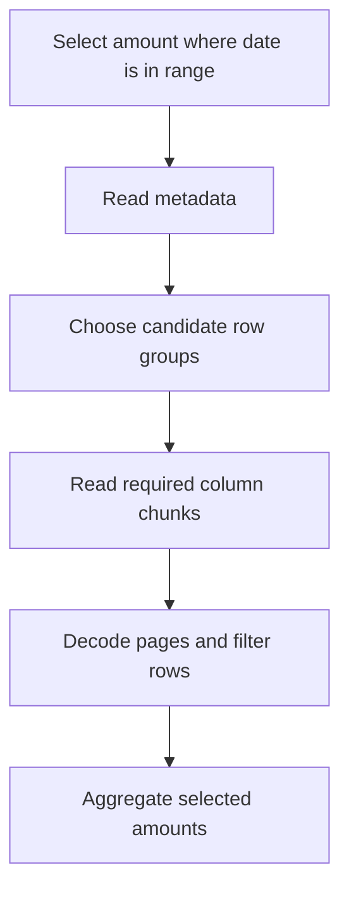

# Parquet and object storage: understand what gets read

A query that requests two columns should not need to decode every field in every record. Parquet organizes analytical data so readers can select columns and, when metadata and predicates permit, skip irrelevant portions of a file.

## Terms introduced in this chapter

| Term | Meaning |
|---|---|
| Row group | A horizontal group of rows stored as separate column chunks |
| Column chunk | The data for one column within a row group |
| Page | A smaller encoded unit within a column chunk |
| Column pruning | Reading only columns needed by a query |
| Predicate pushdown | Passing a filter into the reader so it can avoid or reduce work |
| Object key | The name used to identify one object in a storage service |

## Understand the model first

1. A reader obtains file metadata, including column and row-group information.
2. It identifies the projected columns and filters that the reader can evaluate.
3. It uses available statistics or indexes to avoid regions that cannot match.
4. It reads and decodes the remaining pages and evaluates the result.



Pruning is conditional. A filter function unsupported by the reader, missing statistics, or row groups containing values across the entire range may require much more scanning. Compression reduces stored bytes; encoding exploits data patterns before or alongside compression. Neither is a promise that every query becomes faster.

## A local layout experiment

Use an existing DuckDB CLI in a new temporary working directory. These commands write only `events.parquet` there. Record the DuckDB version before running; the SQL illustrates its Parquet interface, not a portable SQL standard.

```sql
CREATE TABLE events AS
SELECT i AS event_id,
       i % 1000 AS customer_id,
       DATE '2026-01-01' + CAST(i % 30 AS INTEGER) AS event_date,
       100 AS amount_cents
FROM range(100000) t(i);

COPY (SELECT * FROM events ORDER BY event_date)
TO 'events.parquet' (FORMAT PARQUET, ROW_GROUP_SIZE 8192);

SELECT COUNT(*), SUM(amount_cents)
FROM read_parquet('events.parquet');

EXPLAIN ANALYZE
SELECT SUM(amount_cents)
FROM read_parquet('events.parquet')
WHERE event_date = DATE '2026-01-02';

SELECT COUNT(*) AS candidate_row_groups
FROM parquet_metadata('events.parquet')
WHERE path_in_schema = 'event_date'
  AND CAST(stats_min_value AS DATE) <= DATE '2026-01-02'
  AND CAST(stats_max_value AS DATE) >= DATE '2026-01-02';
```

The full file should contain 100,000 rows and sum to 10,000,000 cents. The selected day has 3,334 rows, or 333,400 cents. Inspect the plan for the projected columns and filter. A fast wall-clock result by itself does not prove object-store bytes were skipped. Local filesystem caching can dominate this small experiment.

The explicit row-group size makes this small fixture contain multiple groups; a default larger than the fixture would hide the comparison. Write a second file ordered by `event_id` with the same `ROW_GROUP_SIZE 8192`, compare metadata and available scan metrics, then increase the data size. Preserve result equality. Candidate groups from min/max metadata demonstrate pruning opportunities, not a measurement of physical bytes fetched. The interesting question is whether layout improves selective reads at a reasonable write and maintenance cost. Remove only the files created for the exercise when finished.

## Object storage changes the operating model

Object storage is addressed by keys and API operations. A slash in a key does not automatically give a filesystem directory's rename and transaction behavior. A successful upload of one object does not publish an atomic multi-file table. That problem motivates table metadata and commit protocols.

Use separate prefixes or containers for environments, enforce least-privilege access, and record encryption and retention choices. Include network transfer, request count, and file listing in performance measurements. A million tiny files can create scheduling and metadata overhead even if their combined byte count is modest.

Compare larger files against the write latency and parallelism your workload needs. Larger row groups can improve compression and reduce metadata overhead while increasing the amount read for some selective queries and the working memory of readers/writers. There is no universal file-size setting that replaces a benchmark.

## Inside the file: row groups, column chunks, and pages

Imagine twelve rows with `event_id`, `country`, and `amount`. Divide them into three row groups of four rows. Each group contains three column chunks, so reading only `amount` does not require decoding the `event_id` chunk. A query filtering on `country` and summing `amount` needs both of those columns even though only one appears in the result. The footer describes the layout and offsets; a remote reader can obtain metadata and request relevant byte ranges rather than download the entire object.

A column chunk contains pages. Pages are the units where encoding and compression take effect; row-group statistics provide a coarser skipping opportunity. Nested values additionally require definition and repetition information to reconstruct missing values and repeated structures. This is why changing a nested schema or decoding only the physical primitive values cannot be treated as ordinary CSV column splitting.

### Encoding and compression solve different problems

Dictionary encoding maps repeated values such as `KR, KR, US, KR` to dictionary IDs such as `0, 0, 1, 0`. Run-length encoding compresses repeated runs, and bit packing uses only enough bits for the represented integers. Delta encodings exploit relationships between successive values where supported. A general compression codec then reduces the encoded byte stream. High-cardinality random identifiers may obtain little dictionary benefit; sorting low-cardinality values can create longer runs but costs a sort during writing.

Record codec, row-group size, sort keys, compressed bytes, encode/decode CPU, and query results together. A smaller file can be slower for a CPU-bound reader. A faster codec can cost more remote I/O if it produces larger files. There is no useful single “best compression” setting independent of access pattern and compute/storage costs.

### Four distinct elimination steps

| Step | Decision in the orders query | What still remains |
|---|---|---|
| Partition pruning | Ignore files outside January 2 | Open selected file metadata |
| Row-group statistics | Ignore a group whose date min/max exclude January 2 | Read candidate column chunks/pages |
| Column pruning | Exclude customer text and unused payloads | Read date and amount |
| Residual filter | Evaluate exact date equality on candidate rows | Sum matching amounts |

Statistics usually prove that a region cannot match, not that every row inside a surviving region matches. A group spanning January 1–30 survives a January 2 filter even if it contains no January 2 values. Supported page indexes or Bloom filters can offer additional skipping; they depend on the writer, reader, predicate, and metadata actually present.

## Measure layout with two equal datasets

Continue the DuckDB session above. This second file is deliberately interleaved by date. The queries measure a metadata opportunity and equal results; they do not report measured S3 traffic.

```sql
COPY (SELECT * FROM events ORDER BY event_id)
TO 'events_unsorted.parquet' (FORMAT PARQUET, ROW_GROUP_SIZE 8192);

SELECT 'sorted' AS layout, COUNT(*) AS candidates
FROM parquet_metadata('events.parquet')
WHERE path_in_schema='event_date'
  AND CAST(stats_min_value AS DATE)<=DATE '2026-01-02'
  AND CAST(stats_max_value AS DATE)>=DATE '2026-01-02'
UNION ALL
SELECT 'interleaved', COUNT(*)
FROM parquet_metadata('events_unsorted.parquet')
WHERE path_in_schema='event_date'
  AND CAST(stats_min_value AS DATE)<=DATE '2026-01-02'
  AND CAST(stats_max_value AS DATE)>=DATE '2026-01-02';

SELECT COUNT(*) AS rows, SUM(amount_cents) AS cents
FROM read_parquet('events_unsorted.parquet')
WHERE event_date=DATE '2026-01-02';
```

With DuckDB 1.5.0, this fixture gives:

```text
layout       candidates
sorted       1
interleaved  13
selected rows=3334 cents=333400
```

All thirteen interleaved groups span the selected date. Sorting concentrates it into one group. `1/13` is a candidate-group ratio, not a guaranteed byte or latency reduction: the footer, projected columns, partial final group, compression, and caching affect the actual work.

## Choose partition and object boundaries

Partition by a dimension that commonly eliminates large regions, such as a reporting date; clustering within partitions can help another selective predicate such as customer. Partitioning by a nearly unique event ID creates excessive directories or metadata entries and often tiny files. In a table format, hidden partition transforms can derive the partition from a timestamp so consumers query the source column instead of maintaining a separate partition expression.

For a hypothetical 36 GB daily input, 36,000 one-megabyte files impose many more opens and scheduling units than 144 files of 250 MB. Larger files reduce that overhead but may delay publication or reduce parallelism. Size the writer's buffering and flush policy against the freshness deadline, then schedule compaction separately. Row-group size is a boundary inside a file; file size and table partition are different boundaries.

Object listing consistency is a property of the chosen service, not a reason to assume every object store behaves identically. Even when individual PUT and LIST operations are strongly consistent, uploading ten objects is not one multi-object transaction. Use a table commit or an explicit publication manifest to separate “files uploaded” from “dataset version ready.” Retries should not expose a partially populated prefix as a complete batch.

## Failure exercise

Publish a manifest listing two fixture files, then make one unavailable in a disposable copy. A reader that scans whatever files remain may return a plausible but incomplete answer. A reader that checks the manifest can identify the missing object. Record file identities, expected row counts, and checksums for the fixture. Restore it and verify the same result, not merely that a directory listing succeeds.

## Example results

Expected values for the deterministic fixture; CLI decoration and query timing vary.

```text
full_count: 100000
full_sum_cents: 10000000
selected_day_count: 3334
selected_day_sum_cents: 333400
sorted_layout_candidate_row_groups: 1
```

With event_id ordering and the same row-group size, more groups remain candidates. Counts and totals must stay equal. Candidate metadata is not a measurement of bytes fetched from object storage. A missing manifest file must fail completeness.

## Explain it in your own words

Why are Parquet, an object store, and a table format separate layers? Parquet describes a file; storage persists objects; table metadata defines which objects belong to a committed version. Explain why a date filter might still read most of a poorly clustered file.

Continue with [table formats](04-table-formats.md).

<!-- source: https://parquet.apache.org/docs/file-format/ | checked: 2026-09-10 | file, row-group, column-chunk and page structure -->
<!-- source: https://duckdb.org/docs/current/data/parquet/overview | checked: 2026-09-10 | DuckDB 1.5 documentation; COPY/read_parquet -->
<!-- source: https://parquet.apache.org/docs/file-format/data-pages/encodings/ | checked: 2026-09-10 | dictionary, RLE, bit packing and delta encodings -->
