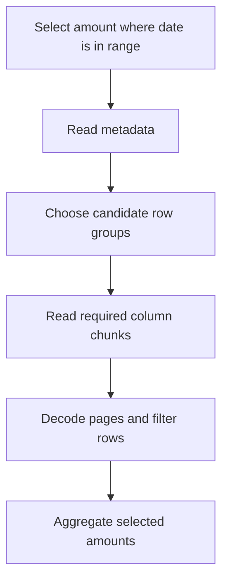

# Parquet and object storage: understand what gets read

A query that requests two columns should not need to decode every field in every record. Parquet organizes analytical data so readers can select columns and, when metadata and predicates permit, skip irrelevant portions of a file.

## Terms introduced in this chapter

| Term | Meaning |
|---|---|
| Row group | A horizontal group of rows stored as separate column chunks |
| Column chunk | The data for one column within a row group |
| Page | A smaller encoded unit within a column chunk |
| Column pruning | Reading only columns needed by a query |
| Predicate pushdown | Passing a filter into the reader so it can avoid or reduce work |
| Object key | The name used to identify one object in a storage service |

## Understand the model first

1. A reader obtains file metadata, including column and row-group information.
2. It identifies the projected columns and filters that the reader can evaluate.
3. It uses available statistics or indexes to avoid regions that cannot match.
4. It reads and decodes the remaining pages and evaluates the result.



Pruning is conditional. A filter function unsupported by the reader, missing statistics, or row groups containing values across the entire range may require much more scanning. Compression reduces stored bytes; encoding exploits data patterns before or alongside compression. Neither is a promise that every query becomes faster.

## A local layout experiment

Use an existing DuckDB CLI in a new temporary working directory. These commands write only `events.parquet` there. Record the DuckDB version before running; the SQL illustrates its Parquet interface, not a portable SQL standard.

```sql
CREATE TABLE events AS
SELECT i AS event_id,
       i % 1000 AS customer_id,
       DATE '2026-01-01' + CAST(i % 30 AS INTEGER) AS event_date,
       100 AS amount_cents
FROM range(100000) t(i);

COPY (SELECT * FROM events ORDER BY event_date)
TO 'events.parquet' (FORMAT PARQUET);

SELECT COUNT(*), SUM(amount_cents)
FROM read_parquet('events.parquet');

EXPLAIN ANALYZE
SELECT SUM(amount_cents)
FROM read_parquet('events.parquet')
WHERE event_date = DATE '2026-01-02';
```

The full file should contain 100,000 rows and sum to 10,000,000 cents. The selected day has 3,334 rows, or 333,400 cents. Inspect the plan for the projected columns and filter. A fast wall-clock result by itself does not prove object-store bytes were skipped. Local filesystem caching can dominate this small experiment.

Write a second file ordered by `event_id`, compare metadata and available scan metrics, then increase the data size and control row-group size. Preserve result equality. The interesting question is whether layout improves selective reads at a reasonable write and maintenance cost. Remove only the files created for the exercise when finished.

## Object storage changes the operating model

Object storage is addressed by keys and API operations. A slash in a key does not automatically give a filesystem directory's rename and transaction behavior. A successful upload of one object does not publish an atomic multi-file table. That problem motivates table metadata and commit protocols.

Use separate prefixes or containers for environments, enforce least-privilege access, and record encryption and retention choices. Include network transfer, request count, and file listing in performance measurements. A million tiny files can create scheduling and metadata overhead even if their combined byte count is modest.

Compare larger files against the write latency and parallelism your workload needs. Larger row groups can improve compression and reduce metadata overhead while increasing the amount read for some selective queries and the working memory of readers/writers. There is no universal file-size setting that replaces a benchmark.

## Failure exercise

Publish a manifest listing two fixture files, then make one unavailable in a disposable copy. A reader that scans whatever files remain may return a plausible but incomplete answer. A reader that checks the manifest can identify the missing object. Record file identities, expected row counts, and checksums for the fixture. Restore it and verify the same result, not merely that a directory listing succeeds.

## Explain it in your own words

Why are Parquet, an object store, and a table format separate layers? Parquet describes a file; storage persists objects; table metadata defines which objects belong to a committed version. Explain why a date filter might still read most of a poorly clustered file.

Continue with [table formats](04-table-formats.md).

<!-- source: https://parquet.apache.org/docs/file-format/ | checked: 2026-09-10 | file, row-group, column-chunk and page structure -->
<!-- source: https://duckdb.org/docs/current/data/parquet/overview | checked: 2026-09-10 | DuckDB 1.5 documentation; COPY/read_parquet -->
