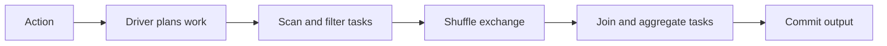

# Spark internals: explain a slow job with evidence

Writing a DataFrame transformation is the beginning. The deeper skill is explaining how it becomes parallel work, why one task delays the result, and whether an optimization preserves correctness.

## Terms introduced in this chapter

| Term | Meaning |
|---|---|
| Driver | The process coordinating the application and its work |
| Executor | A worker process running tasks and holding execution data |
| Job / stage / task | Work triggered by an action / a scheduling phase / one partition's work |
| Shuffle | Redistribution of records across partitions, often through network and disk |
| Skew | Uneven work or data distribution that creates slow partitions |
| Spill | Moving intermediate data to disk when execution cannot keep it in memory |
| AQE | Adaptive Query Execution: changing supported plan choices using runtime statistics |

## Understand the model first

1. DataFrame operations construct a plan; they do not all trigger immediate execution.
2. An action requests a result and Spark plans the required work.
3. The driver schedules tasks on executors, with exchanges separating work that needs redistribution.
4. Tasks read, filter, join, aggregate, and potentially spill or shuffle data.
5. The longest relevant tasks delay completion, even when most executors look idle.

Catalyst is the Spark SQL analysis and optimization framework. Logical plans describe the requested transformations; physical plans select execution strategies. Code generation and the execution-memory machinery often discussed under the historical Tungsten name belong below that plan. Learn to inspect operators and measurements before memorizing internal labels.



## A repeatable performance experiment

Prerequisites: a compatible local PySpark/Java setup and sufficient memory for a synthetic one-million-row dataset. This exercise creates no cloud resources. Record `spark.version`, runtime versions, relevant SQL settings, and the physical plan.

```python
from pyspark.sql import SparkSession, functions as F

spark = SparkSession.builder.master("local[2]").appName("skew-lab").getOrCreate()
events = spark.range(1_000_000).withColumn(
    "customer_id",
    F.when(F.col("id") < 900_000, F.lit(0)).otherwise(F.col("id") % 1000)
)
customers = spark.range(1000).withColumnRenamed("id", "customer_id")
query = events.join(customers, "customer_id").groupBy("customer_id").count()
query.explain("formatted")
rows = query.collect()  # Only the 1,000 aggregated result rows.
assert sum(row["count"] for row in rows) == 1_000_000
spark.stop()
```

Inspect the SQL and stage views while the application is running; for short jobs, configure event logging and a history server before the run or pause your interactive session before stopping Spark. A local test may choose a broadcast join because the dimension is small. Do not claim a shuffle-join diagnosis if the plan shows broadcast.

For a controlled comparison, use a larger dimension or change the session's automatic broadcast threshold and verify the resulting plan. Reset settings afterward. Compare shuffle read/write bytes, spill, task duration percentiles, garbage collection, and output equality. Change only one factor at a time.

## Read the symptom before choosing a fix

| Evidence | Candidate explanation | Next check |
|---|---|---|
| A few tasks read much more input | Skewed keys or files | Partition/key distribution and scan sizes |
| Many tasks spill heavily | Large intermediate state or insufficient memory | Join cardinality, projection, partition sizes |
| Tiny tasks dominate | Excess partitions or small files | Scheduling time versus task execution time |
| Executor loss and repeated tasks | Process, node, or memory failure | Executor logs and infrastructure events |
| Long scan, little CPU | Storage or network limitation | Bytes, request latency, file layout, concurrent load |

AQE can coalesce shuffle partitions and alter supported joins using observed statistics. It does not remove every hot key, repair a many-to-many join, or make an oversized driver collection safe. A broadcast hint is also not a promise that memory will suffice.

`repartition` can redistribute data through a shuffle; reducing partitions with `coalesce` can avoid a full redistribution in relevant cases but reduce parallelism. Inspect the plan and measure. Increasing executor memory before correcting an exploding join may simply make an incorrect job run longer before failure.

## Explain it in your own words

If task p50 is two seconds and p99 is ninety seconds, what evidence distinguishes skew from garbage collection or a slow host? A duration histogram alone cannot identify the cause. Describe how to compare task input, spill, GC time, and executor location. Keep your before/after result checks and cost measurements beside the plans.

Continue with [streaming](06-kafka-cdc-streaming.md).

<!-- source: https://spark.apache.org/docs/latest/cluster-overview.html | checked: 2026-09-10 | driver, executors, tasks -->
<!-- source: https://spark.apache.org/docs/latest/sql-performance-tuning.html | checked: 2026-09-10 | plans, join tuning, partitioning and AQE; latest resolved to 4.2.0 at review -->
