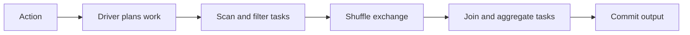

# Spark internals: explain a slow job with evidence

Suppose most Spark tasks finish in a minute, but one keeps running. Why does the whole job still have to wait?

Follow a DataFrame transformation into its stages and tasks. Use the execution evidence to find the delay, then check that an optimization keeps the result correct.

## Terms introduced in this chapter

| Term | Meaning | Why it matters / when to use it |
|---|---|---|
| Driver | The Spark process that coordinates the application and assigns work to executors. | Inspect planning and coordination bottlenecks separately from executor task processing. **Concrete situation (illustrative):** A Spark application fails while collecting a large result centrally. → Inspect driver memory and avoid collecting unnecessary data to it. → Confirm the driver can coordinate the job without exhausting memory. |
| Executor | A Spark worker process that runs tasks and holds the data they need. | Run partition tasks and identify worker memory, disk, and CPU limits during tuning. **Concrete situation (illustrative):** Some Spark tasks repeatedly fail on worker processes. → Inspect executor logs, memory, and task distribution. → Verify the affected partitions complete after addressing the measured cause. |
| Job / stage / task | An action starts a job. The job is divided into stages, and each stage runs tasks for its partitions. | Map a slow action to its scheduling boundary and the particular partitions causing delay. **Concrete situation (illustrative):** A Spark action is slow, but only part of its execution is responsible. → Trace the job into stages and individual tasks. → Identify which stage and task distribution explain the delay. |
| Shuffle | Moving records between partitions, often over the network and through disk, so related data can be processed together. | Bring related keys together for joins or aggregation while accounting for network and disk work. **Concrete situation (illustrative):** A large join spends much of its time moving data between workers. → Inspect shuffle volume and the partitioning strategy. → Compare network and spill metrics after a justified change. |
| Skew | Data or work is unevenly distributed, so a few partitions take much longer than the others. | Recognize uneven partitions so tuning targets stragglers instead of only increasing all resources. **Concrete situation (illustrative):** Most join tasks finish quickly while one runs for much longer. → Inspect key frequencies and partition sizes for skew. → Verify the chosen mitigation reduces the slowest tasks without changing results. |
| Spill | Writing intermediate results to disk when they cannot all stay in execution memory. | Understand how an operation can continue beyond available memory and why disk I/O increases. **Concrete situation (illustrative):** An aggregation exceeds available execution memory. → Inspect spilled bytes and adjust the workload or resources based on evidence. → Confirm disk overhead decreases without introducing memory failures. |
| AQE | Adaptive Query Execution lets Spark revise supported plan choices using statistics collected during execution. | Adapt supported query-plan choices to runtime measurements when initial estimates are inaccurate. **Concrete situation (illustrative):** A Spark plan chosen before execution poorly matches actual data sizes. → Inspect adaptive query execution decisions from runtime statistics. → Compare the final plan and task metrics with the initial plan. |

## Understand the model first

1. DataFrame operations construct a plan; they do not all trigger immediate execution.
2. An action requests a result and Spark plans the required work.
3. The driver schedules tasks on executors, with exchanges separating work that needs redistribution.
4. Tasks read, filter, join, aggregate, and potentially spill or shuffle data.
5. The longest relevant tasks delay completion, even when most executors look idle.

Catalyst is the Spark SQL analysis and optimization framework. Logical plans describe the requested transformations; physical plans select execution strategies. Code generation and the execution-memory machinery often discussed under the historical Tungsten name belong below that plan. Learn to inspect operators and measurements before memorizing internal labels.



## DataFrame to execution: Catalyst and physical plans

A DataFrame transformation builds a description of work. `filter`, `select`, and `join` generally do not immediately scan the full input. An action such as `count`, `collect`, or a write requests an execution. This lazy boundary lets Spark optimize a chain together: an unused column can disappear before the scan rather than being materialized and discarded afterward.

Catalyst is Spark SQL's analysis and optimization framework. The unresolved logical plan contains names and expressions; analysis resolves columns, relations, and types; logical optimization simplifies or rearranges supported operations; physical planning chooses executable operators. Cost-based choices depend on available statistics. `explain('extended')` exposes logical stages and the physical plan, while `explain('formatted')` makes physical operators easier to inspect. A plan is a decision for particular data statistics, settings, and runtime, not a permanent property of the source code.

Consider filtering events to one date, selecting customer and amount, joining a small customer dimension, then summing by region. A useful plan pushes the date predicate and projection toward the source. If the dimension can be broadcast, each executor can join locally against it. The final grouping may still require an exchange by region. “Broadcast join” therefore does not mean “the entire query has no shuffle.”

### Tungsten, code generation, and Python boundaries

Tungsten names Spark's execution-efficiency work around memory representation and generated code. In a compatible physical plan, whole-stage code generation combines operators into generated code, reducing per-row dispatch and intermediate object overhead. Inspect code-generation stage markers or `explain('codegen')`; an entire application is not automatically one generated function.

Built-in SQL expressions expose their meaning to the optimizer. A Python UDF introduces a boundary where data and function execution may need to move between JVM and Python runtimes. Arrow can improve supported columnar transfers, but it does not make arbitrary Python logic visible to Catalyst or eliminate every conversion. Prefer a built-in expression when it expresses the same semantics; benchmark unavoidable UDFs on the actual data types and batch sizes.

## Driver, executors, jobs, stages, and tasks

The driver owns application coordination and plans the work. Executors run tasks and hold relevant cached/shuffle data. A job is triggered by an action, although a complex query can create multiple jobs for auxiliary work such as broadcasts. Shuffle dependencies divide execution into stages. Within a stage, tasks process partitions of the stage's data; a task is not a permanently assigned worker or CPU.

Suppose a stage has 200 tasks and the executors collectively offer 20 usable task slots. Tasks run in roughly ten waves if their durations are similar. If one partition takes 97 seconds while most take two, the final slow task can determine stage completion. More slots help queued work but cannot automatically divide that one partition. A retried task is an additional attempt at the same logical work, so task-attempt counts need not equal partition counts.

The driver is also a resource boundary. `collect()` brings the complete result to it; `toPandas()` adds local materialization and conversion. The example below collects only 1,000 aggregate rows. Keep large results in distributed storage, and inspect small bounded samples when debugging. Increasing executor memory does not fix a driver OOM caused by collecting the full raw dataset.

## Shuffle and partition control

A shuffle redistributes records so equal join or aggregation keys reach compatible downstream partitions. It can require serialization, network transfer, local disk files, and later reads. A narrow map/filter can operate within its existing partition. A wide operation such as key redistribution makes upstream partitions contribute to multiple downstream partitions.

`repartition(n, key)` deliberately redistributes by key; `repartition(n)` changes distribution without that key contract. `coalesce(n)` commonly reduces partition count without a full reshuffle, which can preserve imbalance and concentrate work. Repartitioning to one file just before every write serializes the end of a pipeline. Distinguish scan partitions, shuffle partitions, and output files: setting one count does not freeze all three.

Partial aggregation reduces records before a shuffle when the aggregate supports it. A million rows for a hot key can become a small number of partial sums per input partition. By contrast, a hot many-to-many join may create a vast output before any aggregation can help. Inspect both key frequencies and multiplicity; “skew” is not one interchangeable problem.

### Join algorithms and their costs

| Algorithm | How records meet | Good candidate | Failure mode to examine |
|---|---|---|---|
| Broadcast hash join | Replicate a build relation to executors, probe locally | A filtered dimension fits the runtime's memory budget | Serialized size understates in-memory footprint; broadcast timeout/OOM |
| Sort-merge join | Shuffle compatibly, sort each side, merge matching keys | Large equi-join inputs with manageable partitions | Sort/spill cost and a huge hot-key partition |
| Shuffled hash join | Shuffle by key, build a hash table per selected partition | Per-partition build side fits memory | A few large partitions exceed the local build budget |

Join type and expression support constrain algorithm choice. Hints express preferences within those constraints. A broadcast hint cannot turn an arbitrary non-equality condition into a hash equi-join. Validate the final plan after execution, especially with AQE enabled.

## Memory, spill, and skew diagnosis

Executor heap supports execution state and cached storage under Spark's memory management. The surrounding process/container also needs room for non-heap JVM work, native allocations, and Python workers. A container memory limit is not synonymous with executor heap. Inspect the specific executor exit reason before changing heap size.

Spill moves intermediate work to disk when memory is insufficient for that operation. Some spill is a controlled tradeoff; excessive spill plus slow disk can dominate a stage. Compare per-task peak input/shuffle sizes, spill bytes, GC time, and host placement. If every task is large, reduce intermediate width or change partition sizing. If one key dominates, splitting ordinary partitions may leave that key together.

Salting can divide a hot aggregation key into subkeys, compute partial results, then combine them. For a join, salting one side generally requires compatible replication or transformation of the other; naïvely adding random salts independently loses matches. Non-additive aggregates such as a median cannot be recombined by simply averaging partial medians. A data model correction or pre-aggregation may be safer than a custom salting scheme.

## AQE: revise decisions with runtime statistics

AQE uses observed exchange statistics to revise supported parts of the plan. In Spark 4.0.1, its documented capabilities include coalescing small post-shuffle partitions, converting some joins, and splitting eligible skewed sort-merge join partitions. A tiny local fixture may never satisfy a skew threshold, and initial and final plans can differ.

For an interpretable experiment, first turn off adaptive execution and automatic broadcast, record the resulting sort-merge plan, then restore AQE and repeat with equal input. Compare the final plan and output, not only wall time. Do not claim AQE solved skew merely because the second run benefited from cached files or JVM warmup.

These session settings provide a controlled Spark 4.0.1 comparison. The original values must be saved before changing them and restored afterward; keep this experiment in a disposable session.

```python
# Use inside the active Spark session, before constructing the comparison query.
settings = {
    'spark.sql.adaptive.enabled': 'false',
    'spark.sql.autoBroadcastJoinThreshold': '-1',
    'spark.sql.shuffle.partitions': '8',
}
previous = {key: spark.conf.get(key) for key in settings}
try:
    for key, value in settings.items():
        spark.conf.set(key, value)
    compared = events.join(customers, 'customer_id').groupBy('customer_id').count()
    compared.explain('formatted')
    assert sum(row['count'] for row in compared.collect()) == 1_000_000
finally:
    for key, value in previous.items():
        spark.conf.set(key, value)
```

Run the complete setup below first in an interactive session, pausing before `spark.stop()` to insert this comparison. This code is an optional experiment requiring that session; it is not a standalone fixture. Expected evidence is a non-broadcast join and total 1,000,000, with plan details dependent on the selected runtime. Use a larger controlled workload before drawing throughput conclusions.

## A repeatable performance experiment

Prerequisites: a compatible local PySpark/Java setup and sufficient memory for a synthetic one-million-row dataset. This exercise creates no cloud resources. Record `spark.version`, runtime versions, relevant SQL settings, and the physical plan.

```python
from pyspark.sql import SparkSession, functions as F

spark = SparkSession.builder.master("local[2]").appName("skew-lab").getOrCreate()
events = spark.range(1_000_000).withColumn(
    "customer_id",
    F.when(F.col("id") < 900_000, F.lit(0)).otherwise(F.col("id") % 1000)
)
customers = spark.range(1000).withColumnRenamed("id", "customer_id")
query = events.join(customers, "customer_id").groupBy("customer_id").count()
query.explain("formatted")
rows = query.collect()  # Only the 1,000 aggregated result rows.
assert sum(row["count"] for row in rows) == 1_000_000
spark.stop()
```

Inspect the SQL and stage views while the application is running; for short jobs, configure event logging and a history server before the run or pause your interactive session before stopping Spark. A local test may choose a broadcast join because the dimension is small. Do not claim a shuffle-join diagnosis if the plan shows broadcast.

For a controlled comparison, use a larger dimension or change the session's automatic broadcast threshold and verify the resulting plan. Reset settings afterward. Compare shuffle read/write bytes, spill, task duration percentiles, garbage collection, and output equality. Change only one factor at a time.

## Read the symptom before choosing a fix

| Evidence | Candidate explanation | Next check |
|---|---|---|
| A few tasks read much more input | Skewed keys or files | Partition/key distribution and scan sizes |
| Many tasks spill heavily | Large intermediate state or insufficient memory | Join cardinality, projection, partition sizes |
| Tiny tasks dominate | Excess partitions or small files | Scheduling time versus task execution time |
| Executor loss and repeated tasks | Process, node, or memory failure | Executor logs and infrastructure events |
| Long scan, little CPU | Storage or network limitation | Bytes, request latency, file layout, concurrent load |

AQE can coalesce shuffle partitions and alter supported joins using observed statistics. It does not remove every hot key, repair a many-to-many join, or make an oversized driver collection safe. A broadcast hint is also not a promise that memory will suffice.

`repartition` can redistribute data through a shuffle; reducing partitions with `coalesce` can avoid a full redistribution in relevant cases but reduce parallelism. Inspect the plan and measure. Increasing executor memory before correcting an exploding join may simply make an incorrect job run longer before failure.

## Example results

Expected result invariants; collect ordering and the physical plan may vary.

```text
aggregated_rows: 1000
sum_of_counts: 1000000
customer_0_count: 900100
each_other_customer_count: 100
```

The hot key receives 900,000 explicit rows plus 100 from the modulo tail. The small dimension can be broadcast and partial aggregation can reduce shuffle, so the fixture does not guarantee a slow skewed join. Inspect the plan before attributing a timing change to AQE. Changed counts fail the comparison.

## Read the Spark UI as a causal investigation

Start at the SQL execution and map its exchange nodes to stages. In a slow stage, sort tasks by duration and compare the slowest with the median. A slow task with far more shuffle input supports a size/skew hypothesis. Similar input but much higher GC time supports an allocation/heap hypothesis. Many slow tasks on one executor with disk errors support a host/storage hypothesis. These are tests to distinguish causes, not conclusions from a percentile alone.

Keep a compact experiment record. The following numbers are invented to demonstrate interpretation, not a benchmark:

```text
run A: rows=1000000 sum_counts=1000000
       p50 task=2s p99 task=97s max_shuffle_input=4GB
run B: rows=1000000 sum_counts=1000000
       p50 task=3s p99 task=12s max_shuffle_input=500MB
changed: controlled repartition/skew treatment only
still needed: total runtime, executor-seconds, spill, repeated comparable runs
```

A lower p99 can coexist with more total compute or a slower complete application. Compare startup, scan, exchange, compute, and commit durations. Cache only reused expensive results whose storage cost fits; Spark cache and OS/object-store cache are different layers. Unpersist deliberately when reuse ends. Small-file compaction belongs to the storage stage of this investigation, not an unexplained executor-memory adjustment.

## Explain it in your own words

If task p50 is two seconds and p99 is ninety seconds, what evidence distinguishes skew from garbage collection or a slow host? A duration histogram alone cannot identify the cause. Describe how to compare task input, spill, GC time, and executor location. Keep your before/after result checks and cost measurements beside the plans.

Continue with [streaming](06-kafka-cdc-streaming.md).

<!-- source: https://spark.apache.org/docs/latest/cluster-overview.html | checked: 2026-09-10 | driver, executors, tasks -->
<!-- source: https://spark.apache.org/docs/latest/sql-performance-tuning.html | checked: 2026-09-10 | plans, join tuning, partitioning and AQE; latest resolved to 4.2.0 at review -->
<!-- source: https://spark.apache.org/docs/4.0.1/sql-performance-tuning.html | checked: 2026-09-10 | fixed-version AQE and comparison settings -->
<!-- source: https://spark.apache.org/docs/4.0.1/tuning.html | checked: 2026-09-10 | memory, serialization and allocation -->
<!-- source: https://spark.apache.org/docs/4.0.1/web-ui.html | checked: 2026-09-10 | SQL/stage/task diagnostic views -->
<!-- source: https://spark.apache.org/docs/4.0.1/sql-ref-syntax-qry-explain.html | checked: 2026-09-10 | extended, formatted and codegen plans -->
<!-- source: https://www.databricks.com/blog/2015/04/13/deep-dive-into-spark-sqls-catalyst-optimizer.html | checked: 2026-09-11 | historical optimizer design; runtime behavior scoped by Spark 4.0.1 docs -->
<!-- source: https://www.databricks.com/blog/2015/04/28/project-tungsten-bringing-spark-closer-to-bare-metal.html | checked: 2026-09-11 | historical Tungsten design, not current performance numbers -->
