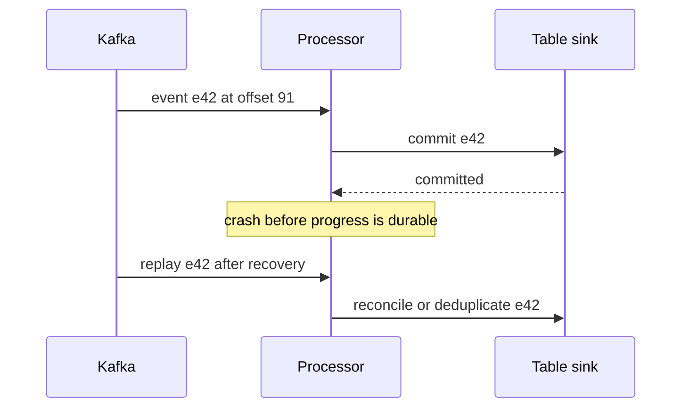

# Kafka, CDC, and streaming recovery

CDC stands for **Change Data Capture**: collecting a database's inserts, updates, and deletes so another system can follow its changes. Imagine an order changing from pending to paid. An analytical copy needs that update; copying every order repeatedly becomes wasteful as the table grows. CDC carries the change, but the consumer still decides how it affects the analytical table.

Debezium implements CDC with database connectors. Kafka stores and distributes the resulting event records, and a stream processor can transform them. These are separate roles: a changed row is not automatically a new business sale, and storing its event does not calculate revenue. In the next chapter, dbt transforms data after it has been loaded.

Streaming correctness becomes visible when a process stops between reading an event and committing its output. Design for that interruption before optimizing throughput.

## Terms introduced in this chapter

| Term | Meaning | Why it matters / when to use it |
|---|---|---|
| Partition / offset | An ordered log segment / a position within it | Define ordering scope and record where each consumer can resume after interruption. |
| Consumer group | Consumers sharing partition consumption responsibility | Share partition processing among workers and rebalance responsibility as group membership changes. |
| Rebalance | A change in partition assignments among consumers | Redistribute partitions when consumers join or leave while checking pauses and duplicate work. |
| CDC | Change Data Capture: turning database changes into records for downstream use | Keep downstream copies current using database changes instead of repeatedly copying every source row. |
| Event time / processing time | When the event occurred / when a processor handled it | Separate when business events happened from arrival delays when building time-based results. |
| Watermark | An event-time progress boundary used by supported stateful operations | Bound eligible state and lateness handling for supported streaming operations under an explicit policy. |
| Checkpoint | Recorded progress and state needed for a processor to recover | Resume a processor from retained progress and state after a failure, with sink correctness checked separately. |

## Understand the model first

1. The producer chooses a partition, often using a key that preserves a desired ordering scope.
2. Kafka appends records under its configured acknowledgement and replication policy.
3. A consumer or stream processor reads positions and updates state.
4. The output sink commits a durable result.
5. Recovery resumes from recorded progress and handles records that may be read again.

Kafka ordering is partition-scoped. More partitions do not create a global order, and increasing partitions can change how a partitioner maps keys. `acks`, replication, and the in-sync replica policy address broker durability; producer idempotence addresses eligible retry duplicates. Neither automatically makes a database write or HTTP side effect exactly once.

## Draw the transaction boundary



Kafka transactions support coordinated Kafka output and consumed offsets under the required consumer behavior. An external sink needs its own compatible transaction or idempotency protocol. Spark's sink documentation explicitly distinguishes guarantees: its Kafka sink is at-least-once, and `foreachBatch` defaults to at-least-once unless the implementation deduplicates appropriately. A checkpoint alone is not a universal exactly-once switch.

## CDC requires a source contract

Debezium's PostgreSQL connector reads an initial snapshot and database changes through logical decoding. Learn replication slots, WAL retention, source positions, transaction metadata, delete events, and restart behavior. A stopped connector can leave WAL retained at the source; monitor that storage risk separately from Kafka consumer lag.

An order event emitted by application code has business meaning. A changed database row has storage meaning. Decide how inserts, updates, deletes, transaction boundaries, and source re-snapshots map into downstream records. Preserve source identifiers so overlap between snapshot and change processing can be reconciled.

A schema registry checks a configured compatibility policy. It cannot infer that an unchanged integer field switched from cents to dollars. Version units and business meaning in the data contract, and test old and new consumers during a migration.

## Event time and state

Suppose an event occurred at 10:01 but arrived at 10:12. Its effect on the 10:00–10:05 aggregate depends on your lateness policy and the processor's operator/output mode. A watermark is progress inferred from observed event times and configuration; it is not proof that all producers have sent everything. Quiet partitions, clock errors, and out-of-order records need explicit handling.

Spark Structured Streaming provides an incremental DataFrame model, commonly using micro-batches. Flink adds a useful comparison in continuous event-time processing, watermarks, keyed state, and checkpointing. Choose through measured latency, state size, connector behavior, and operational capacity; neither name guarantees end-to-end semantics.

## Replication, ISR, acknowledgements, and ordering

Each partition has a leader and replicas. The in-sync replica set, ISR, represents replicas considered sufficiently caught up under Kafka's rules. With replication factor 3, `min.insync.replicas=2`, and a producer using `acks=all`, a write needs the configured minimum ISR and acknowledgement through the current in-sync set. `acks=all` does not mean “exactly two replicas” or “every configured replica, even an offline one.” If the ISR falls below the minimum, writes fail instead of silently weakening that requirement.

By contrast, `acks=1` waits for the leader's acknowledgement without the same replication wait; a leader failure before replication can lose an acknowledged record under that policy. `acks=0` gives the producer no broker acknowledgement. Compare availability during replica failure with the durability requirement, and record broker configuration together with producer settings. A successful client send under one policy cannot establish another policy's guarantee.

Producer idempotence attaches sequence information so supported retries of a producer's records can be deduplicated at the broker. Kafka 4.1 documents required relationships among `acks`, retries, and the maximum in-flight requests. This does not merge two distinct business requests with different event identities, and it does not make an HTTP request from a consumer idempotent. Preserve the business event ID independently of the Kafka offset.

Ordering is within a partition's log. Keying by customer puts related events together under the chosen partitioner, but a single very active customer can saturate that partition. Expanding partition count can remap keys for future records, so cross-expansion ordering needs a migration design. An application that dispatches records from one partition to independent workers can also complete them out of order even though Kafka delivered them in order.

## Consumer assignment, rebalance, and lag

For ordinary consumer-group subscription, a partition is assigned to one group member at a time. Six partitions and three consumers may give two partitions each; eight consumers leave some members with no partition. Other groups can independently read the same log. Assignment strategy and rebalance protocol determine how ownership changes when membership or subscriptions change; do not assume every deployed client uses the same generation of rebalance behavior.

During ownership transfer, stop starting work for a revoked partition and coordinate any in-flight work before recording progress. If workers finish offsets 101 and 103 while 102 is unfinished, committing 104 as the next position skips unfinished work after restart. Advance a partition's committed position only through a contiguous completed prefix when using this pattern.

An offset is a position, not a timestamp. Lag of 10,000 records can mean seconds or hours depending on event rate and age. Inspect per-partition lag, oldest unprocessed age, throughput, and publication latency. The illustrative arithmetic below assumes next-position conventions and no gaps:

```text
partition 0: end position=1000 committed next position=900 lag=100
partition 1: end position=2000 committed next position=1990 lag=10
group lag=110, but partition 0 determines most catch-up work
```

Committing automatically on a timer can race with application work if polling and processing lifetimes are not coordinated. For externally committed effects, explicitly choose a transaction or idempotency design and test a crash at each boundary. Commit-before-effect gives an at-most-once risk window; effect-before-commit gives an at-least-once replay window.

## Kafka transactions versus an external sink

A Kafka read-process-write transaction can atomically include output records and consumed offsets. Downstream consumers must use the required isolation behavior, such as `read_committed`, to avoid exposing aborted transactional output. Stable transactional identities and fencing address competing producer instances. An open transaction can delay visibility for read-committed consumers, so “broker has the bytes” and “consumer can read them” are different positions.

For a database sink, insert the event identity into an inbox and apply the effect in the same database transaction. On a retry, a uniqueness conflict means the already applied effect is not applied again. Commit the source progress afterward; a crash between the two causes harmless reprocessing when the invariant holds. The [messaging replay lab](../../../docs-site/content/messaging/02-duplicate-dlq-replay-lab.md) gives a transactional implementation. Never deduplicate by storing only an in-memory set that disappears on restart.

## CDC envelopes, deletes, and schema compatibility

Debezium change records distinguish operations and carry before/after and source metadata according to the connector/schema configuration. An update changes a row; it is not automatically a new sale. A delete must remove or close the corresponding downstream entity, not be dropped because its after-image is null. Kafka tombstones additionally support compacted-log deletion semantics; distinguish them from a business delete envelope.

The initial snapshot and subsequent WAL stream need one coherent source-position history. Keep a replication slot's retained WAL under observation; a consumer caught up in Kafka does not prove the source connector is current. On re-snapshot, reconcile row identities and versions rather than blindly appending the snapshot as new events. Source transaction grouping matters if consumers require all rows of a multi-row business update to be visible together.

Backward schema compatibility concerns a new reader reading older data; forward compatibility concerns an older reader reading newer data. Exact rules depend on Avro/Protobuf/JSON Schema and the registry policy. A defaulted optional field may pass a schema compatibility check while a unit change from cents to dollars passes unnoticed. Test the pair of old/new readers and payloads as well as the domain contract.

## Structured Streaming: micro-batches and output modes

A micro-batch selects a bounded input range, updates applicable state, and writes output. Checkpoints record source progress and state needed to resume. Trigger cadence controls when batches are attempted; if a batch takes 30 seconds, a one-second trigger does not make it finish in one second. Compare input rows per second with processed rows per second and batch-duration components.

Append mode emits newly finalized result rows where the query supports finalization. Update mode emits changed result rows; a sink must understand that a repeated key can represent a replacement, not an additional amount. Complete mode emits the entire result table each batch and can retain growing aggregate state. Operator, source, and sink combinations constrain the available modes.

For `foreachBatch`, the callback can receive a previously attempted batch again. Deduplicate using the batch identity within a stable query/checkpoint lifetime or reconcile stable event/version keys at the destination. If you reset the checkpoint, batch numbers can restart; `batch_id` alone is not globally unique across a new pipeline identity. The callback also must not independently commit half of a multi-table business publication and call that atomic.

### Watermarks, windows, and late corrections

Take a five-minute tumbling window `[10:00,10:05)` and a ten-minute allowed-delay setting. After the engine observes event time 10:20, a candidate watermark is 10:10. A supported aggregation can eventually finalize older windows and evict their state. Actual advancement happens through the engine's batch/operator rules; wall-clock passage alone is not equivalent to advancing observed event time.

```text
event time 10:01 arrives while window state is open: contributes to [10:00,10:05)
event time 10:04 arrives after a watermark beyond 10:05: may be too late
event time 10:20 observed: progress can advance, even if another source is delayed
```

Spark's documented delay guarantee is one-sided: data less late than the threshold is not dropped by the applicable watermark rule, while data beyond it may or may not be processed depending on the situation. Record the operator/output-mode behavior observed in the lab instead of inventing an exact universal acceptance boundary.

Watermark-bounded deduplication also has a memory horizon. A retry after its identity has aged out can no longer be recognized from that state alone. If monetary correctness requires lifetime deduplication, keep a durable identity/version rule at the sink. Stream-stream joins need bounded time relationships and watermarks to limit retained unmatched rows; an unbounded join can accumulate state indefinitely.

## Flink, keyed state, checkpoints, and backpressure

Flink provides a useful second execution model: events flow through operators, key-based partitioning places a key's state with the appropriate operator instance, and watermarks communicate event-time progress. Multiple inputs commonly advance based on the slowest relevant watermark; an idle source can hold progress unless idleness is handled. This gives a concrete reason to monitor source activity separately from CPU.

Checkpoint barriers coordinate a recoverable view of operator state and source progress. A transactional or otherwise compatible sink is still needed for the required output guarantee. Large state, slow snapshots, or backpressure can delay checkpoints and reduce the recovery margin. Compare checkpoint completion age and duration with the input replay-retention window.

Backpressure means a downstream operator cannot accept work at the upstream rate. Durable source retention can absorb the backlog only for a finite time. At arrival 5,000 events/s and processing 4,000 events/s, backlog grows by 3.6 million events per hour. Adding consumers beyond the available partition parallelism will not fix it; neither will a faster source reader when the sink is saturated.

## Guided failure matrix

Use an isolated topic, synthetic event IDs, a disposable sink, and an independent expected ledger. Do not delete a real checkpoint as a troubleshooting shortcut.

| Change | Expected evidence and recovery check |
|---|---|
| Stop the consumer | Lag rises; after restart compare distinct eligible IDs and output values |
| Crash after sink commit | Replay occurs; output is reconciled without duplicate business effects |
| Send duplicate and conflicting IDs | Identical retry is handled; conflicting payload has an explicit outcome |
| Send late events | Record accepted, corrected, or rejected counts under the declared policy |
| Break a schema field | Quarantine or fail with a reason, then repair and replay |
| Lose a disposable checkpoint | Restore from a known checkpoint or start a deliberately reconciled replay |
| Exhaust source retention | Report an unrecoverable gap or restore from an independent source copy |

Observe input rate, processing rate, event-to-publication latency, state size, retries, checkpoint age, and sink commits together. Zero Kafka lag does not prove a mart is current: downstream processing or publication may still be stuck.

## Example results

Synthetic replay ledger using the capstone's e1=100 and e2=250, not a broker execution trace.

```text
input deliveries: e1, e2, e1
accepted unique IDs: e1, e2
published total_cents: 350
crash after sink commit before checkpoint: replay expected
after replay: unique IDs=2, total_cents=350
conflicting e1 payload: BLOCK or explicit quarantine
```

A replayed total of 450 shows double-counting. Zero source lag while publication is stopped fails freshness. Recreating a checkpoint cannot recover events absent from both source retention and independent captures.

## Explain it in your own words

Where are your offsets and output committed, and what happens if the process dies between them? Explain why a dead-letter queue needs ownership, retention, a repair procedure, and a tested replay path. Moving a record into a DLQ records a failure; it does not resolve it.

Continue with [modeling and orchestration](07-modeling-orchestration.md).

<!-- source: https://kafka.apache.org/41/design/design/ | checked: 2026-09-10 | Kafka 4.1 delivery and ordering boundaries -->
<!-- source: https://spark.apache.org/docs/latest/streaming/apis-on-dataframes-and-datasets.html | checked: 2026-09-10 | sink guarantees and checkpoint recovery -->
<!-- source: https://debezium.io/documentation/reference/stable/connectors/postgresql.html | checked: 2026-09-10 | snapshot, replication slots and WAL -->
<!-- source: https://nightlies.apache.org/flink/flink-docs-stable/docs/concepts/time/ | checked: 2026-09-10 | event time and watermarks -->
<!-- source: https://kafka.apache.org/41/configuration/producer-configs/ | checked: 2026-09-10 | acknowledgement and idempotent producer constraints -->
<!-- source: https://kafka.apache.org/41/configuration/consumer-configs/ | checked: 2026-09-10 | group protocol, offsets and isolation -->
<!-- source: https://spark.apache.org/docs/4.0.1/streaming/apis-on-dataframes-and-datasets.html | checked: 2026-09-10 | fixed-version state/output/watermark semantics -->
<!-- source: https://nightlies.apache.org/flink/flink-docs-stable/docs/concepts/stateful-stream-processing/ | checked: 2026-09-10 | keyed state and checkpoint coordination -->
